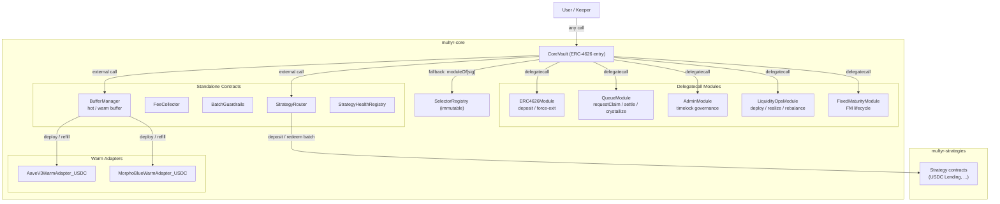

# multyr-core

Non-custodial ERC-4626 vault primitive for the Multyr Protocol on Arbitrum.

[](LICENSE)
[](https://soliditylang.org)
[](https://getfoundry.sh)
[](https://github.com/Multyr/multyr-core/actions)

---

## Overview

Multyr is a non-custodial DeFi yield protocol deployed on Arbitrum. Users deposit USDC into a
single vault entry point (`CoreVault`) and receive ERC-4626 shares whose price-per-share rises as
allocated capital earns yield across lending protocols (Aave V3, Compound III, Morpho Blue, Euler
V2, Fluid, Dolomite).

This repository (`multyr-core`) contains the on-chain foundation of the protocol: the vault
contract, its modular execution layer, storage libraries, governance primitives, automation
keepers, and warm lending adapters. It is the primary audit target and the dependency upon which
`multyr-periphery` and `multyr-strategies` are built.

The vault supports two operating modes. In **Open Ended** mode, deposits and exits operate
continuously with no fixed term. In **Fixed Maturity** mode, capital is committed for a defined
period; deposits are accepted during a funding window, the strategy activates at the start date,
and exits open only at maturity. The two modes share the same module infrastructure and storage
model, controlled by a state machine in `FixedMaturityModule`.

`CoreVault` is a Diamond-lite proxy: a thin ERC-4626 contract that delegates all economic
operations to a set of external module contracts via `delegatecall`. Modules share vault storage
through four EIP-7201 namespaced slots, eliminating storage collisions across upgrade cycles.
The selector registry is immutable after initial deployment. Modules can be upgraded individually
under a governance timelock without redeploying the vault itself.

---

## Architecture



The Diamond-lite dispatch works as follows. Every call to `CoreVault` that is not an explicitly
implemented function hits the `fallback()`. The fallback reads `moduleOf[msg.sig]` from
`CoreStorage`, verifies the caller's role against `roleOf[msg.sig]`, and delegates via
`delegatecall` to the module contract. Because modules execute in the vault's context,
`address(this)` inside a module equals the vault address. State is partitioned into four
EIP-7201 namespaces: `CoreStorage` (main flags, routing table, params), `FeeStorage`
(fee params, HWM), `QueueStorage` (FIFO exit queue, epoch state), and
`FixedMaturityStorage` (FM mode, state machine, funding config).

---

## Key Concepts & Invariants

- **PPS monotonicity**: price-per-share (`totalAssets / totalSupply`) is non-decreasing under
  normal operation. Only force-exit penalties and performance-fee crystallization affect it,
  and both are strictly defined by on-chain parameters.
- **Exit guarantee (W2 policy)**: all exit paths remain open regardless of vault state.
  `DegradedMode` blocks deposits (W1 policy) but never blocks exits or force-exits.
- **Storage isolation**: all module state uses EIP-7201 namespaced slots. Direct `sstore`
  outside a namespace is not possible; storage collisions between modules are ruled out
  at the layout level.
- **Delegatecall safety**: every `delegatecall` target is whitelisted in the immutable
  `SelectorRegistry`. A call to an unregistered selector reverts before `delegatecall`
  is reached.
- **Fee caps enforced on-chain**: deposit fee, withdrawal fee, force-exit penalty, and
  performance fee are each bounded by constants in `GlobalConfig` (IParamsProvider).
  No governance action can set a fee above the protocol cap.
- **Role model completeness**: every externally callable selector has an assigned role
  in `SelectorRegistry`. ROLE_PUBLIC (0) functions are callable by anyone; no selector
  is reachable without an explicit role assignment.
- **Epoch cap guard**: instant exits are rate-limited to `capPerEpochBps` of NAV per epoch,
  preventing coordinated mass-exit events from draining the hot buffer in a single block.
- **BufferManager invariant**: `BufferManager` holds no idle asset balance at rest. Excess
  hot USDC is deployed to warm adapters; the hot buffer is refilled only on settlement demand.
- **System sealing irreversibility**: after `sealFinalState()`, the routing table and module
  set are permanently frozen. No upgrade path exists post-seal without a governance-approved
  Timelock proposal with a minimum 2-day delay.
- **ForceExit liquidity waterfall**: `forceWithdraw` and `forceWithdrawAll` pull liquidity
  from warm adapters first, then from strategies in allocation order. The sequence is
  deterministic and cannot be short-circuited.

See [`docs/audit-scope.md`](docs/audit-scope.md) for the complete formal invariant set and
known-waiver list used as the audit perimeter.

---

## Modules

| Module | Category | Description | EIP-7201 namespace |
|---|---|---|---|
| `CoreVault` | Entry point | ERC-4626 vault, module dispatcher, ownership, pause | `CoreStorage` |
| `ERC4626Module` | Delegatecall | `deposit`, `mint`, `forceWithdraw`, `forceWithdrawAll` | `CoreStorage` + `FeeStorage` + `FixedMaturityStorage` |
| `QueueModule` | Delegatecall | `requestClaim`, `cancelClaim`, `settleFeesAndProcessQueue`, `endEpochCrystallize` | `CoreStorage` + `FeeStorage` + `QueueStorage` |
| `AdminModule` | Delegatecall | Fee params timelock, component wiring, `seedDeadDeposit` | `CoreStorage` + `FeeStorage` |
| `LiquidityOpsModule` | Delegatecall | `deployToStrategies`, `realizeForQueue`, `canDeploy` | `CoreStorage` |
| `FixedMaturityModule` | Delegatecall | FM lifecycle governance, `markMatured`, `refundClaim` | `CoreStorage` + `FixedMaturityStorage` |
| `BufferManager` | Standalone | Hot/warm buffer orchestration, warm NAV cache, `refill` | — |
| `FeeCollector` | Standalone | Receives fee shares; `harvest` to protocol treasury | — |
| `StrategyRouter` | Standalone | Strategy allocation, NAV aggregation, deposit/redeem batching | — |
| `StrategyHealthRegistry` | Standalone | Per-strategy health status; consulted by StrategyRouter | — |
| `BatchGuardrails` | Standalone | Size and rate limits on keeper batch operations | — |
| `PriceOracleMiddleware` | Standalone | Oracle wrapper for strategy NAV normalisation | — |
| `ExecutionMemory` | Standalone | V10 allocation engine execution state (optional, strict mode toggle) | — |
| `RouterAllocationPolicy` | View | V10 target allocation computation | — |
| `RouterRebalanceGuard` | View | V10 rebalance safety check | — |
| `StrategyScorer` | View | V10 strategy scoring | — |
| `IncentivesEngine` (v2) | External notify | Current deposit/exit incentives; called via try/catch | — |
| `AaveV3WarmAdapter_USDC` | Warm adapter | Aave V3 USDC integration for BufferManager warm buffer | — |
| `MorphoBlueWarmAdapter_USDC` | Warm adapter | Morpho Blue USDC integration for BufferManager warm buffer | — |
| `SelectorRegistry` | Immutable lib | Canonical selector-to-role mapping for 91 selectors | — |
| `GlobalConfig` | Config | Protocol-wide parameter caps (IParamsProvider) | — |
| `VaultFactory` | Factory | Deterministic deployment of CoreVault + module set | — |
| `CoreVaultLens` | Lens | Read-only aggregated view of vault state | — |
| `ProtocolRegistryWithTimelock` | Registry | On-chain registry of deployed vaults with timelock | — |
| `IncentivesTimelock` | Governance | Timelock controller for protocol governance | — |
| `VaultUpkeep` | Automation | Chainlink-compatible keeper for Open Ended vaults | — |
| `FixedMaturityVaultUpkeep` | Automation | Chainlink-compatible keeper for Fixed Maturity lifecycle | — |

---

## Documentation

| Document | Description |
|---|---|
| [`docs/architecture.md`](docs/architecture.md) | Diamond-lite dispatch, storage model, NAV accounting, exit semantics, fee mechanics, buffer management, sealing |
| [`docs/modules.md`](docs/modules.md) | Per-module interface tables, access control, storage access patterns, error codes |
| [`docs/storage-layout.md`](docs/storage-layout.md) | EIP-7201 slot derivation, field-by-field layout for all four namespaces |
| [`docs/exit-engine.md`](docs/exit-engine.md) | Exit modes (STANDARD / INSTANT / FORCE), epoch cap, queue mechanics, settlement algorithm |
| [`docs/queue-mechanics.md`](docs/queue-mechanics.md) | FIFO queue internals, settlement scan, warm refill during settlement |
| [`docs/fee-policy.md`](docs/fee-policy.md) | Deposit fee, withdrawal fee, force-exit penalty, performance fee crystallization, HWM |
| [`docs/force-exit.md`](docs/force-exit.md) | `forceWithdraw` and `forceWithdrawAll` paths, liquidity waterfall |
| [`docs/access-control.md`](docs/access-control.md) | Role constants, selector-to-role matrix, guardian cooldown, timelock matrix |
| [`docs/governance.md`](docs/governance.md) | Submit/accept/revoke pattern, paramMinDelay, component timelock, post-deployment checklist |
| [`docs/testing.md`](docs/testing.md) | Test architecture, mock vs fork tests, coverage targets, Halmos specs |
| [`docs/audit-scope.md`](docs/audit-scope.md) | In-scope files, known findings, invariants, threat model, storage snapshot policy |

---

## Audits

No external audits have been completed yet. Pre-audit hardening is in progress. When
third-party security audits are published, the signed PDF reports will appear in
[`audits/`](audits/).

Internal hardening reports, automated tool outputs (Slither, Aderyn, Halmos), and
self-reviews are not published as audits. They are kept in the `multyr-research` repository
(private) and are not a substitute for third-party security review.

| Date | Auditor | Scope | Findings | Report |
|---|---|---|---|---|
| Planned 2026-Q3 | TBD | `multyr-core` v1.0 | — | — |

Bug bounty: TBD — will be announced after the first signed audit report is published.

---

## Security

To report a vulnerability, email **security@multyr.fi** or see [`SECURITY.md`](SECURITY.md)
for the full responsible disclosure process, severity classification, and response timeline.

Severity classification follows the CVSS v3.1 framework. Acknowledged within 48 hours.
Critical findings are triaged within 72 hours. Do not open public GitHub issues for
security vulnerabilities.

---

## Build and Test

### Prerequisites

- [Foundry](https://getfoundry.sh) — `forge`, `cast`, `anvil`
- An Arbitrum RPC endpoint for fork tests (set `ALCHEMY_API_KEY` or `RPC_URL_ARB` in `.env`)

### Build

```bash
forge build
```

### Test (unit, no fork)

```bash
forge test --no-match-path "test/fork*"
```

### Test (full suite, including fork tests)

```bash
forge test
```

Requires a live Arbitrum RPC endpoint. Fork tests validate warm adapter integrations against
real Aave V3 and Morpho Blue contracts on Arbitrum mainnet.

### Coverage

```bash
forge coverage --no-match-path "test/fork*"
```

### Formal verification (Halmos)

Symbolic execution specs live in `halmos-core/`. Run with:

```bash
halmos --contract CoreVaultHalmos --function check_
```

See [`docs/testing.md`](docs/testing.md) for the full Halmos spec inventory.

### Static analysis

```bash
# Slither
slither src/ --config-file slither.config.json

# Aderyn
aderyn src/
```

Raw scanner output is stored in `multyr-research/internal-reports/scans/` (private).
Triage notes are in `multyr-research/internal-reports/triage/`.

---

## Deployment

Deployment scripts and broadcast artifacts live in the private `multyr-deployment` repository.
See the deployment guide at [`docs/deployment.md`](docs/deployment.md) for the canonical
CoreVault + module wiring sequence, post-deployment checklist, and `paramMinDelay` bootstrap
requirements.

### Cross-repo dependency graph

`multyr-core` is the root dependency in the Multyr ecosystem. Other repositories consume it
as a Foundry submodule:

```
multyr-core (this repo)
  |- multyr-periphery   (forge install Multyr/multyr-core)
  |- multyr-strategies  (forge install Multyr/multyr-core)
  \- multyr-strategies-dev (forge install Multyr/multyr-core)
```

During monorepo development, cross-repo dependencies are managed via relative symlinks
(`lib/multyr-X => ../../multyr-X/`). Post-upload they become GitHub submodules with
unchanged remappings (`@multyr-core/=lib/multyr-core/src/`).

### Remappings

```
@multyr-core/=src/
@openzeppelin/=lib/openzeppelin-contracts/
@openzeppelin-upgradeable/=lib/openzeppelin-contracts-upgradeable/
```

---

## Governance

Protocol governance is controlled by a two-role model: `owner` (Timelock-backed multisig)
and `guardian` (hot key for emergency pause). Fee parameter changes go through a
submit/accept/revoke pattern with a configurable `paramMinDelay` (minimum 2 days in
production). Critical component changes (router, buffer manager, params provider) can be
placed under a secondary `componentsTimelock` flag.

After initial deployment, `StrategyBootstrapper` role grants are revoked and `paramMinDelay`
is raised from 0 to the production value. Once the routing table is final, `freezeRouting()`
is called (irreversible). System sealing (`prepareSeal` then `sealFinalState`) can be
applied to permanently lock the vault configuration.

| Role | Address type | Capabilities |
|---|---|---|
| `ROLE_OWNER` (1) | Timelock multisig | Module upgrades, fee parameters, component wiring, sealing |
| `ROLE_GUARDIAN` (2) | Hot key (EOA or multisig) | Emergency pause, degraded mode, guardian-scoped parameter overrides |
| `ROLE_OWNER_OR_GUARDIAN` (3) | Either | Shared emergency actions |
| `ROLE_MODULE` (4) | Contract only | Cross-module calls within the vault delegatecall context |
| `ROLE_PUBLIC` (0) | Any address | Read-only views, deposit, requestClaim, forceWithdraw |

See [`docs/governance.md`](docs/governance.md) for the full governance sequence,
role grant/revoke checklist, and `IncentivesTimelock` configuration.

---

## Repo Layout

```
multyr-core/
|- src/
|   |- core/
|   |   |- CoreVault.sol                  ERC-4626 entry point + module dispatcher
|   |   |- modules/                       18 modules (delegatecall + standalone + V10)
|   |   |- libraries/                     15 libraries (ExitEngineLib, ExitFeeLib, SelectorRegistry, ...)
|   |   |- mixins/                        10 mixins (Ownable2Step, ClaimsMixin, FeeMixin, ...)
|   |   |- storage/                       4 EIP-7201 storage libraries
|   |   \- config/                        GlobalConfig (IParamsProvider)
|   |- adapters/
|   |   \- warm/                          AaveV3WarmAdapter_USDC, MorphoBlueWarmAdapter_USDC
|   |- automation/                        VaultUpkeep, FixedMaturityVaultUpkeep
|   |- factory/                           VaultFactory
|   |- governance/                        IncentivesTimelock
|   |- lens/                              CoreVaultLens
|   |- registry/                          ProtocolRegistryWithTimelock
|   |- libs/                              FixedPoint, MathUtils, Percentage
|   |- mocks/                             ERC20Mock (test only)
|   \- interfaces/                        22 Solidity interfaces (MIT licensed)
|- test/                                  Unit, integration, fork, Halmos
|- halmos-core/                           Formal verification specs
|- docs/                                  11 canonical documentation files
|- audits/                                Empty — see audit policy above
|- storage-snapshots/                     forge inspect storage layout snapshots
|- SECURITY.md
|- CONTRIBUTING.md
\- LICENSE
```

---

## License

The core protocol — `src/` excluding `src/interfaces/` — is licensed under the
**Business Source License 1.1** (BUSL-1.1).

Change Date: four years after the first production mainnet deployment of Multyr v1.0 on
Arbitrum. On the Change Date the license automatically converts to **GPL-2.0-or-later**.

Additional Use Grant: use of the software is permitted for non-production purposes
(research, testing, audit, development) without restriction. Refer to [`LICENSE`](LICENSE)
for the full grant language and restrictions.

The public Solidity interfaces in `src/interfaces/` are separately available under the
**MIT License** to enable third-party integrations without BUSL restrictions. See
[`src/interfaces/LICENSE-INTERFACES`](src/interfaces/LICENSE-INTERFACES).

License model follows Aave v3 (BUSL-1.1 core, MIT interfaces).

---

## Contributing

External contributions are welcome via pull request.

Before opening a PR, read [`CONTRIBUTING.md`](CONTRIBUTING.md) for the coding standards,
test requirements (unit + fork coverage gate), commit message format, and the
contributor license agreement.

Security findings must be reported via the responsible disclosure process in
[`SECURITY.md`](SECURITY.md), not as public issues.

---

## Links

| | |
|---|---|
| Website | https://multyr.fi |
| GitHub org | https://github.com/Multyr |
| Security | security@multyr.fi |
| Subgraphs | https://github.com/Multyr/subgraphs |
| Periphery | https://github.com/Multyr/multyr-periphery |
| Strategies | https://github.com/Multyr/multyr-strategies |
