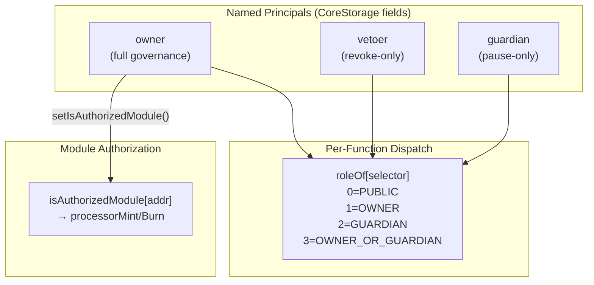

# access-control.md — Multyr Core: Access Control System

**Version**: 1.0.0 | **Branch**: reorg/runbook-docs-consolidate-01a.3 | **Commit**: see footer

---

## Table of Contents

1. [Overview](#1-overview)
2. [Role Definitions](#2-role-definitions)
3. [Role Assignments](#3-role-assignments)
4. [Role Capabilities — Per-Function Mapping](#4-role-capabilities--per-function-mapping)
5. [CoreStorage Role Fields](#5-corestorage-role-fields)
6. [Module Authorization (`isAuthorizedModule`)](#6-module-authorization-isauthorizedmodule)
7. [Invariants](#7-invariants)
8. [Events](#8-events)
9. [Examples](#9-examples)
10. [Edge Cases](#10-edge-cases)
11. [Glossary](#11-glossary)

---

## 1. Overview

Multyr Core uses a **hybrid access control model**:

1. **Named principals** stored in `CoreStorage.Layout`: `owner`, `vetoer`, `guardian`. No role-constants library is used in production — roles are checked against storage fields directly.

2. **Per-function role dispatch**: `CoreStorage.Layout.roleOf[selector]` maps each function's 4-byte selector to one of four numeric access levels. This mapping is set at deployment and can only be changed by the owner.

3. **Module authorization**: `CoreStorage.Layout.isAuthorizedModule[addr]` controls which contracts may call `processorMint` and `processorBurn` — the internal share minting/burning functions used by the queue settlement and force exit paths.



**No role library is active in production**. `src/core/mixins/Roles.sol:10` (pragma 0.8.24) defines a `governor` address + `rolesFrozen` boolean pattern but is NOT imported by any active module. See §11 for the discrepancy.

---

## 2. Role Definitions

### 2.1 Active Role System

The active CoreVault has four effective access levels, checked via `CoreStorage.Layout.roleOf[selector]`:

| Level | Constant | Who passes | Notes |
|-------|----------|-----------|-------|
| 0 | `ROLE_PUBLIC` | Any address | No check performed |
| 1 | `ROLE_OWNER` | `msg.sender == core.owner` | Full governance authority |
| 2 | `ROLE_GUARDIAN` | `msg.sender == core.guardian` | Emergency pause authority |
| 3 | `ROLE_OWNER_OR_GUARDIAN` | owner OR guardian | Flexible pause actions |

Role levels are stored as `uint8`. The check at the module dispatch layer reads `roleOf[msg.sig]` and validates `msg.sender` against the stored principal.

### 2.2 Legacy Roles.sol (NOT Active)

`src/core/mixins/Roles.sol:10` (pragma 0.8.24) defines:

```solidity
address public governor;
bool public rolesFrozen;
bytes32 public constant GUARDIAN_ROLE = keccak256("GUARDIAN_ROLE");
bytes32 public constant KEEPER_ROLE   = keccak256("KEEPER_ROLE");
bytes32 public constant PARAM_ROLE    = keccak256("PARAM_ROLE");
```

This contract uses a `governor` address + OpenZeppelin `AccessControl`-style `bytes32` role constants. It is **NOT** imported by `AdminModule`, `QueueModule`, `ERC4626Module`, or any active module on branch `reorg/runbook-docs-consolidate-01a.3`. The production role system is the `roleOf[selector]` mapping described above.

---

## 3. Role Assignments

### 3.1 Initial Assignment

All three named principals are set during deployment:

| Principal | Initial setter | Function | Notes |
|-----------|----------------|----------|-------|
| `owner` | Deployer | Constructor / `transferOwnership` flow | Deployer is initial owner |
| `vetoer` | Owner | `setVetoer(addr)` | Immediate setter; no timelock |
| `guardian` | Owner via batch | `setEcosystem(cfg)` or `setHealthRegistry`-area setters | `cfg.guardian` required non-zero in `setEcosystem` |

The `guardian` field in `CoreStorage.Layout` is set either directly (owner-only setter) or via `setEcosystem`. It can be updated by the owner at any time post-deploy (no timelock).

### 3.2 How to Change Roles

| Principal | Change mechanism | Timelock? | Revert if misused |
|-----------|-----------------|-----------|------------------|
| `owner` | 2-step: `transferOwnership` + `acceptOwnership` | None (immediate once accepted) | Pending owner must accept |
| `vetoer` | `setVetoer(addr)` (owner-only, immediate) | None | `NotOwner()` if non-owner |
| `guardian` | Direct setter or `setEcosystem` (owner-only, immediate) | None | `NotOwner()` if non-owner |

No mechanism exists to "lock" a principal address permanently (except `sealFinalState` which locks `bufferManager`/`router` only). The owner retains ability to rotate vetoer and guardian indefinitely.

### 3.3 `roleOf[selector]` Management

`roleOf[selector]` is populated via a selector registry contract (`CoreStorage.Layout.selectorRegistry`) at deployment and can be updated by the owner. Changing a function's role level changes its access control permanently for that function.

---

## 4. Role Capabilities — Per-Function Mapping

### 4.1 OWNER-only Functions (roleOf = 1)

| Function | Module | Description |
|----------|--------|-------------|
| `submitFeeParams` | AdminModule | Timelock submission for fee params |
| `acceptFeeParams` | AdminModule | Accept after delay |
| `revokeFeeParams` | AdminModule | Also callable by vetoer |
| `submitPerfParams` | AdminModule | Timelock submission for perf params |
| `acceptPerfParams` | AdminModule | Accept after delay |
| `revokePerfParams` | AdminModule | Also callable by vetoer |
| `submitMinDelay` | AdminModule | Timelock submission for paramMinDelay |
| `acceptMinDelay` | AdminModule | Accept after delay |
| `revokeMinDelay` | AdminModule | Also callable by vetoer |
| `setParams` | AdminModule | IParamsProvider address |
| `setFeeCollector` | AdminModule | Fee recipient |
| `setVetoer` | AdminModule | Vetoer address |
| `setHealthRegistry` | AdminModule | Strategy health registry |
| `setIncentives` | AdminModule | Incentives contract |
| `setIncentivesEngine` | AdminModule | Incentives engine |
| `setRewardsPayoutManager` | AdminModule | Rewards manager |
| `setRebalancePolicy` | AdminModule | V10 rebalance policy |
| `setRebalanceGuard` | AdminModule | V10 rebalance guard |
| `setExecutionMemory` | AdminModule | Execution memory recorder |
| `setStrictExecutionMemory` | AdminModule | Bool setter |
| `setEcosystem` | AdminModule | Batch component init |
| `setInitialFees` | AdminModule | One-shot pre-seal fee bootstrap |
| `setInitialPerfParams` | AdminModule | One-shot pre-seal perf bootstrap |
| `seedDeadDeposit` | AdminModule | Inflation hardening (one-shot) |
| `freezeParams` | AdminModule | Permanent FLAG_PARAMS_FROZEN |
| `enableComponentsTimelock` | AdminModule | FLAG_COMPONENTS_TIMELOCKED |
| `sealFinalState` | AdminModule | Permanent FLAG_SYSTEM_SEALED |
| `transferOwnership` | AdminModule | Step 1 of 2-step transfer |
| `setVaultModeFixedMaturity` | FixedMaturityModule | Enter FM mode |
| `configureFixedMaturity` | FixedMaturityModule | Set FM parameters |
| `startFixedMaturityCycle` | FixedMaturityModule | Funding → Starting |
| `activateFixedMaturityCycle` | FixedMaturityModule | Starting → Active |
| `closeFixedMaturityCycle` | FixedMaturityModule | Matured → Closed |
| `deployToStrategies` | LiquidityOpsModule | Deploy surplus to strategies |
| `deployToStrategiesWithPlan` | LiquidityOpsModule | Deploy with external plan |
| `realizeForQueue` | LiquidityOpsModule | Realize liquidity for queue |
| `realizeForReserveAndOps` | LiquidityOpsModule | Realize for reserve + ops |
| `rebalanceStrategies` | LiquidityOpsModule | V10 rebalance execution |

### 4.2 GUARDIAN-only Functions (roleOf = 2)

| Function | Module | Description |
|----------|--------|-------------|
| *(none currently defined as guardian-exclusive)* | — | Guardian authority is expressed via OWNER_OR_GUARDIAN |

### 4.3 OWNER_OR_GUARDIAN Functions (roleOf = 3)

| Function | Module | Description |
|----------|--------|-------------|
| `pause` | AdminModule | Set FLAG_PAUSED |
| `unpause` | AdminModule | Clear FLAG_PAUSED |
| `pauseDeposits` | AdminModule | Set FLAG_PAUSED_DEPOSITS |
| `unpauseDeposits` | AdminModule | Clear FLAG_PAUSED_DEPOSITS |
| `pauseWithdrawals` | AdminModule | Set FLAG_PAUSED_WITHDRAWALS |

> Note: `unpauseWithdrawals` is OWNER-only (roleOf = 1). The guardian can pause withdrawals but not unpause them.

### 4.4 PUBLIC Functions (roleOf = 0)

Key permissionless functions:

| Function | Module | Notes |
|----------|--------|-------|
| `deposit` | ERC4626Module | Subject to pause checks |
| `requestClaim` | QueueModule | Subject to pause + anti-spam checks |
| `settleFeesAndProcessQueue` | QueueModule | Callable by anyone (keeper pattern) |
| `compactQueue` | QueueModule | Cleanup, always callable |
| `acceptOwnership` | AdminModule | Must be `pendingOwner` (checked internally) |
| `markMatured` | FixedMaturityModule | Any address, once maturityTs reached |
| `markFundingFailed` | FixedMaturityModule | Any address, once deadline + net < min |
| `recallFixedTermCapital` | FixedMaturityModule | Matured state only |
| `refundClaim` | FixedMaturityModule | FundingFailed state only |
| `canDeploy` | LiquidityOpsModule | View function |
| `canRebalance` | LiquidityOpsModule | View function |
| `totalAssets` | ERC4626Module | Standard ERC-4626 view |

---

## 5. CoreStorage Role Fields

All role-related state is stored in `CoreStorage.Layout` (EIP-7201 namespaced slot `0xff7b491291207fbb51df1ab8f042e8ee7f087c9a7e4a083e1a2dbbddb742ef00`):

```solidity
struct Layout {
    // Named principals
    address owner;            // Full governance authority
    address pendingOwner;     // Staging: 2-step ownership transfer
    address vetoer;           // Revoke pending params only
    address guardian;         // Emergency pause only

    // Per-function role dispatch
    mapping(bytes4 => uint8) roleOf;   // selector → 0/1/2/3

    // Module dispatch
    mapping(bytes4 => address) moduleOf;   // selector → implementation module

    // Module authorization for mint/burn
    mapping(address => bool) isAuthorizedModule;

    // Selector registry
    address selectorRegistry;

    // Authorization state
    bytes32 pendingSealHash;
    address authorizedSealer;

    uint256 packedFlags;  // bit 0=PAUSED, bit 8=COMPONENTS_TIMELOCKED, bit 9=SEALED, ...
    // ... other fields
}
```

**Source**: `src/core/storage/CoreStorage.sol:38`.

---

## 6. Module Authorization (`isAuthorizedModule`)

`CoreStorage.Layout.isAuthorizedModule[addr]` is a mapping from contract address to bool. When `true`, that contract may call `processorMint(address, uint256)` and `processorBurn(address, uint256)` — the internal share issuance and destruction functions.

These functions bypass normal ERC-20 transfer logic and directly adjust share balances. They are used by:

- **QueueModule** — burns user shares during queue settlement, mints fee shares to `feeCollector`
- **FixedMaturityModule** — mints/burns during lifecycle transitions (e.g., `_applyFinalPerformanceFee`)

Access check:

```solidity
if (!CoreStorage.layout().isAuthorizedModule[msg.sender]) revert NotAuthorizedModule();
```

The owner manages this mapping via `setIsAuthorizedModule(address module, bool authorized)`. Any address granted this flag can mint or burn shares without restriction — it is the most privileged internal capability in the system. Granting it to untrusted contracts is a critical security risk.

**Source**: `src/core/storage/CoreStorage.sol:38`, `src/core/modules/AdminModule.sol:73`.

---

## 7. Invariants

| ID | Invariant | Source |
|----|-----------|--------|
| AC1 | `roleOf[selector] ∈ {0, 1, 2, 3}` for all registered selectors | CoreStorage uint8 encoding |
| AC2 | `owner != address(0)` after deploy; transferOwnership to zero is unsafe (no guard in CoreStorage) | Deployment responsibility |
| AC3 | `pendingOwner` is cleared to `address(0)` after `acceptOwnership` | AdminModule |
| AC4 | `isAuthorizedModule[addr] = true` implies addr can mint/burn shares arbitrarily | AdminModule guard |
| AC5 | Guardian can pause but not unpause withdrawals | roleOf[unpauseWithdrawals] = 1 (OWNER) |
| AC6 | Vetoer has no positive governance power — revoke-only | revoke functions only |
| AC7 | `roleOf[selector]` changes require owner action | AdminModule, selectorRegistry |
| AC8 | After `FLAG_SYSTEM_SEALED`, `selectorRegistry` can still be updated — sealing does not lock the role dispatch table | Design limitation |

---

## 8. Events

| Event | When emitted | Key parameters |
|-------|-------------|----------------|
| `OwnershipTransferStarted` | `transferOwnership` | `previousOwner`, `newOwner` |
| `OwnershipTransferred` | `acceptOwnership` | `previousOwner`, `newOwner` |
| `VetoerUpdated` | `setVetoer` | `previousVetoer`, `newVetoer` |
| `GuardianUpdated` | `setGuardian` / `setEcosystem` | `previousGuardian`, `newGuardian` |
| `Paused` | `pause()` | `account` (caller) |
| `Unpaused` | `unpause()` | `account` (caller) |
| `DepositsPaused` | `pauseDeposits()` | — |
| `DepositsUnpaused` | `unpauseDeposits()` | — |
| `WithdrawalsPaused` | `pauseWithdrawals()` | — |
| `WithdrawalsUnpaused` | `unpauseWithdrawals()` | — |
| `IsAuthorizedModuleSet` | `setIsAuthorizedModule` | `module`, `authorized` |

**Source**: `src/core/modules/AdminModule.sol:357`.

---

## 9. Examples

### 9.1 Checking Role for a Given Selector

```solidity
// Off-chain read: what role does depositWithReferral() require?
bytes4 sel = bytes4(keccak256("depositWithReferral(uint256,address,bytes)"));
uint8 role = CoreStorage.layout().roleOf[sel];
// role = 0 → PUBLIC (any caller)
// role = 1 → OWNER-only
// role = 2 → GUARDIAN-only
// role = 3 → OWNER or GUARDIAN
```

### 9.2 Granting Module Authorization

```
Scenario: New FixedMaturityModule deployment — needs processorMint/processorBurn.

owner calls setIsAuthorizedModule(address(newFixedMaturityModule), true)
  → isAuthorizedModule[newFixedMaturityModule] = true

newFixedMaturityModule can now call processorMint(user, shares)
  → shares minted to user without ERC-20 approval

Risk: if newFixedMaturityModule has a reentrancy bug or is malicious,
      it can mint arbitrary shares. Owner must audit before authorization.
```

### 9.3 Guardian Rotation

```
Scenario: Current guardian key suspected compromised.

owner calls setVetoer(0xNewSecure)  ← same call for vetoer rotation
owner calls (guardian setter)(0xNewGuardian)  ← replace guardian

Both changes are immediate (no timelock).
Old guardian key immediately loses all pause authority.
No delay — enables fast rotation in incident response.
```

### 9.4 Per-Function Role Inspection at Deploy

```
At deployment, selectorRegistry registers all selectors with their roles:

selector | function                        | roleOf
---------+---------------------------------+-------
0x6e553f65 | deposit(uint256,address)       | 0 (PUBLIC)
0x...      | pause()                         | 3 (OWNER_OR_GUARDIAN)
0x...      | submitFeeParams(...)            | 1 (OWNER)
0x...      | acceptFeeParams()               | 1 (OWNER)
0x...      | markMatured()                   | 0 (PUBLIC)
0x...      | freezeParams()                  | 1 (OWNER)

Owner can update any entry via the selectorRegistry (no timelock on role changes).
```

---

## 10. Edge Cases

| Scenario | Behaviour |
|----------|-----------|
| `roleOf[unknownSelector] == 0` | Unregistered selector defaults to PUBLIC (0). If the module dispatch routes it, no access check is performed. Deployment must ensure all sensitive selectors are registered. |
| `owner == vetoer` | Functionally valid — one address holds both roles. Reduces security (no independent veto). Deployment should keep them separate. |
| `guardian == owner` | Valid but defeats fast-rotation purpose; same key compromise affects both roles. |
| `isAuthorizedModule[addr]` set for an EOA | EOA would have processorMint/Burn access. Avoid; use only for audited module contracts. |
| `transferOwnership(address(0))` | Sets `pendingOwner = 0`. If `acceptOwnership` is then called by address(0) (impossible for EOA), vault would be ownerless. In practice only contracts can call from address(0). Guard: deployment must never call transferOwnership(0). |
| Role change on a paused vault | No restriction — owner can update `roleOf[selector]` even while `FLAG_PAUSED` is set. |
| Vetoer set to address(0) | Zero address cannot sign transactions — veto capability effectively removed. Owner revokes are still possible. |
| `FLAG_SYSTEM_SEALED` effect on roleOf | Sealing does NOT freeze the `selectorRegistry` or `roleOf` mapping. Role assignments remain mutable by the owner even post-seal. This is a known design gap (AC8 in §7). |

---

## 11. Glossary

| Term | Definition |
|------|-----------|
| **owner** | Primary governance address; `CoreStorage.Layout.owner`; full authority |
| **vetoer** | Revoke-only principal; `CoreStorage.Layout.vetoer`; no positive governance |
| **guardian** | Pause-only principal; `CoreStorage.Layout.guardian`; fast circuit breaker |
| **pendingOwner** | Staging address for 2-step transfer; `CoreStorage.Layout.pendingOwner` |
| **roleOf[selector]** | Per-function access level: 0=PUBLIC, 1=OWNER, 2=GUARDIAN, 3=OWNER_OR_GUARDIAN |
| **isAuthorizedModule** | Mapping of authorized contracts for processorMint/Burn |
| **processorMint** | Internal share minting bypassing ERC-20 transfers; gated by isAuthorizedModule |
| **processorBurn** | Internal share burning; gated by isAuthorizedModule |
| **selectorRegistry** | Contract responsible for registering selector → role mappings |
| **ROLE_PUBLIC (0)** | No access control check; any address may call |
| **ROLE_OWNER (1)** | `msg.sender == core.owner` |
| **ROLE_GUARDIAN (2)** | `msg.sender == core.guardian` |
| **ROLE_OWNER_OR_GUARDIAN (3)** | `msg.sender == core.owner OR core.guardian` |
| **Roles.sol** | LEGACY mixin (pragma 0.8.24); `governor` + `rolesFrozen` + `bytes32` constants; NOT active |
| **Ownable2StepMixin.sol** | LEGACY mixin (pragma 0.8.24); OZ Ownable2Step wrapper; NOT active |

---

## Appendix: Code Reference Index

| Symbol | File | Notes |
|--------|------|-------|
| `CoreStorage.Layout.owner` | `src/core/storage/CoreStorage.sol:48` | Primary governance principal |
| `CoreStorage.Layout.vetoer` | `src/core/storage/CoreStorage.sol:46` | Revoke-only principal |
| `CoreStorage.Layout.guardian` | `src/core/storage/CoreStorage.sol:47` | Pause-only principal |
| `CoreStorage.Layout.pendingOwner` | `src/core/storage/CoreStorage.sol:49` | 2-step transfer staging |
| `CoreStorage.Layout.roleOf` | `src/core/storage/CoreStorage.sol:80` | Selector → role mapping |
| `CoreStorage.Layout.moduleOf` | `src/core/storage/CoreStorage.sol:79` | Selector → module dispatch |
| `CoreStorage.Layout.isAuthorizedModule` | `src/core/storage/CoreStorage.sol:92` | processorMint/Burn gate |
| `CoreStorage.Layout.selectorRegistry` | `src/core/storage/CoreStorage.sol:83` | Role registration contract |
| `CoreStorage.SLOT` | `src/core/storage/CoreStorage.sol:16` | EIP-7201 slot = `0xff7b4912...` |
| `AdminModule.setVetoer` | `src/core/modules/AdminModule.sol:357` | Immediate vetoer update |
| `AdminModule.setIsAuthorizedModule` | `src/core/CoreVault.sol:335` | Grant/revoke processorMint/Burn |
| `AdminModule.transferOwnership` | `src/core/CoreVault.sol:394` | Step 1 of 2-step |
| `AdminModule.acceptOwnership` | `src/core/CoreVault.sol:400` | Step 2 of 2-step |
| `AdminModule._requireNotPaused` | `src/core/CoreVault.sol:107` | FLAG_PAUSED check |
| `AdminModule.pause/unpause` | `src/core/CoreVault.sol:425` | OWNER_OR_GUARDIAN |
| `AdminModule.unpauseWithdrawals` | `src/core/CoreVault.sol:446` | OWNER only |
| `Roles.sol` | `src/core/mixins/Roles.sol:10` | LEGACY (pragma 0.8.24); NOT active |
| `Ownable2StepMixin.sol` | `src/core/mixins/Ownable2StepMixin.sol:12` | LEGACY (pragma 0.8.24); NOT active |

---

## Footer

**Commit SHA**: `4a21f2ee` (governance.md commit; see git log for current SHA)

**Sources read** (ADR-015 §5):

| File | Lines | Read at |
|------|-------|---------|
| `src/core/storage/CoreStorage.sol:38` | 114L | Full |
| `src/core/modules/AdminModule.sol:73` | 847L | Full |
| `src/core/mixins/Roles.sol:10` | 37L | Full |
| `src/core/mixins/Ownable2StepMixin.sol:12` | 15L | Full |
| `src/core/modules/FixedMaturityModule.sol:43` | 454L | Full |
| `src/core/modules/LiquidityOpsModule.sol:32` | 689L | Full |
| `src/core/modules/BatchGuardrails.sol:20` | 263L | Full |

**Discrepancies found** (ADR-015 §5):

1. **`src/core/mixins/Roles.sol:10`** (pragma 0.8.24): Defines `governor`, `rolesFrozen`, and `bytes32` role constants (`GUARDIAN_ROLE`, `KEEPER_ROLE`, `PARAM_ROLE`) using an OpenZeppelin AccessControl-style pattern. This is NOT the active role system. The active system uses `CoreStorage.Layout.roleOf[selector]` with numeric levels (0-3).

2. **`src/core/mixins/Ownable2StepMixin.sol:12`** (pragma 0.8.24): Wraps OZ `Ownable2Step` with `_beginOwnershipTransfer(address)`. NOT imported by any active module. The active two-step transfer is implemented via `CoreStorage.owner` + `CoreStorage.pendingOwner` directly.

3. **`FLAG_SYSTEM_SEALED` does not freeze `roleOf`**: Sealing the system locks `bufferManager`/`router` component changes but does NOT freeze the `selectorRegistry` or `roleOf[selector]` mapping. An owner with a compromised key could theoretically change function roles after sealing. This is a known design gap documented as invariant AC8.

4. **`BatchGuardrails.sol`**: A standalone peripheral contract (pragma 0.8.20) with its own `IConfig` and oracle dependencies. It validates batch calls but is NOT part of `CoreStorage.moduleOf` dispatch. Not a governance actor — included in source read for completeness.

---

*Generated from code — not from existing documentation. Authoritative source: `.sol` files listed above.*
