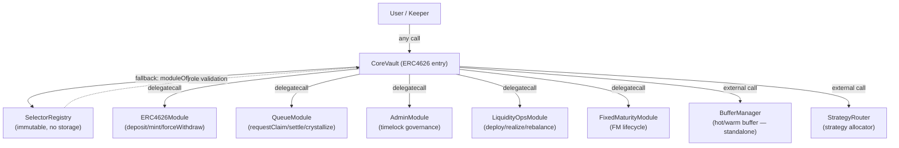
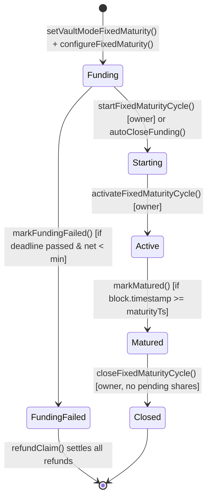

# Multyr Core — Architecture

> **Status**: draft | **Audit-scope**: multyr-core@pierdev
> **Last reviewed by code**: commit `1595a279` on branch `pierdev` (date: 2026-05-15)
> **Version**: 1.0.0-draft

---

## Table of Contents

1. [Overview](#1-overview)
2. [Diamond-Lite Architecture](#2-diamond-lite-architecture)
3. [Module Routing and Access Control](#3-module-routing-and-access-control)
4. [Storage Model](#4-storage-model)
5. [NAV Accounting and totalAssets()](#5-nav-accounting-and-totalassets)
6. [Exit Semantics (v9 Async Protocol)](#6-exit-semantics-v9-async-protocol)
7. [Fee Mechanics](#7-fee-mechanics)
8. [Buffer Management (Hot/Warm)](#8-buffer-management-hotwarm)
9. [Fixed Maturity Lifecycle States](#9-fixed-maturity-lifecycle-states)
10. [System Sealing](#10-system-sealing)
11. [Ownership and Pause](#11-ownership-and-pause)
12. [Strategy Boundary](#12-strategy-boundary)
13. [Public Interface Summary](#13-public-interface-summary)
14. [Invariants](#14-invariants)
15. [External Calls](#15-external-calls)
16. [Edge Cases](#16-edge-cases)
17. [Glossary and Cross-Links](#17-glossary-and-cross-links)

---

## 1. Overview

Multyr Core is a non-custodial ERC-4626 vault built on Arbitrum. It accepts USDC deposits and allocates capital to a configurable set of lending strategies (Aave V3, Compound III, Morpho Blue, Euler V2, Fluid, Dolomite) through a strategy router. Yield accrues to share holders via a rising price-per-share (PPS) model.

The core protocol is designed with three guiding principles:

**Non-custodial**: At no point does the protocol hold user funds outside of the vault smart contracts. All assets flow between the vault's hot buffer, warm adapters, and strategy adapters under deterministic, publicly-verifiable rules.

**Queued exits**: Standard withdrawals and redemptions are non-atomic. `withdraw()` and `redeem()` always revert. Users submit exit requests via `requestClaim()`, which either settles instantly (if epoch cap allows) or enters a FIFO queue settled by keepers. This design eliminates the synchronous MEV attack surface present in standard ERC-4626 vaults.

**Modular logic (Diamond-lite)**: All economic logic — deposits, exits, fee crystallization, admin governance — is implemented in separate module contracts. `CoreVault` delegates every call to the appropriate module via `delegatecall`. This permits module-level upgrades (with timelock) without redeploying the vault.

---

## 2. Diamond-Lite Architecture

### 2.1 Design

`CoreVault` is a Diamond-lite proxy: a thin ERC-4626 contract that delegates all economic operations to external module contracts via `delegatecall`. Unlike EIP-2535 (full Diamond), the selector registry is immutable after initial deployment, and modules are not stored in a shared diamond storage contract — each module uses its own EIP-7201 namespaced storage slot.



All shared state (flags, module routing table, owner, params, etc.) lives in `CoreStorage.Layout` accessed via `CoreStorage.layout()` in every module. Because modules execute in the vault's context via `delegatecall`, `address(this)` inside a module equals `CoreVault`'s address.

### 2.2 Dispatch Flow

Every call to `CoreVault` that is not an explicitly-implemented function (see §2.3) is intercepted by the `fallback()` function:

```
fallback() [CoreVault.sol:144-178]:
  1. core = CoreStorage.layout()
  2. module = core.moduleOf[msg.sig]
     → revert ModuleNotSet() if address(0)
  3. role = core.roleOf[msg.sig]
     → access control check (see §3)
  4. (success, result) = module.delegatecall(msg.data)
     → propagate revert on failure
     → inline assembly return on success
```

ERC-4626 public functions (`deposit`, `mint`, `withdraw`, `redeem`) are explicitly implemented on `CoreVault` and delegate internally via `_delegateToModule()`:

```solidity
// CoreVault.sol:236-250
function _delegateToModule(bytes4 sel, bytes calldata data) internal returns (bytes memory) {
    address module = CoreStorage.layout().moduleOf[sel];
    if (module == address(0)) revert ModuleNotSet();
    (bool success, bytes memory result) = module.delegatecall(data);
    ...
}
```

After delegation, `CoreVault` calls `_refreshOpsNavCache()` to keep the operational NAV cache fresh. See §5 for the distinction between live NAV and ops cache.

### 2.3 Functions Implemented Directly on CoreVault

The following functions are NOT routed via the module dispatch — they are implemented directly on `CoreVault`:

| Function | Purpose |
|---|---|
| `totalAssets()` | Live NAV (ERC-4626 canonical) — see §5 |
| `maxDeposit(address)` | Returns 0 if paused/cap/warm-NAV invalid |
| `maxWithdraw(address)` | Always returns 0 (queued protocol) |
| `maxRedeem(address)` | Always returns 0 (queued protocol) |
| `previewDeposit(uint256)` | Fee-aware shares preview |
| `previewMint(uint256)` | Fee-aware assets-in preview |
| `owner()`, `guardian()` | Role reads |
| `paused()`, `pausedDeposits()`, `pausedWithdrawals()` | State reads |
| `moduleOf(bytes4)`, `roleOf(bytes4)` | Routing table reads |
| `setModule()`, `setModulesBatch()` | Routing table writes (onlyOwner) |
| `freezeRouting()` | Freeze routing table (irreversible) |
| `setSelectorRegistry()` | One-shot registry binding |
| `pauseAll()`, `unpauseAll()`, `guardianPause()` | Pause control |
| `beginOwnerTransfer()`, `acceptOwnerTransfer()` | Ownership transfer |
| `processorMint()`, `processorBurn()`, `processorTransfer()`, `processorSpendAllowance()` | Module callbacks for share accounting |
| `authorizeModule()`, `isModuleAuthorized()` | Module authorization for processor functions |
| `setAuthorizedSealer()`, `sealBySealer()` | System sealing |
| `mintRewardShares()` | Dedicated reward minting (via RewardsPayoutManager) |

---

## 3. Module Routing and Access Control

### 3.1 Role Constants

`CoreVault` defines five role constants that govern which addresses may call which selectors via the `fallback()` router:

```solidity
// CoreVault.sol:71-75
uint8 public constant ROLE_PUBLIC = 0;           // no restriction
uint8 public constant ROLE_OWNER = 1;            // only owner
uint8 public constant ROLE_GUARDIAN = 2;         // only guardian
uint8 public constant ROLE_OWNER_OR_GUARDIAN = 3; // owner or guardian
uint8 public constant ROLE_MODULE = 4;            // only address(this)
```

The role check is performed in `fallback()` before the `delegatecall` to the module. `ROLE_PUBLIC` (0) has no restriction — any address may call.

### 3.2 SelectorRegistry

`SelectorRegistry` is a stateless, immutable contract that serves as the single source of truth for selector-to-role mappings. It encodes the security model at deploy time and cannot be modified:

```solidity
// SelectorRegistry.sol:27-28
// No storage, no admin, no upgrades — fully immutable
contract SelectorRegistry {
```

Key properties (`src/core/libraries/SelectorRegistry.sol:55-208`):
- `getRequiredRole(bytes4 selector) → uint8`: O(1) switch-case lookup, pure function.
- `validateRoleAssignment(bytes4, uint8) → bool`: reverts with `InvalidRoleForSelector` if a registered selector is assigned the wrong role.
- `requireKnownSelector(bytes4)`: reverts with `UnknownSelector` if the selector is not in the registry (allowlist mode).
- Total registered selectors: 91 (`src/core/libraries/SelectorRegistry.sol:388-390`).
- Owner-critical selectors: 34 (all AdminModule governance functions + FM governance).

`CoreVault.setModule()` calls `SelectorRegistry.validateRoleAssignment()` before every routing table write, preventing misrouting attacks where an owner-only function could be mistakenly set as public (`src/core/CoreVault.sol:292-302`).

### 3.3 Routing Table

The routing table is stored in `CoreStorage.Layout`:

```solidity
// CoreStorage.sol:79-80
mapping(bytes4 => address) moduleOf;
mapping(bytes4 => uint8)   roleOf;
```

Once `freezeRouting()` is called (`src/core/CoreVault.sol:304-309`), the routing table is permanently frozen — no further `setModule()` calls are accepted. This is a precondition for `sealBySealer()` (see §10).

The routing table is populated during deployment by `setModulesBatch()`. Typical mappings:

| Selector Group | Module | Role |
|---|---|---|
| `deposit`, `mint`, `redeem`, `withdraw`, `forceWithdraw` | ERC4626Module | ROLE_PUBLIC |
| `requestClaim`, `cancelClaim`, `settleFeesAndProcessQueue`, `compactQueue` | QueueModule | ROLE_PUBLIC |
| `submitFeeParams`, `acceptFeeParams`, `setParams`, `setRouter`, ... | AdminModule | ROLE_OWNER |
| `setVaultModeFixedMaturity`, `configureFixedMaturity`, `startFixedMaturityCycle` | FixedMaturityModule | ROLE_OWNER |
| `markMatured`, `refundClaim`, `autoCloseFunding` | FixedMaturityModule | ROLE_PUBLIC |
| `deployToStrategies`, `realizeForQueue`, `canDeploy` | LiquidityOpsModule | ROLE_PUBLIC |

### 3.4 Processor Functions

Modules executing via `delegatecall` cannot directly call ERC20-inherited functions on `CoreVault` (`_mint`, `_burn`, `_transfer`) because those are `internal`. Instead, `CoreVault` exposes four processor callbacks:

```solidity
// CoreVault.sol:681-699
function processorMint(address to, uint256 amount) external { _requireModuleAccess(); _mint(to, amount); }
function processorBurn(address from, uint256 amount) external { _requireModuleAccess(); _burn(from, amount); }
function processorTransfer(address from, address to, uint256 amount) external { _requireModuleAccess(); _transfer(from, to, amount); }
function processorSpendAllowance(address owner_, address spender, uint256 amount) external { _requireModuleAccess(); _spendAllowance(owner_, spender, amount); }
```

`_requireModuleAccess()` (`src/core/CoreVault.sol:673-679`) authorizes two patterns:
1. **Delegatecall context**: `msg.sender == address(this)` — QueueModule, AdminModule, LiquidityOpsModule call these from within delegatecall, so `msg.sender` is the vault itself.
2. **Authorized external module**: `isAuthorizedModule[msg.sender]` — ERC4626Module executes as an external call (not delegatecall), so it must be registered via `authorizeModule()`.

---

## 4. Storage Model

All vault state is stored using EIP-7201 namespaced storage to prevent collisions between modules sharing the vault's storage context via `delegatecall`. Each namespace is a separate library with a fixed `SLOT` constant.

### 4.1 Storage Namespaces

| Library | Namespace string | SLOT (truncated) |
|---|---|---|
| `CoreStorage` | `dsf.core.main.storage.v1` | `0x5f3e8c9a...2d00` |
| `FeeStorage` | `dsf.core.fee.storage.v1` | `0x2b4d6f8a...2b00` |
| `QueueStorage` | `dsf.core.queue.storage.v1` | `0x8a3c5e7b...1a00` |
| `FixedMaturityStorage` | `dsf.core.fixedmaturity.storage.v1` | `0xa3a75559...9300` |

Each library exposes a `layout()` function that returns a storage pointer at the fixed slot via inline assembly. For detailed field-by-field layout see [storage-layout.md](storage-layout.md).

### 4.2 Packed Flags

`CoreStorage.Layout.packedFlags` is a `uint256` bitmap used for gas-efficient state flags. Each bit corresponds to a specific boolean state:

| Bit | Constant | Meaning |
|---|---|---|
| 0 | `FLAG_PAUSED` | All operations paused |
| 1 | `FLAG_PAUSED_DEPOSITS` | Deposits only paused |
| 2 | `FLAG_PAUSED_WITHDRAWALS` | Withdrawals only paused |
| 3 | `FLAG_PARAMS_FROZEN` | `paramMinDelay` permanently frozen |
| 4 | `FLAG_LIQUIDITY_LOCKED` | Liquidity reallocation locked |
| 5 | `FLAG_NAV_SMOOTH_INIT` | NAV smoothing initialized |
| 6 | `FLAG_ROUTING_FROZEN` | Module routing table frozen (irreversible) |
| 7 | `FLAG_REENTRANCY_LOCKED` | Reentrancy guard |
| 8 | `FLAG_COMPONENTS_TIMELOCKED` | Component changes require timelock |
| 9 | `FLAG_SYSTEM_SEALED` | System permanently sealed |
| 10 | `FLAG_DEAD_DEPOSIT_DONE` | Dead deposit seeded (inflation attack hardening) |
| 11 | `FLAG_FEES_INITIALIZED` | Fees initialized via `setInitialFees()` |
| 12 | `FLAG_PERF_INITIALIZED` | Performance fee initialized via `setInitialPerfParams()` |

Source: `src/core/storage/CoreStorage.sol:24-36`.

---

## 5. NAV Accounting and totalAssets()

### 5.1 Live NAV (Canonical)

`totalAssets()` is the canonical NAV function used for all ERC-4626 computations (PPS, `convertToAssets`, `convertToShares`, fee crystallization, deposit/withdrawal math):

```solidity
// CoreVault.sol:500-527
function totalAssets() public view override returns (uint256) {
    (uint256 hot, uint256 strat, uint256 warm) = _totalAssetsBreakdown();
    return hot + strat + warm;
}
```

NAV consists of three components:
- **Hot** (`hot`): USDC held directly in `CoreVault` (`IERC20(asset()).balanceOf(address(this))`).
- **Strategy** (`strat`): `IStrategyRouter.totalStrategyAssetsSafe()` — sum of all enabled strategies' reported NAV.
- **Warm** (`warm`): `IBufferManager.warmNavState()` — NAV held by warm adapters (Aave, Morpho, etc., used for short-term buffer). Returns the cached warm NAV; validity checked separately.

The `totalAssetsBreakdown()` external function returns `(nav, hot, warm)` — note `strat` is included in `nav` but not returned separately.

### 5.2 Ops NAV Cache (Non-Canonical)

A separate cache exists for gas-sensitive operational decisions:

```solidity
// CoreVault.sol:80-82
uint256 internal _opsNavCache;
uint64  internal _opsNavCacheTs;
uint32  public   opsNavCacheTtl = 60; // seconds
```

**Allowed uses**: `checkUpkeep`, keeper scheduling, liquidity routing pre-checks.
**Forbidden uses**: `convertToAssets`, `convertToShares`, fee math, share mint/burn, payout.

The cache is refreshed after every `deposit`, `mint`, `withdraw`, `redeem` call via `_refreshOpsNavCache()` (`src/core/CoreVault.sol:655-658`). Off-path callers read it via `cachedNavForOps()` (`src/core/CoreVault.sol:645-647`).

### 5.3 Deposit Admission Gate

Deposits are gated by `_depositsAreCurrentlyAllowed()` (`src/core/CoreVault.sol:616-627`). A deposit is rejected if:
- `FLAG_PAUSED` or `FLAG_PAUSED_DEPOSITS` is set.
- `bufferManager` is not set (address zero).
- `warmNavState()` is not valid.
- `warmNavState()` timestamp is older than 15 minutes (`MAX_WARM_NAV_AGE = 15 minutes`, `src/core/modules/ERC4626Module.sol:73`).

This ensures that no shares are minted when the warm NAV is stale or unavailable, preventing dilution attacks.

---

## 6. Exit Semantics (v9 Async Protocol)

### 6.1 No Sync Withdraw

This is a queued protocol. Standard ERC-4626 `withdraw()` and `redeem()` **always revert** with `AsyncWithdrawalRequired`:

```solidity
// ERC4626Module.sol:140-157
function withdraw(uint256, address, address) external pure returns (uint256) {
    revert ExitEngineLib.AsyncWithdrawalRequired();
}
function redeem(uint256, address, address) external pure returns (uint256) {
    revert ExitEngineLib.AsyncWithdrawalRequired();
}
```

ERC-4626 compliance is maintained: `maxWithdraw(address)` and `maxRedeem(address)` both return 0, signaling that these functions will revert. Source: `src/core/CoreVault.sol:544-553`.

### 6.2 Exit Modes

The protocol defines three exit modes (`src/core/libraries/ExitEngineLib.sol:28-33`):

```solidity
enum ExitMode {
    STANDARD, // requestClaim(false) — witBps only
    INSTANT,  // requestClaim(true)  — witBps + immediateExitPenaltyBps
    FORCE     // forceWithdraw()     — witBps + forceExitPenaltyBps
}
```

| Mode | Path | Epoch Cap | Lock Period | Fee |
|---|---|---|---|---|
| STANDARD | `requestClaim(false)` | Not consumed | Enforced | `witBps` |
| INSTANT | `requestClaim(true)` | Consumed | Enforced | `witBps + immediateExitPenaltyBps` |
| FORCE | `forceWithdraw()` | Not consumed | Bypassed | `witBps + forceExitPenaltyBps` |

### 6.3 requestClaim() — INSTANT vs QUEUED

`requestClaim(bool immediate, uint256 shares)` (`src/core/modules/QueueModule.sol:81-169`) is the primary exit function. Its behavior depends on the `immediate` parameter and three conditions:

**INSTANT settlement conditions** (`src/core/modules/QueueModule.sol:529-553`):
1. Lock period has passed: `block.timestamp >= lastDepositTs[user] + lockPeriod`
2. Epoch cap not exhausted: `grossAssets <= calculateCapRemaining()`
3. Sufficient hot liquidity: `hot >= grossAssets`

If all three conditions are met and `immediate == true`, settlement is atomic in the same transaction:
1. Fee shares transferred to `feeCollector` (TRANSFER, not mint — no dilution).
2. User shares burned via `processorBurn`.
3. Net assets transferred to user.
4. Epoch cap consumed via `ExitEngineLib.consumeEpochCap()`.

If any condition fails (or `immediate == false`), the claim is queued:
1. Shares transferred to vault as escrow.
2. `QueueStorage.Claim` created with `immediate = false` regardless of the caller's preference (fallback INSTANT→QUEUED drops the epoch cap flag).
3. Claim ID assigned and pushed to `queue[]`.

### 6.4 Queue Processing

The queue is a FIFO array of claim IDs (`QueueStorage.Layout.queue`). Settlement is triggered by `settleFeesAndProcessQueue(maxClaims)` (keeper) or `processQueuedRedemptions(maxClaims)` (public).

Settlement algorithm (`src/core/modules/QueueModule.sol:358-521`):
1. **Bounded pre-scan**: scan up to `maxClaims * 2` entries, stop after 32 consecutive ineligible claims.
2. **Warm refill**: attempt `BufferManager.refill()` if hot < required.
3. **Settle loop**: iterate `[head, scanWindowEnd)`, settle eligible claims at cached PPS snapshot.

Deterministic pricing: `cachedTA` and `cachedTS` (totalAssets, totalSupply) are snapshotted once per `settleFeesAndProcessQueue` call. All claims in the batch use the same PPS, preventing intra-batch arbitrage.

### 6.5 forceWithdraw — Guaranteed Exit

`forceWithdraw(uint256 assets, address receiver, address owner_, IStrategyRouter.Pull[] calldata plan, uint256 maxShares)` (`src/core/modules/ERC4626Module.sol:163-250`) provides a guaranteed exit path:

- Bypasses lock period.
- Does NOT consume epoch cap.
- Requires a user-supplied liquidity plan specifying which strategies to redeem from.
- Applies `witBps + forceExitPenaltyBps` fee (and `preMaturityForceExitPenaltyBps` in FM/Active state).
- Maximum 10 strategy legs (`MAX_FORCE_LEGS = 10`, `src/core/modules/ERC4626Module.sol:74`).

`forceWithdrawAll(address receiver)` (`src/core/modules/ERC4626Module.sol:257-332`) is a no-plan variant: burns all caller shares, attempts hot → warm → strategy liquidity waterfall in sequence.

---

## 7. Fee Mechanics

### 7.1 Fee Types

Four fee parameters are stored in `FeeStorage.InternalFeeParams` (`src/core/storage/FeeStorage.sol:12-18`):

| Field | Type | Applied at |
|---|---|---|
| `depBps` | uint16 | Deposit — deducted from deposited assets |
| `witBps` | uint16 | All exits — base withdrawal fee |
| `immediateExitPenaltyBps` | uint16 | Instant exits (`requestClaim(true)`) — additive |
| `forceExitPenaltyBps` | uint16 | Force exits (`forceWithdraw`) — additive |

All values are in basis points (1 bp = 0.01%). Maximum values are capped by `GlobalConfig` via `IParamsProvider` (governance-configurable, not hardcoded).

### 7.2 Fee Computation

`ExitFeeLib` is the single source of truth for exit fee computation (`src/core/libraries/ExitFeeLib.sol`):

```
STANDARD:  feeBps = witBps
INSTANT:   feeBps = witBps + immediateExitPenaltyBps
FORCE:     feeBps = witBps + forceExitPenaltyBps
           [+ preMaturityForceExitPenaltyBps if FM mode + Active state]
```

Fee shares are computed by `ExitEngineLib.computeFeeShares()` (`src/core/libraries/ExitEngineLib.sol:151-174`), rounded UP (directive #5). Fee shares are transferred to `feeCollector` via `processorTransfer` — no new shares are minted, so the operation is non-dilutive.

### 7.3 Deposit Fee

The deposit fee (`depBps`) is applied as:

```
feeAssets = mulBpsDown(assets, depBps)
net = assets - feeAssets
shares = convertToShares(net)
sharesFee = convertToShares(feeAssets)
```

Gross shares `(shares + sharesFee)` are minted to the receiver, then `sharesFee` is transferred to `feeCollector`. This is non-dilutive: totalSupply increases by `convertToShares(assets)`, proportional to the totalAssets increase. Source: `src/core/modules/ERC4626Module.sol:475-493`.

### 7.4 Performance Fee (Crystallization)

A high-water mark (HWM) performance fee is crystallized at epoch end via `endEpochCrystallize()`. The fee is minted as new shares to `feeCollector`:

```
profit = totalAssets - (HWM * totalSupply)
feeAssets = profit * perfRateX
feeShares = convertToShares(feeAssets)
```

Source: `src/core/modules/QueueModule.sol:763-803`. Parameters:
- `perfRateX`: scaled performance fee rate (`FeeStorage.Layout.perfRateX`).
- `highWaterMark`: PPS at last crystallization (`FeeStorage.Layout.highWaterMark`).
- `minCrystallizeInterval`: minimum time between crystallizations.

Performance fee minting is dilutive by design — it represents protocol revenue proportional to vault growth.

### 7.5 Fee Changes (Timelock)

Fee parameters are changed via a submit/accept/revoke timelock pattern in `AdminModule`. The timelock duration is `paramMinDelay` (set at deployment, adjustable with its own timelock). The maximum ETA window is 7 days (`src/core/modules/AdminModule.sol:45`).

During bootstrap, `paramMinDelay = 0` (immediate acceptance). Owners MUST increase this post-deployment. Source: `src/core/CoreVault.sol:104`.

---

## 8. Buffer Management (Hot/Warm)

### 8.1 Three-Tier Liquidity Architecture

```
User deposits/exits
       │
       ▼
┌──────────────┐
│ HOT BUFFER   │  = USDC held in CoreVault
│ (CoreVault)  │  ← immediate exits paid from here
└──────┬───────┘
       │  BufferManager deploys/refills
       ▼
┌──────────────┐
│ WARM BUFFER  │  = WarmAdapters (Aave, Morpho for short-term buffer)
│ (Adapters)   │  ← BufferManager.refill() pulls from here
└──────┬───────┘
       │  StrategyRouter deploys/redeems
       ▼
┌──────────────┐
│ STRATEGY     │  = Long-term yield strategies
│ (Router)     │  ← LiquidityOpsModule.deployToStrategies()
└──────────────┘
```

### 8.2 BufferManager Role

`BufferManager` (`src/core/modules/BufferManager.sol`) is a standalone contract (not a module, not called via delegatecall). It manages:
- **Deploy**: push excess hot funds into warm adapters.
- **Refill**: pull from warm adapters back to hot buffer when needed for queue settlement.
- **Warm NAV cache**: maintains `cachedWarmNav`, updated by keeper's `rebalance()` call.

**Critical invariant**: BufferManager must NEVER hold idle asset balance. All assets flow directly between CoreVault (hot) and WarmAdapters. Source: `src/core/modules/BufferManager.sol:16-20`.

### 8.3 Warm NAV Validity

`BufferManager.warmNavState()` returns `(uint256 warmNav, uint40 ts, bool valid)`.

`valid = false` if any adapter failed during the last NAV cache update. When `valid = false`:
- Deposits are rejected (`_depositsAreCurrentlyAllowed()` returns false).
- Exits proceed regardless (W2 policy: never block exits).

The warm NAV timestamp expires after `MAX_WARM_NAV_AGE = 15 minutes` (`src/core/modules/ERC4626Module.sol:73`). `ERC4626Module._ensureFreshWarmNav()` attempts a soft refresh on deposit and reverts if the result is still invalid or stale.

For exits, `_trySoftRefreshWarmNav()` is best-effort (try/catch, never blocking). Source: `src/core/modules/ERC4626Module.sol:636-664`.

### 8.4 Buffer Config

`BufferManager.getConfig()` returns a `BufferConfig` struct with:
- `opsReserveTargetBps`: percentage of NAV to keep as hot reserve.
- `maxWarmBps`: maximum percentage of NAV to deploy to warm adapters.
- `maxWarmSlippageBps`: slippage tolerance for warm adapter withdrawals.

These configure when `canDeploy()` triggers deployment (`src/core/modules/LiquidityOpsModule.sol:60-97`).

---

## 9. Fixed Maturity Lifecycle States

`CoreVault` supports two vault modes (coexisting deployments can be either):

```solidity
// FixedMaturityStorage.sol:11-14
enum VaultMode { OpenEnded, FixedMaturity }
```

For `OpenEnded` vaults, all FixedMaturity logic is zero-cost (early return guards at every gating function). For `FixedMaturity` vaults, the vault progresses through a state machine:

```solidity
// FixedMaturityStorage.sol:17-24
enum VaultState {
    Funding,       // accepting deposits, awaiting activation
    Starting,      // committed assets locked, strategy not yet deployed
    Active,        // capital deployed to fixedTermStrategy
    Matured,       // maturity reached; exits allowed
    Closed,        // terminal: all claims settled
    FundingFailed  // terminal: deadline passed, minFunding not reached
}
```

### 9.1 State Transition Diagram



### 9.2 State-Dependent Operation Gating

Operations are gated by the current state via free functions in `src/core/storage/FixedMaturityStorage.sol`:

| Operation | Allowed in states |
|---|---|
| `deposit()` | `Funding` (OpenEnded: always) |
| `requestClaim()` | `Matured` (OpenEnded: always) |
| `settleFeesAndProcessQueue()` | `Matured` (OpenEnded: always) |
| `forceWithdraw()` | `Active` (OpenEnded: always) |
| `deployToStrategies()` | OpenEnded only |

### 9.3 Funding Failed Path

If the funding deadline passes and `totalAssets < minFundingAssets`, any user can call `markFundingFailed()`. A PPS snapshot `fundingFailedPPS` is taken at this point. Depositors can then call `refundClaim()` to recover their proportional share of assets at the snapshot PPS.

Source: `src/core/modules/FixedMaturityModule.sol:37-80` (governance), `src/core/storage/FixedMaturityStorage.sol:55-70` (storage layout).

---

## 10. System Sealing

The system sealing mechanism provides a tamper-proof finalization for production deployments. There are now two supported paths:

### 10.1 Atomic seal (production path): `SystemSealer.verifyAndSeal()`

```
ROOT_TIMELOCK schedules a single-call batch:
  systemSealer.verifyAndSeal(config)
    - Verifies all deployment invariants (owner, guardian, vetoer, components, ...)
    - Computes configHash = keccak256(config addresses)   — NO block.timestamp
    - Calls vault.sealBySealer(configHash), which atomically:
        - checks msg.sender == authorizedSealer
        - checks FLAG_ROUTING_FROZEN is set
        - sets pendingSealHash = configHash
        - sets FLAG_SYSTEM_SEALED
  - Permanent — no reversal
```

`sealBySealer()` (`src/core/CoreVault.sol:369`) is the **only** sealing path — invoked entirely from within `SystemSealer.verifyAndSeal()`.

### 10.2 Removed: legacy two-step `prepareSeal` / `sealFinalState`

An earlier design split sealing into two owner-facing calls on `CoreVault`:

```
Owner calls prepareSeal(configHash):
  - Requires FLAG_ROUTING_FROZEN
  - Requires authorized sealer (SystemSealer contract)
  - Stores pendingSealHash = configHash

Owner calls sealFinalState(expectedHash):
  - Verifies expectedHash == pendingSealHash (TOCTOU protection)
  - Sets FLAG_SYSTEM_SEALED
  - Permanent — no reversal
```

The contract-side half of this pattern, `SystemSealer.prepareSeal()`, computed `configHash` including `block.timestamp`, which made the hash unrecoverable at `executeBatch()` time: `scheduleBatch()` and `executeBatch()` run at different blocks separated by the full timelock delay, so no operator could ever encode the matching hash in advance and the batch always reverted (see `test/sprint-test/SystemSealer_TimestampHash_POC.t.sol`). `verifyAndSeal()`/`sealBySealer()` fixed this by excluding `block.timestamp` from the hash and sealing atomically in one call.

Once the atomic path existed, `CoreVault.prepareSeal()` and `CoreVault.sealFinalState()` had no remaining caller (`SystemSealer.prepareSeal()` was already gone) and were **removed** as dead code ahead of audit, along with their now-unused `SealHashMismatch`/`SealNotPrepared` errors and `SealPrepared` event.

After sealing:
- `authorizeModule()` reverts (`SystemSealed`).
- Further sealer assignment reverts.

Source: `src/core/SystemSealer.sol`, `src/core/CoreVault.sol:343-378`.

---

## 11. Ownership and Pause

### 11.1 Ownership (2-Step Transfer)

Ownership transfer is a two-step process to prevent accidental loss:

1. Current owner calls `beginOwnerTransfer(newOwner)` — stores `pendingOwner`.
2. `newOwner` calls `acceptOwnerTransfer()` — atomically transfers ownership.

Source: `src/core/CoreVault.sol:394-407`.

### 11.2 Guardian

The guardian is a separate address with limited pause capability. The guardian can pause the vault via `guardianPause()`, subject to a cooldown enforced by `IParamsProvider.guardianPauseCooldown()`. Default cooldown: 7 days (`src/core/CoreVault.sol:459-468`).

Guardians cannot unpause or modify routing — these require owner.

### 11.3 Pause Granularity

Three pause levels are available (all set by owner, all stored in `packedFlags`):

| Function | Pauses | Flag |
|---|---|---|
| `pauseAll()` | All operations | `FLAG_PAUSED` |
| `pauseDepositsOnly(true)` | Deposits only | `FLAG_PAUSED_DEPOSITS` |
| `pauseWithdrawalsOnly(true)` | Withdrawals only | `FLAG_PAUSED_WITHDRAWALS` |
| `guardianPause()` | All (emergency) | `FLAG_PAUSED` |

`unpauseAll()` clears all three flags atomically. Source: `src/core/CoreVault.sol:425-454`.

---

## 12. Strategy Boundary

`CoreVault` interacts with strategies exclusively through `IStrategyRouter`. The router is set via `AdminModule.setRouter()` (or `submitRouter / acceptRouter` if component timelock is enabled).

### 12.1 StrategyRouter Interface

From the vault's perspective, the strategy boundary is:

| Interface method | Called by | Purpose |
|---|---|---|
| `totalStrategyAssetsSafe()` | `CoreVault._totalAssetsBreakdown()` | NAV contribution from strategies |
| `forceRedeemForWithdraw(amount)` | `ERC4626Module._forcePullAllLiquidity()` | Emergency redeem for forceWithdrawAll |
| `isStrategyEnabled(strat)` | `ERC4626Module._validateAndExecutePlan()` | Validate plan in forceWithdraw |
| `executeRedeemBatch(plan)` | `ERC4626Module._validateAndExecutePlan()` | Execute forceWithdraw plan |
| `list()` | `LiquidityOpsModule.canDeploy()` | Check for enabled strategies |
| `executeDepositBatch(plan)` | `LiquidityOpsModule.deployToStrategies()` | Deploy surplus to strategies |

The StrategyRouter enforces per-strategy allocation caps and health checks independently of the vault. For the full strategy system documentation see `multyr-strategies/docs/usdc-lending/overview.md`.

### 12.2 Strategy Health Registry

`IStrategyHealthRegistry` (`CoreStorage.Layout.healthRegistry`) provides health status for strategies. It is consulted by `StrategyRouter` to determine whether a strategy is deployable.

---

## 13. Public Interface Summary

This table covers the 30 most important functions. For the complete selector registry see `src/core/libraries/SelectorRegistry.sol`.

| Function | Module/Contract | Role | Events | Key Reverts |
|---|---|---|---|---|
| `deposit(uint256,address)` | ERC4626Module | PUBLIC | `Deposit`, `DepositFeeTaken` | `Paused`, `NavInvalid`, `NavStale`, `VaultDepositCapExceeded` |
| `mint(uint256,address)` | ERC4626Module | PUBLIC | `Deposit`, `DepositFeeTaken` | same as deposit |
| `withdraw(...)` | ERC4626Module | PUBLIC | — | `AsyncWithdrawalRequired` (always) |
| `redeem(...)` | ERC4626Module | PUBLIC | — | `AsyncWithdrawalRequired` (always) |
| `forceWithdraw(...)` | ERC4626Module | PUBLIC | `ForceWithdrawExecuted`, `ForceExit` | `Paused`, `ZeroAmount`, `EmptyPlan`, `InsufficientLiquidity` |
| `forceWithdrawAll(address)` | ERC4626Module | PUBLIC | `ForceWithdrawAllExecuted`, `ForceExit` | `Paused`, `ZeroAmount` |
| `requestClaim(bool,uint256)` | QueueModule | PUBLIC | `ClaimRequested`, `InstantExit` or `ClaimQueued` | `ZeroAmount`, `ClaimTooSmall`, `ClaimCooldownActive` |
| `cancelClaim(uint256)` | QueueModule | PUBLIC | `ClaimCancelled`, `SharesUnfrozen` | `NotClaimOwner`, `AlreadySettled` |
| `settleFeesAndProcessQueue(uint256)` | QueueModule | PUBLIC | `ClaimSettled`, `EpochRolled`, `VaultPpsSnapshot` | `ZeroAmount` |
| `endEpochCrystallize()` | QueueModule | PUBLIC | `Crystallized`, `PerfFeeMinted`, `NavSmoothUpdated` | — |
| `deployToStrategies(...)` | LiquidityOpsModule | PUBLIC | `DeployedToStrategies` | `ReentrancyGuardLocked` |
| `realizeForQueue(uint256)` | LiquidityOpsModule | PUBLIC | — | — |
| `submitFeeParams(...)` | AdminModule | OWNER | `FeeParamsSubmitted` | `FeeTooHigh`, `PendingParamsNotResolved` |
| `acceptFeeParams()` | AdminModule | OWNER | `FeeParamsAccepted` | `EtaNotReached`, `NotPending` |
| `setParams(address)` | AdminModule | OWNER | — | `ZeroAddress`, `ComponentsTimelocked` |
| `setRouter(address)` | AdminModule | OWNER | — | `ZeroAddress`, `ComponentsTimelocked` |
| `setBufferManager(address)` | AdminModule | OWNER | — | `ZeroAddress`, `ComponentsTimelocked` |
| `setEcosystem(...)` | AdminModule | OWNER | — | `ZeroAddress` |
| `seedDeadDeposit(uint256)` | AdminModule | OWNER | `DeadDepositSeeded` | `DeadDepositAlreadySeeded`, `ZeroAmount` |
| `setVaultModeFixedMaturity()` | FixedMaturityModule | OWNER | `VaultModeConfigured` | `InvalidVaultMode`, `RoutingFrozen` |
| `configureFixedMaturity(...)` | FixedMaturityModule | OWNER | `FixedMaturityConfigured` | `AlreadyConfigured`, `InvalidVaultState` |
| `startFixedMaturityCycle()` | FixedMaturityModule | OWNER | `FixedMaturityStarted` | `FixedMaturityNotConfigured` |
| `markMatured()` | FixedMaturityModule | PUBLIC | `FixedMaturityMatured`, `FinalPerformanceFeeApplied` | `MaturityNotReached` |
| `refundClaim()` | FixedMaturityModule | PUBLIC | `RefundClaimed` | `NotFundingFailed` |
| `pauseAll()` | CoreVault | OWNER | `AllPaused` | — |
| `guardianPause()` | CoreVault | GUARDIAN | `GuardianPauseActivated` | `GuardianCooldownActive` |
| `setModule(bytes4,address,uint8)` | CoreVault | OWNER | `ModuleSet` | `RoutingFrozen`, `InvalidRoleForSelector` |
| `freezeRouting()` | CoreVault | OWNER | `RoutingFrozen` | `RoutingFrozen` (if already frozen) |
| `sealBySealer(bytes32)` | CoreVault | SEALER | `SystemSealed` | `RoutingNotFrozen`, `SystemSealed`, `InvalidConfigHash` |

---

## 14. Invariants

Invariants enforced by the protocol. For formal verification results see `docs/invariants.md`.

| ID | Statement | Enforcement location | Verified by test |
|---|---|---|---|
| I1 | `withdraw()` and `redeem()` NEVER transfer assets | `src/core/modules/ERC4626Module.sol:140-157` (pure revert) | `test/unit/ERC4626Module.t.sol` + Halmos `halmos-core/` |
| I2 | `totalSupply` NEVER increases on exit | no `_mint` in exit paths; fees via `transfer` | `test/unit/ERC4626Module.t.sol` + Halmos |
| I3 | `epochWithdrawn <= cap` (INSTANT only) | `ExitEngineLib.consumeEpochCap()`, cap check before settle | `test/unit/ExitEngine*.t.sol` |
| I4 | `simulateExit == runtime execution` | `ExitEngineLib.simulateExit()` mirrors production formulas | `test/unit/ExitEngine*.t.sol` (parity assertions) |
| I5 | `forceWithdraw` does NOT consume epoch cap | `src/core/modules/ERC4626Module.sol:325` (no cap consumption) | `test/unit/ERC4626Module.t.sol` |
| I6 | Fee shares always from owner/escrow via TRANSFER (not mint) | `processorTransfer` in all exit paths | `test/unit/ERC4626Module.t.sol` + `QueueModule.t.sol` |
| I7 | `maxWithdraw(address) == 0` always | `src/core/CoreVault.sol:544-547` (pure) | `test/unit/CoreVault*.t.sol` |
| I8 | `maxRedeem(address) == 0` always | `src/core/CoreVault.sol:549-553` (pure) | `test/unit/CoreVault*.t.sol` |
| I9 | Deposits blocked when warmNavValid=false | `_depositsAreCurrentlyAllowed()` checks `warmNavState()` | `test/unit/ERC4626Module.t.sol` (warmNav gate) |
| I10 | Routing table write blocked after `freezeRouting()` | `FLAG_ROUTING_FROZEN` check in `setModule()` | `test/unit/AdminModule.t.sol` |
| I11 | `processorMint/Burn/Transfer` only callable by authorized modules or delegatecall context | `_requireModuleAccess()` | `test/unit/CoreVault*.t.sol` (RBAC assertions) |
| I12 | Dead deposit seeded exactly once | `FLAG_DEAD_DEPOSIT_DONE` + `DeadDepositAlreadySeeded` guard | `test/unit/AdminModule.t.sol` |

---

## 15. External Calls

All external calls made by the vault system and their safety properties:

| Call | Caller | Target | Max Gas | Safety |
|---|---|---|---|---|
| `warmNavState()` | `CoreVault._depositsAreCurrentlyAllowed()` | `BufferManager` | ~3K | View-only; no trust needed |
| `refreshWarmNav()` | `ERC4626Module._ensureFreshWarmNav()` | `BufferManager` | ~200K | try/catch; non-blocking |
| `totalStrategyAssetsSafe()` | `CoreVault._totalAssetsBreakdown()` | `StrategyRouter` | ~50K | Safe view; returns 0 on error |
| `getDepositLimits()`, `getWithdrawalParams()` | `ERC4626Module`, `QueueModule` | `IParamsProvider` | ~5K | View; trust required (admin-set) |
| `forceRedeemForWithdraw()` | `ERC4626Module._forcePullAllLiquidity()` | `StrategyRouter` | ~300K | Best-effort; called last |
| `executeDepositBatch()` | `LiquidityOpsModule` | `StrategyRouter` | ~500K | Bounded by plan |
| `bm.refill()` | `QueueModule._settleScan()` | `BufferManager` | ~200K | try/catch; non-blocking |
| `bm.forceRefill()` | `ERC4626Module._forcePullAllLiquidity()` | `BufferManager` | ~200K | Best-effort |
| `inc.onDeposit()` | `ERC4626Module._notifyIncentivesDeposit()` | `IIncentives` | ~50K | try/catch; non-blocking |
| `eng.onDeposit/onExit()` | `ERC4626Module` | `IIncentivesEngine` | ~50K | try/catch; non-blocking |

---

## 16. Edge Cases

### 16.1 Zero totalSupply at deploy

Before `seedDeadDeposit()` is called, `totalSupply == 0`. In this state `convertToAssets(0) == 0` and deposits via `ERC4626Module` will compute `previewDeposit(net) == 0` shares. Owners MUST call `seedDeadDeposit()` before the first real deposit to prevent the ERC-4626 inflation attack. Source: `src/core/modules/AdminModule.sol` (`seedDeadDeposit()`).

### 16.2 Warm NAV = 0

If all warm adapters report 0 NAV (freshly deployed or empty), `warmNavState()` returns `(0, ts, true)`. The warm component of totalAssets is 0. Deposits are still admitted if `valid=true` and within TTL.

### 16.3 requestClaim INSTANT fallback to queue

If an instant claim fails the cap or lock period check, it is queued with `immediate = false` — the epoch cap is NOT pre-consumed. This means the queued claim will be settled as STANDARD (no cap consumption at settlement). This design avoids the scenario where a user reserves cap space by queuing an instant claim.

### 16.4 Oracle staleness (FixedMaturity)

In `FixedMaturity/Active` state, `markMatured()` is callable by anyone once `block.timestamp >= maturityTs`. The final performance fee is applied exactly once at the moment `markMatured()` is called. If `markMatured()` is called significantly later than `maturityTs`, the performance fee base will reflect NAV at that later time — the protocol's fee should be computed on growth during the active period, not extended waiting time. Governance should trigger `markMatured()` promptly after maturity.

### 16.5 Max uint values and dust

- Epoch cap: if `capPerEpochBps == 0`, `calculateCapRemaining()` returns `type(uint256).max` (uncapped). Source: `src/core/libraries/ExitEngineLib.sol:129`.
- `maxDeposit(receiver)`: if both vault and user caps are 0, returns `type(uint256).max`. Source: `src/core/CoreVault.sol:555-583`.
- Dust: minimum deposit enforced by `DepositBelowMinimum` if `minDepositAmount > 0`.

---

## 17. Glossary and Cross-Links

| Term | Definition |
|---|---|
| Diamond-lite | Delegatecall-based modular architecture; selectors routed to external logic contracts. Not EIP-2535. |
| Hot buffer | USDC held directly in CoreVault (immediate liquidity). |
| Warm buffer | USDC deployed to short-duration adapters (Aave, Morpho) for yield; managed by BufferManager. |
| Strategy | Long-term yield strategy (USDC Lending, Multiply). Accessed via StrategyRouter. |
| PPS | Price-per-share = `totalAssets * 1e18 / totalSupply`. |
| Epoch cap | Maximum fraction of NAV withdrawable via INSTANT exits per epoch (configurable via `capPerEpochBps`). |
| HWM | High-water mark for performance fee crystallization. |
| paramMinDelay | Minimum timelock delay for fee/governance param changes (bootstrap: 0, production: ≥2 days). |
| Sealer | SystemSealer contract authorized to call `sealBySealer()` (via `verifyAndSeal()`). |
| Dead deposit | A "dead" share minted by owner at genesis to prevent the ERC-4626 inflation attack. |
| Lock period | Minimum time between deposit and claim eligibility (anti-MEV). |
| W2 policy | "Never block exits": all exit paths continue on error, never revert due to NAV staleness. |

### 17.1 Protocol-Level Sequence Examples

**Canonical deposit flow** (OpenEnded, warmNav valid):
1. User calls `deposit(assets, receiver)` → CoreVault ERC4626 thin wrapper
2. CoreVault delegates to `ERC4626Module._depositInternal()` (`src/core/modules/ERC4626Module.sol:457`)
3. FM gate: `_checkDepositsAllowed(fm)` → passes if `OpenEnded` or `Funding`
4. Pause gate, reentrancy lock acquired (`FLAG_REENTRANCY_LOCKED`)
5. `_ensureFreshWarmNav()` → calls `BufferManager.warmNavState()` if stale
6. Limit check: `assets <= maxDeposit(receiver)` — cap enforcement
7. Fee computation: `feeBps = fee.depBps` → `feeShares = shares * feeBps / 10000`
8. `processorMint(receiver, shares - feeShares)` + `processorMint(feeCollector, feeShares)`
9. `safeTransferFrom(caller, address(this), assets)` — USDC pulled
10. Update `lastDepositTs[receiver]` and `_opsNavCache`

**Canonical exit flow** (INSTANT path):
1. User calls `requestClaim(immediate=true, shares)` → QueueModule
2. Lock period check: `block.timestamp >= lastDepositTs[user] + lockPeriod`
3. Epoch rollover: `ExitEngineLib.rollEpochIfNeeded()` if `block.timestamp >= epochStart + epochDuration`
4. Cap check: `ExitEngineLib.calculateCapRemaining()` — epoch cap still available
5. Fee shares computed: `ExitEngineLib.computeFeeShares(INSTANT, ...)` — rounded UP
6. Fee shares transferred to feeCollector, remaining shares escrowed (transferred to `address(this)`)
7. Claim stored in QueueStorage with `immediate=true`
8. At settlement: assets calculated from escrowed shares, USDC transferred to user

### Cross-Links

- Storage layout details → field offsets, EIP-7201 slot computation, forge inspect: [storage-layout.md](storage-layout.md)
- Module-by-module spec → per-function access control, storage access patterns, error codes: [modules.md](modules.md)
- Access control matrix → all selector→role assignments: [access-control.md](access-control.md)
- Invariants (formal): [invariants.md](invariants.md)
- Threat model: [threat-model.md](threat-model.md)
- Exit engine + fee policy: cluster 01a.2 (pending)
- Queue mechanics: cluster 01a.2 (pending)
- Deployment guide: [deployment.md](deployment.md)

---

**Code reference**: commit `1595a279` on branch `pierdev` (date: 2026-05-15)

**Source .md files that informed this document** (topic coverage only, no content copied):
- `docs/01-architecture/DIAMOND-LITE-ARCHITECTURE.md` — terminology and section coverage check
- `docs/01-architecture/TECH-DESIGN-COMPLETO.md` — section coverage check
- `docs/01-architecture/V10_ENGINE_REPORT.md` — design rationale for portfolio-grade allocation engine
- `docs/01-architecture/vault-flow.md` — flow diagram structure
- `docs/01-architecture/FEECOLLECTOR-SAFETYRESERVE.md` — fee flow section inspiration
- `docs/09-audit/architecture.md` — auditor expectation coverage

**Discrepancies found** (code vs. old source .md):
- [^1]: Some source .md files (pre-dating v9 refactor) describe `redeem()` / `withdraw()` as synchronous exit paths. Code confirms these always revert `AsyncWithdrawalRequired` (ERC4626Module.sol:140-157). Users must use `requestClaim()`.
- [^2]: `V10_ENGINE_REPORT.md` treats "V10 Portfolio-Grade Allocation Engine" as a future proposal. The code shows `rebalancePolicy`, `rebalanceGuard`, `executionMemory` fields already present in `CoreStorage.Layout:100-105`, with wiring modules `RouterAllocationPolicy.sol`, `RouterRebalanceGuard.sol`, `src/core/modules/ExecutionMemory.sol` existing in `src/core/modules/`. The feature is partially implemented but optional (strict mode toggleable via `strictExecutionMemory`).
