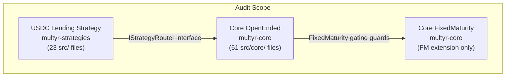

# audit-scope.md — Multyr Core: Audit Scope & Security Profile

**Version**: 1.0.0 | **Branch**: reorg/runbook-docs-consolidate-01a.4 | **Commit**: see footer

---

## Table of Contents

1. [Overview](#1-overview)
2. [In-Scope Components](#2-in-scope-components)
3. [Out-of-Scope](#3-out-of-scope)
4. [Component File Map](#4-component-file-map)
5. [Known Limitations and Design Choices](#5-known-limitations-and-design-choices)
6. [Security Test Coverage](#6-security-test-coverage)
7. [Canonical Invariants](#7-canonical-invariants)
8. [Threat Model Summary](#8-threat-model-summary)
9. [Recommended Audit Focus Areas](#9-recommended-audit-focus-areas)
10. [Glossary](#10-glossary)

---

## 1. Overview

The first Multyr audit targets **3 components**:



**Not in scope for first audit**: Multiply strategy, PT-Multiply strategy, periphery contracts (EpochPayout, DepositRouter, FeeCollectorUpkeep), deployment scripts.

---

## 2. In-Scope Components

### 2.1 Core Protocol — OpenEnded

| Module | Path | Role |
|--------|------|------|
| `CoreVault` | `src/core/CoreVault.sol:36` | Diamond-lite proxy; delegatecalls to modules |
| `ERC4626Module` | `src/core/modules/ERC4626Module.sol:166` | Deposit/mint/withdraw/redeem; ERC-4626 compliance |
| `QueueModule` | `src/core/modules/QueueModule.sol:207` | Async withdrawal queue; settlement; anti-spam |
| `AdminModule` | `src/core/modules/AdminModule.sol:73` | Governance, timelocks, pause, ecosystem wiring |
| `LiquidityOpsModule` | `src/core/modules/LiquidityOpsModule.sol:32` | Deploy/rebalance/realize liquidity to/from strategies |
| `FeeCollector` | `src/core/modules/FeeCollector.sol:17` | Fee distribution to treasury/ops/safety reserve |
| `BufferManager` | `src/core/modules/BufferManager.sol:21` | Hot/warm/cold liquidity management |
| `StrategyRouter` | `src/core/modules/StrategyRouter.sol:19` | Strategy registration + allocation routing |
| `StrategyHealthRegistry` | `src/core/modules/StrategyHealthRegistry.sol:17` | Strategy health signals (degraded mode) |
| `SelectorRegistry` | `src/core/libraries/SelectorRegistry.sol:27` | Immutable role-per-selector registry |
| `SystemSealer` | `src/core/SystemSealer.sol:67` | One-time system seal certification |
| `GlobalConfig` | `src/core/config/GlobalConfig.sol:12` | Protocol-wide parameter provider |
| `ExitEngineLib` | `src/core/libraries/ExitEngineLib.sol:202` | Exit mode routing + epoch cap engine |
| `ExitFeeLib` | `src/core/libraries/ExitFeeLib.sol:29` | Fee computation for all 3 exit modes |
| `CoreStorage` | `src/core/storage/CoreStorage.sol:38` | EIP-7201 namespaced core storage |
| `FeeStorage` | `src/core/storage/FeeStorage.sol:55` | Fee params + perf fee storage |
| `QueueStorage` | `src/core/storage/QueueStorage.sol:24` | Queue head/claims/pendingShares |
| `BatchGuardrails` | `src/core/modules/BatchGuardrails.sol:20` | Batch call validation (peripheral) |

### 2.2 Core Protocol — FixedMaturity Extension

The FM extension adds state machine governance on top of OpenEnded CoreVault. The audit scope for FM is limited to FM-specific files plus minimal guards added to existing modules:

| File | Role |
|------|------|
| `src/core/modules/FixedMaturityModule.sol:52` | FM lifecycle (Funding→Starting→Active→Matured→Closed) |
| `src/core/storage/FixedMaturityStorage.sol:30` | FM-specific storage (EIP-7201 namespaced) |
| `src/core/libraries/FixedMaturityLogicLib.sol:9` | FM state transition logic |
| `src/automation/FixedMaturityVaultUpkeep.sol:30` | Keeper automation for FM |
| `src/interfaces/IFixedMaturityModule.sol:7` | FM public interface |
| `src/interfaces/IFixedTermStrategy.sol:10` | Fixed-term strategy interface |

**Minimal guards in existing modules** (not new logic — just early-return gates):
- `ERC4626Module.sol` (3 gating calls)
- `QueueModule.sol` (2 gating calls)
- `LiquidityOpsModule.sol` (2 gating calls)

**Architectural constraint**: FM extension must not modify any OpenEnded execution path. All FM logic is isolated in FM files.

### 2.3 USDC Lending Strategy

Located in `src/strategies/usdc-lending/` (23 files):

| Component | Role |
|-----------|------|
| `UsdcLendingStrategy.sol` | Main strategy contract + IStrategyRouter interface |
| `StrategyAllocCalcModule.sol` | Allocation computation (pure view, delegatecall) |
| `StrategyScoringModule.sol` | Multi-adapter scoring + cap engine (4-layer overlay) |
| `StrategyParamsModule.sol` | Parameter management |
| `adapters/AaveV3USDCAdapter.sol` | Aave v3 USDC lending integration |
| `adapters/CompoundCometAdapter.sol` | Compound Comet (v3) integration |
| `adapters/FluidVaultAdapter.sol` | Fluid vault integration |
| `adapters/DolomiteAdapter.sol` | Dolomite integration |
| `adapters/MorphoAdapter.sol` | Morpho integration |

---

## 3. Out-of-Scope

| Component | Reason |
|-----------|--------|
| `src/strategies/multiply/` | In development (S12 sprint active); not hardened |
| `src/strategies/pt-multiply/` | In development; not hardened |
| `src/periphery/` | EpochPayout, DepositRouter, FeeCollectorUpkeep — separate audit track |
| `script/` | Deployment scripts; operational risk, not protocol security |
| `src/automation/VaultUpkeep.sol:74` | Keeper contract — separate audit track |
| `test/` | Test infrastructure (not deployed to production) |
| `lib/` | Third-party libraries (OZ, Chainlink, forge-std) |
| Bridge/cross-chain | No bridge logic in current scope |

---

## 4. Component File Map

### 4.1 Core (`src/core/`)

```
src/core/
├── CoreVault.sol              # Diamond-lite proxy
├── SystemSealer.sol           # Seal certification
├── automation/
│   ├── VaultUpkeep.sol        # Keeper (out of scope)
│   └── FixedMaturityVaultUpkeep.sol  # FM keeper (in scope)
├── config/
│   └── GlobalConfig.sol       # IParamsProvider impl
├── libraries/
│   ├── ExitEngineLib.sol       # Exit routing + epoch cap
│   ├── ExitFeeLib.sol          # Fee computation
│   ├── FixedMaturityLogicLib.sol  # FM transitions
│   ├── SelectorLib.sol         # Selector constants
│   └── SelectorRegistry.sol    # Immutable role registry
├── mixins/
│   ├── Roles.sol               # LEGACY (pragma 0.8.24) — NOT active
│   └── Ownable2StepMixin.sol   # LEGACY (pragma 0.8.24) — NOT active
├── modules/
│   ├── AdminModule.sol
│   ├── BatchGuardrails.sol
│   ├── BufferManager.sol
│   ├── ERC4626Module.sol
│   ├── FeeCollector.sol
│   ├── FixedMaturityModule.sol
│   ├── LiquidityOpsModule.sol
│   ├── QueueModule.sol
│   ├── StrategyHealthRegistry.sol
│   ├── StrategyRouter.sol
│   └── VaultUpkeep.sol         # Keeper (out of scope)
└── storage/
    ├── CoreStorage.sol          # EIP-7201 main
    ├── FeeStorage.sol           # EIP-7201 fee
    ├── FixedMaturityStorage.sol # EIP-7201 FM
    └── QueueStorage.sol         # EIP-7201 queue
```

Total: 51 `.sol` files in `src/core/`.

### 4.2 USDC Lending Strategy (`src/strategies/usdc-lending/`)

23 `.sol` files including main contracts, 5+ adapter implementations, scoring/params/allocCalc modules, interfaces.

---

## 5. Known Limitations and Design Choices

| # | Item | Classification | Notes |
|---|------|----------------|-------|
| L1 | **Owner key is single point of control** | Design choice | No on-chain DAO. Mitigated by vetoer + timelock. Deployment to multi-sig (Safe) is recommended. |
| L2 | **`FLAG_SYSTEM_SEALED` does not freeze `roleOf[selector]`** | Known gap (AC8) | Owner can change per-function roles post-seal. Timelock provides recourse window. |
| L3 | **`forceWithdrawAll` is best-effort** | Design choice | Delivers `min(hot, targetAssets)` — may deliver less than requested if hot liquidity < target. |
| L4 | **Settlement loop is partial** | Design choice | Gas safety exit at `gasleft() > 150_000`. Queue resumes in next call. Settlement is not atomic for large queues. |
| L5 | **INSTANT fallback stores `immediate=false`** | Design choice | INSTANT requests that fall back to queue are re-classified as standard queue entries (no epoch cap). Fixed in shadow report (BUG 6). |
| L6 | **`preMaturityForceExitPenaltyBps` max 50%** | Design constraint | Hard cap at 5000 bps validated in `configureFixedMaturity`. |
| L7 | **`BatchGuardrails.sol` is peripheral** | Design choice | Not part of CoreVault module dispatch. Separate validation layer, not enforced at core level. |
| L8 | **`Roles.sol` and `Ownable2StepMixin.sol` are legacy** | Legacy artifact | pragma 0.8.24, NOT imported by active modules. Present in codebase but not deployed. |
| L9 | **Fork test directories fragmented** | Structural debt | 4 fork folders pending consolidation (STRUCTURE-02). Test coverage is correct but organisation is messy. |
| L10 | **`EIP7201Compliance.t.sol` was added post-bug** | Reactive fix | Added after FINDING-OOS-03 found placeholder SLOT values in 3 storage contracts (fixed 2026-05-15). |

### 5.1 Shadow Report Bugs — All Fixed

The Final Shadow Readiness Report (2026-04-10) found 7 bugs during a 1950-test, 10K-operation fork replay. All 7 were fixed before the first audit. Regression tests for each are in `test/unit/core/AuditFix_Regression.t.sol`.

| Bug | Severity | File fixed | What was wrong |
|-----|---------|------------|---------------|
| BUG 1 | P0 | `ERC4626Module.sol` | `previewDeposit` returned gross instead of net (OZ non-compliance) |
| BUG 2 | HIGH | `ERC4626Module.sol` | `mintInternal` under-collected fees by up to 45% at scale (roundtrip rounding) |
| BUG 3 | HIGH | `ERC4626Module.sol` | Deposit fee minted new shares to feeCollector → PPS dilution (−101 bps per 1K deposits) |
| BUG 4 | HIGH | `QueueModule.sol` | `convertToAssets(userShares)` computed AFTER burn → overpaid user (PPS −9 bps per 100 ops) |
| BUG 5 | MEDIUM | `DeployCoreSystem.s.sol` | FeeCollectorUpkeep ownership transferred before `addToken(vault)` call |
| BUG 6 | HIGH | `QueueModule.sol` | INSTANT fallback stored `immediate=true` → re-subjected to epoch cap at settle |
| BUG 7 | CRITICAL | `IncentivesEngine.sol` + `QueueModule.sol` | `onExit()` gas 631K–672K/claim → 9.75M for 15 claims → Chainlink 5M limit exceeded |

Post-fix baseline: PPS = 1.000 at all Phase O checkpoints. 0 bps drift over 10K+ operations.

### 5.2 Open Limitations (Accepted Before Audit)

These are known and accepted before the first audit:

| # | Item | Status |
|---|------|--------|
| AC8 | `FLAG_SYSTEM_SEALED` does not freeze `roleOf[selector]` | Accepted — owner can only change roles through timelock window |
| L3 | `forceWithdrawAll` is best-effort (partial delivery possible) | Documented; by design |
| L9 | Fork test directory fragmentation | Technical debt; content correct |

---

## 6. Security Test Coverage

| Component | Unit | Invariant | Fuzz | Fork | Halmos | Echidna |
|-----------|------|-----------|------|------|--------|---------|
| CoreVault deposit/withdraw | ✅ | ✅ SI-1..6 | ✅ | ✅ | — | ✅ |
| QueueModule settlement | ✅ | ✅ QI-1..6 | ✅ | ✅ | — | — |
| AdminModule governance | ✅ | ✅ GI-1..7 | — | — | — | — |
| Fee computation | ✅ | ✅ SI-4 | ✅ | ✅ | — | ✅ |
| FixedMaturity lifecycle | ✅ | ✅ FM-inv | — | — | — | — |
| EIP-7201 slot compliance | ✅ (5 tests) | — | — | — | — | — |
| Force exit paths | ✅ (8 files) | — | ✅ | ✅ | — | — |
| Reentrancy guard | ✅ DiamondLite | — | — | — | — | — |
| Timelock/param freeze | ✅ | ✅ GI-3,4 | — | — | — | — |
| Share price conservation | ✅ AuditFix | ✅ SI-2 | ✅ | ✅ | ✅ I3 | ✅ |
| RBAC dispatch | ✅ DiamondLite | ✅ GI-5..7 | — | — | ✅ | — |
| Allocation math | — | — | — | — | ✅ I1,I2 | — |
| FeeCollector distribution | ✅ | ✅ GI-2 | — | — | — | ✅ |

---

## 7. Canonical Invariants

Cross-referenced to test files for auditor traceability:

| ID | Statement | Test file |
|----|-----------|-----------|
| SI-1 | `totalAssets >= sum of all user claims` | `test/invariants/CoreVault_System_Invariants.t.sol` |
| SI-2 | `totalSupply * sharePrice ≈ totalAssets` | `test/invariants/CoreVault_System_Invariants.t.sol` |
| SI-3 | No user can withdraw more than deposited (minus fees) | `test/invariants/CoreVault_System_Invariants.t.sol` |
| SI-4 | Fees never exceed configured maximums | `test/invariants/CoreVault_System_Invariants.t.sol` |
| SI-5 | `queueLength() == number of open claims` | `test/invariants/CoreVault_ClaimsQueue_Invariants.t.sol` |
| SI-6 | NAV is consistent with underlying balances | `test/invariants/CoreVault_System_Invariants.t.sol` |
| QI-1 | No claim in queue has `grossAssets < minClaimAmount` | `test/invariants/CoreVault_ClaimsQueue_Invariants.t.sol` |
| QI-4 | A claim cannot be settled twice | `test/invariants/CoreVault_ClaimsQueue_Invariants.t.sol` |
| QI-5 | A claim cannot be cancelled twice | `test/invariants/CoreVault_ClaimsQueue_Invariants.t.sol` |
| GI-1 | All owner selectors require ROLE_OWNER | `test/invariants/Governance_Seal_Invariants.t.sol` |
| GI-2 | `FeeCollector.governor` is immutable and equals `rootTimelock` | `test/invariants/Governance_Seal_Invariants.t.sol` |
| GI-3 | Routing frozen is monotone (once frozen, stays frozen) | `test/invariants/Governance_Seal_Invariants.t.sol` |
| GI-4 | System sealed is monotone (once sealed, stays sealed) | `test/invariants/Governance_Seal_Invariants.t.sol` |
| G1 | `FLAG_PARAMS_FROZEN` is monotone | `src/core/modules/AdminModule.sol:432` |
| G2 | `FLAG_SYSTEM_SEALED` is monotone | `src/core/modules/AdminModule.sol:371` |
| G5 | `acceptFeeParams` only within `[ETA, ETA + MAX_WINDOW]` | `src/core/modules/AdminModule.sol:812` |
| I1 | Allocation headroom never underflows | `test/halmos/HalmosStrategyInvariants.t.sol` |
| I2 | `maxExposureBps ≤ 10000` implies allocation ≤ TVL | `test/halmos/HalmosStrategyInvariants.t.sol` |
| I3 | Reallocation conserves `deployed + idle == total` | `test/halmos/HalmosStrategyInvariants.t.sol` |

---

## 8. Threat Model Summary

| # | Attack Surface | Risk | Mitigation | Test coverage |
|---|---------------|------|-----------|---------------|
| T1 | **Owner key compromise** | HIGH | Timelock delay + vetoer revoke window. `freezeParams` makes fees immutable post-hardening. | GI-3,4; governance unit tests |
| T2 | **Share price manipulation via donation** | HIGH | Fixed in shadow report (BUG 3: non-dilutive fee transfer). Dead deposit seeds baseline. | SI-2; `AuditFix_Regression`; `SharePriceCollapse_Security.t.sol` |
| T3 | **Queue exhaustion / gas DoS** | MEDIUM | Gas safety exit at 150K remaining. Partial settlement resumes in next call. `compactQueue` callable by anyone. | SI-5; `ExitEngine_StressTest`; e2e |
| T4 | **Reentrancy via strategy callback** | MEDIUM | `FLAG_REENTRANCY_LOCKED` guards `deployToStrategies`, `rebalanceStrategies`. W2 rule: external calls are try/catch. | `CoreVault_DiamondLite_Reentrancy`; `ForceWithdraw_Reentrancy` |
| T5 | **EIP-7201 storage slot collision** | HIGH (mitigated) | 4 namespaces verified via `EIP7201Compliance.t.sol` (5 tests). Fixed post-FINDING-OOS-03. | `test/security/EIP7201Compliance.t.sol` |
| T6 | **Unauthorized processorMint/Burn** | CRITICAL | `isAuthorizedModule[addr]` gate — only QueueModule and FixedMaturityModule authorized at deploy. | `CoreVault_DiamondLite_AccessControl` |
| T7 | **FixedMaturity capital lock** | MEDIUM | `markMatured()` is permissionless; `preMaturityForceExitPenaltyBps ≤ 50%` hard cap. `forceWithdrawAll` available. | FM invariant tests; `ForceWithdraw_*` |
| T8 | **Fee parameter ratchet via short timelock** | MEDIUM | H3: post-seal min delay floor 1 day. Guardian can pause while vetoer revokes. | `CoreVault_ParamTimelock`; `Governance_Seal_Invariants` |

---

## 9. Recommended Audit Focus Areas

Priority ranking based on value at risk and complexity:

1. **Settlement loop and share accounting** (CRITICAL): `QueueModule._settleLoop`, `_convertToAssetsCached`, `_crystallize`. Four shadow-report HIGH bugs were found here. The PPS must remain exact across all settlement sequences.

2. **ERC-4626 compliance at boundaries** (HIGH): `previewDeposit`, `previewWithdraw`, `mint` fee symmetry with `deposit`. Boundary conditions (totalAssets=0, totalSupply=0) and mint/deposit equivalence.

3. **processorMint authorization** (HIGH): Any path that reaches `processorMint(addr, shares)` without going through `isAuthorizedModule` check is a critical bug. Verify call graph exhaustively.

4. **FixedMaturity state machine** (HIGH): State transition guard completeness. FM storage is in a separate EIP-7201 slot — verify no OpenEnded path can corrupt FM state. FundingFailed refund path must apply zero fees.

5. **Timelock and freeze mechanics** (MEDIUM): H3 (post-seal delay floor), H4 (no pending overwrite), `MAX_WINDOW` expiry. Verify that `freezeParams` correctly blocks all submit paths.

6. **`isAuthorizedModule` post-seal mutability** (MEDIUM): The seal does not freeze `roleOf[selector]` or `isAuthorizedModule`. Verify the threat surface of this gap.

7. **Force exit best-effort delivery** (MEDIUM): `forceWithdrawAll` delivers `min(hot, target)`. Verify no accounting inconsistency when partial delivery occurs.

### 9.1 Audit Checklist Items

The following specific checks are recommended based on the internal shadow report and architecture review:

**Settlement loop** (`src/core/modules/QueueModule.sol:407`):
- [ ] Verify `_convertToAssetsCached` uses snapshot BEFORE `_burn` (BUG 4 regression)
- [ ] Verify `immediate=false` for all queued claims (BUG 6 regression)
- [ ] Verify `feeShares` rounded UP (rounding in favour of protocol)
- [ ] Verify `cachedTA / cachedTS` snapshot is set once per batch (deterministic PPS)
- [ ] Verify `gasleft() > 150_000` guard prevents out-of-gas in settle loop
- [ ] Verify INSTANT cap consumption: only for INSTANT-mode, never STANDARD/FORCE

**Deposit and mint** (`src/core/modules/ERC4626Module.sol:166`):
- [ ] Verify `previewDeposit(X) == deposit(X).shares` (ERC-4626 compliance, BUG 1 regression)
- [ ] Verify mint fee formula: `sharesFee = shares * depBps / (10000 - depBps)` (BUG 2 regression)
- [ ] Verify fee transfer is non-dilutive: `_processorTransfer(user, feeCollector, sharesFee)` not `_processorMint` (BUG 3 regression)

**processorMint authorization** (`src/core/CoreVault.sol:335`):
- [ ] Trace all call paths to `processorMint` — verify ALL paths go through `isAuthorizedModule` gate
- [ ] Verify no external account can be added to `isAuthorizedModule` without owner action + timelock window
- [ ] Verify `isAuthorizedModule` is not set for any EOA in deployment scripts

**FixedMaturity** (`src/core/modules/FixedMaturityModule.sol:52`):
- [ ] Verify `FundingFailed.refundClaim` applies zero fees and uses snapshot PPS
- [ ] Verify `autoCloseFunding` is idempotent (no double-transition on concurrent deposits)
- [ ] Verify `configureFixedMaturity` reverts if `preMaturityForceExitPenaltyBps > 5000`
- [ ] Verify `markMatured` / `markFundingFailed` are truly permissionless (no hidden role check)
- [ ] Verify FM storage (EIP-7201 slot) cannot be corrupted by OpenEnded code paths

**Governance** (`src/core/modules/AdminModule.sol:73`):
- [ ] Verify H4: second `submitFeeParams` with existing pending reverts `PendingParamsNotResolved`
- [ ] Verify H3: post-seal `submitMinDelay(0)` reverts `MinDelayTooShort`
- [ ] Verify `freezeParams` is irreversible — no `unfreeze` path exists
- [ ] Verify vetoer cannot call any positive governance function (only revoke)

---

## 10. Glossary

| Term | Definition |
|------|-----------|
| **Audit scope** | Files and components subject to external security review |
| **OpenEnded** | Default CoreVault mode — no maturity date, continuous deposits/withdrawals |
| **FixedMaturity (FM)** | CoreVault extension — defined funding window, single-strategy deployment, maturity date |
| **USDC Lending** | Multi-adapter lending strategy (Aave, Compound, Fluid, Dolomite, Morpho) |
| **Shadow readiness** | Internal pre-audit validation: full-system fork replay on mainnet state |
| **BUG 1-7** | Seven bugs found and fixed in Final Shadow Readiness Report (2026-04-10) |
| **isAuthorizedModule** | Mapping controlling processorMint/Burn access — highest-privilege internal gate |
| **Diamond-lite** | CoreVault's module dispatch pattern: delegatecall via `moduleOf[selector]` |
| **EIP-7201** | Namespaced storage standard; used for all 4 CoreVault storage libraries |
| **processorMint/Burn** | Internal share mint/burn bypassing ERC-20 transfer logic |
| **W2 rule** | Never block exits: all non-critical external calls wrapped in try/catch |
| **Ghost variable** | Invariant test tracking variable; persists state across handler calls |
| **AC8** | Known gap: `FLAG_SYSTEM_SEALED` does not freeze `roleOf[selector]` |

---

## Appendix: Code Reference Index

| Symbol | File | Notes |
|--------|------|-------|
| `CoreVault` | `src/core/CoreVault.sol:36` | Diamond-lite proxy; delegatecall dispatch |
| `ERC4626Module` | `src/core/modules/ERC4626Module.sol:166` | Deposit/withdraw; BUG 2+3 fixed here |
| `QueueModule._settleLoop` | `src/core/modules/QueueModule.sol:407` | Settlement; BUG 4+6 fixed here |
| `AdminModule` | `src/core/modules/AdminModule.sol:73` | Governance; all timelocks |
| `FeeCollector` | `src/core/modules/FeeCollector.sol:17` | Immutable governor; GI-2 |
| `FixedMaturityModule` | `src/core/modules/FixedMaturityModule.sol:52` | FM state machine; FM audit scope |
| `CoreStorage.Layout.isAuthorizedModule` | `src/core/storage/CoreStorage.sol:92` | processorMint/Burn gate |
| `CoreStorage.Layout.roleOf` | `src/core/storage/CoreStorage.sol:80` | Per-function role dispatch |
| `ExitEngineLib.ExitMode` | `src/core/libraries/ExitEngineLib.sol:28` | STANDARD/INSTANT/FORCE enum |
| `ExitFeeLib` | `src/core/libraries/ExitFeeLib.sol:29` | Fee computation for all 3 modes |
| `SelectorRegistry` | `src/core/libraries/SelectorRegistry.sol:27` | Immutable role-per-selector registry |
| `SystemSealer` | `src/core/SystemSealer.sol:67` | One-time seal certification |
| `CoreStorage.SLOT` | `src/core/storage/CoreStorage.sol:16` | EIP-7201 slot `0xff7b4912...` |
| `FeeStorage.SLOT` | `src/core/storage/FeeStorage.sol:9` | EIP-7201 slot `0x70739e31...` |
| `QueueStorage.SLOT` | `src/core/storage/QueueStorage.sol:9` | EIP-7201 slot |
| `FixedMaturityStorage.SLOT` | `src/core/storage/FixedMaturityStorage.sol:27` | EIP-7201 slot |
| `test/invariants/` | `test/invariants/` | 8 handler-based invariant test files |
| `test/security/EIP7201Compliance.t.sol` | `test/security/EIP7201Compliance.t.sol` | 5 EIP-7201 slot compliance tests |
| `docs/09-audit/FM_CORE_AUDITOR_BRIEF.md` | `docs/09-audit/FM_CORE_AUDITOR_BRIEF.md` | FM scope + state machine brief |
| `docs/09-audit/FINAL-SHADOW-READINESS-REPORT.md` | `docs/09-audit/FINAL-SHADOW-READINESS-REPORT.md` | 7 bugs found + fixed; 1950 tests PASS |

---

## Footer

**Commit SHA**: `1090da20` (testing.md commit; see git log for current SHA)

**Sources read** (ADR-015 §5):

| File | Lines | Read at |
|------|-------|---------|
| `docs/09-audit/FM_CORE_AUDITOR_BRIEF.md` | ~80L | Scope section + state machine |
| `docs/09-audit/FINAL-SHADOW-READINESS-REPORT.md` | ~80L | Bugs + executive summary |
| `src/core/storage/CoreStorage.sol:38` | 114L | Full (prior session) |
| `src/core/modules/AdminModule.sol:73` | 847L | Full (prior session) |
| `src/core/modules/FixedMaturityModule.sol:52` | 454L | Full (prior session) |
| `test/invariants/Governance_Seal_Invariants.t.sol` | 520L | Full |
| `test/security/EIP7201Compliance.t.sol` | 49L | Full |

**Discrepancies found** (ADR-015 §5):

1. **`docs/09-audit/`** contains 81 internal report files. Per ADR-011 (Audits folder reputational policy), these internal reports are NOT published in `multyr-core` public repo. They go to `multyr-research/internal-reports/`. The external audit PDF (when produced) is the only file that will appear in `multyr-core/audits/`.

2. **`src/core/mixins/Roles.sol:10` and `Ownable2StepMixin.sol`** (pragma 0.8.24): Present in `src/core/mixins/` but NOT active in production. Should be moved to `_archive/` or `_legacy/` to avoid auditor confusion (tracked in STRUCTURE pending runbook).

3. **`test/v8/`**: Legacy v8 regression tests are included in the compilation graph. They do not affect production but may confuse auditors inspecting test scope.

---

*Generated from code — not from existing documentation. Authoritative source: files listed above.*
