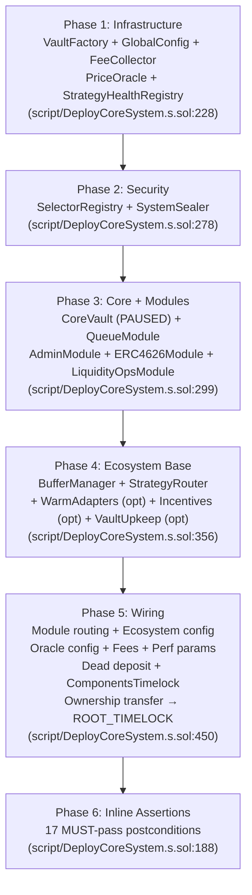
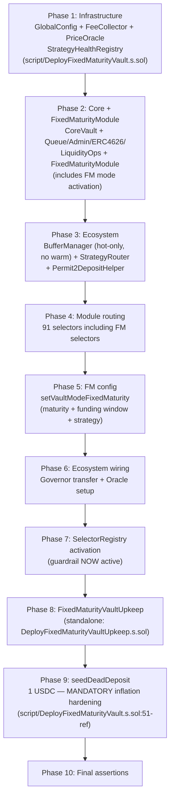

# multyr-core — Deployment Guide

> **Repo**: `Multyr/multyr-core` (public, BUSL-1.1)
> **Chain**: Arbitrum One (chainId 42161) — enforced at runtime in every script
> **Modular Path B**: canonical reference per `docs/09-audit/deployment-flow.md §147-242`
> **Last updated**: 2026-05-20 · branch `reorg/runbook-deploy-docs-01`

---

## Overview

`multyr-core` deploys the Multyr vault protocol core: an ERC-4626-compatible, module-routing
vault supporting **Open-Ended (OE)** and **Fixed-Maturity (FM)** vault modes. All scripts enforce
Arbitrum One chain guard (`multyr-core/script/DeployCoreSystem.s.sol:133`) and require a
pre-deployed `ROOT_TIMELOCK` as final owner.

### Vault modes

| Mode | Script | Notes |
|------|--------|-------|
| OE (Open-Ended) | `multyr-core/script/DeployCoreSystem.s.sol` | Standard always-available deposits/withdrawals (queue-gated) |
| FM (Fixed-Maturity) | `multyr-core/script/DeployFixedMaturityVault.s.sol` | Hard maturity timestamp, funding window, locked capital |
| Integrated (OE) | `multyr-core/script/DeployCoreIntegrated.s.sol` | Single-command with Permit2, periphery entry points |

---

## Prerequisites

### Environment variables (required)

| Variable | Used by | Notes |
|----------|---------|-------|
| `DEPLOYER_PRIVATE_KEY` | All scripts | EOA with ETH+USDC for gas + dead deposit |
| `GOVERNOR_ADDRESS` | `multyr-core/script/DeployCoreSystem.s.sol:655` | ROOT_TIMELOCK address (from Step 1) |
| `GUARDIAN_ADDRESS` | `multyr-core/script/DeployCoreSystem.s.sol:656` | SAFE_GUARDIAN multisig |
| `TREASURY_ADDRESS` | `multyr-core/script/DeployCoreSystem.s.sol:657` | Fee treasury wallet |
| `OPS_ADDRESS` | `multyr-core/script/DeployCoreSystem.s.sol:658` | Ops wallet |
| `SAFETY_RESERVE_ADDRESS` | `multyr-core/script/DeployCoreSystem.s.sol:659` | Safety reserve wallet |
| `CHAINLINK_USDC_FEED` | `multyr-core/script/DeployCoreSystem.s.sol:667` | Optional; sets oracle on Chainlink USDC/USD feed |

### Environment variables (optional / post-deploy)

| Variable | Default | Notes |
|----------|---------|-------|
| `TIMELOCK_ADDRESS` | `GOVERNOR_ADDRESS` | Explicit timelock if different from governor |
| `VETOER_ADDRESS` | `address(0)` | Safe veto multisig |
| `DEPLOY_INCENTIVES` | `false` | Deploy `Incentives` module inline |
| `DEPLOY_UPKEEP` | `false` | Deploy `VaultUpkeep` inline |
| `DEPLOY_WARM_ADAPTERS` | `true` | Deploy Aave + Morpho warm adapters |
| `OUTPUT_JSON` | `broadcast/core-addresses.json` | Address book output path |

### Arbitrum One constants

```solidity
USDC     = 0xaf88d065e77c8cC2239327C5EDb3A432268e5831  // multyr-core/script/DeployCoreSystem.s.sol:69
MORPHO_GAUNTLET_CORE = 0x7e97fa6893871A2751B5fE961978DCCb2c201E65  // multyr-core/script/DeployCoreSystem.s.sol:70
```

### Prerequisites checklist

- [ ] ROOT_TIMELOCK deployed (Step 1 below, or `multyr-deployment/script/DeployTimelock.s.sol:30`)
- [ ] Deployer EOA funded: ETH for gas + ≥2 USDC (1 USDC dead deposit + 1 USDC buffer)
- [ ] Chainlink USDC/USD feed address known (Arbitrum: `0x50834F3163758fcC1Df9973b6e91f0F0F0434aD3`, staleness 86400s)
- [ ] Safe multisig addresses confirmed for GOVERNOR, GUARDIAN, VETOER

---

## Modular Path B — OE Deploy Sequence

### Step 1: Deploy Timelock (multyr-deployment prerequisite)

Timelock must be deployed **before** core. Run from `multyr-deployment/`:

```bash
forge script script/DeployTimelock.s.sol:DeployTimelock \
  --rpc-url $RPC_URL --broadcast --verify
```

**Script**: `multyr-deployment/script/DeployTimelock.s.sol:30`

Role setup (`multyr-deployment/script/DeployTimelock.s.sol:59`):
- `PROPOSER_ROLE` → [SAFE_GOVERNOR, SAFE_GUARDIAN]
- `EXECUTOR_ROLE` → [SAFE_GOVERNOR]
- `CANCELLER_ROLE` → [SAFE_VETO]
- `DEFAULT_ADMIN_ROLE` → timelock itself (`multyr-deployment/script/DeployTimelock.s.sol:78`: `admin = address(0)`)
- Default min delay: 172800s (2 days) — use 0 for fork testing (`multyr-deployment/script/DeployTimelock.s.sol:37`)

Export `TIMELOCK_ADDRESS` from the broadcast output before proceeding.

### Step 2: Deploy Core System (OE)

```bash
cd multyr-core
forge script script/DeployCoreSystem.s.sol:DeployCoreSystem \
  --rpc-url $RPC_URL --broadcast --verify
```

Entry point: `multyr-core/script/DeployCoreSystem.s.sol:132`

Chain guard: `multyr-core/script/DeployCoreSystem.s.sol:133`
```solidity
require(block.chainid == 42161, "WRONG_CHAIN: DeployCoreSystem is Arbitrum-only (chainId 42161)");
```



---

### Phase 1: Infrastructure (`multyr-core/script/DeployCoreSystem.s.sol:223`)

| Contract | Citation | Constructor notes |
|----------|----------|------------------|
| `VaultFactory` | `multyr-core/script/DeployCoreSystem.s.sol:228` | No constructor args; used for vault registry + subgraph template |
| `GlobalConfig` | `multyr-core/script/DeployCoreSystem.s.sol:233` | Temp governor = `cfg.deployer`; transferred to ROOT_TIMELOCK in Phase 5 |
| `FeeCollector` | `multyr-core/script/DeployCoreSystem.s.sol:250` | **IMMUTABLE** governor = ROOT_TIMELOCK; `treasuryBps=7000`, `safetyReserveBps=100`, `opsMaxBps=3000` |
| `PriceOracleMiddleware` | `multyr-core/script/DeployCoreSystem.s.sol:263` | Owner = deployer; transferred in Phase 5 |
| `StrategyHealthRegistry` | `multyr-core/script/DeployCoreSystem.s.sol:267` | Owner = deployer; guardian = SAFE_GUARDIAN |

> **Critical invariant**: `FeeCollector.governor` is **immutable** post-deploy. If ROOT_TIMELOCK
> address is wrong, re-deploy the entire system. Verified by `SystemSealer.verifyAndSeal()`
> (`multyr-core/script/DeployCoreSystem.s.sol:249`).

---

### Phase 2: Security (`multyr-core/script/DeployCoreSystem.s.sol:278`)

| Contract | Citation | Role |
|----------|----------|------|
| `SelectorRegistry` | `multyr-core/script/DeployCoreSystem.s.sol:283` | Immutable source of truth for selector-role mappings; activates guardrail when set on vault |
| `SystemSealer` | `multyr-core/script/DeployCoreSystem.s.sol:289` | Stateless verification contract for final seal |

---

### Phase 3: Core + Modules (`multyr-core/script/DeployCoreSystem.s.sol:299`)

| Contract | Citation | Notes |
|----------|----------|-------|
| `CoreVault` | `multyr-core/script/DeployCoreSystem.s.sol:304` | Starts **PAUSED** — invariant verified at `multyr-core/script/DeployCoreSystem.s.sol:313` |
| Factory registration | `multyr-core/script/DeployCoreSystem.s.sol:316` | **Immediate** after deploy (subgraph event ordering) |
| `QueueModule` | `multyr-core/script/DeployCoreSystem.s.sol:333` | Stateless; handles deposit/withdrawal queue |
| `AdminModule` | `multyr-core/script/DeployCoreSystem.s.sol:337` | Stateless; handles admin operations |
| `ERC4626Module` | `multyr-core/script/DeployCoreSystem.s.sol:340` | Stateless; implements ERC-4626 vault interface |
| `LiquidityOpsModule` | `multyr-core/script/DeployCoreSystem.s.sol:344` | Stateless; handles liquidity operations |

> **ERC4626Module invariant**: must use `_ensureFreshWarmNav()` (self-healing on deposit/mint),
> NOT `_requireFreshWarmNav()`. Without this, deposits block after 15 minutes.
> See `multyr-core/script/DeployCoreSystem.s.sol:341` inline comment (v8 regression lesson).

---

### Phase 4: Ecosystem Base (`multyr-core/script/DeployCoreSystem.s.sol:356`)

#### BufferManager (`multyr-core/script/DeployCoreSystem.s.sol:374`)

Liquidity policy invariants (enforced at `multyr-core/script/DeployCoreSystem.s.sol:378`):
- `targetHotBps (400) + targetWarmBps (600) = 1000` (10% total reserve)
- `maxWarmBps (800) == 1000 - minHotBps (200)`
- `opsReserveTargetBps (400) == targetHotBps (400)`

BufferManager config (`multyr-core/script/DeployCoreSystem.s.sol:362`):

| Parameter | Value | Meaning |
|-----------|-------|---------|
| `targetHotBps` | 400 | 4% idle in CoreVault |
| `minHotBps` | 200 | 2% trigger for warm refill |
| `targetWarmBps` | 600 | 6% in warm adapters (Aave/Morpho) |
| `maxWarmBps` | 800 | 8% hard cap on warm adapters |
| `maxWarmSlippageBps` | 50 | 0.5% slippage cap on warm operations |

#### StrategyRouter (`multyr-core/script/DeployCoreSystem.s.sol:390`)

```solidity
new StrategyRouter(cfg.deployer, address(result.vault), address(result.globalConfig))
```
Owner transferred to ROOT_TIMELOCK in Phase 5.

#### Warm Adapters (optional, `DEPLOY_WARM_ADAPTERS=true`)

| Adapter | Citation | Protocol |
|---------|----------|---------|
| `AaveV3WarmAdapter_USDC` | `multyr-core/script/DeployCoreSystem.s.sol:395` | Aave V3 USDC pool |
| `MorphoVaultWarmAdapter_USDC` | `multyr-core/script/DeployCoreSystem.s.sol:403` | Morpho Gauntlet Core USDC |

Standalone redeploy: `multyr-core/script/DeployWarmAdapters.s.sol`

---

### Phase 5: Wiring (`multyr-core/script/DeployCoreSystem.s.sol:450`)

Executed within a single `vm.startBroadcast(cfg.deployerPk)` context.

#### 5.1 Module routing (`multyr-core/script/DeployCoreSystem.s.sol:452`)

Configured via `_configureModuleRouting()` (`multyr-core/script/DeployCoreSystem.s.sol:596`):

| Module | Selectors | Role |
|--------|-----------|------|
| `QueueModule` | write + view selectors | `ROLE_PUBLIC` |
| `AdminModule` | owner selectors | `ROLE_OWNER` |
| `AdminModule` | view selectors | `ROLE_PUBLIC` |
| `ERC4626Module` | all selectors | `ROLE_PUBLIC` |
| `LiquidityOpsModule` | all selectors | `ROLE_PUBLIC` |

Post-routing gate (`multyr-core/script/DeployCoreSystem.s.sol:624`):
```solidity
require(vault.moduleOf(withdraw.selector) == address(erc4626Module), "GATE: withdraw routing");
require(vault.moduleOf(redeem.selector)   == address(erc4626Module), "GATE: redeem routing");
require(vault.moduleOf(requestClaim.selector) == address(queueModule), "GATE: requestClaim routing");
```

#### 5.1b Ecosystem config (`multyr-core/script/DeployCoreSystem.s.sol:457`)

Sets `bufferManager`, `strategyRouter`, `healthRegistry`, `guardian`, `vetoer` on the vault.

#### 5.2 StrategyRouter config (`multyr-core/script/DeployCoreSystem.s.sol:469`)

```
router.setHealthRegistry(healthRegistry)
bufferManager.refreshWarmNav()
bufferManager.setRebalanceParams(cooldown=600, minMove=1_000_000, interval=21600)  // multyr-core/script/DeployCoreSystem.s.sol:479
```

#### 5.6 Oracle configuration (`multyr-core/script/DeployCoreSystem.s.sol:501`)

Oracle staleness: **86400s (24h)** — Chainlink USDC/USD heartbeat. Do NOT use 3600s.

```solidity
priceOracle.setOracleFeed(USDC, cfg.chainlinkUsdcFeed, 86400);          // multyr-core/script/DeployCoreSystem.s.sol:503
globalConfig.setDefaultOracleConfig(address(priceOracle), 86400);       // multyr-core/script/DeployCoreSystem.s.sol:504
globalConfig.setAssetOracleConfig(USDC, address(priceOracle), 86400);   // multyr-core/script/DeployCoreSystem.s.sol:505
```

> **WARNING**: StrategyRouter hard-fails without oracle (`multyr-core/script/DeployCoreSystem.s.sol:511`).
> Oracle must be configured before ANY deposit operations.

#### 5.6.2 GlobalConfig governor transfer (`multyr-core/script/DeployCoreSystem.s.sol:515`)

```solidity
globalConfig.setGovernor(cfg.governor);  // ROOT_TIMELOCK (after oracle config)
```

Governor must be transferred AFTER oracle configuration (deployer had temp governor role to call `setOracleFeed`).

#### 5.8 SelectorRegistry activation (`multyr-core/script/DeployCoreSystem.s.sol:524`)

```solidity
vault.setSelectorRegistry(address(selectorRegistry));
// Guardrail NOW ACTIVE — all subsequent calls through routing guardrail
```

#### 5.9 Initial fees (`multyr-core/script/DeployCoreSystem.s.sol:529`)

| Parameter | Value | Notes |
|-----------|-------|-------|
| `depositFeeBps` | 25 (0.25%) | ERC-4626 entry fee |
| `withdrawFeeBps` | 25 (0.25%) | Queue withdrawal fee |
| `immediateExitPenaltyBps` | 100 (1%) | Immediate exit cost |
| `forceExitPenaltyBps` | 150 (1.5%) | Force exit cost |

#### 5.9b Performance fee params (`multyr-core/script/DeployCoreSystem.s.sol:547`)

| Parameter | Value |
|-----------|-------|
| `perfRateX` | 6e16 (6% WAD-scaled) |
| `minCrystallizeInterval` | 43200s (12h) |

#### 5.10 Dead deposit (MANDATORY) (`multyr-core/script/DeployCoreSystem.s.sol:562`)

```solidity
IERC20(USDC).approve(address(vault), 1_000_000);  // 1 USDC (6 decimals)
IAdminModule(vault).seedDeadDeposit(1_000_000);
require(IAdminModule(vault).isDeadDepositDone(), "DEPLOY_BUG: dead deposit not done");
```

**Inflation attack hardening**: `seedDeadDeposit` must be called when `totalAssets == 0`.
The deployer EOA must hold ≥1 USDC at this point.

#### 5.12 Components timelock (`multyr-core/script/DeployCoreSystem.s.sol:579`)

```solidity
IAdminModule(vault).enableComponentsTimelock();
```

#### 5.13 Ownership transfer (`multyr-core/script/DeployCoreSystem.s.sol:582`)

All component ownerships transferred/pending to ROOT_TIMELOCK:
- `bufferManager.transferOwnership(timelock)`
- `strategyRouter.transferOwnership(timelock)`
- `healthRegistry.transferOwnership(timelock)`
- `priceOracle.transferOwnership(timelock)`
- `vault.beginOwnerTransfer(timelock)` — pending (requires `acceptOwnerTransfer` from Timelock)

---

### Phase 6: Inline Assertions (`multyr-core/script/DeployCoreSystem.s.sol:188`)

All 6 must pass before broadcast completes:

```solidity
require(vault.moduleOf(withdraw.selector) == address(erc4626Module), "FINAL: withdraw routing");  // multyr-core/script/DeployCoreSystem.s.sol:191
require(vault.moduleOf(redeem.selector)   == address(erc4626Module), "FINAL: redeem routing");    // multyr-core/script/DeployCoreSystem.s.sol:192
require(IAdminModule(vault).isFeesInitialized(),   "FINAL: fees not initialized");                 // multyr-core/script/DeployCoreSystem.s.sol:193
require(IAdminModule(vault).isDeadDepositDone(),   "FINAL: dead deposit not done");               // multyr-core/script/DeployCoreSystem.s.sol:194
require(IAdminModule(vault).isPerfInitialized(),   "FINAL: perf not initialized");                // multyr-core/script/DeployCoreSystem.s.sol:195
require(IAdminModule(vault).getImmediateExitPenalty() == 100, "FINAL: ...");                      // multyr-core/script/DeployCoreSystem.s.sol:196
require(!vault.isRoutingFrozen(), "FINAL: routing NOT frozen yet");                               // multyr-core/script/DeployCoreSystem.s.sol:197
require(vault.paused(), "FINAL: vault must still be paused");                                     // multyr-core/script/DeployCoreSystem.s.sol:198
```

---

## Fixed-Maturity (FM) Deploy Sequence

### FM-specific environment variables

| Variable | Notes |
|----------|-------|
| `FM_MATURITY_TS` | Unix timestamp for vault maturity |
| `FM_FUNDING_DEADLINE_TS` | Funding window close timestamp |
| `FM_MIN_FUNDING_ASSETS` | Minimum USDC to activate vault (6 decimals) |
| `FM_TARGET_FUNDING_ASSETS` | Target TVL for the FM vault |
| `FIXED_TERM_STRATEGY` | Address of the fixed-term strategy to register |
| `FM_AUTO_CLOSE` | Optional; enables auto-close at maturity |
| `FM_INSTANT_EXIT` | Optional; enables instant exit mode |
| `FM_FORCE_PENALTY_BPS` | Optional; force exit penalty override |

Script: `multyr-core/script/DeployFixedMaturityVault.s.sol:49`



**FM-only notes**:
- `FixedMaturityModule` deployed as stateless module (included alongside standard modules)
- `BufferManager` in FM mode is hot-only (no warm adapters) — `targetWarmBps = 0`
- FM vault CANNOT switch to OE mode post-deploy
- Script: `multyr-core/script/DeployFixedMaturityVault.s.sol`

---

## Standalone Redeploy Scripts

For partial re-deployments (e.g., after migration or upkeep contract failure):

| Script | Citation | Purpose |
|--------|----------|---------|
| `DeployVaultUpkeep.s.sol` | `multyr-core/script/DeployVaultUpkeep.s.sol` | Redeploy VaultUpkeep + wire to BufferManager |
| `DeployBufferManager.s.sol` | `multyr-core/script/DeployBufferManager.s.sol` | Redeploy BufferManager + migrate warm adapters |
| `DeployStrategyRouter.s.sol` | `multyr-core/script/DeployStrategyRouter.s.sol` | Redeploy StrategyRouter + re-register strategies |
| `DeployQueueModule.s.sol` | `multyr-core/script/DeployQueueModule.s.sol` | Redeploy QueueModule + update module routing |
| `DeployWarmAdapters.s.sol` | `multyr-core/script/DeployWarmAdapters.s.sol` | Redeploy Aave + Morpho warm adapters |

> **Note**: All standalone scripts require `VAULT_ADDRESS` and `TIMELOCK_ADDRESS` env vars.
> Routing changes (adding new modules) require an unpaused vault AND owner authorization.

---

## Integrated Path (DeployCoreIntegrated)

For single-command full deploy with Permit2 + Incentives + Upkeep:

```bash
# Run from vault-usdc2/ root
forge script multyr-core/script/DeployCoreIntegrated.s.sol:DeployCoreIntegrated \
  --rpc-url $RPC_URL --broadcast --verify
```

Script: `multyr-core/script/DeployCoreIntegrated.s.sol`

This combines core deploy with Permit2DepositHelper wiring and optional Incentives module
in a single broadcast. Preferred for fresh chain/testnet deployments. For mainnet, use
Modular Path B (step-by-step) for auditability.

---

## Verification (Address Book)

After deploy, `broadcast/core-addresses.json` is written (`multyr-core/script/DeployCoreSystem.s.sol:688`):

```json
{
  "chainId": 42161,
  "blockNumber": ...,
  "state": "PRE-SEAL",
  "vaultFactory": "0x...",
  "globalConfig": "0x...",
  "feeCollector": "0x...",
  "priceOracle": "0x...",
  "healthRegistry": "0x...",
  "selectorRegistry": "0x...",
  "systemSealer": "0x...",
  "vault": "0x...",
  "queueModule": "0x...",
  "adminModule": "0x...",
  "erc4626Module": "0x...",
  "liquidityOpsModule": "0x...",
  "bufferManager": "0x...",
  "strategyRouter": "0x...",
  "aaveWarmAdapter": "0x...",
  "morphoWarmAdapter": "0x..."
}
```

Export the relevant addresses as env vars for subsequent deploy steps
(e.g., `VAULT_ADDRESS`, `STRATEGY_ROUTER_ADDRESS`).

---

## Post-Deploy State

After `DeployCoreSystem.s.sol` completes (`multyr-core/script/DeployCoreSystem.s.sol:769`):

| State | Value |
|-------|-------|
| `vault.paused()` | `true` — vault is PAUSED |
| `vault.isRoutingFrozen()` | `false` — routing NOT frozen (freeze in Phase 6 Hardening) |
| `vault.owner()` | pending transfer (requires `acceptOwnerTransfer` from ROOT_TIMELOCK) |
| `IAdminModule(vault).isFeesInitialized()` | `true` |
| `IAdminModule(vault).isDeadDepositDone()` | `true` |
| `IAdminModule(vault).isComponentsTimelocked()` | `true` |
| `globalConfig.governor()` | ROOT_TIMELOCK |
| `feeCollector.governor()` | ROOT_TIMELOCK (immutable) |

---

## Next Steps (Modular Path B)

```
multyr-core/script/DeployCoreSystem.s.sol:769 — _printNextSteps() output:

1. Deploy strategy:
   VAULT_ADDRESS = <vault>
   STRATEGY_ROUTER_ADDRESS = <strategyRouter>
   BUFFER_MANAGER_ADDRESS = <bufferManager>
   HEALTH_REGISTRY_ADDRESS = <healthRegistry>
   GLOBAL_CONFIG_ADDRESS = <globalConfig>
   PRICE_ORACLE_ADDRESS = <priceOracle>
   → Run: multyr-strategies/script/DeployUsdcLendingStrategy.s.sol

2. Timelock: acceptOwnerTransfer + setAuthorizedSealer + systemSealer.verifyAndSeal(config)
   (single atomic call — see `docs/architecture.md` §10.1)

3. Verify all contracts on Arbiscan
```

See `multyr-deployment/runbooks/full-system-deploy.md` for the complete 7-day mainnet timeline.

---

## Troubleshooting

### Oracle not configured (`multyr-core/script/DeployCoreSystem.s.sol:511`)

If `CHAINLINK_USDC_FEED` is not set, the oracle is skipped with a WARNING. The StrategyRouter
will hard-fail on any deposit/withdraw attempt. Configure oracle via Timelock before going live.

### Dead deposit fails (`multyr-core/script/DeployCoreSystem.s.sol:562`)

The deployer must hold ≥1 USDC (6 decimals = 1,000,000) at deploy time. Transfer USDC to deployer
before running the script.

### FeeCollectorUpkeep: `addToken(vault)` REQUIRED

After deploying `FeeCollectorUpkeep` (from `multyr-periphery`), call `addToken(vault)` or fees
will never distribute. This is a v9 mainnet incident lesson.

### Owner transfer pending

`vault.beginOwnerTransfer(timelock)` sets pending owner; the ROOT_TIMELOCK must call
`acceptOwnerTransfer()` to finalize. Until then, `vault.owner()` is still the deployer
(or pending state). Use `multyr-deployment/script/ExecuteFinalSeal.s.sol` to finalize.

---

## Security Invariants

1. **`FeeCollector.governor` is immutable**: Set at deploy time (`multyr-core/script/DeployCoreSystem.s.sol:250`). Wrong address requires full re-deploy.
2. **Oracle staleness = 86400s**: Chainlink USDC/USD heartbeat. Never use 3600s. (`multyr-core/script/DeployCoreSystem.s.sol:503`)
3. **Dead deposit before ecosystem wiring**: `seedDeadDeposit` must run when `totalAssets == 0` (`multyr-core/script/DeployCoreSystem.s.sol:564`).
4. **Guardrail activation**: After `setSelectorRegistry` (`multyr-core/script/DeployCoreSystem.s.sol:526`), all routing goes through the immutable `SelectorRegistry`.
5. **Do NOT freeze routing pre-strategy**: Routing is frozen in Phase 6 Hardening (`ExecuteFinalSeal.s.sol`), AFTER strategy wiring and smoke test.
6. **Adapter constructor admin ordering**: Use `cfg.deployer` as temp admin, transfer AFTER `PARAM_ROLE` grants (V9 lesson).

---

## Deployment Assertions

`multyr-deployment/script/lib/DeploymentAssertions.sol` provides 19 CRITICAL invariant checks:

```bash
# Run from vault-usdc2/ root
forge script multyr-deployment/script/lib/DeploymentAssertions.sol --rpc-url $RPC_URL
```

Run on fork before mainnet deployment (Day 1 of `multyr-deployment/runbooks/full-system-deploy.md`).

---

*Generated code-first from `multyr-core/script/DeployCoreSystem.s.sol`, `multyr-deployment/script/DeployTimelock.s.sol`, and `multyr-core/script/DeployFixedMaturityVault.s.sol`. All citations verified against source.*
