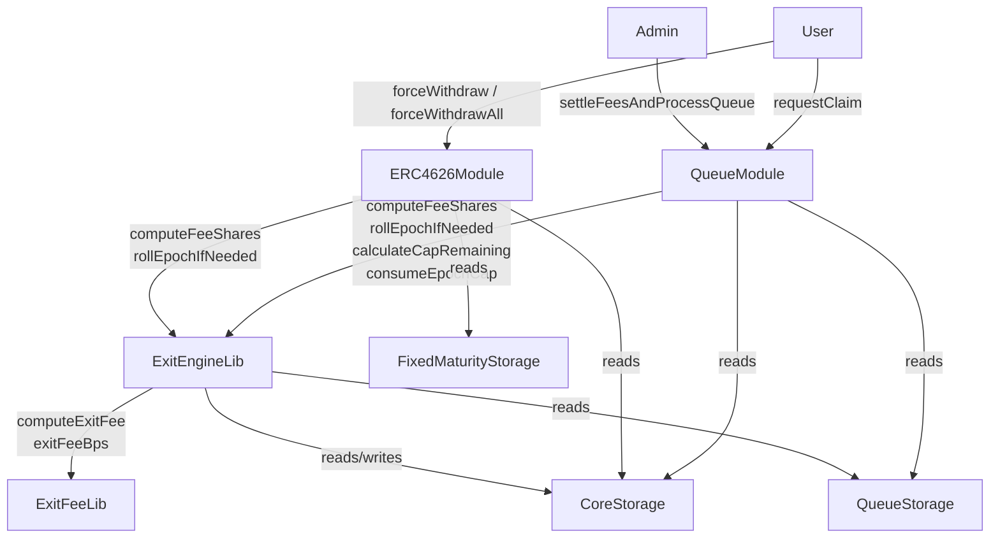
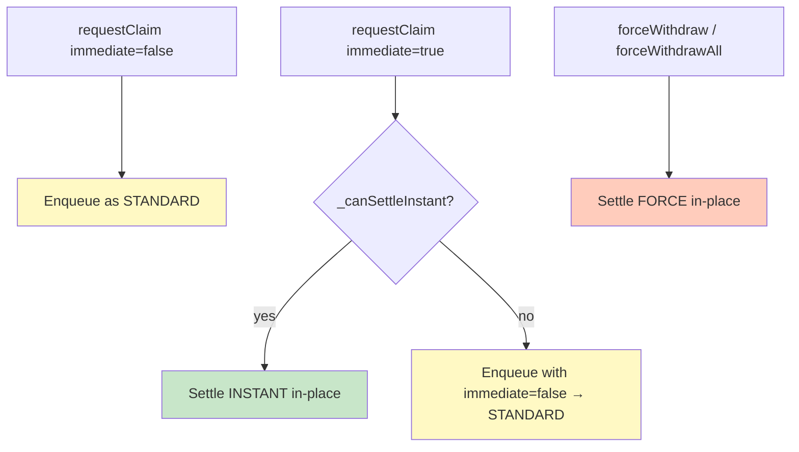
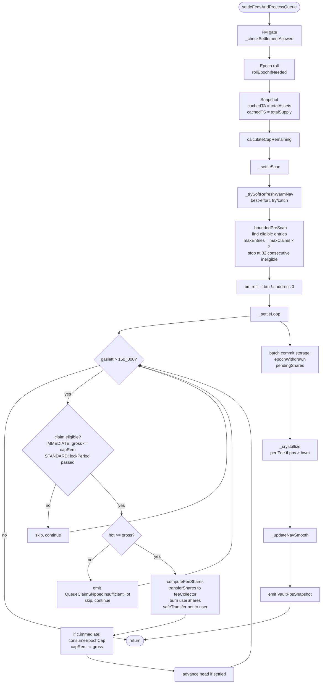

# Exit Engine

> **Source of truth**: `src/core/libraries/ExitEngineLib.sol:202` @ `c39f9462`
> **ADR-015 workflow applied**: full code read before drafting.

---

## 1. Overview

The exit engine is the single library that coordinates all withdrawal paths in a Multyr vault. It is implemented in `src/core/libraries/ExitEngineLib.sol:202` (279L) and delegates fee computation to `src/core/libraries/ExitFeeLib.sol:29` (77L).

Two modules consume the exit engine:

| Module | File | Exit paths |
|--------|------|------------|
| `QueueModule` | `src/core/modules/QueueModule.sol:81` | `requestClaim` (STANDARD + INSTANT), `settleFeesAndProcessQueue` |
| `ERC4626Module` | `src/core/modules/ERC4626Module.sol:166` | `forceWithdraw`, `forceWithdrawAll` |

`ExitEngineLib` is a pure library — it holds no storage. It reads from `CoreStorage.Layout` and `QueueStorage.Layout` via storage pointers passed by the calling module (delegatecall context; `address(this)` is the vault).

Three responsibilities:

1. **Mode routing** — determine exit path (STANDARD / INSTANT / FORCE)
2. **Epoch cap accounting** — roll epoch boundaries, compute cap remaining, consume cap
3. **Fee computation** — invoke `ExitFeeLib`, round shares up and assets down

### 1.1 Module call graph



---

## 2. Three Exit Modes

The `ExitMode` enum (`ExitEngineLib.sol:L8`) defines three settlement paths:

```solidity
// src/core/libraries/ExitEngineLib.sol:28
enum ExitMode {
    STANDARD,   // queued — witBps only
    INSTANT,    // immediate, cap-gated — witBps + immediateExitPenaltyBps
    FORCE       // bypasses cap and lock — witBps + forceExitPenaltyBps
}
```

### 2.1 STANDARD

STANDARD is the baseline path for all queued withdrawals.

- Entry: `requestClaim(false, shares)`, or `requestClaim(true, shares)` when instant settlement is not possible
- Shares are escrowed to `address(this)` (the vault contract)
- A `Claim` struct is stored with `immediate = false` regardless of user intent — the queue always records the claim as STANDARD once fallback triggers
- Settles in a future `settleFeesAndProcessQueue(maxClaims)` call
- Subject to `lockPeriod` check at settlement time (not at request time)
- Fee: `witBps` only
- **`netAssets` in `simulateExit()` is INDICATIVE** — PPS at settlement may differ from PPS at request

### 2.2 INSTANT

INSTANT is the immediate path, available when three conditions hold simultaneously.

- Entry: `requestClaim(true, shares)` when `_canSettleInstant()` returns `true`
- Three-gate check (`src/core/modules/QueueModule.sol:528`):
  1. **Lock period**: `block.timestamp >= core.lastDepositTs[msg.sender] + lockPeriod`
  2. **Epoch cap**: `grossAssets <= calculateCapRemaining(core, q, totalAssets, vault)`
  3. **Hot liquidity**: `IERC20(_asset()).balanceOf(address(this)) >= grossAssets`
- Settles atomically in the same transaction — no queue enqueue
- Fee: `witBps + immediateExitPenaltyBps`
- Consumes epoch cap via `consumeEpochCap(core, grossAssets)`
- **`netAssets` is EXACT** — PPS computed and applied in the same block

### 2.3 FORCE

FORCE is the emergency withdrawal path. It bypasses the epoch cap and lock period.

- Entry: `forceWithdraw(assets, receiver, owner, plan, maxShares)` or `forceWithdrawAll(receiver)`
- Requires vault to be in OpenEnded mode, or FixedMaturity/Active state (`_checkForceExitAllowed()` in `FixedMaturityStorage.sol`)
- Does **not** call `consumeEpochCap` — `epochWithdrawn` is unchanged
- Does **not** check `lockPeriod`
- Fee: `witBps + forceExitPenaltyBps`; in FixedMaturity/Active, `preMaturityForceExitPenaltyBps` is added
- User supplies a `Pull[]` plan (`MAX_FORCE_LEGS = 10`) for `forceWithdraw`, or auto-calls `_forcePullAllLiquidity` for `forceWithdrawAll`
- **`netAssets` is EXACT**

### 2.4 Mode selection decision tree



The queue at settlement time re-evaluates mode: a claim with `c.immediate = true` uses INSTANT mode (cap check), one with `c.immediate = false` uses STANDARD mode (lock check). See `_settleLoop` (`src/core/modules/QueueModule.sol:407`).

---

## 2.5 Public interface

Entry points for each mode:

| Function | Module | Selector | Mode |
|----------|--------|----------|------|
| `requestClaim(bool immediate, uint256 shares)` | QueueModule | — | STANDARD or INSTANT |
| `cancelClaim(uint256 claimId)` | QueueModule | — | — (reversal) |
| `settleFeesAndProcessQueue(uint256 maxClaims)` | QueueModule | — | settles STANDARD + INSTANT from queue |
| `forceWithdraw(uint256 assets, address receiver, address owner, Pull[] plan, uint256 maxShares)` | ERC4626Module | `0x0f0824be` | FORCE |
| `forceWithdrawAll(address receiver)` | ERC4626Module | — | FORCE (all shares) |
| `simulateExit(uint256 shares, bool immediate, bool isForce, address vault)` | ExitEngineLib (view) | — | preview only |

Note: `withdraw(uint256, address, address)` and `redeem(uint256, address, address)` always revert (`AsyncWithdrawalRequired`) — see Invariant E1.

---

## 3. ExitResult Struct

`simulateExit()` (`src/core/libraries/ExitEngineLib.sol:202`) returns an `ExitResult` struct that mirrors the state written by actual settlement:

```solidity
// src/core/libraries/ExitEngineLib.sol:34
struct ExitResult {
    uint256 grossAssets;        // assets before fees
    uint256 netAssets;          // assets user receives
    uint256 feeShares;          // shares taken as fee (rounded UP)
    uint256 userShares;         // shares burned for user
    uint256 withdrawFeeAssets;  // fee from witBps (informational)
    uint256 penaltyAssets;      // fee from penalty bps (informational)
    bool    willQueue;          // true if immediate=true but cap insufficient
    uint256 epochCapRemaining;  // remaining cap after this exit (0 for STANDARD/FORCE)
}
```

**Precision contract** (src/core/libraries/ExitFeeLib.sol:29, src/core/libraries/ExitEngineLib.sol:151):

| Field | Rounding | Direction | Reason |
|-------|----------|-----------|--------|
| `withdrawFeeAssets` | `mulBpsDown` | truncate | computed in assets; truncation favors user |
| `penaltyAssets` | `mulBpsDown` | truncate | same |
| `netAssets` | `grossAssets - totalFee` | — | derived |
| `feeShares` | `mulBpsUp` | ceiling | favors protocol; prevents sub-1-share dust leakage |
| `userShares` | `grossShares - feeShares` | — | derived |

`simulateExit()` is call-equivalent to the runtime path for INSTANT and FORCE. For STANDARD, `netAssets` is indicative because PPS changes between request and settlement.

---

## 4. Epoch Cap Engine

The epoch cap limits aggregate INSTANT withdrawals per time window. It does not apply to STANDARD (lazy) or FORCE (emergency) paths.

### 4.1 Storage fields

Fields in `CoreStorage.Layout` (`src/core/storage/CoreStorage.sol:38`):

| Field | Type | Description |
|-------|------|-------------|
| `epochStart` | `uint64` | Timestamp of current epoch start |
| `epochDuration` | `uint64` | Duration in seconds (1d–30d) |
| `epochWithdrawn` | `uint256` | Cumulative INSTANT assets withdrawn this epoch |
| `maxWithdrawPerEpoch` | `uint256` | Static cap (used when WithdrawalCapLib not wired) |

### 4.2 Epoch roll

`rollEpochIfNeeded(CoreStorage.Layout storage core)` (`src/core/libraries/ExitEngineLib.sol:77`):

```
if block.timestamp >= epochStart + epochDuration:
    epochStart += epochDuration   // boundary-aligned, NOT block.timestamp
    epochWithdrawn = 0
```

Multi-epoch skips (vault was inactive for N epochs) are handled by iterating: `epochStart` is advanced in multiples of `epochDuration` until it is within one duration of `block.timestamp`.

Constants (`ExitEngineLib.sol:L15`):
- `MIN_EPOCH_DURATION = 1 days`
- `MAX_EPOCH_DURATION = 30 days`

### 4.3 Cap computation

`calculateCapRemaining(core, q, totalAssets, vault)` (`src/core/libraries/ExitEngineLib.sol:106`):

1. Calls `rollEpochIfNeeded` (writes `epochStart`, `epochWithdrawn` if epoch expired)
2. If `WithdrawalCapLib` is wired: `cap = WithdrawalCapLib.computeCap(totalAssets, ...)`
3. Else: `cap = core.maxWithdrawPerEpoch`
4. Returns `max(0, cap - core.epochWithdrawn)`

### 4.4 Cap consumption

`consumeEpochCap(core, grossAssets)` (`src/core/libraries/ExitEngineLib.sol:258`):

```solidity
core.epochWithdrawn += grossAssets;
```

Called in two places:
- `requestClaim()` INSTANT path: immediately after settlement in the same tx
- `_settleLoop()` in `QueueModule`: for `c.immediate = true` claims processed from queue

**FORCE never calls `consumeEpochCap`.** The `epochWithdrawn` counter is unaffected by `forceWithdraw` and `forceWithdrawAll`.

### 4.5 INSTANT fallback

When `requestClaim(true, shares)` fails `_canSettleInstant()` (any one of: cap exhausted, lock active, insufficient hot), the claim is stored with `immediate = false`:

```
Claim{user, ts, immediate=false, settled=false, shares=N}
```

At settlement time, this claim is treated as STANDARD — it is **never subject to the epoch cap** regardless of remaining capacity. This prevents a starvation scenario where a user who requested immediate but was downgraded to queue is blocked by a full cap on settlement day.

### 4.6 Epoch cap timeline example

```
Day 0:  epochStart=T0, epochWithdrawn=0, cap=100_000 USDC
  tx1:  INSTANT 40_000 → epochWithdrawn=40_000, capRem=60_000
  tx2:  INSTANT 60_000 → epochWithdrawn=100_000, capRem=0
  tx3:  INSTANT 1_000  → _canSettleInstant() false → queued as STANDARD

Day 1:  rollEpochIfNeeded() → epochStart=T0+1d, epochWithdrawn=0
  tx4:  INSTANT 1_000  → capRem=99_000 ✓
```

---

## 4.7 Storage layout (exit-engine-relevant fields)

Fields read or written by ExitEngineLib during exit processing (`src/core/storage/CoreStorage.sol:38`):

| Field | Type | Slot offset | Access |
|-------|------|-------------|--------|
| `epochStart` | `uint64` | packed in slot 3 | read/write (rollEpochIfNeeded) |
| `epochDuration` | `uint64` | packed in slot 3 | read |
| `epochWithdrawn` | `uint256` | slot 4 | read/write |
| `maxWithdrawPerEpoch` | `uint256` | slot 5 | read |
| `lastDepositTs[user]` | `mapping(address → uint64)` | derived slot | read (INSTANT lock check) |
| `paramMinDelay` | `uint64` | packed in slot 6 | read (AdminModule fee timelock) |
| `packedFlags` | `uint256` | slot 7 | read/write (reentrancy guard) |

Fields in `QueueStorage.Layout` (`src/core/storage/QueueStorage.sol:24`, SLOT `0x20afa2de...`):

| Field | Type | Description |
|-------|------|-------------|
| `queue` | `uint256[]` | Ordered list of active claim IDs |
| `head` | `uint256` | Index into `queue` of first unsettled entry |
| `nextClaimId` | `uint256` | Monotonic counter for claim IDs |
| `pendingShares` | `uint256` | Total shares in escrow across all active claims |
| `claims[id]` | `mapping(uint256 → Claim)` | Full claim data per ID |

`Claim` struct memory layout (2 storage slots):
```
slot 0: [address user (20B)] [uint64 ts (8B)] [bool immediate (1B)] [bool settled (1B)]
slot 1: uint256 shares
```

---

## 5. Fee Path Per Mode

### 5.1 Fee parameters

Fee parameters are stored in `FeeStorage.Layout` (`src/core/storage/FeeStorage.sol:12`):

```solidity
struct InternalFeeParams {
    uint16 depBps;                    // deposit fee (not used in exit)
    uint16 witBps;                    // withdrawal fee — all modes
    uint16 immediateExitPenaltyBps;   // INSTANT additional penalty
    uint16 forceExitPenaltyBps;       // FORCE additional penalty
    address treasury;                 // feeCollector address
}
```

In FixedMaturity/Active vaults, `FixedMaturityStorage.Layout.preMaturityForceExitPenaltyBps` (`src/core/storage/FixedMaturityStorage.sol:47`) is fetched and added to FORCE fee only.

### 5.2 Fee computation chain

```
ExitEngineLib.computeFeeShares(shares, mode, fee)
    ↓
ExitFeeLib.exitFeeBps(isImmediate, isForce, fee)          ← combined bps
    → STANDARD:  witBps
    → INSTANT:   witBps + immediateExitPenaltyBps
    → FORCE:     witBps + forceExitPenaltyBps
                 [+ preMaturityForceExitPenaltyBps if FM/Active]
    ↓
ExitFeeLib.computeExitFee(grossAssets, isImmediate, isForce, fee)
    → totalFee      = mulBpsDown(gross, combined)
    → withdrawFee   = mulBpsDown(gross, witBps)
    → penaltyFee    = totalFee - withdrawFee
    → netAssets     = gross - totalFee
    ↓
ExitEngineLib.computeFeeShares:
    → feeShares  = mulBpsUp(grossShares, combined)
    → userShares = grossShares - feeShares
```

(`ExitFeeLib.sol:L20–L60`; `ExitEngineLib.sol:L155–L175`)

### 5.3 Fee disposition

Fee shares are **transferred** from the existing supply to `feeCollector`, never minted:

| Path | Escrow source | Transfer call |
|------|--------------|---------------|
| INSTANT in `requestClaim` | `msg.sender` (user holds shares) | `_transferShares(msg.sender, feeCollector, feeShares)` |
| STANDARD/INSTANT in `_settleLoop` | `address(this)` (vault escrow) | `_transferShares(address(this), feeCollector, feeShares)` |
| FORCE in `forceWithdraw` | `owner_` | `_transferShares(owner_, feeCollector, feeShares)` |
| FORCE in `forceWithdrawAll` | `msg.sender` | `_transferShares(msg.sender, feeCollector, feeShares)` |

**Invariant**: `totalSupply` is never increased by any fee operation on the exit path. The fee is taken from the exiting user's allocation — no new shares are created.

### 5.3.1 Fee parameter timelock

Fee parameters (`witBps`, `immediateExitPenaltyBps`, `forceExitPenaltyBps`) are changed through a two-step timelock in `AdminModule` (`src/core/modules/AdminModule.sol:73`):

```
submitFeeParams(depBps, witBps, immediateExitPenaltyBps, forceExitPenaltyBps, treasury)
  → sets f.pendingFee with eta = block.timestamp + paramMinDelay

acceptFeeParams()
  → validates: eta passed AND not expired (eta + MAX_WINDOW=7d)
  → applies: f.fee = pendingFee

revokeFeeParams()
  → callable by owner OR vetoer
  → deletes pendingFee
```

`paramMinDelay` is itself subject to a separate timelock (`submitParamDelay` / `acceptParamDelay`). The `MAX_WINDOW = 7 days` (`AdminModule.sol:L45`) ensures stale pending params cannot be applied indefinitely.

---

### 5.4 Performance fee (crystallization)

Performance fee is independent from exit fees. It is triggered in `settleFeesAndProcessQueue` via `_crystallize()` (`src/core/modules/QueueModule.sol:763`):

```
pps = totalAssets / totalSupply  (WAD-scaled)
if pps > highWaterMark:
    profit   = totalAssets - (highWaterMark × totalSupply)
    feeAssets = mulWadDown(profit, perfRateX)
    feeShares = convertToShares(feeAssets)
    _mint(feeCollector, feeShares)      ← only mint in entire exit system
    highWaterMark = new pps
```

Note: `_mint` is called **only for perf fee crystallization** — not during standard/instant/force exits.

---

## 6. Critical Invariants

Six invariants enforced across `ExitEngineLib`, `QueueModule`, and `ERC4626Module`:

| ID | Invariant | Where enforced |
|----|-----------|---------------|
| **E1** | `withdraw()` and `redeem()` always revert with `AsyncWithdrawalRequired` | `ERC4626Module.sol` — unconditional revert on both functions |
| **E2** | `epochWithdrawn ≤ epochCap` after any INSTANT settlement | `consumeEpochCap` called only after `_canSettleInstant()` confirms cap available |
| **E3** | `totalSupply` never increases on any exit path | exit fees are transfer-only; `_mint` is perf-fee only |
| **E4** | `feeShares` transferred from user/escrow to feeCollector, not minted | `_transferShares()` call site, not `_mint()` |
| **E5** | `simulateExit()` result == runtime for INSTANT and FORCE | Same code path in ExitEngineLib ← ExitFeeLib, identical rounding |
| **E6** | FORCE exits do not consume epoch cap | `consumeEpochCap` absent from both `forceWithdraw` and `forceWithdrawAll` |

Test coverage: `test/unit/core/ExitEngineLib.t.sol`, `test/unit/core/QueueModule.t.sol`, `test/unit/core/ERC4626Module.t.sol` (commit `c39f9462`).

---

## 6.1 Settlement loop architecture

`settleFeesAndProcessQueue(maxClaims)` orchestrates the full settle cycle (`src/core/modules/QueueModule.sol:207`):



Key gas safety: `gasleft() > 150_000` guard exits the loop before gas exhaustion — the batch commits partial progress to storage before returning.

---

## 7. Events

Events emitted on exit paths (defined in `src/core/libraries/Events.sol:7`):

| Event | Module | Trigger |
|-------|--------|---------|
| `ClaimQueued(claimId, user, shares, immediate)` | QueueModule | `requestClaim` → queue path |
| `ClaimSettled(claimId, user, netAssets)` | QueueModule | `_settleLoop` per claim |
| `ClaimCancelled(claimId, user, shares)` | QueueModule | `cancelClaim` |
| `QueueClaimSkippedInsufficientHot(id, hot, gross)` | QueueModule | `_settleLoop` — hot < gross |
| `FeePaid(user, feeCollector, feeShares)` | QueueModule | Each fee transfer in settle loop |
| `VaultPpsSnapshot(pps, ts)` | QueueModule | End of `settleFeesAndProcessQueue` |
| `Crystallized(oldHwm, newHwm, feeAssets)` | QueueModule | Performance fee crystallization |
| `PerfFeeMinted(oldHwm, ppsBefore, feeShares, ppsAfter)` | QueueModule | Perf fee mint |
| `WithdrawFeeTaken(user, feeShares)` | ERC4626Module | FORCE fee transfer |
| `ForceExitPenaltyApplied(user, penaltyAssets)` | ERC4626Module | When `penaltyAssets > 0` |
| `ForceWithdrawExecuted(user, assets, shares, feeShares)` | ERC4626Module | `forceWithdraw` completion |
| `ForceWithdrawAllExecuted(user, assets, shares, feeShares)` | ERC4626Module | `forceWithdrawAll` completion |
| `ForceExit(owner, receiver, assets)` | ERC4626Module | Both FORCE paths |
| `EpochRolled(epochStart, epochDuration)` | ExitEngineLib | On epoch boundary roll |

---

## 8. External Calls

All external calls on the exit path follow the **W2 rule** (never block exits — `src/core/modules/QueueModule.sol:628`):

| Call | Context | Failure policy |
|------|---------|----------------|
| `bm.refreshWarmNav()` | `_trySoftRefreshWarmNav()` | `try/catch` — silent failure; exits proceed with stale NAV |
| `bm.refill(required)` | `_settleScan` warm refill step | Called only when `bm != address(0)`; failure propagates only if not try/catch wrapped |
| `eng.onExitLight(user, assets × 1e12)` | `_notifyIncentivesExit()` | `try/catch` — silent failure; exit never blocked |
| `router.executeRedeemBatch(plan)` | `_sourceLiquidityForForceWithdraw` | Reverts propagate to `forceWithdraw` caller |
| `router.forceRedeemForWithdraw(amount)` | `_forcePullAllLiquidity` | Reverts propagate to `forceWithdrawAll` caller |

The `bm.refill` in `_settleScan` is the sole hot-balance replenishment path during batch settlement. If `bm == address(0)`, settlement proceeds with whatever idle balance the vault holds — claims requiring more hot than available are skipped with `QueueClaimSkippedInsufficientHot`.

---

## 9. Threat Model

| Threat | Mitigation |
|--------|-----------|
| **Cap drain via repeated INSTANT exits** | Epoch roll resets `epochWithdrawn`; cap consumed atomically before settlement in same tx |
| **FORCE griefing via dust extraction** | `_checkWithdrawalLimitsForForce` enforces minimum assets for force path; fee applies |
| **Reentrancy during settlement** | `_enterNonReentrant` / `_exitNonReentrant` use `CoreStorage.FLAG_REENTRANCY_LOCKED`; guards on `requestClaim` and `settleFeesAndProcessQueue` |
| **Stale NAV price manipulation** | W2 soft refresh; stale NAV allows settlement but does not block it — attacker cannot force stale-NAV settlement advantageously since they cannot control when NAV was last updated |
| **Queue spam / DoS** | Anti-spam: `cooldownPerClaim`, `maxClaimsPerUserPerEpoch` per epoch; `MAX_CONSECUTIVE_INELIGIBLE = 32` in pre-scan bounds gas per settle call |
| **Fee rounding theft (sub-1-share dust)** | `feeShares` rounded UP (ceiling) — ensures protocol never receives 0 shares on a non-zero-fee exit |
| **Force exit in restricted FM state** | `_checkForceExitAllowed()` (`src/core/storage/FixedMaturityStorage.sol:111`) reverts for Funding/Starting/Closed/FundingFailed states |
| **Cross-epoch cap evasion (timer manipulation)** | Epoch boundary is computed as `epochStart + epochDuration * n` — cannot be advanced by caller; `block.timestamp` read-only |

---

## 10. Examples

### 10.1 Standard withdrawal

```
User: requestClaim(false, 1000e18)
  1. FM gate check (if applicable)
  2. Reentrancy lock
  3. _ensureFreshWarmNav()
  4. rollEpochIfNeeded(core)
  5. Escrow: _transferShares(user, vault, 1000e18)
  6. Store Claim{user, ts=now, immediate=false, shares=1000e18}
  7. queue.push(claimId), pendingShares += 1000e18
  8. Emit ClaimQueued(claimId, user, 1000e18, false)

Later — Admin: settleFeesAndProcessQueue(20)
  1. epoch roll
  2. cachedTA = totalAssets(), cachedTS = totalSupply()     // snapshot once
  3. calculateCapRemaining() → capRem
  4. _settleScan → _boundedPreScan → _settleLoop
     Claim{immediate=false}: lockPeriod check passes
     feeShares = mulBpsUp(1000e18, witBps=50) = 5e18
     userShares = 995e18
     net = 995e18 * cachedTA / cachedTS
     _transferShares(vault, feeCollector, 5e18)
     _burn(vault, 995e18)
     token.safeTransfer(user, net)
     Emit ClaimSettled(claimId, user, net)
```

### 10.2 Instant withdrawal (success path)

```
User: requestClaim(true, 1000e18)
  → _canSettleInstant():
      lockPeriod=0 ✓
      gross=~995 USDC, capRem=10_000 USDC ✓
      hot=50_000 USDC ✓
  → ExitEngineLib.computeFeeShares(1000e18, INSTANT, fee)
      combined = witBps(50) + immediateExitPenaltyBps(100) = 150 bps
      feeShares = mulBpsUp(1000e18, 150) = 15e18
      userShares = 985e18
  → _transferShares(user, feeCollector, 15e18)
  → _burn(user, 985e18)
  → net = convertToAssets(985e18)
  → token.safeTransfer(user, net)
  → consumeEpochCap(core, ~995 USDC)
  → Emit ClaimQueued NOT emitted (no queue entry)
```

### 10.3 Instant fallback to queue

```
User: requestClaim(true, 1000e18)
  → _canSettleInstant():
      capRem=0 ✗ (epoch cap exhausted)
  → Queue path, stored with immediate=false
  → Claim{user, ts, immediate=false, shares=1000e18}
  → NOTE: no cap check at settlement; settles as STANDARD
```

### 10.4 Force withdrawal with plan

```
Context: OpenEnded vault, witBps=50 (0.5%), forceExitPenaltyBps=200 (2%), totalSupply=1_000_000e18
         totalAssets=1_010_000 USDC, PPS ≈ 1.01 USDC/share

User: forceWithdraw(
        assets=10_000e6,
        receiver=alice,
        owner_=alice,
        plan=[Pull{strat=0xAaaa, amount=10_000e6}],
        maxShares=uint256.max
      )

Step 1: _checkForceExitAllowed()
  → vaultMode=OpenEnded → passes immediately

Step 2-3: pause + reentrancy lock acquired

Step 4: _ensureFreshWarmNav()
  → bm.refreshWarmNav() if stale

Step 5: baseShares = _previewWithdraw(10_000e6)
  → convertToShares(10_000e6) = 10_000e6 * 1_000_000e18 / 1_010_000e6 ≈ 9_900_990e12

Step 6: feeShares = mulBpsUp(baseShares, witBps=50 + forceExitPenaltyBps=200)
  → combined = 250 bps (2.5%)
  → feeShares = ceiling(9_900_990e12 * 250 / 10_000) ≈ 247_525e12

Step 7: sharesSpent = baseShares + feeShares ≈ 10_148_515e12

Step 8: sharesSpent <= maxShares ✓

Step 9: caller == owner → no allowance check

Step 10: _checkWithdrawalLimitsForForce(10_000e6) — min check passes

Step 11: _sourceLiquidityForForceWithdraw(10_000e6, plan)
  → router.executeRedeemBatch([Pull{0xAaaa, 10_000e6}])
  → strategy redeems 10_000e6 → vault receives 10_000e6 USDC

Step 12: _transferShares(alice, feeCollector, feeShares=247_525e12)
  → feeCollector now holds 247_525e12 extra shares

Step 13: Emit WithdrawFeeTaken(alice, 247_525e12)
         Emit ForceExitPenaltyApplied(alice, ~245e6 USDC)

Step 14: _burn(alice, baseShares=9_900_990e12)
  → totalSupply decreases; alice loses 9_900_990e12 shares

Step 15: token.safeTransfer(receiver=alice, 10_000e6)
  → alice receives exactly 10_000 USDC

Step 16: Emit ForceWithdrawExecuted, ForceExit

NOTE: epochWithdrawn unchanged — FORCE does not consume epoch cap
NOTE: feeShares transferred (no mint) — totalSupply net delta = -9_900_990e12 (only base burned)
```

### 10.5 forceWithdrawAll

```
User holds 5_000e18 shares; PPS = 1.01; witBps=50; forceExitPenaltyBps=200

User: forceWithdrawAll(receiver=alice)

Step 1: shares = balanceOf(alice) = 5_000e18
Step 2: feeShares = mulBpsUp(5_000e18, 250) = 125e18
Step 3: netShares = 5_000e18 - 125e18 = 4_875e18
Step 4: targetAssets = convertToAssets(4_875e18)
         = 4_875e18 * totalAssets / totalSupply ≈ 4_924_999 USDC
Step 5: _checkWithdrawalLimitsForForce(targetAssets)
Step 6: _transferShares(alice, feeCollector, 125e18)
Step 7: _forcePullAllLiquidity(targetAssets)
         → router.forceRedeemForWithdraw(targetAssets)
Step 8: assetsReceived = min(hot, targetAssets)   // best-effort
Step 9: _burn(alice, netShares=4_875e18)
Step 10: token.safeTransfer(alice, assetsReceived)
Step 11: Emit ForceWithdrawAllExecuted, ForceExit
```

---

## 11. Edge Cases

| Case | Behavior |
|------|---------|
| `requestClaim(true)` when epoch cap = 0 | Falls back to queue with `immediate=false`; settles as STANDARD with no cap check |
| `requestClaim(true)` when hot < gross | Falls back to queue (hot check is third gate in `_canSettleInstant`) |
| Settle loop: `capRem=0` during batch | INSTANT claims (`c.immediate=true`) skipped; STANDARD claims proceed via lockPeriod check only |
| `hot < gross` for a claim in settle loop | Claim skipped; `QueueClaimSkippedInsufficientHot` emitted; claim remains at queue position for next batch |
| All claims ineligible for 32 consecutive entries | `hitEarlyExit=true`; pre-scan terminates; `_settleLoop` runs on zero eligible entries (no-op) |
| `totalSupply = 0` at crystallize | HWM reset to WAD, zero perf fee, `lastCrystallize` updated |
| FORCE on FixedMaturity/Funding | `_checkForceExitAllowed()` reverts |
| FORCE on FixedMaturity/Matured | Passes; `preMaturityForceExitPenaltyBps = 0` (maturity removes the pre-maturity surcharge) |
| `forceWithdrawAll`: hot < targetAssets | Best-effort: `assetsReceived = min(hot, targetAssets)` after `_forcePullAllLiquidity`; no revert |
| `witBps=0` and `forceExitPenaltyBps=0` | `feeShares=0`; fee transfer skipped; user receives full `grossShares` |
| Epoch multi-skip (vault inactive N epochs) | `rollEpochIfNeeded` iterates until `epochStart` is within one duration of `block.timestamp` |

---

## 12. Glossary

| Term | Definition |
|------|-----------|
| **epoch** | Rolling time window (1d–30d) within which INSTANT withdrawal cap is tracked; `epochStart` stored in `CoreStorage` |
| **epochWithdrawn** | Cumulative INSTANT assets withdrawn in the current epoch (`CoreStorage.Layout.epochWithdrawn`) |
| **epoch cap** | Maximum total INSTANT assets per epoch; static (`maxWithdrawPerEpoch`) or dynamic via `WithdrawalCapLib` |
| **hot balance** | Idle underlying token held directly by the vault: `IERC20(_asset()).balanceOf(address(this))` |
| **escrow** | `address(this)` — vault contract address that holds shares for queued claims |
| **PPS** | Price per share = `totalAssets / totalSupply` (WAD-scaled, 1e18 base) |
| **HWM** | High water mark — peak PPS above which performance fee is charged (`FeeStorage.Layout.highWaterMark`) |
| **feeShares** | Shares transferred to `feeCollector` as protocol fee on exit |
| **witBps** | Withdrawal fee in basis points — applied to all three modes |
| **immediateExitPenaltyBps** | Additional fee for INSTANT exits (`FeeStorage.InternalFeeParams`) |
| **forceExitPenaltyBps** | Additional fee for FORCE exits (`FeeStorage.InternalFeeParams`) |
| **preMaturityForceExitPenaltyBps** | Additive surcharge for FORCE exits in FixedMaturity/Active state (`FixedMaturityStorage.Layout`) |
| **Pull plan** | `Pull[]` array (`{address strat, uint256 amount}`) specifying strategy–amount legs for FORCE liquidity sourcing; max 10 legs (`MAX_FORCE_LEGS`) |
| **W2 rule** | "Never block exits" — all non-critical external calls on exit paths are wrapped in `try/catch` |
| **simulateExit** | View function in `ExitEngineLib` that mirrors the runtime path; EXACT for INSTANT/FORCE, INDICATIVE for STANDARD |

---

## Appendix: Code Reference Index

Key functions with canonical file paths (for auditor cross-referencing):

| Function | File | Line |
|----------|------|-------------|
| `ExitMode` enum | `src/core/libraries/ExitEngineLib.sol:28` | L8 |
| `ExitResult` struct | `src/core/libraries/ExitEngineLib.sol:34` | L18 |
| `rollEpochIfNeeded` | `src/core/libraries/ExitEngineLib.sol:77` | L40 |
| `calculateCapRemaining` | `src/core/libraries/ExitEngineLib.sol:106` | L60 |
| `simulateExit` | `src/core/libraries/ExitEngineLib.sol:202` | L80 |
| `consumeEpochCap` | `src/core/libraries/ExitEngineLib.sol:258` | L145 |
| `computeFeeShares` | `src/core/libraries/ExitEngineLib.sol:151` | L155 |
| `computeExitFee` | `src/core/libraries/ExitFeeLib.sol:29` | L20 |
| `exitFeeBps` | `src/core/libraries/ExitFeeLib.sol:61` | L10 |
| `requestClaim` | `src/core/modules/QueueModule.sol:81` | L100 |
| `settleFeesAndProcessQueue` | `src/core/modules/QueueModule.sol:207` | L200 |
| `_canSettleInstant` | `src/core/modules/QueueModule.sol:528` | L528 |
| `_boundedPreScan` | `src/core/modules/QueueModule.sol:303` | L350 |
| `_settleLoop` | `src/core/modules/QueueModule.sol:407` | L430 |
| `_trySoftRefreshWarmNav` | `src/core/modules/QueueModule.sol:628` | L626 |
| `_crystallize` | `src/core/modules/QueueModule.sol:763` | L763 |
| `forceWithdraw` | `src/core/modules/ERC4626Module.sol:166` | L100 |
| `forceWithdrawAll` | `src/core/modules/ERC4626Module.sol:257` | L220 |
| `_checkForceExitAllowed` | `src/core/storage/FixedMaturityStorage.sol:111` | L105 |
| `InternalFeeParams` struct | `src/core/storage/FeeStorage.sol:12` | L20 |
| `QueueStorage.Layout` | `src/core/storage/QueueStorage.sol:24` | L10 |
| `Claim` struct | `src/core/storage/QueueStorage.sol:16` | L18 |

---

## Footer

**Source commit**: `c39f9462` (branch `reorg/runbook-docs-consolidate-01a.2`)

**Authoritative files read** (ADR-015 §2 workflow):

| File | Lines | Notes |
|------|-------|-------|
| `src/core/libraries/ExitEngineLib.sol:202` | 279 | Full read |
| `src/core/libraries/ExitFeeLib.sol:29` | 77 | Full read |
| `src/core/modules/QueueModule.sol:207` | 841 | Full read |
| `src/core/modules/ERC4626Module.sol:166` | L62–L336 | Force section |
| `src/core/storage/FeeStorage.sol:12` | 79 | Full read |
| `src/core/storage/FixedMaturityStorage.sol:111` | 123 | Full read |
| `src/core/storage/QueueStorage.sol:24` | 38 | Full read |
| `src/core/storage/CoreStorage.sol:38` | partial | epochWithdrawn, epochStart, paramMinDelay |

**Discrepancies** (ADR-015 §5):

1. `src/core/mixins/PerfFeeMixin.sol:1` (pragma `0.8.24`) contains a legacy `_crystallize()` using a struct-based `perf` storage field. The active implementation is `QueueModule._crystallize()` using `FeeStorage.Layout` (EIP-7201 namespaced). `PerfFeeMixin` is not imported by any active module on `c39f9462`.

2. `src/core/mixins/FeeMixin.sol:1` (pragma `0.8.24`) uses a 3-field `InternalFeeParams` (no `immediateExitPenaltyBps`, no `forceExitPenaltyBps`). Active fee params use the 5-field struct in `FeeStorage.sol`. `FeeMixin` is not imported by any active module.
