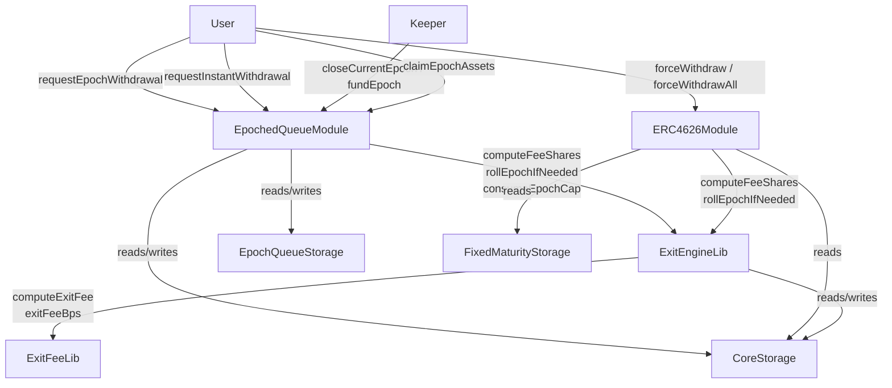
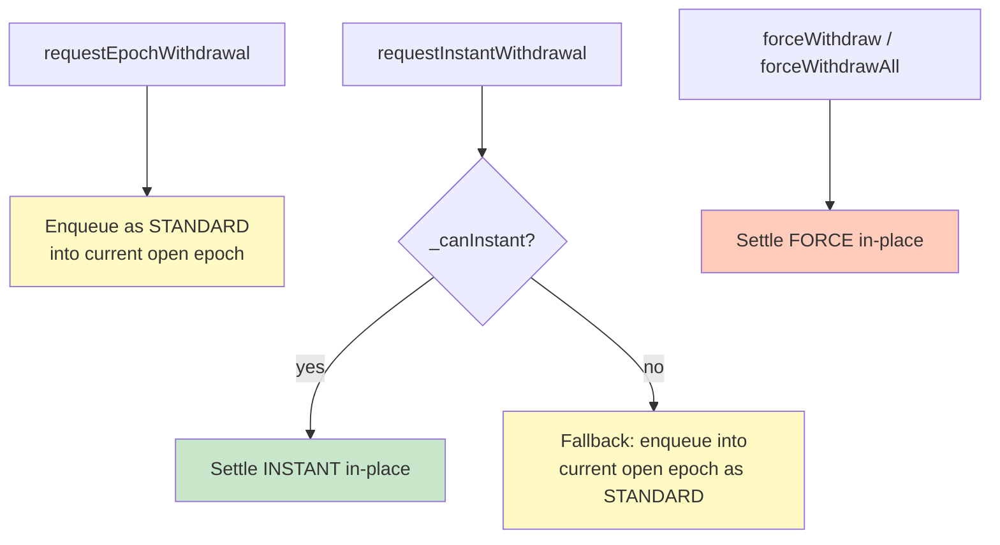
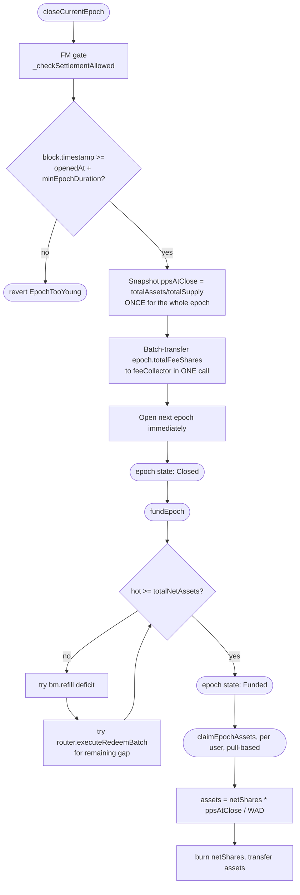

# Exit Engine

> **Source of truth**: `src/core/libraries/ExitEngineLib.sol` + `src/core/modules/EpochedQueueModule.sol` @ `f7e3544`
> **Supersedes**: v1.0 of this document, which described the exit engine's `QueueModule`
> integration. `QueueModule.sol` has been deleted; `EpochedQueueModule` is the sole production
> queue-settlement mechanism. See `docs/queue-mechanics.md` for the full epoch-queue writeup —
> this document focuses on `ExitEngineLib`'s mode routing, fee computation, and cap accounting,
> which are largely unchanged by the queue migration.

---

## 1. Overview

The exit engine is the single library that coordinates all withdrawal paths in a Multyr vault. It is implemented in `src/core/libraries/ExitEngineLib.sol` and delegates fee computation to `src/core/libraries/ExitFeeLib.sol`.

Two modules consume the exit engine:

| Module | File | Exit paths |
|--------|------|------------|
| `EpochedQueueModule` | `src/core/modules/EpochedQueueModule.sol` | `requestEpochWithdrawal` (STANDARD), `requestInstantWithdrawal` (INSTANT), `closeCurrentEpoch`/`fundEpoch`/`claimEpochAssets` (settlement) |
| `ERC4626Module` | `src/core/modules/ERC4626Module.sol:166` | `forceWithdraw`, `forceWithdrawAll` |

`ExitEngineLib` is a pure library — it holds no storage. It reads from `CoreStorage.Layout` via storage pointers passed by the calling module (delegatecall context; `address(this)` is the vault). Unlike the retired `QueueModule` integration, `ExitEngineLib`'s exported functions no longer take a `QueueStorage.Layout` pointer — `EpochedQueueModule` computes its own "queue depth" dynamic-cap signal internally (`_epochCapRemaining()`, `EpochedQueueModule.sol:946`) rather than routing through `ExitEngineLib.calculateCapRemaining()`.

Three responsibilities:

1. **Mode routing** — determine exit path (STANDARD / INSTANT / FORCE)
2. **Epoch cap accounting** — roll epoch boundaries, compute cap remaining, consume cap
3. **Fee computation** — invoke `ExitFeeLib`, round shares up and assets down

### 1.1 Module call graph


```mermaid
flowchart TD
    User -->|requestEpochWithdrawal| QM[EpochedQueueModule]
    User -->|requestInstantWithdrawal| QM
    User -->|forceWithdraw / forceWithdrawAll| ERC[ERC4626Module]
    Keeper -->|closeCurrentEpoch / fundEpoch| QM
    User -->|claimEpochAssets| QM

    QM -->|computeFeeShares\nrollEpochIfNeeded\nconsumeEpochCap| EEL[ExitEngineLib]
    ERC -->|computeFeeShares\nrollEpochIfNeeded| EEL

    EEL -->|computeExitFee\nexitFeeBps| EFL[ExitFeeLib]

    QM -->|reads/writes| CS[CoreStorage]
    QM -->|reads/writes| EQS[EpochQueueStorage]
    ERC -->|reads| CS
    ERC -->|reads| FS[FixedMaturityStorage]

    EEL -->|reads/writes| CS
```

---

## 2. Three Exit Modes

The `ExitMode` enum (`ExitEngineLib.sol:28`) defines three settlement paths — unchanged by the queue migration:

```solidity
// src/core/libraries/ExitEngineLib.sol:28
enum ExitMode {
    STANDARD,   // queued — witBps only
    INSTANT,    // immediate, cap-gated — witBps + immediateExitPenaltyBps
    FORCE       // bypasses cap and lock — witBps + forceExitPenaltyBps
}
```

### 2.1 STANDARD

STANDARD is the baseline path for all queued withdrawals.

- Entry: `requestEpochWithdrawal(shares)`, or `requestInstantWithdrawal(shares)` when instant settlement is not possible (internal fallback to the same code path)
- ALL gross shares (not just the fee-deducted portion) are escrowed to `address(this)` (the vault contract) — fee shares are only separated out and transferred at `closeCurrentEpoch()`
- An `EpochClaim` is recorded under `(currentEpochId, claimId)` — there is no `immediate` flag on the claim struct itself; the fallback path and the direct `requestEpochWithdrawal` path both simply create a standard epoch claim
- Settles via a future `closeCurrentEpoch()` → `fundEpoch()` → `claimEpochAssets()` sequence — the last step is pull-based, called by the user, not a keeper
- Subject to `lockPeriod` check at *request* time (not settlement time — a difference from the retired queue, whose lock check ran at settlement)
- Fee: `witBps` only
- **`netAssets` in `simulateExit()` is INDICATIVE** — `ppsAtClose` (locked at `closeCurrentEpoch()`) may differ from PPS at request time

### 2.2 INSTANT

INSTANT is the immediate path, available when three conditions hold simultaneously.

- Entry: `requestInstantWithdrawal(shares)` when `_canInstant()` returns `true`
- Three-gate check (`src/core/modules/EpochedQueueModule.sol:917`):
  1. **Lock period**: `block.timestamp >= core.lastDepositTs[msg.sender] + lockPeriod`
  2. **Epoch cap**: `grossAssets <= _epochCapRemaining()` (the withdrawal-cap epoch — see §4)
  3. **Hot liquidity**: `IERC20(_asset()).balanceOf(address(this)) >= grossAssets`
- Settles atomically in the same transaction — no queue entry created
- Fee: `witBps + immediateExitPenaltyBps`
- Consumes epoch cap via `consumeEpochCap(core, grossAssets)`
- **`netAssets` is EXACT** — PPS computed and applied in the same block
- Returns `(settledImmediately=true, epochId=0, claimId=0)`

### 2.3 FORCE

FORCE is the emergency withdrawal path. It bypasses the epoch cap and lock period. Unchanged by the queue migration — still implemented in `ERC4626Module`.

- Entry: `forceWithdraw(assets, receiver, owner, plan, maxShares)` or `forceWithdrawAll(receiver, minAssetsOut)`
- Requires vault to be in OpenEnded mode, or FixedMaturity/Active state (`_checkForceExitAllowed()` in `FixedMaturityStorage.sol`)
- Does **not** call `consumeEpochCap` — `epochWithdrawn` is unchanged
- Does **not** check `lockPeriod`
- Fee: `witBps + forceExitPenaltyBps`; in FixedMaturity/Active, `preMaturityForceExitPenaltyBps` is added
- User supplies a `Pull[]` plan (`MAX_FORCE_LEGS = 10`) for `forceWithdraw`, or auto-calls `_forcePullAllLiquidity` for `forceWithdrawAll`
- **`netAssets` is EXACT**

### 2.4 Mode selection decision tree


```mermaid
flowchart TD
    A[requestEpochWithdrawal] --> Q1[Enqueue as STANDARD\ninto current open epoch]
    B[requestInstantWithdrawal] --> C{_canInstant?}
    C -->|yes| D[Settle INSTANT in-place]
    C -->|no| E[Fallback: enqueue into\ncurrent open epoch as STANDARD]
    F[forceWithdraw / forceWithdrawAll] --> G[Settle FORCE in-place]

    style D fill:#c8e6c9
    style G fill:#ffccbc
    style Q1 fill:#fff9c4
    style E fill:#fff9c4
```

Unlike the retired queue, there is no per-claim mode re-evaluation at settlement time — an
epoch claim is always STANDARD once created (the `immediate=true→false` downgrade concept no
longer applies since instant settlement, when it happens, never creates a claim at all).

---

## 2.5 Public interface

Entry points for each mode:

| Function | Module | Mode |
|----------|--------|------|
| `requestEpochWithdrawal(uint256 shares)` | EpochedQueueModule | STANDARD |
| `requestInstantWithdrawal(uint256 shares)` | EpochedQueueModule | INSTANT (falls back to STANDARD) |
| `cancelEpochWithdrawal(uint256 epochId, uint256 claimId)` | EpochedQueueModule | — (reversal, epoch must still be Open) |
| `closeCurrentEpoch()` | EpochedQueueModule | locks PPS for a full epoch of STANDARD claims |
| `fundEpoch(uint256 epochId)` | EpochedQueueModule | pulls liquidity for a Closed epoch |
| `claimEpochAssets(uint256 epochId, uint256 claimId)` / `batchClaimEpochAssets(...)` | EpochedQueueModule | pull-based settlement of a Funded epoch's claim(s) |
| `forceWithdraw(uint256 assets, address receiver, address owner, Pull[] plan, uint256 maxShares)` | ERC4626Module | FORCE |
| `forceWithdrawAll(address receiver, uint256 minAssetsOut)` | ERC4626Module | FORCE (all shares, reverts below `minAssetsOut` — F-03) |
| `simulateExit(uint256 shares, bool immediate, bool isForce, address vault)` | ExitEngineLib (view) | preview only |

Note: `withdraw(uint256, address, address)` and `redeem(uint256, address, address)` always revert (`AsyncWithdrawalRequired`) — see Invariant E1.

---

## 3. ExitResult Struct

`simulateExit()` (`src/core/libraries/ExitEngineLib.sol`) returns an `ExitResult` struct that mirrors the state written by actual settlement — unchanged by the queue migration:

```solidity
struct ExitResult {
    uint256 grossAssets;        // assets before fees
    uint256 netAssets;          // assets user receives
    uint256 feeShares;          // shares taken as fee (rounded UP)
    uint256 userShares;         // shares burned for user
    uint256 withdrawFeeAssets;  // fee from witBps (informational)
    uint256 penaltyAssets;      // fee from penalty bps (informational)
    bool    willQueue;          // true if immediate=true but cap insufficient
    uint256 epochCapRemaining;  // remaining cap after this exit (0 for STANDARD/FORCE)
}
```

**Precision contract** (`src/core/libraries/ExitFeeLib.sol`, `src/core/libraries/ExitEngineLib.sol`):

| Field | Rounding | Direction | Reason |
|-------|----------|-----------|--------|
| `withdrawFeeAssets` | `mulBpsDown` | truncate | computed in assets; truncation favors user |
| `penaltyAssets` | `mulBpsDown` | truncate | same |
| `netAssets` | `grossAssets - totalFee` | — | derived |
| `feeShares` | `mulBpsUp` | ceiling | favors protocol; prevents sub-1-share dust leakage |
| `userShares` | `grossShares - feeShares` | — | derived |

`simulateExit()` is call-equivalent to the runtime path for INSTANT and FORCE. For STANDARD, `netAssets` is indicative because `ppsAtClose` is set later, at `closeCurrentEpoch()`, and may differ from PPS at request time.

---

## 4. Epoch Cap Engine

The withdrawal-cap epoch limits aggregate INSTANT withdrawals per time window. It does not apply to STANDARD (queued) or FORCE (emergency) paths. **This is a distinct concept from the settlement epoch** used by `EpochedQueueModule` for claim batching — see `docs/queue-mechanics.md` §6 for the full distinction. They have independent storage, independent durations, and roll on different triggers.

### 4.1 Storage fields

Fields in `CoreStorage.Layout`:

| Field | Type | Description |
|-------|------|-------------|
| `epochStart` | `uint64` | Timestamp of current cap-epoch start |
| `epochDuration` | `uint64` | Duration in seconds (1d–30d) |
| `epochWithdrawn` | `uint256` | Cumulative INSTANT assets withdrawn this cap epoch |
| `maxWithdrawPerEpoch` | `uint256` | Static cap (used when `WithdrawalCapLib` not wired) |

### 4.2 Epoch roll

`rollEpochIfNeeded(CoreStorage.Layout storage core)` (`src/core/libraries/ExitEngineLib.sol`):

```
if block.timestamp >= epochStart + epochDuration:
    epochStart += epochDuration   // boundary-aligned, NOT block.timestamp
    epochWithdrawn = 0
```

Multi-epoch skips (vault was inactive for N epochs) are handled by iterating: `epochStart` is advanced in multiples of `epochDuration` until it is within one duration of `block.timestamp`.

Constants:
- `MIN_EPOCH_DURATION = 1 days`
- `MAX_EPOCH_DURATION = 30 days`

### 4.3 Cap computation

`EpochedQueueModule._epochCapRemaining()` (`src/core/modules/EpochedQueueModule.sol:946`) replaces the old `ExitEngineLib.calculateCapRemaining(core, q, ...)` wrapper (which took a `QueueStorage.Layout` pointer and has been deleted along with `QueueModule`):

1. Calls `rollEpochIfNeeded` (writes `epochStart`, `epochWithdrawn` if the cap epoch expired)
2. If `WithdrawalCapLib` dynamic cap is enabled: computes a stress-adjusted cap using `outstandingClaimCount()` (the epoch-model "queue depth" signal — see `docs/queue-mechanics.md` §2.1) in place of the old flat-array `queue.length - head`
3. Else: `cap = wp.capPerEpochBps` (or `maxWithdrawPerEpoch` fallback)
4. Returns `max(0, cap - core.epochWithdrawn)`

### 4.4 Cap consumption

`consumeEpochCap(core, grossAssets)` (`src/core/libraries/ExitEngineLib.sol`):

```solidity
core.epochWithdrawn += grossAssets;
```

Called only in one place now: `requestInstantWithdrawal()`'s settled-immediately path, in the same transaction as settlement. The old second call site — `QueueModule._settleLoop()` re-checking `c.immediate=true` claims at settlement time — no longer exists, because an epoch claim is never subject to the cap at settlement; only the atomic instant path ever consumes it.

**FORCE never calls `consumeEpochCap`.** The `epochWithdrawn` counter is unaffected by `forceWithdraw` and `forceWithdrawAll`.

### 4.5 INSTANT fallback

When `requestInstantWithdrawal(shares)` fails `_canInstant()` (any one of: cap exhausted, lock active, insufficient hot), it internally calls the same code path as `requestEpochWithdrawal`:

```
EpochClaim{user, netShares, feeShares, claimed=false}   // recorded under (currentEpochId, claimId)
```

This claim is settled via the normal close → fund → claim cycle and is **never subject to the epoch cap**, regardless of remaining capacity at settlement time. This prevents a starvation scenario where a user who requested immediate but was downgraded to the queue is blocked by a full cap at settlement.

### 4.6 Epoch cap timeline example

```
Day 0:  epochStart=T0, epochWithdrawn=0, cap=100_000 USDC
  tx1:  INSTANT 40_000 → epochWithdrawn=40_000, capRem=60_000
  tx2:  INSTANT 60_000 → epochWithdrawn=100_000, capRem=0
  tx3:  INSTANT 1_000  → _canInstant() false → falls back, queued into current settlement epoch

Day 1:  rollEpochIfNeeded() → epochStart=T0+1d, epochWithdrawn=0   (cap epoch only — unrelated to the settlement epoch's own lifecycle)
  tx4:  INSTANT 1_000  → capRem=99_000 ✓
```

---

## 4.7 Storage layout (exit-engine-relevant fields)

Fields read or written by `ExitEngineLib` during exit processing (`src/core/storage/CoreStorage.sol`):

| Field | Type | Access |
|-------|------|--------|
| `epochStart` | `uint64` | read/write (`rollEpochIfNeeded`) |
| `epochDuration` | `uint64` | read |
| `epochWithdrawn` | `uint256` | read/write |
| `maxWithdrawPerEpoch` | `uint256` | read |
| `lastDepositTs[user]` | `mapping(address → uint64)` | read (INSTANT lock check) |
| `paramMinDelay` | `uint64` | read (AdminModule fee timelock) |
| `packedFlags` | `uint256` | read/write (reentrancy guard) |

Fields in `EpochQueueStorage.Layout` (`src/core/modules/EpochedQueueModule.sol:59`, a namespace entirely separate from the retired `QueueStorage.Layout`):

| Field | Type | Description |
|-------|------|-------------|
| `currentEpochId` | `uint256` | The currently open settlement epoch |
| `epochs[epochId]` | `mapping(uint256 → EpochData)` | Per-epoch aggregate (state, `ppsAtClose`, totals) |
| `claims[epochId][claimId]` | `mapping(uint256 → mapping(uint256 → EpochClaim))` | Per-claim data |
| `nextClaimId[epochId]` | `mapping(uint256 → uint256)` | Per-epoch claim ID counter (starts at 1) |
| `escrowedShares` | `uint256` | Total shares in vault escrow across all epochs |
| `outstandingClaimCount` | `uint256` | Total unclaimed claims across all epochs — dynamic-cap signal |
| `oldestUnfundedEpochId` | `uint256` | Keeper cursor — oldest Closed-not-yet-Funded epoch |

`EpochClaim` struct (2 storage slots, `EpochedQueueModule.sol:52`):
```solidity
struct EpochClaim {
    address user;
    uint256 netShares;
    uint256 feeShares;
    bool    claimed;
}
```

Note: unlike the retired `Claim` struct, there is no `immediate` field — every `EpochClaim` is, by construction, a STANDARD claim.

---

## 5. Fee Path Per Mode

### 5.1 Fee parameters

Fee parameters are stored in `FeeStorage.Layout` — unchanged by the queue migration:

```solidity
struct InternalFeeParams {
    uint16 depBps;                    // deposit fee (not used in exit)
    uint16 witBps;                    // withdrawal fee — all modes
    uint16 immediateExitPenaltyBps;   // INSTANT additional penalty
    uint16 forceExitPenaltyBps;       // FORCE additional penalty
    address treasury;                 // feeCollector address
}
```

In FixedMaturity/Active vaults, `FixedMaturityStorage.Layout.preMaturityForceExitPenaltyBps` is fetched and added to FORCE fee only.

### 5.2 Fee computation chain

Unchanged — `ExitEngineLib`/`ExitFeeLib` compute fees identically regardless of which queue module calls them:

```
ExitEngineLib.computeFeeShares(shares, mode, fee)
    ↓
ExitFeeLib.exitFeeBps(isImmediate, isForce, fee)          ← combined bps
    → STANDARD:  witBps
    → INSTANT:   witBps + immediateExitPenaltyBps
    → FORCE:     witBps + forceExitPenaltyBps
                 [+ preMaturityForceExitPenaltyBps if FM/Active]
    ↓
ExitFeeLib.computeExitFee(grossAssets, isImmediate, isForce, fee)
    → totalFee      = mulBpsDown(gross, combined)
    → withdrawFee   = mulBpsDown(gross, witBps)
    → penaltyFee    = totalFee - withdrawFee
    → netAssets     = gross - totalFee
    ↓
ExitEngineLib.computeFeeShares:
    → feeShares  = mulBpsUp(grossShares, combined)
    → userShares = grossShares - feeShares
```

### 5.3 Fee disposition

Fee shares are **transferred** from the existing supply to `feeCollector`, never minted:

| Path | Escrow source | Transfer call | When |
|------|--------------|---------------|------|
| INSTANT in `requestInstantWithdrawal` | `msg.sender` (user holds shares) | `_transferShares(msg.sender, feeCollector, feeShares)` | Same transaction, atomic |
| STANDARD in `closeCurrentEpoch` | `address(this)` (vault escrow) | `_transferShares(address(this), feeCollector, epoch.totalFeeShares)` | ONE batched transfer per epoch, not per claim |
| FORCE in `forceWithdraw` | `owner_` | `_transferShares(owner_, feeCollector, feeShares)` | Same transaction |
| FORCE in `forceWithdrawAll` | `msg.sender` | `_transferShares(msg.sender, feeCollector, feeShares)` | Same transaction |

**Invariant**: `totalSupply` is never increased by any fee operation on the exit path. The fee is taken from the exiting user's allocation — no new shares are created.

The STANDARD-path batching (one `_transferShares` call for the whole epoch's accumulated fee shares, at close time) replaces the retired per-claim fee transfer inside `QueueModule._settleLoop` — a direct consequence of settling a whole epoch at once instead of scanning individual claims.

### 5.3.1 Fee parameter timelock

Unchanged by the queue migration. Fee parameters (`witBps`, `immediateExitPenaltyBps`, `forceExitPenaltyBps`) are changed through a two-step timelock in `AdminModule`:

```
submitFeeParams(depBps, witBps, immediateExitPenaltyBps, forceExitPenaltyBps, treasury)
  → sets f.pendingFee with eta = block.timestamp + paramMinDelay

acceptFeeParams()
  → validates: eta passed AND not expired (eta + MAX_WINDOW=7d)
  → applies: f.fee = pendingFee

revokeFeeParams()
  → callable by owner OR vetoer
  → deletes pendingFee
```

`paramMinDelay` is itself subject to a separate timelock (`submitParamDelay` / `acceptParamDelay`). `MAX_WINDOW = 7 days` ensures stale pending params cannot be applied indefinitely.

---

### 5.4 Performance fee (crystallization)

Performance fee is independent from exit fees, and — as of this migration — explicitly documented as independent from queue settlement too (see `docs/queue-mechanics.md` §7). It is triggered via `endEpochCrystallize()` → `_crystallize()` (`src/core/modules/EpochedQueueModule.sol:576`), ported verbatim from the retired `QueueModule`:

```
pps = totalAssets / totalSupply  (WAD-scaled)
if pps > highWaterMark:
    profit   = totalAssets - (highWaterMark × totalSupply)
    feeAssets = mulWadDown(profit, perfRateX)
    feeShares = convertToShares(feeAssets)
    _mint(feeCollector, feeShares)      ← only mint in entire exit system
    highWaterMark = new pps
```

`endEpochCrystallize()` can be called at any time, independent of whether any settlement epoch is open, closed, or funded — it has zero dependency on `EpochQueueStorage`.

Note: `_mint` is called **only for perf fee crystallization** — not during standard/instant/force exits.

---

## 6. Critical Invariants

Six invariants enforced across `ExitEngineLib`, `EpochedQueueModule`, and `ERC4626Module`:

| ID | Invariant | Where enforced |
|----|-----------|---------------|
| **E1** | `withdraw()` and `redeem()` always revert with `AsyncWithdrawalRequired` | `ERC4626Module.sol` — unconditional revert on both functions |
| **E2** | `epochWithdrawn ≤ epochCap` after any INSTANT settlement | `consumeEpochCap` called only after `_canInstant()` confirms cap available |
| **E3** | `totalSupply` never increases on any exit path | exit fees are transfer-only; `_mint` is perf-fee only |
| **E4** | `feeShares` transferred from user/escrow to feeCollector, not minted | `_transferShares()` call site, not `_mint()` |
| **E5** | `simulateExit()` result == runtime for INSTANT and FORCE | Same code path in ExitEngineLib ← ExitFeeLib, identical rounding |
| **E6** | FORCE exits do not consume epoch cap | `consumeEpochCap` absent from both `forceWithdraw` and `forceWithdrawAll` |

Test coverage: `test/unit/core/ExitEngineLib.t.sol`, `test/unit/core/EpochedQueueModule.t.sol`, `test/unit/core/ERC4626Module.t.sol`, `test/unit/core/ExitEngine_StressTest.t.sol`, `test/unit/core/ExitEngine_ForkSuite.t.sol`, `test/unit/core/ExitEngine_AuditEdgeCases.t.sol`.

---

## 6.1 Settlement architecture

Settlement is no longer a single-function batch scan — it is a three-call, epoch-wide sequence (`src/core/modules/EpochedQueueModule.sol:327-513`). See `docs/queue-mechanics.md` §4 for the full breakdown; summary:


```mermaid
flowchart TD
    CLOSE([closeCurrentEpoch]) --> FM[FM gate\n_checkSettlementAllowed]
    FM --> AGE{block.timestamp >=\nopenedAt + minEpochDuration?}
    AGE -->|no| REVERT([revert EpochTooYoung])
    AGE -->|yes| SNAP[Snapshot ppsAtClose = totalAssets/totalSupply\nONCE for the whole epoch]
    SNAP --> FEEBATCH[Batch-transfer epoch.totalFeeShares\nto feeCollector in ONE call]
    FEEBATCH --> NEXTEPOCH[Open next epoch immediately]
    NEXTEPOCH --> CLOSED([epoch state: Closed])

    CLOSED --> FUND([fundEpoch])
    FUND --> HOTCHK{hot >= totalNetAssets?}
    HOTCHK -->|no| WARM[try bm.refill deficit]
    WARM --> STRAT[try router.executeRedeemBatch\nfor remaining gap]
    STRAT --> HOTCHK
    HOTCHK -->|yes| FUNDED([epoch state: Funded])

    FUNDED --> CLAIM([claimEpochAssets, per user, pull-based])
    CLAIM --> ASSETS[assets = netShares * ppsAtClose / WAD]
    ASSETS --> BURN[burn netShares, transfer assets]
```

Key gas property: `fundEpoch()` is **O(1) regardless of how many claims the epoch contains** — one liquidity pull covers the entire epoch's net liability, unlike the retired per-batch keeper scan whose cost scaled with `min(maxClaims, queueDepth)`. Empirically measured flat at ~39k gas across queue depths of 100/500/1000 claims (`test/unit/core/Hardening_GasAndChaos.t.sol:test_gasCharacterization_queue100/500/1000`).

---

## 7. Events

Events emitted on exit paths:

| Event | Module | Trigger |
|-------|--------|---------|
| `EpochWithdrawalRequested(epochId, claimId, user, grossShares, netShares, feeShares)` | EpochedQueueModule | `requestEpochWithdrawal` / instant fallback |
| `EpochWithdrawalCancelled(epochId, claimId, user, grossShares)` | EpochedQueueModule | `cancelEpochWithdrawal` |
| `EpochClosed(epochId, ppsAtClose, totalNetShares, totalNetAssets, totalFeeShares)` | EpochedQueueModule | `closeCurrentEpoch` |
| `EpochFundAttempt(epochId, needed, hotBefore, hotAfter)` | EpochedQueueModule | `fundEpoch` (emitted twice) |
| `EpochFunded(epochId, totalNetAssets)` | EpochedQueueModule | `fundEpoch` success |
| `EpochAssetsClaimed(epochId, claimId, user, assets, netShares)` | EpochedQueueModule | `claimEpochAssets` / `batchClaimEpochAssets` |
| `InstantExit(user, shares, netAssets, feeShares)` | EpochedQueueModule | `requestInstantWithdrawal` settled-immediately path |
| `FeePaid(user, feeCollector, feeShares)` | EpochedQueueModule | `closeCurrentEpoch` batched fee transfer |
| `Crystallized(oldHwm, newHwm, feeAssets)` | EpochedQueueModule | Performance fee crystallization |
| `PerfFeeMinted(oldHwm, ppsBefore, feeShares, ppsAfter)` | EpochedQueueModule | Perf fee mint |
| `WithdrawFeeTaken(user, feeShares)` | ERC4626Module | FORCE fee transfer |
| `ForceExitPenaltyApplied(user, penaltyAssets)` | ERC4626Module | When `penaltyAssets > 0` |
| `ForceWithdrawExecuted(user, assets, shares, feeShares)` | ERC4626Module | `forceWithdraw` completion |
| `ForceWithdrawAllExecuted(user, assets, shares, feeShares)` | ERC4626Module | `forceWithdrawAll` completion |
| `ForceExit(owner, receiver, assets)` | ERC4626Module | Both FORCE paths |
| `WithdrawalCapEpochRolled(newEpochStart)` | ExitEngineLib | On cap-epoch boundary roll. Renamed from `EpochRolled`: the old name invited indexers to merge the withdrawal-cap window with the settlement queue's `EpochOpened`/`EpochClosed`/`EpochFunded`, which are unrelated |

---

## 8. External Calls

All external calls on the exit path follow the **W2 rule** (never block exits):

| Call | Context | Failure policy |
|------|---------|----------------|
| `bm.refreshWarmNav()` | `_trySoftRefreshWarmNav()` | `try/catch` — silent failure; exits proceed with stale NAV |
| `bm.refill(deficit)` | `fundEpoch()` warm-refill step | `try/catch`; emits `QueueWarmRefillFailed` on failure, falls through to strategy redeem |
| `eng.onExitLight(user, assets × 1e12)` | `_notifyIncentivesExit()` | `try/catch` — silent failure; exit never blocked |
| `router.planRedeem` / `executeRedeemBatch` | `fundEpoch()` strategy-redeem step | `try/catch`; emits `RealizedForQueue` on success, epoch stays `Closed` on failure for later retry |
| `router.executeRedeemBatch(plan)` | `_sourceLiquidityForForceWithdraw` | Reverts propagate to `forceWithdraw` caller |
| `router.forceRedeemForWithdraw(amount)` | `_forcePullAllLiquidity` | Reverts propagate to `forceWithdrawAll` caller |

The liquidity waterfall inside `fundEpoch()` (warm refill, then strategy redeem) replaces the retired `bm.refill` call inside `QueueModule._settleScan` — it now runs once per epoch instead of once per settle batch, and additionally attempts strategy redemption if warm refill alone doesn't close the gap (the old settle path only attempted warm refill).

---

## 9. Threat Model

| Threat | Mitigation |
|--------|-----------|
| **Cap drain via repeated INSTANT exits** | Epoch roll resets `epochWithdrawn`; cap consumed atomically before settlement in same tx |
| **FORCE griefing via dust extraction** | `_checkWithdrawalLimitsForForce` enforces minimum assets for force path; fee applies |
| **Reentrancy during settlement** | `_enterNonReentrant` / `_exitNonReentrant` use `CoreStorage.FLAG_REENTRANCY_LOCKED`; guards on `requestEpochWithdrawal`, `requestInstantWithdrawal`, `claimEpochAssets`, `batchClaimEpochAssets` |
| **Stale NAV price manipulation** | W2 soft refresh; stale NAV allows settlement but does not block it |
| **Dynamic-cap bypass via epoch-close timing** | `outstandingClaimCount()` persists across epoch boundaries — a claim landing before an epoch closes still counts against the dynamic-cap "queue depth" signal after the close, closing a bug window that existed in an earlier version of this module (fixed pre-cutover; regression-tested in `EpochedQueueModule.t.sol`) |
| **Fee rounding theft (sub-1-share dust)** | `feeShares` rounded UP (ceiling) — ensures protocol never receives 0 shares on a non-zero-fee exit |
| **Force exit in restricted FM state** | `_checkForceExitAllowed()` reverts for Funding/Starting/Closed/FundingFailed states |
| **Cross-epoch cap evasion (cap-epoch timer manipulation)** | Cap-epoch boundary is computed as `epochStart + epochDuration * n` — cannot be advanced by caller |
| **Settlement epoch closed prematurely** | `closeCurrentEpoch()` reverts `EpochTooYoung` until `minEpochDuration` has elapsed since the epoch opened; permissionless but time-gated |
| **Epoch funded while under-collateralized** | `fundEpoch()` only transitions to `Funded` when `hot >= totalNetAssets` — an explicit check, not an assumption |

**Discontinued mitigation (flagged, not silently dropped)**: the retired `QueueModule` enforced per-user anti-spam via `cooldownPerClaim`/`maxClaimsPerUserPerEpoch` (`_checkQueueAntiSpam`). `EpochedQueueModule` has no equivalent per-user rate limit on `requestEpochWithdrawal`/`requestInstantWithdrawal`. This is a deliberate simplification enabled by the architecture change: since settlement cost no longer scales with the number of individual claims (`fundEpoch()` is O(1) regardless of claim count — see §6.1), the original DoS rationale for per-user claim throttling is substantially weaker. Confirm this is an acceptable tradeoff for the deployment's expected exit volume before relying on it.

---

## 10. Examples

### 10.1 Standard withdrawal

```
User: requestEpochWithdrawal(1000e18)
  1. FM gate check (if applicable)
  2. epoch 0 lazily opened if this is the first-ever submission
  3. _trySoftRefreshWarmNav() — try/catch
  4. computeFeeShares(1000e18, STANDARD, fee) → feeShares=5e18 (witBps=50), netShares=995e18
  5. Escrow: _transferShares(user, vault, 1000e18)   // FULL gross, not just net
  6. claimId = ++nextClaimId[0]
  7. claims[0][claimId] = EpochClaim{user, netShares=995e18, feeShares=5e18, claimed=false}
  8. escrowedShares += 1000e18; outstandingClaimCount += 1
  9. Emit EpochWithdrawalRequested(0, claimId, user, 1000e18, 995e18, 5e18)

Later — Keeper: closeCurrentEpoch()
  1. block.timestamp >= openedAt + minEpochDuration, else EpochTooYoung
  2. ppsAtClose = totalAssets() * WAD / totalSupply()     // locked, once, for the WHOLE epoch
  3. epoch.totalNetAssets = totalNetShares * ppsAtClose / WAD
  4. _transferShares(vault, feeCollector, epoch.totalFeeShares)   // ONE batched transfer
  5. escrowedShares -= totalFeeShares
  6. Open epoch 1 immediately
  7. Emit EpochClosed(0, ppsAtClose, totalNetShares, totalNetAssets, totalFeeShares)

Keeper: fundEpoch(0)
  1. hot = balanceOf(vault); if hot < totalNetAssets: try warm refill, then strategy redeem
  2. if hot >= totalNetAssets: state = Funded; emit EpochFunded(0, totalNetAssets)

User: claimEpochAssets(0, claimId)
  1. assets = 995e18 * ppsAtClose / WAD
  2. claim.claimed = true; escrowedShares -= 995e18; outstandingClaimCount -= 1
  3. _burn(vault, 995e18); token.safeTransfer(user, assets)
  4. Emit EpochAssetsClaimed(0, claimId, user, assets, 995e18)
```

### 10.2 Instant withdrawal (success path)

```
User: requestInstantWithdrawal(1000e18)
  → _canInstant():
      lockPeriod=0 ✓
      gross=~995 USDC, capRem=10_000 USDC ✓
      hot=50_000 USDC ✓
  → ExitEngineLib.computeFeeShares(1000e18, INSTANT, fee)
      combined = witBps(50) + immediateExitPenaltyBps(100) = 150 bps
      feeShares = mulBpsUp(1000e18, 150) = 15e18
      userShares = 985e18
  → _transferShares(user, feeCollector, 15e18)
  → _burn(user, 985e18)
  → net = convertToAssets(985e18)
  → token.safeTransfer(user, net)
  → consumeEpochCap(core, ~995 USDC)
  → emit InstantExit(user, 1000e18, net, 15e18)
  → return (settledImmediately=true, epochId=0, claimId=0)
  → NOTE: no EpochClaim created — this exit never touches EpochQueueStorage
```

### 10.3 Instant fallback to the epoch queue

```
User: requestInstantWithdrawal(1000e18)
  → _canInstant():
      capRem=0 ✗ (epoch cap exhausted)
  → Falls back to the exact same path as requestEpochWithdrawal(1000e18)
  → EpochClaim{user, netShares, feeShares, claimed=false} recorded in the current open epoch
  → return (settledImmediately=false, epochId, claimId)
  → NOTE: no cap check ever applies to this claim again; it settles as ordinary STANDARD
```

### 10.4 Force withdrawal with plan

```
Context: OpenEnded vault, witBps=50 (0.5%), forceExitPenaltyBps=200 (2%), totalSupply=1_000_000e18
         totalAssets=1_010_000 USDC, PPS ≈ 1.01 USDC/share

User: forceWithdraw(
        assets=10_000e6,
        receiver=alice,
        owner_=alice,
        plan=[Pull{strat=0xAaaa, amount=10_000e6}],
        maxShares=uint256.max
      )

Step 1: _checkForceExitAllowed()
  → vaultMode=OpenEnded → passes immediately

Step 2-3: pause + reentrancy lock acquired

Step 4: _ensureFreshWarmNav()
  → bm.refreshWarmNav() if stale

Step 5: baseShares = _previewWithdraw(10_000e6)
  → convertToShares(10_000e6) = 10_000e6 * 1_000_000e18 / 1_010_000e6 ≈ 9_900_990e12

Step 6: feeShares = mulBpsUp(baseShares, witBps=50 + forceExitPenaltyBps=200)
  → combined = 250 bps (2.5%)
  → feeShares = ceiling(9_900_990e12 * 250 / 10_000) ≈ 247_525e12

Step 7: sharesSpent = baseShares + feeShares ≈ 10_148_515e12

Step 8: sharesSpent <= maxShares ✓

Step 9: caller == owner → no allowance check

Step 10: _checkWithdrawalLimitsForForce(10_000e6) — min check passes

Step 11: _sourceLiquidityForForceWithdraw(10_000e6, plan)
  → router.executeRedeemBatch([Pull{0xAaaa, 10_000e6}])
  → strategy redeems 10_000e6 → vault receives 10_000e6 USDC

Step 12: _transferShares(alice, feeCollector, feeShares=247_525e12)
  → feeCollector now holds 247_525e12 extra shares

Step 13: Emit WithdrawFeeTaken(alice, 247_525e12)
         Emit ForceExitPenaltyApplied(alice, ~245e6 USDC)

Step 14: _burn(alice, baseShares=9_900_990e12)
  → totalSupply decreases; alice loses 9_900_990e12 shares

Step 15: token.safeTransfer(receiver=alice, 10_000e6)
  → alice receives exactly 10_000 USDC

Step 16: Emit ForceWithdrawExecuted, ForceExit

NOTE: epochWithdrawn unchanged — FORCE does not consume epoch cap
NOTE: feeShares transferred (no mint) — totalSupply net delta = -9_900_990e12 (only base burned)
```

### 10.5 forceWithdrawAll

```
User holds 5_000e18 shares; PPS = 1.01; witBps=50; forceExitPenaltyBps=200

User: forceWithdrawAll(receiver=alice, minAssetsOut=0)

Step 1: shares = balanceOf(alice) = 5_000e18
Step 2: feeShares = mulBpsUp(5_000e18, 250) = 125e18
Step 3: netShares = 5_000e18 - 125e18 = 4_875e18
Step 4: targetAssets = convertToAssets(4_875e18)
         = 4_875e18 * totalAssets / totalSupply ≈ 4_924_999 USDC
Step 5: _checkWithdrawalLimitsForForce(targetAssets)
Step 6: _forcePullAllLiquidity(targetAssets)
         → router.forceRedeemForWithdraw(targetAssets)
Step 7: assetsReceived = min(hot, targetAssets)   // best-effort
Step 7a: if assetsReceived < minAssetsOut: revert SlippageExceeded()   // F-03
Step 8: fillRatio = assetsReceived / targetAssets (1.0 here — fully filled)
         netSharesToBurn = netShares × fillRatio = 4_875e18
Step 9: _transferShares(alice, feeCollector, 125e18 × fillRatio)
Step 10: _burn(alice, netSharesToBurn)
Step 11: token.safeTransfer(alice, assetsReceived)
Step 12: Emit ForceWithdrawAllExecuted, ForceExit
```

---

## 11. Edge Cases

| Case | Behavior |
|------|---------|
| `requestInstantWithdrawal` when epoch cap = 0 | Falls back to the epoch queue; settles as STANDARD with no cap check |
| `requestInstantWithdrawal` when hot < gross | Falls back to the epoch queue (hot check is the third gate in `_canInstant`) |
| `closeCurrentEpoch()` called before `minEpochDuration` elapsed | Reverts `EpochTooYoung()` — permissionless but time-gated |
| `closeCurrentEpoch()` on an epoch with zero claims | Succeeds; `ppsAtClose`/`totalNetAssets` compute sanely (no division issues); next epoch opens normally |
| `fundEpoch()` called on an already-`Funded` epoch | Reverts `EpochAlreadyFunded()` — callers must guard against double-funding, it is not silently idempotent |
| `fundEpoch()` partial funding (hot still < totalNetAssets after waterfall) | Epoch remains `Closed`; retry `fundEpoch()` later as more liquidity becomes available; `oldestUnfundedEpochId` cursor does not advance past it |
| `claimEpochAssets` on a not-yet-`Funded` epoch | Reverts `EpochNotFunded()` |
| `claimEpochAssets` called twice for the same claim | Second call reverts `ClaimAlreadySettled()` |
| `cancelEpochWithdrawal` after the epoch has closed | Reverts — cancellation is only possible while the epoch is still `Open` |
| `totalSupply = 0` at crystallize, vault also holds 0 assets | Genuine fresh start: HWM reset to WAD, zero perf fee, `lastCrystallize` updated |
| `totalSupply = 0` at crystallize, but dust assets remain | HWM preserved (not reset to WAD); zero perf fee; `lastCrystallize` left untouched (no-op — prevents free griefing of the interval clock via a `ROLE_PUBLIC` caller) |
| FORCE on FixedMaturity/Funding | `_checkForceExitAllowed()` reverts |
| FORCE on FixedMaturity/Matured | Passes; `preMaturityForceExitPenaltyBps = 0` (maturity removes the pre-maturity surcharge) |
| `forceWithdrawAll`: hot < targetAssets, `assetsReceived >= minAssetsOut` | Best-effort: `assetsReceived = min(hot, targetAssets)` after `_forcePullAllLiquidity`; proportional burn, no revert |
| `forceWithdrawAll`: `assetsReceived < minAssetsOut` | Reverts `SlippageExceeded` (F-03); no shares burned, no fees transferred, no state changed |
| `witBps=0` and `forceExitPenaltyBps=0` | `feeShares=0`; fee transfer skipped; user receives full `grossShares` |
| Cap-epoch multi-skip (vault inactive N epochs) | `rollEpochIfNeeded` iterates until `epochStart` is within one duration of `block.timestamp` — the settlement epoch is unaffected (it only advances via explicit `closeCurrentEpoch()` calls) |

---

## 12. Glossary

| Term | Definition |
|------|-----------|
| **cap epoch** | Rolling time window (1d–30d) within which INSTANT withdrawal cap is tracked; `epochStart` stored in `CoreStorage` — distinct from the settlement epoch |
| **settlement epoch** | A batch of STANDARD claims sharing one locked `ppsAtClose` and one `fundEpoch()` liquidity pull; see `docs/queue-mechanics.md` |
| **epochWithdrawn** | Cumulative INSTANT assets withdrawn in the current cap epoch (`CoreStorage.Layout.epochWithdrawn`) |
| **epoch cap** | Maximum total INSTANT assets per cap epoch; static (`maxWithdrawPerEpoch`) or dynamic via `WithdrawalCapLib` |
| **hot balance** | Idle underlying token held directly by the vault: `IERC20(_asset()).balanceOf(address(this))` |
| **escrow** | `address(this)` — vault contract address that holds shares for open/closed-unfunded epoch claims |
| **PPS** | Price per share = `totalAssets / totalSupply` (WAD-scaled, 1e18 base) |
| **ppsAtClose** | PPS locked once at `closeCurrentEpoch()`; used for every claim in that epoch, forever |
| **HWM** | High water mark — peak PPS above which performance fee is charged (`FeeStorage.Layout.highWaterMark`) |
| **feeShares** | Shares transferred to `feeCollector` as protocol fee on exit |
| **witBps** | Withdrawal fee in basis points — applied to all three modes |
| **immediateExitPenaltyBps** | Additional fee for INSTANT exits (`FeeStorage.InternalFeeParams`) |
| **forceExitPenaltyBps** | Additional fee for FORCE exits (`FeeStorage.InternalFeeParams`) |
| **preMaturityForceExitPenaltyBps** | Additive surcharge for FORCE exits in FixedMaturity/Active state (`FixedMaturityStorage.Layout`) |
| **Pull plan** | `Pull[]` array (`{address strat, uint256 amount}`) specifying strategy–amount legs for FORCE liquidity sourcing; max 10 legs (`MAX_FORCE_LEGS`) |
| **W2 rule** | "Never block exits" — all non-critical external calls on exit paths are wrapped in `try/catch` |
| **simulateExit** | View function in `ExitEngineLib` that mirrors the runtime path; EXACT for INSTANT/FORCE, INDICATIVE for STANDARD |

---

## Appendix: Code Reference Index

| Function | File | Line |
|----------|------|------|
| `ExitMode` enum | `src/core/libraries/ExitEngineLib.sol` | 28 |
| `ExitResult` struct | `src/core/libraries/ExitEngineLib.sol` | ~34 |
| `rollEpochIfNeeded` | `src/core/libraries/ExitEngineLib.sol` | ~77 |
| `simulateExit` | `src/core/libraries/ExitEngineLib.sol` | ~202 |
| `consumeEpochCap` | `src/core/libraries/ExitEngineLib.sol` | ~258 |
| `computeFeeShares` | `src/core/libraries/ExitEngineLib.sol` | ~151 |
| `computeExitFee` | `src/core/libraries/ExitFeeLib.sol` | ~29 |
| `exitFeeBps` | `src/core/libraries/ExitFeeLib.sol` | ~61 |
| `requestEpochWithdrawal` / `_requestEpochWithdrawal` | `src/core/modules/EpochedQueueModule.sol` | 212 / 228 |
| `requestInstantWithdrawal` | `src/core/modules/EpochedQueueModule.sol` | 698 |
| `cancelEpochWithdrawal` | `src/core/modules/EpochedQueueModule.sol` | 290 |
| `closeCurrentEpoch` | `src/core/modules/EpochedQueueModule.sol` | 327 |
| `fundEpoch` | `src/core/modules/EpochedQueueModule.sol` | 390 |
| `claimEpochAssets` / `batchClaimEpochAssets` | `src/core/modules/EpochedQueueModule.sol` | 470 / 515 |
| `endEpochCrystallize` / `_crystallize` | `src/core/modules/EpochedQueueModule.sol` | 566 / 576 |
| `_canInstant` / `_epochCapRemaining` | `src/core/modules/EpochedQueueModule.sol` | 917 / 946 |
| `forceWithdraw` | `src/core/modules/ERC4626Module.sol` | 166 |
| `forceWithdrawAll` | `src/core/modules/ERC4626Module.sol` | 272 |
| `_checkForceExitAllowed` | `src/core/storage/FixedMaturityStorage.sol` | 111 |
| `InternalFeeParams` struct | `src/core/storage/FeeStorage.sol` | ~12 |
| `EpochQueueStorage.Layout` | `src/core/modules/EpochedQueueModule.sol` | 59 |
| `EpochClaim` struct | `src/core/modules/EpochedQueueModule.sol` | 52 |
| Reserved (unused) legacy slot | `src/core/storage/QueueStorage.sol` | kept only for EIP-7201 slot-collision safety |

---

## Footer

**Source commit**: `f7e3544`

**Migration note**: This document was rewritten for the `EpochedQueueModule` cutover.
`QueueModule.sol` (FIFO array, keeper-scanned settle loop) was fully deleted; all queue
selectors now route exclusively to `EpochedQueueModule` (epoch-bucketed, close → fund →
pull-claim). See `docs/queue-mechanics.md` for the complete queue-side writeup and
`git log` on this file for the pre-migration (`QueueModule`-based) version of this document.

**Known discrepancy carried forward from the pre-migration version**:

1. `src/core/mixins/PerfFeeMixin.sol` (pragma `0.8.24`) contains a legacy `_crystallize()` using a struct-based `perf` storage field. The active implementation is `EpochedQueueModule._crystallize()` using `FeeStorage.Layout` (EIP-7201 namespaced). `PerfFeeMixin` is not imported by any active module.
2. `src/core/mixins/FeeMixin.sol` (pragma `0.8.24`) uses a 3-field `InternalFeeParams` (no `immediateExitPenaltyBps`, no `forceExitPenaltyBps`). Active fee params use the 5-field struct in `FeeStorage.sol`. `FeeMixin` is not imported by any active module.
