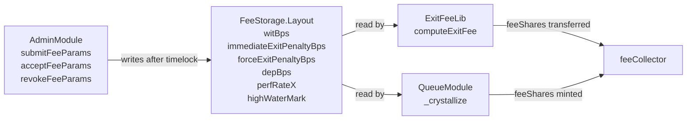

# Fee Policy

> **Source of truth**: `src/core/storage/FeeStorage.sol:55` @ `c39f9462`
> **ADR-015 workflow applied**: full code read before drafting.

---

## 1. Overview

The Multyr vault collects fees in four on-exit categories plus one performance category. All fees are denominated in vault shares and transferred (or minted for performance fee) to the `feeCollector` address stored in `CoreStorage.Layout`.

Fee parameters live in `FeeStorage.Layout` (EIP-7201 namespaced, `src/core/storage/FeeStorage.sol:55`). Any change to fee parameters requires a timelock through `AdminModule` (`src/core/modules/AdminModule.sol:73`).

Fee computation lives in two libraries:
- `src/core/libraries/ExitFeeLib.sol:29` — on-exit fee calculation
- `src/core/modules/QueueModule.sol:763` (`_crystallize`) — performance fee crystallization



---

## 2. Fee Types

### 2.1 Summary table

| Fee | Storage field | Applied on | Rounding | Disposition |
|-----|--------------|------------|----------|-------------|
| Deposit fee | `depBps` | `deposit()` and `mint()` — shares minted net of fee | shares: `mulBpsUp` | transfer to feeCollector |
| Withdrawal fee | `witBps` | All three exit modes (STANDARD, INSTANT, FORCE) | shares: `mulBpsUp`, assets: `mulBpsDown` | transfer to feeCollector |
| Immediate exit penalty | `immediateExitPenaltyBps` | INSTANT mode only (in addition to `witBps`) | same | transfer to feeCollector |
| Force exit penalty | `forceExitPenaltyBps` | FORCE mode only (in addition to `witBps`) | same | transfer to feeCollector |
| Performance fee | `perfRateX` (WAD) | Crystallization — profit above HWM | shares: `mulWadDown` then `convertToShares` | **mint** to feeCollector |
| Pre-maturity penalty | `preMaturityForceExitPenaltyBps` | FORCE on FixedMaturity/Active (in addition to `forceExitPenaltyBps`) | same | transfer to feeCollector |

Pre-maturity penalty is stored in `FixedMaturityStorage.Layout`, not `FeeStorage.Layout` — see §6.

---

## 3. FeeStorage Layout

`FeeStorage.Layout` is an EIP-7201 namespaced struct stored at a fixed slot in the vault's storage (`src/core/storage/FeeStorage.sol:55`):

```
SLOT = 0x70739e319b75b4e5834916b9ca624fcbb6af45b4e67e7e365061fa4e1afc2100
```

Accessed via `FeeStorage.layout()` free function which returns a storage pointer:

```solidity
// src/core/storage/FeeStorage.sol:55
struct Layout {
    // ── Active fee parameters ──────────────────────────────────────────
    InternalFeeParams fee;            // current active params (see below)

    // ── Pending fee parameters (timelock) ─────────────────────────────
    PendingFeeParams  pendingFee;     // submitted but not yet accepted
    PendingPerfParams pendingPerf;    // pending perf rate change
    PendingDelayParams pendingDelay;  // pending paramMinDelay change
    PendingBufferParams pendingBuffer; // pending warm buffer change
    PendingRouterParams pendingRouter; // pending strategy router change

    // ── Performance fee state ──────────────────────────────────────────
    uint256 perfRateX;               // WAD-scaled perf rate (e.g. 0.20e18 = 20%)
    uint256 highWaterMark;           // peak PPS (WAD-scaled)
    uint64  lastCrystallize;         // last crystallization timestamp
    uint64  minCrystallizeInterval;  // minimum seconds between crystallizations
}
```

`InternalFeeParams` struct (`src/core/storage/FeeStorage.sol:12`):

```solidity
struct InternalFeeParams {
    uint16  depBps;                    // deposit fee bps (max 1000 = 10%)
    uint16  witBps;                    // withdrawal fee bps (max 1000 = 10%)
    uint16  immediateExitPenaltyBps;   // INSTANT exit penalty bps
    uint16  forceExitPenaltyBps;       // FORCE exit penalty bps
    address treasury;                  // feeCollector address
}
```

`PendingFeeParams` mirrors `InternalFeeParams` with additional timelock fields:

```solidity
struct PendingFeeParams {
    uint16  dep;
    uint16  wit;
    uint16  immediateExitPenalty;
    uint16  forceExitPenalty;
    address treasury;
    uint64  eta;         // block.timestamp + paramMinDelay at submit time
    bool    exists;      // true while a submission is pending
}
```

### 3.1 Fee parameter constraints

Validation in `submitFeeParams` (`src/core/modules/AdminModule.sol:73`):

| Parameter | Constraint | Revert |
|-----------|-----------|--------|
| `depBps` | ≤ 1000 (10%) | `FeeCapExceeded` |
| `witBps` | ≤ 1000 (10%) | `FeeCapExceeded` |
| `immediateExitPenaltyBps` | ≤ 1000 (10%) | `FeeCapExceeded` |
| `forceExitPenaltyBps` | ≤ 1000 (10%) | `FeeCapExceeded` |
| `treasury` | != address(0) | `ZeroAddress` |

Combined exit fee ceiling: a user paying `witBps + forceExitPenaltyBps` pays at most 20%. In practice, protocol convention keeps combined bps well below 5%.

---

## 4. Timelock Workflow

All fee parameter changes flow through a two-step timelock. The delay prevents sudden fee increases that would harm users with active positions.

### 4.1 Workflow

```mermaid
sequenceDiagram
    participant Owner
    participant AdminModule
    participant FeeStorage
    participant Vetoer

    Owner->>AdminModule: submitFeeParams(...)
    AdminModule->>FeeStorage: pendingFee = {params, eta=now+paramMinDelay, exists=true}
    Note over AdminModule,FeeStorage: Wait paramMinDelay seconds

    alt Accept path
        Owner->>AdminModule: acceptFeeParams()
        AdminModule->>AdminModule: validate: eta <= now <= eta+MAX_WINDOW(7d)
        AdminModule->>FeeStorage: fee = pendingFee; delete pendingFee
    else Veto path
        Vetoer->>AdminModule: revokeFeeParams()
        AdminModule->>FeeStorage: delete pendingFee
    else Expiry
        Note over AdminModule: If now > eta+7d: acceptFeeParams() reverts EtaExpired
    end
```

### 4.2 Timelock constants

| Constant | Value | Source |
|----------|-------|--------|
| `MAX_WINDOW` | 7 days | `AdminModule.sol:L45` |
| `paramMinDelay` | governance-configurable | `CoreStorage.layout().paramMinDelay` |
| Min `paramMinDelay` | 0 (no minimum enforced on-chain) | convention |

`paramMinDelay` itself is subject to the same two-step pattern via `submitParamDelay` / `acceptParamDelay`. Both must clear `_validateEta`:

```solidity
// src/core/modules/AdminModule.sol:812
function _validateEta(uint64 eta, bool exists) internal view {
    if (!exists)                          revert NotPending();
    if (block.timestamp < eta)            revert EtaNotReached();
    if (block.timestamp > eta + MAX_WINDOW) revert EtaExpired();
}
```

### 4.3 Roles

| Role | Capability |
|------|-----------|
| `owner` | submit, accept, revoke |
| `vetoer` | revoke only (cannot submit or accept) |
| anyone | read pending params (public `pendingFee` slot) |

The `vetoer` role is a safety valve: an independent address (e.g., a multisig or DAO) can cancel a malicious parameter submission without being able to initiate one.

### 4.4 Parallel pending

Only one pending submission per parameter category is supported at a time. A new `submitFeeParams` call while `pendingFee.exists = true` **overwrites** the previous submission with a fresh `eta`. This prevents a griefing scenario where an owner submits, then immediately re-submits with a higher fee, resetting the delay.

---

## 5. Performance Fee

### 5.1 High Water Mark model

The HWM model ensures performance fee is charged only on new profit above the previous peak price per share:

```
pps(t)  = totalAssets(t) / totalSupply(t)

if pps(t) > hwm:
    profit   = totalAssets(t) - hwm × totalSupply(t)
    feeAssets = profit × perfRateX / 1e18
    feeShares = convertToShares(feeAssets)
    mint feeShares → feeCollector
    hwm = pps(t_after_mint)    // updated AFTER mint (diluted PPS)
```

Example:
```
hwm=1.00 USDC/share, totalSupply=1_000_000, totalAssets=1_010_000 USDC
pps = 1.01 > hwm ✓
profit = 1_010_000 - 1.00 × 1_000_000 = 10_000 USDC
perfRateX = 0.20e18 (20%)
feeAssets = 2_000 USDC
feeShares = 2_000e6 × 1_000_000e18 / 1_010_000e6 ≈ 1_980_198e12
_mint(feeCollector, 1_980_198e12)
newHwm = totalAssets / (totalSupply + 1_980_198e12)  ≈ 1.0078 USDC/share
```

### 5.2 Crystallization trigger

`_crystallize()` is called at the end of every `settleFeesAndProcessQueue` call (`src/core/modules/QueueModule.sol:238`). It is NOT called on INSTANT exits or FORCE exits — only during the scheduled batch settle.

Pre-conditions for fee to be minted:
1. `totalSupply > 0`
2. `pps > highWaterMark`
3. `block.timestamp >= lastCrystallize + minCrystallizeInterval` (skipped on the very first crystallize, i.e. `highWaterMark == 0`) — see §5.3
4. `feeAssets > 0` (profit is non-zero)
5. `feeShares > 0` (conversion does not produce zero)

Branch behavior when `pps <= highWaterMark` (no profit): `highWaterMark` is **left unchanged** at its prior peak and `lastCrystallize` is updated; no shares are minted. Previously `highWaterMark` was incorrectly overwritten with the (lower or equal) current `pps`, which broke HWM monotonicity — a subsequent crystallize at a `pps` between the old and new (lower) HWM would wrongly charge a performance fee on assets the vault had already been credited for. This was fixed by writing the prior `old` value back instead of `pps`. `Events.Crystallized(old, pps, 0)` is still emitted with the (unchanged) current `pps` as its second argument for observability, even though storage does not move.

Branch behavior when the interval guard (condition 3) blocks a would-be-profitable crystallize: the call returns early with `(old, 0)` — **neither `highWaterMark` nor `lastCrystallize` is updated** in this case, unlike the no-profit branch above.

### 5.3 Minimum crystallize interval

`minCrystallizeInterval` (`FeeStorage.Layout.minCrystallizeInterval`) **is now enforced by `_crystallize()`**: if `pps > highWaterMark` (profitable) but `block.timestamp < lastCrystallize + minCrystallizeInterval`, the call returns without minting a fee or advancing `highWaterMark`/`lastCrystallize`, deferring fee extraction to a later settle. The guard is skipped on the very first ever crystallize (`highWaterMark == 0`). Previously this parameter was accepted by governance (`submitPerfParams`/`acceptPerfParams`) but had no runtime effect — `_crystallize()` never read it, so `settleFeesAndProcessQueue` could crystallize performance fees on every call regardless of the configured minimum interval.

### 5.4 PerfFeeMixin (legacy)

`src/core/mixins/PerfFeeMixin.sol:73` contains an older `_crystallize()` using a `Perf` struct stored in contract storage (not EIP-7201 namespaced). This mixin is **not imported by any active module** on `c39f9462`. The active perf fee logic is in `QueueModule._crystallize()` (`src/core/modules/QueueModule.sol:763`), which uses `FeeStorage.Layout`. See Footer §Discrepancies.

This branch applied the same HWM-monotonicity and min-interval-enforcement fixes (§5.2, §5.3) to `PerfFeeMixin._crystallize()` for consistency, even though it remains dead code with no active caller.

---

## 6. FixedMaturity Pre-maturity Penalty

`preMaturityForceExitPenaltyBps` is an additive surcharge applied exclusively to FORCE exits from FixedMaturity vaults in the `Active` state.

Storage: `FixedMaturityStorage.Layout.preMaturityForceExitPenaltyBps` (`src/core/storage/FixedMaturityStorage.sol:47`).

| Vault mode | Vault state | preMaturityForceExitPenaltyBps applied? |
|-----------|------------|----------------------------------------|
| OpenEnded | any | No |
| FixedMaturity | Funding | N/A — `_checkForceExitAllowed()` reverts |
| FixedMaturity | Starting | N/A — `_checkForceExitAllowed()` reverts |
| FixedMaturity | Active | **Yes** — additive to `forceExitPenaltyBps` |
| FixedMaturity | Matured | No — penalty cleared at maturity |
| FixedMaturity | Closed | N/A — `_checkForceExitAllowed()` reverts |

Combined FORCE fee in FixedMaturity/Active:
```
totalForceBps = witBps + forceExitPenaltyBps + preMaturityForceExitPenaltyBps
```

---

## 7. Invariants

| ID | Invariant | Enforcement |
|----|-----------|-------------|
| **F1** | `depBps`, `witBps`, `immediateExitPenaltyBps`, `forceExitPenaltyBps` ≤ 1000 bps | `submitFeeParams` validation, `FeeCapExceeded` revert |
| **F2** | Fee parameters only change after `paramMinDelay` and within `MAX_WINDOW` | `_validateEta` in `acceptFeeParams` |
| **F3** | Performance fee minted only when `pps > highWaterMark`, `totalSupply > 0`, and the min-crystallize-interval has elapsed since `lastCrystallize` (skipped on first-ever crystallize) | `_crystallize()` guard |
| **F4** | `highWaterMark` is monotonically non-decreasing; it is only ever raised (on a successful fee mint) or left unchanged — never lowered | `_crystallize()`: no-profit branch writes `old` back (not `pps`); interval-guard branch and profit branch never lower it |
| **F5** | Only owner can submit/accept fee changes; owner OR vetoer can revoke | `_onlyOwner()` / `_onlyOwnerOrVetoer()` checks in AdminModule |
| **F6** | Exit fee shares transferred from user, not minted | `_transferShares()` not `_mint()` for exit fees |

---

## 8. Events

| Event | Emitter | When |
|-------|---------|------|
| `FeeParamsSubmitted(depBps, witBps, immediateExitPenalty, forceExitPenalty, treasury, eta)` | AdminModule | `submitFeeParams` |
| `FeeParamsAccepted(depBps, witBps, immediateExitPenalty, forceExitPenalty, treasury)` | AdminModule | `acceptFeeParams` |
| `FeeParamsRevoked()` | AdminModule | `revokeFeeParams` |
| `PerfParamsSubmitted(rateX, minInterval, eta)` | AdminModule | `submitPerfParams` |
| `PerfParamsAccepted(rateX, minInterval)` | AdminModule | `acceptPerfParams` |
| `FeePaid(user, feeCollector, feeShares)` | QueueModule | Exit fee transfer in settle loop |
| `Crystallized(oldHwm, newHwm, feeAssets)` | QueueModule | Crystallization (fee or not) |
| `PerfFeeMinted(oldHwm, ppsBefore, feeShares, ppsAfter)` | QueueModule | When perf fee > 0 |

---

## 9. Examples

### 9.1 Standard exit fee calculation

```
witBps = 50 (0.5%), shares = 1_000e18

feeShares = mulBpsUp(1_000e18, 50)
          = ceiling(1_000e18 × 50 / 10_000)
          = ceiling(5e18)
          = 5e18

userShares = 1_000e18 - 5e18 = 995e18
net = convertToAssets(995e18)
```

### 9.2 Perf fee crystallization

```
Before: hwm=1.00, totalSupply=500_000e18, totalAssets=510_000e6, perfRateX=0.15e18 (15%)

pps = 510_000e6 × 1e18 / 500_000e18 = 1.02e18 > hwm ✓
profit = 510_000e6 - 1.00 × 500_000e18 / 1e18 = 10_000e6
feeAssets = mulWadDown(10_000e6, 0.15e18) = 1_500e6
feeShares = 1_500e6 × 500_000e18 / 510_000e6 ≈ 1_470_588e12
_mint(feeCollector, 1_470_588e12)

newHwm = 510_000e6 / (500_000e18 + 1_470_588e12) × 1e18 ≈ 1.01706e18
f.highWaterMark = 1.01706e18
```

### 9.3 Fee parameter update cycle

```
Day 0, 09:00: owner calls submitFeeParams(depBps=30, witBps=60, ...)
  → pendingFee = {params, eta=Day2_09:00, exists=true}
  → Emit FeeParamsSubmitted(..., eta=Day2_09:00)

Day 1, 12:00: vetoer calls revokeFeeParams()
  → pendingFee deleted
  → Emit FeeParamsRevoked()

Day 1, 13:00: owner calls submitFeeParams(depBps=25, witBps=55, ...)
  → new pendingFee with fresh eta=Day3_13:00

Day 3, 14:00: owner calls acceptFeeParams()
  → _validateEta: Day3_14:00 >= Day3_13:00 ✓, <= Day3_13:00 + 7d ✓
  → fee = pendingFee; delete pendingFee
  → Emit FeeParamsAccepted(...)
```

---

## 10. Edge Cases

| Case | Behavior |
|------|---------|
| `perfRateX = 0` | No perf fee minted; HWM updated; `Crystallized(old, new, 0)` emitted |
| `totalSupply = 0` at crystallize | HWM reset to WAD (1.0), no mint, `lastCrystallize` updated |
| `pps == hwm` exactly | Treated as no profit (`pps <= old` branch); no fee minted |
| `acceptFeeParams()` after expiry (now > eta + 7d) | Reverts `EtaExpired`; params must be re-submitted |
| Donation inflates PPS above HWM | POLICY A: treated as profit; perf fee charged on full delta — by design |
| `feeShares = 0` after rounding | `if (feeShares > 0)` guard skips transfer; exit proceeds with zero fee |

---

## 11. Glossary

| Term | Definition |
|------|-----------|
| **bps** | Basis points: 1 bps = 0.01%; 10_000 bps = 100% |
| **witBps** | Withdrawal fee in bps — applies to all exit modes |
| **immediateExitPenaltyBps** | Surcharge for INSTANT exits (`FeeStorage.InternalFeeParams`) |
| **forceExitPenaltyBps** | Surcharge for FORCE exits (`FeeStorage.InternalFeeParams`) |
| **preMaturityForceExitPenaltyBps** | FM/Active additive surcharge (`FixedMaturityStorage.Layout`) |
| **perfRateX** | Performance fee rate, WAD-scaled (1e18 = 100%) |
| **HWM** | High water mark — peak PPS used as baseline for performance fee |
| **paramMinDelay** | Minimum seconds between fee param submission and acceptance |
| **MAX_WINDOW** | 7 days — maximum seconds between eta and acceptance deadline |
| **feeCollector** | Address receiving all protocol fees (`CoreStorage.Layout.feeCollector`) |
| **POLICY A** | Donation = Profit: any `totalAssets` increase triggers performance fee |
| **vetoer** | Address that can cancel pending fee submissions without proposing new ones |
| **EIP-7201** | Namespaced storage pattern: deterministic slot from keccak256 of namespace string |

---

## Appendix: Code Reference Index

| Function | File | Line |
|----------|------|-------------|
| `FeeStorage.Layout` | `src/core/storage/FeeStorage.sol:55` | L10 |
| `InternalFeeParams` struct | `src/core/storage/FeeStorage.sol:12` | L20 |
| `PendingFeeParams` struct | `src/core/storage/FeeStorage.sol:20` | L30 |
| `FeeStorage.layout()` accessor | `src/core/storage/FeeStorage.sol:72` | L72 |
| `submitFeeParams` | `src/core/modules/AdminModule.sol:73` | L73 |
| `acceptFeeParams` | `src/core/modules/AdminModule.sol:105` | L105 |
| `revokeFeeParams` | `src/core/modules/AdminModule.sol:141` | L141 |
| `_validateEta` | `src/core/modules/AdminModule.sol:812` | L812 |
| `MAX_WINDOW` constant | `src/core/modules/AdminModule.sol:45` | L45 |
| `_crystallize` (active) | `src/core/modules/QueueModule.sol:763` | L763 |
| `computeExitFee` | `src/core/libraries/ExitFeeLib.sol:29` | L20 |
| `exitFeeBps` | `src/core/libraries/ExitFeeLib.sol:61` | L10 |
| `preMaturityForceExitPenaltyBps` | `src/core/storage/FixedMaturityStorage.sol:47` | L80 |
| `_checkForceExitAllowed` | `src/core/storage/FixedMaturityStorage.sol:111` | L105 |
| `VaultMode` enum | `src/core/storage/FixedMaturityStorage.sol:11` | L10 |
| `VaultState` enum | `src/core/storage/FixedMaturityStorage.sol:16` | L18 |
| `PerfFeeMixin._crystallize` (legacy) | `src/core/mixins/PerfFeeMixin.sol:73` | L73 |

---

## Footer

**Source commit**: `c39f9462` (branch `reorg/runbook-docs-consolidate-01a.2`)

**Authoritative files read** (ADR-015 §2 workflow):

| File | Lines | Notes |
|------|-------|-------|
| `src/core/storage/FeeStorage.sol:55` | 79 | Full read |
| `src/core/modules/AdminModule.sol:73` | partial | submitFeeParams, acceptFeeParams, revokeFeeParams, _validateEta |
| `src/core/modules/QueueModule.sol:763` | 841 | Full read — `_crystallize()` section |
| `src/core/mixins/PerfFeeMixin.sol:73` | 108 | Full read (legacy) |
| `src/core/libraries/ExitFeeLib.sol:29` | 77 | Full read |
| `src/core/storage/FixedMaturityStorage.sol:47` | 123 | Full read — `preMaturityForceExitPenaltyBps` |

**Discrepancies** (ADR-015 §5):

1. `PerfFeeMixin.sol` (pragma `0.8.24`) implements `_crystallize()` using a struct `Perf { hwm, rateX, minInterval, last, init }` stored in contract storage (not EIP-7201). The active implementation is `QueueModule._crystallize()` using `FeeStorage.Layout.perfRateX` and `FeeStorage.Layout.highWaterMark`. `PerfFeeMixin` is not imported by any active module.

2. `FeeMixin.sol` (pragma `0.8.24`) uses a 3-field `InternalFeeParams { depBps, witBps, treasury }` — missing `immediateExitPenaltyBps` and `forceExitPenaltyBps`. This is a superseded design. `FeeMixin` is not imported by any active module.


Applied in `ERC4626Module` during `deposit(assets, receiver)` and `mint(shares, receiver)`:

```
grossShares = convertToShares(assets)
depFeeShares = mulBpsUp(grossShares, depBps)
netSharesMinted = grossShares - depFeeShares
_mint(receiver, netSharesMinted)
_transferShares(... feeCollector, depFeeShares)   // from existing supply or minted?
```

Note: deposit fee is informational here — the exit-engine docs focus on exit fees. The deposit path is fully described in `modules.md §3` (ERC4626Module).

### 2.3 Withdrawal fee (witBps)

`witBps` is the baseline exit fee. Applied to **all** exit modes before any penalty is added.

Combined fee by mode:

```
STANDARD:  totalExitBps = witBps
INSTANT:   totalExitBps = witBps + immediateExitPenaltyBps
FORCE:     totalExitBps = witBps + forceExitPenaltyBps [+ preMaturityForceExitPenaltyBps]
```

Source: `ExitFeeLib.exitFeeBps(isImmediate, isForce, fee)` (`src/core/libraries/ExitFeeLib.sol:61`).

### 2.4 Immediate exit penalty

`immediateExitPenaltyBps` compensates the vault for the capital cost of providing instant liquidity. Users who bypass the queue pay this surcharge on top of `witBps`.

Design rationale: without a penalty, all users would prefer INSTANT over STANDARD — the penalty price-discovers the value of instant liquidity.

### 2.5 Force exit penalty

`forceExitPenaltyBps` is the penalty for emergency withdrawals that bypass the epoch cap and lock period. It is set higher than `immediateExitPenaltyBps` to discourage force exits except when genuinely necessary.

### 2.6 Performance fee

Performance fee uses a High Water Mark (HWM) model. Fee is charged only on profits above the last peak PPS.

Formula (active implementation in `QueueModule._crystallize()`, `src/core/modules/QueueModule.sol:763`):

```
pps = totalAssets / totalSupply     (WAD-scaled, 1e18)
if pps > highWaterMark:
    profit   = totalAssets - (highWaterMark × totalSupply / 1e18)
    feeAssets = mulWadDown(profit, perfRateX)
    feeShares = convertToShares(feeAssets)
    _mint(feeCollector, feeShares)
    highWaterMark = new_pps_after_mint
```

POLICY A — Donation = Profit (documented in `src/core/mixins/PerfFeeMixin.sol:12`): any increase in `totalAssets` — including direct transfers to the vault — is treated as profit. This is intentional protocol design.

---
