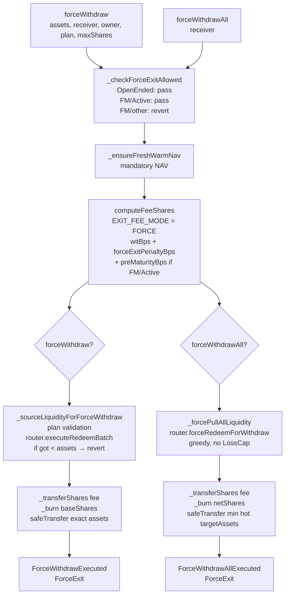

# Force Exit

> **Source of truth**: `src/core/modules/ERC4626Module.sol:166` (L62–L336) @ `c39f9462`
> **ADR-015 workflow applied**: full code read before drafting.

---

## 1. Overview

Force exit is the emergency withdrawal path. It allows a user to bypass the epoch cap, the lock period, and the queue — and retrieve assets immediately — at the cost of a higher fee.

Two functions implement force exit:

| Function | Entry point | Selector | Scope |
|----------|------------|----------|-------|
| `forceWithdraw(assets, receiver, owner, plan, maxShares)` | `ERC4626Module` | `0x0f0824be` | Exact asset amount, user-supplied liquidity plan |
| `forceWithdrawAll(receiver)` | `ERC4626Module` | — | All caller shares, auto-sourced liquidity |

Both paths:
- Bypass epoch cap (do NOT call `consumeEpochCap`)
- Bypass lock period
- Apply `witBps + forceExitPenaltyBps` fee
- In FixedMaturity/Active vaults, additionally apply `preMaturityForceExitPenaltyBps`

---

## 2. FixedMaturity Gate

Before any force exit can proceed, `_checkForceExitAllowed()` (`src/core/storage/FixedMaturityStorage.sol:111`) is called:

```solidity
function _checkForceExitAllowed() internal view {
    FixedMaturityStorage.Layout storage fm = FixedMaturityStorage.layout();
    if (fm.vaultMode == VaultMode.OpenEnded) return;  // fast path — always allowed

    // FixedMaturity mode: only Active state permits force exit
    if (fm.vaultState != VaultState.Active) revert ForceExitNotAllowed();
}
```

| Mode | State | Force exit allowed? |
|------|-------|---------------------|
| OpenEnded | any | **Yes** |
| FixedMaturity | Funding | No — `ForceExitNotAllowed` |
| FixedMaturity | Starting | No — `ForceExitNotAllowed` |
| FixedMaturity | **Active** | **Yes** — plus `preMaturityForceExitPenaltyBps` surcharge |
| FixedMaturity | Matured | No — `ForceExitNotAllowed` (use standard settle path) |
| FixedMaturity | Closed | No — `ForceExitNotAllowed` |
| FixedMaturity | FundingFailed | No — `ForceExitNotAllowed` |

OpenEnded vaults short-circuit the gate check with an early return — no storage reads for the FixedMaturity state machine.

---

## 2.1 Force exit call graph



---

## 3. forceWithdraw

### 3.1 Function signature

```solidity
// src/core/modules/ERC4626Module.sol:166
function forceWithdraw(
    uint256 assets,         // exact underlying amount to receive
    address receiver,       // who receives the underlying
    address owner_,         // whose shares are burned
    Pull[]  calldata plan,  // liquidity sourcing legs (max MAX_FORCE_LEGS=10)
    uint256 maxShares       // slippage cap: revert if sharesSpent > maxShares
) external nonReentrant;
```

`Pull` struct (`src/interfaces/IStrategyRouter.sol:42`):

```solidity
struct Pull {
    address strat;    // strategy address to redeem from
    uint256 amount;   // underlying amount to pull from this strategy
}
```

### 3.2 Execution flow

```
 1. _checkForceExitAllowed()
 2. _requireNotPaused()
 3. _ensureFreshWarmNav()        — mandatory NAV freshness (hard revert if stale + refresh fails)
 4. baseShares = _previewWithdraw(assets)    — convertToShares(assets)
 5. feeShares = mulBpsUp(baseShares, witBps + forceExitPenaltyBps [+ preMaturityBps])
 6. sharesSpent = baseShares + feeShares
 7. if sharesSpent > maxShares: revert SlippageExceeded()
 8. if caller != owner_: check ERC20 allowance caller → owner_; deduct allowance
 9. _checkWithdrawalLimitsForForce(assets)  — min asset check
10. _sourceLiquidityForForceWithdraw(assets, plan)
    → router.executeRedeemBatch(plan)       — router pulls from strategies
11. _transferShares(owner_, feeCollector, feeShares)
    → emit WithdrawFeeTaken(owner_, feeShares)
    → if penaltyAssets > 0: emit ForceExitPenaltyApplied(owner_, penaltyAssets)
12. _burn(owner_, baseShares)
13. token.safeTransfer(receiver, assets)    — exact amount
14. emit ForceWithdrawExecuted(owner_, assets, baseShares, feeShares)
    emit ForceExit(owner_, receiver, assets)
```

### 3.3 Liquidity sourcing

`_sourceLiquidityForForceWithdraw(assets, plan)` validates the plan and calls the strategy router:

```
MAX_FORCE_LEGS = 10 (src/core/modules/ERC4626Module.sol:74)

Validation:
  if plan.length > MAX_FORCE_LEGS: revert TooManyLegs()
  if plan.length == 0: revert EmptyPlan()

Execution:
  got = router.executeRedeemBatch(plan)
  if got < assets: revert InsufficientAssets(got, assets)
```

`router.executeRedeemBatch(Pull[])` (`IStrategyRouter.sol:L78`) is a privileged call — the vault (via router's CORE_ROLE) executes partial redeems from each named strategy. Each `Pull.amount` specifies how many underlying units to pull from `Pull.strat`. The router transfers assets directly to the vault.

The user is responsible for sizing the plan correctly. If the plan underestimates available liquidity per strategy, `executeRedeemBatch` may return `got < assets` and the call reverts. The user must re-simulate and re-submit.

### 3.3.1 _checkWithdrawalLimitsForForce

Before calling the router, `_checkWithdrawalLimitsForForce(assets)` validates the requested amount:

```
if assets == 0: revert ZeroAmount()
if assets < minForceWithdrawAssets: revert BelowMinimum()
```

`minForceWithdrawAssets` is a governance-configurable parameter (in `WithdrawalParams`). Setting it to 0 disables the minimum check.

The minimum serves as a griefing defense: without it, a user could submit 1 wei force withdrawals, triggering router calls at near-zero cost to the protocol.

### 3.4 Slippage protection

`maxShares` acts as a slippage cap. PPS can change between the user's simulation and the actual tx:

```
Simulation: PPS = 1.00 → baseShares = 10_000e18, feeShares = 250e18, total = 10_250e18
Tx arrives:  PPS = 1.02 → baseShares = 9_804e18, feeShares = 245e18, total = 10_049e18

Both pass if maxShares = 10_500e18  ← user sets generous slippage
Simulation reverts if maxShares = 10_100e18 and PPS moved unfavorably
```

Setting `maxShares = type(uint256).max` disables slippage protection — acceptable for trusted automation.

---

## 4. forceWithdrawAll

### 4.1 Function signature

```solidity
// src/core/modules/ERC4626Module.sol:257
function forceWithdrawAll(address receiver) external;
```

No plan or slippage parameter — `forceWithdrawAll` pulls all caller shares and sources liquidity automatically via the router.

### 4.2 Execution flow

```
 1. _checkForceExitAllowed()
 2. _requireNotPaused()
 3. _ensureFreshWarmNav()
 4. shares = balanceOf(msg.sender)         — ALL caller shares
 5. if shares == 0: revert ZeroShares()
 6. feeShares = mulBpsUp(shares, witBps + forceExitPenaltyBps [+ preMaturityBps])
 7. netShares  = shares - feeShares
 8. targetAssets = convertToAssets(netShares)
 9. _checkWithdrawalLimitsForForce(targetAssets)
10. _transferShares(msg.sender, feeCollector, feeShares)
    → emit WithdrawFeeTaken(msg.sender, feeShares)
11. _forcePullAllLiquidity(targetAssets)
    → router.forceRedeemForWithdraw(targetAssets)  — greedy, no LossCap
12. assetsReceived = min(IERC20(_asset()).balanceOf(vault), targetAssets)   // best-effort
13. _burn(msg.sender, netShares)
14. token.safeTransfer(receiver, assetsReceived)
15. emit ForceWithdrawAllExecuted(msg.sender, assetsReceived, shares, feeShares)
    emit ForceExit(msg.sender, receiver, assetsReceived)
```

Key difference from `forceWithdraw`:
- **No plan** — `router.forceRedeemForWithdraw` is greedy: it redeems as much as possible from all strategies, up to `targetAssets`
- **Best-effort**: `assetsReceived = min(hot, targetAssets)` — user receives what the vault could source; no revert if `assetsReceived < targetAssets`
- **No LossCap**: `forceRedeemForWithdraw` ignores per-strategy loss caps (`IStrategyRouter.sol:L80–L81`)

### 4.3 Best-effort vs exact

| | `forceWithdraw` | `forceWithdrawAll` |
|--|-----------------|-------------------|
| Asset amount | **Exact** — reverts if plan cannot deliver | **Best-effort** — user receives what vault has |
| Plan | User-supplied, up to 10 legs | Auto via `forceRedeemForWithdraw` |
| LossCap | Respected by `executeRedeemBatch` | Bypassed by `forceRedeemForWithdraw` |
| Slippage protection | `maxShares` parameter | None |
| Appropriate for | Precisely controlled exit | Full emergency exit |

---

## 5. Pre-maturity Penalty

In FixedMaturity/Active vaults, force exits carry an extra surcharge (`preMaturityForceExitPenaltyBps`) to discourage early exit before the vault reaches maturity.

Fee computation in `ExitFeeLib.computeExitFee` with FM/Active:

```
totalForceBps = witBps + forceExitPenaltyBps + preMaturityForceExitPenaltyBps

Example: witBps=50, forceExitPenaltyBps=200, preMaturityBps=500
  totalForceBps = 750 bps (7.5%)
  User exiting 100_000 USDC:
    netAssets ≈ 92_500 USDC (7.5% fee)
```

`preMaturityForceExitPenaltyBps` is stored in `FixedMaturityStorage.Layout.preMaturityForceExitPenaltyBps` and is zero for OpenEnded vaults and zero after maturity.

---

## 6. Invariants

| ID | Invariant | Enforcement |
|----|-----------|-------------|
| **FX1** | FORCE exits do not consume the epoch cap | `consumeEpochCap` is absent from both force functions |
| **FX2** | FORCE exits bypass the lock period | No `lastDepositTs` check in `forceWithdraw` or `forceWithdrawAll` |
| **FX3** | Fee shares transferred, not minted | `_transferShares(owner_, feeCollector, feeShares)` |
| **FX4** | `forceWithdraw` delivers exact `assets` or reverts | `if got < assets: revert InsufficientAssets(got, assets)` |
| **FX5** | `forceWithdrawAll` cannot over-pay (never sends > `targetAssets`) | `min(hot, targetAssets)` ensures no overshoot |
| **FX6** | FORCE exits only permitted in OpenEnded or FixedMaturity/Active | `_checkForceExitAllowed()` guard |
| **FX7** | `plan.length ≤ MAX_FORCE_LEGS (10)` | `_sourceLiquidityForForceWithdraw` validation |

---

## 7. Threat Model

| Threat | Mitigation |
|--------|-----------|
| **Force exit griefing** (repeatedly forcing small exits to drain router) | `_checkWithdrawalLimitsForForce` minimum assets check; fee cost makes griefing economically unattractive |
| **Pre-maturity insider exit** | `preMaturityForceExitPenaltyBps` surcharge; governance-set value discourages routine pre-maturity force exits |
| **Plan manipulation** (user provides plan that extracts > assets) | `executeRedeemBatch` transfers exact amounts per leg; the router enforces that `got == plan total` |
| **PPS manipulation between simulate and tx** | `maxShares` slippage cap; `_ensureFreshWarmNav()` mandatory NAV refresh before computation |
| **Reentrancy during USDC transfer** | `nonReentrant` modifier (`_enterNonReentrant` / `_exitNonReentrant`) on both force functions |

---

## 8. Events

| Event | When |
|-------|------|
| `WithdrawFeeTaken(user, feeShares)` | Fee transfer in both force functions |
| `ForceExitPenaltyApplied(user, penaltyAssets)` | When penalty > 0 (penaltyAssets = gross × penaltyBps) |
| `ForceWithdrawExecuted(user, assets, baseShares, feeShares)` | `forceWithdraw` completion |
| `ForceWithdrawAllExecuted(user, assetsReceived, allShares, feeShares)` | `forceWithdrawAll` completion |
| `ForceExit(owner, receiver, assets)` | Both force paths |

---

## 8.1 Vault state flow relevant to force exit

```mermaid
stateDiagram-v2
    direction LR
    [*] --> OpenEnded: deploy(OpenEnded)
    [*] --> Funding: deploy(FixedMaturity)

    Funding --> Starting: target reached
    Starting --> Active: admin transition
    Active --> Matured: maturity date passed
    Matured --> Closed: admin transition
    Funding --> FundingFailed: deadline with no target

    note right of OpenEnded: FORCE EXIT: always allowed
    note right of Active: FORCE EXIT: allowed\n+ preMaturityForceExitPenaltyBps
    note right of Funding: FORCE EXIT: revert
    note right of Starting: FORCE EXIT: revert
    note right of Matured: FORCE EXIT: revert\n(use standard settle)
    note right of Closed: FORCE EXIT: revert
    note right of FundingFailed: FORCE EXIT: revert
```

---

## 9. Examples

### 9.1 forceWithdraw: single-strategy plan

```
Vault: OpenEnded, witBps=50, forceExitPenaltyBps=200, PPS=1.00
User: forceWithdraw(10_000e6, alice, alice, [Pull{strat=0xAave, amount=10_000e6}], maxShares=11_000e18)

  baseShares = convertToShares(10_000e6) = 10_000e18
  feeShares  = mulBpsUp(10_000e18, 250) = 250e18
  sharesSpent = 10_250e18 <= maxShares ✓

  executeRedeemBatch([Pull{Aave, 10_000e6}]) → got=10_000e6 ✓
  _transferShares(alice, feeCollector, 250e18)
  _burn(alice, 10_000e18)
  safeTransfer(alice, 10_000e6)
```

### 9.2 forceWithdrawAll: emergency full exit

```
User holds 5_000e18 shares; PPS=1.01; witBps=50; forceExitPenaltyBps=300

  feeShares = mulBpsUp(5_000e18, 350) = 175e18
  netShares = 4_825e18
  targetAssets = convertToAssets(4_825e18) = 4_825e18 × 1.01 / 1e18 ≈ 4_873_250e6

  forceRedeemForWithdraw(4_873_250e6):
    Strategy returns 4_850_000e6 (slight slippage — strategy at capacity)
  
  assetsReceived = min(vault.hot=4_850_000e6, target=4_873_250e6) = 4_850_000e6
  _burn(alice, 4_825e18)
  safeTransfer(alice, 4_850_000e6)   // slightly less than target — accepted
```

### 9.3 FixedMaturity/Active force exit with pre-maturity penalty

```
Vault: FixedMaturity, state=Active
  witBps=50, forceExitPenaltyBps=200, preMaturityForceExitPenaltyBps=500
  PPS = 1.05 USDC/share

User: forceWithdraw(50_000e6, alice, alice, [Pull{strat=Euler, 50_000e6}], maxShares=55_000e18)

Step 1: _checkForceExitAllowed()
  → vaultMode=FixedMaturity, vaultState=Active → allowed ✓
  → preMaturityBps = 500 (penalty for exiting before maturity)

Step 2-3: pause + ensureFreshWarmNav ✓

Step 4: baseShares = convertToShares(50_000e6) = 50_000e6 / 1.05 ≈ 47_619e18

Step 5: combined = witBps(50) + forceExitPenaltyBps(200) + preMaturityBps(500) = 750 bps
        feeShares = mulBpsUp(47_619e18, 750) ≈ 3_572e18

Step 6: sharesSpent = 47_619e18 + 3_572e18 = 51_191e18 <= maxShares=55_000e18 ✓

Step 7-9: plan validation, executeRedeemBatch([{Euler, 50_000e6}])
  → Euler returns 50_000e6 to vault ✓

Step 10: _transferShares(alice, feeCollector, 3_572e18)
  Fee breakdown:
    withdrawFee  = 50_000e6 × 50/10000   = 250 USDC
    forceExitFee = 50_000e6 × 200/10000  = 1_000 USDC
    preMaturity  = 50_000e6 × 500/10000  = 2_500 USDC
    totalFee     ≈ 3_750 USDC → alice receives 46_250 USDC equivalent
  emit ForceExitPenaltyApplied(alice, 3_500 USDC)  // penalty portion

Step 11: _burn(alice, 47_619e18)
Step 12: safeTransfer(alice, 50_000e6)
  NOTE: alice burns ~47_619 shares to receive exactly 50_000 USDC
        feeCollector receives 3_572 shares ≈ 3_750 USDC value
        Total cost to alice: 3_750 USDC in fees (7.5% of exit value)
```

### 9.4 Interaction with delegation (owner != caller)

```
Owner: alice, Delegate: bob (authorized via ERC20 approve)

alice: approve(bob, 10_250e18)   // approve bob to spend 10_250 alice-shares

bob:   forceWithdraw(
         assets=10_000e6,
         receiver=alice,         // alice receives the USDC
         owner_=alice,           // alice's shares are burned
         plan=[Pull{Morpho, 10_000e6}],
         maxShares=11_000e18
       )

Step 8: caller(bob) != owner_(alice)
  → check allowance: alice → bob = 10_250e18 >= sharesSpent=10_250e18 ✓
  → deduct allowance: alice → bob = 0
  → _transferShares(alice, feeCollector, feeShares)
  → _burn(alice, baseShares)
  → safeTransfer(alice, 10_000e6)
```

---

## 10. Glossary

| Term | Definition |
|------|-----------|
| **FORCE** | Exit mode that bypasses epoch cap and lock period |
| **forceWithdraw** | Exact-amount FORCE exit with user-supplied `Pull[]` liquidity plan |
| **forceWithdrawAll** | Best-effort FORCE exit burning all caller shares |
| **Pull** | `{address strat, uint256 amount}` — one leg of a liquidity sourcing plan |
| **MAX_FORCE_LEGS** | 10 — maximum legs in a `Pull[]` plan |
| **preMaturityForceExitPenaltyBps** | Additive surcharge for FixedMaturity/Active FORCE exits |
| **best-effort** | `forceWithdrawAll` accepts `assetsReceived < targetAssets` without reverting |
| **LossCap** | Per-strategy loss tolerance enforced by `executeRedeemBatch` but bypassed by `forceRedeemForWithdraw` |
| **`_checkForceExitAllowed`** | Gate function in `FixedMaturityStorage` — allows OpenEnded or FM/Active only |
| **maxShares** | Slippage cap for `forceWithdraw`: reverts if `sharesSpent > maxShares` |

---

## Appendix: Code Reference Index

| Function | File | Line |
|----------|------|-------------|
| `forceWithdraw` | `src/core/modules/ERC4626Module.sol:166` | L100 |
| `forceWithdrawAll` | `src/core/modules/ERC4626Module.sol:257` | L220 |
| `_sourceLiquidityForForceWithdraw` | `src/core/modules/ERC4626Module.sol:396` | L260 |
| `_forcePullAllLiquidity` | `src/core/modules/ERC4626Module.sol:343` | L295 |
| `_checkWithdrawalLimitsForForce` | `src/core/modules/ERC4626Module.sol:370` | L255 |
| `MAX_FORCE_LEGS` constant | `src/core/modules/ERC4626Module.sol:74` | L65 |
| `_checkForceExitAllowed` | `src/core/storage/FixedMaturityStorage.sol:111` | L105 |
| `preMaturityForceExitPenaltyBps` | `src/core/storage/FixedMaturityStorage.sol:47` | L80 |
| `VaultMode` enum | `src/core/storage/FixedMaturityStorage.sol:11` | L10 |
| `VaultState` enum | `src/core/storage/FixedMaturityStorage.sol:16` | L18 |
| `computeExitFee` (FORCE path) | `src/core/libraries/ExitFeeLib.sol:29` | L20 |
| `computeFeeShares` (FORCE mode) | `src/core/libraries/ExitEngineLib.sol:151` | L155 |
| `InternalFeeParams.forceExitPenaltyBps` | `src/core/storage/FeeStorage.sol:16` | L26 |
| `Pull` struct | `src/interfaces/IStrategyRouter.sol:42` | 42 |
| `executeRedeemBatch` | `src/interfaces/IStrategyRouter.sol:78` | 78 |
| `forceRedeemForWithdraw` | `src/interfaces/IStrategyRouter.sol:81` | 81 |

---

## Footer

**Source commit**: `c39f9462` (branch `reorg/runbook-docs-consolidate-01a.2`)

**Authoritative files read** (ADR-015 §2 workflow):

| File | Lines | Notes |
|------|-------|-------|
| `src/core/modules/ERC4626Module.sol:166` | L62–L336 | Force section — full read |
| `src/core/storage/FixedMaturityStorage.sol:111` | 123 | Full read — `_checkForceExitAllowed`, `preMaturityForceExitPenaltyBps` |
| `src/interfaces/IStrategyRouter.sol:42` | partial | `Pull` struct, `executeRedeemBatch`, `forceRedeemForWithdraw` |
| `src/core/libraries/ExitFeeLib.sol:29` | 77 | Full read — `computeExitFee` FORCE path |
| `src/core/storage/FeeStorage.sol:16` | 79 | Full read — `forceExitPenaltyBps` |

**Discrepancies** (ADR-015 §5):

1. `forceWithdrawAll` step 12 uses `min(IERC20(_asset()).balanceOf(vault), targetAssets)` as `assetsReceived`. This means the user may receive less than `targetAssets` if the router cannot fully source the required liquidity. This behavior is documented and intentional ("best-effort"), but callers should verify `assetsReceived` in the emitted `ForceWithdrawAllExecuted` event rather than assuming `targetAssets` was fully delivered.

2. The `_sourceLiquidityForForceWithdraw` function validates `plan.length > 0` and `plan.length <= MAX_FORCE_LEGS`. However, it does not validate that `sum(plan[i].amount) >= assets`. A plan that provides insufficient liquidity will cause `executeRedeemBatch` to return `got < assets`, triggering `InsufficientAssets`. Users must pre-simulate to size plans correctly.
