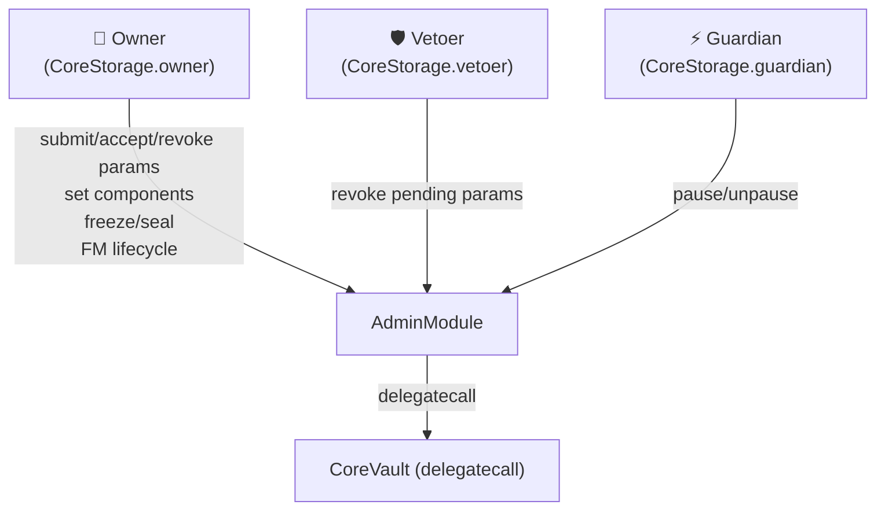
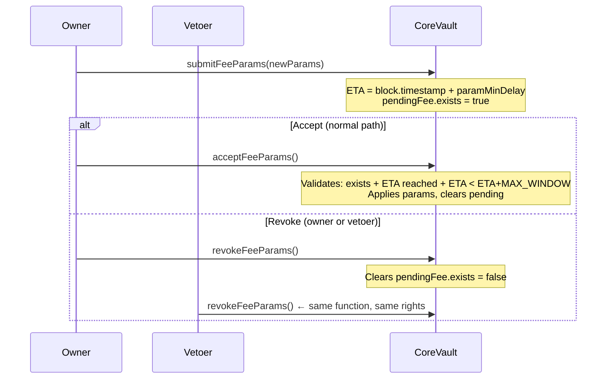
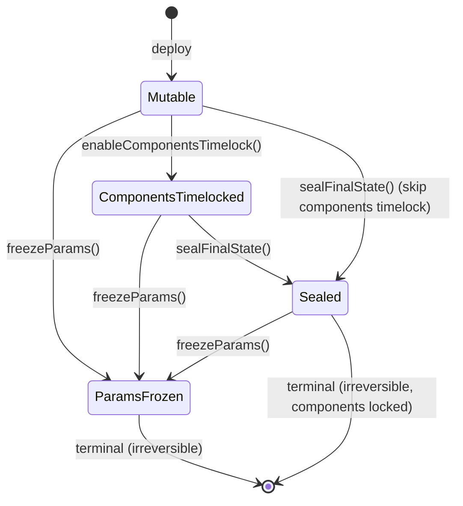
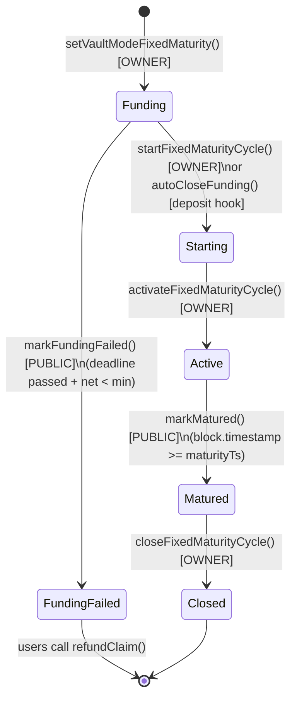

# governance.md — Multyr Core: Governance & Owner Model

**Version**: 1.0.0 | **Branch**: reorg/runbook-docs-consolidate-01a.3 | **Commit**: see footer

---

## Table of Contents

1. [Overview](#1-overview)
2. [Owner Model](#2-owner-model)
3. [Timelock Workflow](#3-timelock-workflow)
4. [Pause & Freeze](#4-pause--freeze)
5. [FixedMaturity Lifecycle Governance](#5-fixedmaturity-lifecycle-governance)
6. [Bootstrap Lifecycle](#6-bootstrap-lifecycle)
7. [Invariants](#7-invariants)
8. [Events](#8-events)
9. [Threat Model](#9-threat-model)
10. [Examples](#10-examples)
11. [Edge Cases](#11-edge-cases)
12. [Glossary](#12-glossary)

---

## 1. Overview

Multyr Core uses a **single-owner governance model** with no on-chain DAO, no multi-sig requirement at the contract level, and no proposal/vote mechanism. All privileged actions are executed directly by the owner EOA or contract, subject to timelocks and veto rights where applicable.

Three privileged principals exist:

| Principal | Field | Role |
|-----------|-------|------|
| Owner | `CoreStorage.Layout.owner` | Full governance authority |
| Vetoer | `CoreStorage.Layout.vetoer` | Revoke pending parameter changes |
| Guardian | `CoreStorage.Layout.guardian` | Emergency pause (deposits/withdrawals/all) |

The access control dispatch is per-function: `CoreStorage.Layout.roleOf[selector]` maps each function selector to one of four access levels (0=PUBLIC, 1=OWNER, 2=GUARDIAN, 3=OWNER_OR_GUARDIAN). See `src/core/storage/CoreStorage.sol:38`.



**Design rationale**: Simplicity over ceremony. The timelock window and veto mechanism provide a recourse interval without requiring a DAO or multi-sig. The guardian provides a fast circuit breaker without requiring owner action.

---

## 2. Owner Model

### 2.1 Owner Capabilities

The owner (role 1 = `OWNER`) has authority over:

- All parameter timelock submissions and acceptances (`submitFeeParams`, `acceptFeeParams`, `submitPerfParams`, `acceptPerfParams`, `submitMinDelay`, `acceptMinDelay`)
- Component assignments (`setParams`, `setBufferManager`, `setRouter`, `setHealthRegistry`, `setIncentives`, `setIncentivesEngine`, `setRewardsPayoutManager`, `setRebalancePolicy`, `setRebalanceGuard`, `setExecutionMemory`, `setStrictExecutionMemory`, `setFeeCollector`, `setVetoer`)
- Bootstrap one-shots (`setInitialFees`, `setInitialPerfParams`, `seedDeadDeposit`)
- Irreversible state transitions (`freezeParams`, `enableComponentsTimelock`, `sealFinalState`)
- FixedMaturity lifecycle (`setVaultModeFixedMaturity`, `configureFixedMaturity`, `startFixedMaturityCycle`, `activateFixedMaturityCycle`, `closeFixedMaturityCycle`)
- Ecosystem batch init (`setEcosystem`)

See `src/core/modules/AdminModule.sol:73` for the full function list.

### 2.2 Two-Step Ownership Transfer

Ownership transfer is a two-step process stored in `CoreStorage.Layout`:

```
owner transfers → pendingOwner
pendingOwner calls acceptOwnership() → owner = pendingOwner, pendingOwner = 0
```

| Step | Function | Who | Effect |
|------|----------|-----|--------|
| 1 | `transferOwnership(newOwner)` | current owner | Sets `pendingOwner` |
| 2 | `acceptOwnership()` | `pendingOwner` | Promotes to `owner`, clears `pendingOwner` |

**Source**: `src/core/storage/CoreStorage.sol:48` (`owner`, `pendingOwner` fields).

The active vault uses `CoreStorage.owner`/`CoreStorage.pendingOwner` directly. `src/core/mixins/Ownable2StepMixin.sol:12` (pragma 0.8.24) is a **legacy mixin** wrapping OpenZeppelin's `Ownable2Step` — it is NOT imported by any active module.

### 2.3 Vetoer

The vetoer is a separate address with no positive governance powers. Its sole capability is to call `revokeFeeParams()`, `revokePerfParams()`, or `revokeMinDelay()` — the same revoke functions available to the owner. This allows a designated security address to cancel suspicious parameter changes without waiting for the owner.

```solidity
// AdminModule.sol — revoke access check
if (msg.sender != core.owner && msg.sender != core.vetoer) revert NotOwnerOrVetoer();
```

See `src/core/modules/AdminModule.sol:141` for the revoke functions.

### 2.4 Guardian

The guardian (`CoreStorage.Layout.guardian`) is a third privileged address with a narrow remit: emergency pause. The guardian can:

- Call `pause()` / `unpause()` — set/clear `FLAG_PAUSED`
- Call `pauseDeposits()` / `unpauseDeposits()` — set/clear `FLAG_PAUSED_DEPOSITS`
- Call `pauseWithdrawals()` — set `FLAG_PAUSED_WITHDRAWALS` (but NOT `unpauseWithdrawals()`)

The asymmetry in withdrawals (pause yes, unpause no) is intentional: a compromised guardian can halt withdrawals temporarily but cannot unilaterally lift the hold. The owner must call `unpauseWithdrawals()`.

`CoreStorage.Layout.lastGuardianPause` is updated each time the guardian pauses to enable off-chain monitoring.

### 2.5 Component Governance

Beyond parameter timelocks, the owner controls a set of component addresses used by the vault:

| Component | Setter | Gated by | Description |
|-----------|--------|----------|-------------|
| `params` | `setParams` | — | IParamsProvider (no timelock) |
| `bufferManager` | `setBufferManager` | `FLAG_COMPONENTS_TIMELOCKED` | Buffer/reserve manager |
| `router` | `setRouter` | `FLAG_COMPONENTS_TIMELOCKED` | Strategy router |
| `healthRegistry` | `setHealthRegistry` | — | Strategy health registry |
| `incentives` | `setIncentives` | — | Incentives contract |
| `incentivesEngine` | `setIncentivesEngine` | — | Incentives engine |
| `rewardsPayoutManager` | `setRewardsPayoutManager` | — | Rewards manager |
| `rebalancePolicy` | `setRebalancePolicy` | — | V10 rebalance policy |
| `rebalanceGuard` | `setRebalanceGuard` | — | V10 rebalance guard |
| `executionMemory` | `setExecutionMemory` | — | Execution memory recorder |
| `strictExecutionMemory` | `setStrictExecutionMemory` | — | Bool: strict vs best-effort |
| `feeCollector` | `setFeeCollector` | — | Fee recipient address |
| `vetoer` | `setVetoer` | — | Update vetoer address |

Components without a timelock gate are immediately effective. After `enableComponentsTimelock()` sets `FLAG_COMPONENTS_TIMELOCKED`, only `setBufferManager` and `setRouter` gain the timelock requirement. All other component setters remain immediate even after this flag.

---

## 3. Timelock Workflow

### 3.1 Overview

Sensitive parameter changes follow a **submit → wait → accept** pattern. A pending change can be **revoked** at any time by the owner or vetoer before acceptance. The vetoer exists precisely for this revoke path.



### 3.2 Timelock Categories

Six parameter categories are subject to timelocks:

| Category | Submit | Accept | Revoke | Storage |
|----------|--------|--------|--------|---------|
| Fee params | `submitFeeParams` | `acceptFeeParams` | `revokeFeeParams` | `FeeStorage.Layout.pendingFee` |
| Perf params | `submitPerfParams` | `acceptPerfParams` | `revokePerfParams` | `FeeStorage.Layout.pendingPerf` |
| Min delay | `submitMinDelay` | `acceptMinDelay` | `revokeMinDelay` | `CoreStorage.Layout` |
| Buffer manager | `submitBufferManager` | `acceptBufferManager` | `revokeBufferManager` | Component change |
| Router | `submitRouter` | `acceptRouter` | `revokeRouter` | Component change |

> Note: `submitBufferManager` and `submitRouter` are only available after `enableComponentsTimelock()` is called. Before that flag, `setBufferManager` and `setRouter` are immediate (no timelock).

### 3.3 Timing Constants

| Constant | Value | Description |
|----------|-------|-------------|
| `MAX_WINDOW` | 7 days | Acceptance window after ETA; expired pending → must resubmit |
| `paramMinDelay` | configured at deploy | Minimum delay before acceptance; stored in `CoreStorage.Layout.paramMinDelay` |
| Post-seal floor | 1 day | After `FLAG_SYSTEM_SEALED`: `submitMinDelay` requires `newDelay >= 1 days` (H3) |

### 3.4 Validation on Accept

`_validateEta` (internal helper in `AdminModule`) enforces three conditions:

```
1. pending.exists == true           → else: NotPending()
2. block.timestamp >= eta           → else: EtaNotReached()
3. block.timestamp <= eta + MAX_WINDOW → else: EtaExpired()
```

See `src/core/modules/AdminModule.sol:812` for `_validateEta`.

### 3.5 H4 — No Overwrite of Pending Params

A second `submitFeeParams` while `pendingFee.exists == true` reverts with `PendingParamsNotResolved()`. The owner must first revoke before resubmitting:

```
submit → (want to change again) → revoke → submit new
```

This prevents accidental race between two parameter windows.

### 3.6 `paramMinDelay` Configuration

`paramMinDelay` is stored in `CoreStorage.Layout.paramMinDelay` (uint64, seconds). It is set at bootstrap via `setInitialFees` or a specific setter, and can be updated via the `submitMinDelay`/`acceptMinDelay` timelock path.

There is a notable **bootstrapping asymmetry**: the initial value of `paramMinDelay` controls the delay for all subsequent param changes — including changes to `paramMinDelay` itself. Setting a very short initial delay is dangerous: an attacker with owner access could immediately reduce the delay further, making all future timelocks ineffective.

Best practice: set `paramMinDelay >= 2 days` before calling `sealFinalState()`. The seal enforces a floor of `1 day` for future `submitMinDelay` calls (H3), but does not retroactively raise a too-short existing delay.

### 3.7 `setEcosystem` — Batch Init

`setEcosystem(EcosystemConfig cfg)` is a convenience function that sets multiple components in one transaction during initial deployment:

- Requires `cfg.bufferManager != address(0)`, `cfg.strategyRouter != address(0)`, `cfg.guardian != address(0)`
- Sets: `bufferManager`, `router`, `guardian`, `healthRegistry`, `incentives`, `feeCollector` (if non-zero in config)
- Emits individual events for each component set

This function is subject to the same access control as individual component setters (OWNER). After `enableComponentsTimelock()`, setting `bufferManager` and `router` via `setEcosystem` would violate the timelock gate — deployment scripts must call `setEcosystem` before enabling the components timelock.

**Source**: `src/core/modules/AdminModule.sol:73`.

---

## 4. Pause & Freeze

### 4.1 Flag Architecture

Pause and freeze state are encoded as bit flags in `CoreStorage.Layout.packedFlags` (uint256). Relevant flags:

| Flag | Bit | Effect |
|------|-----|--------|
| `FLAG_PAUSED` | 0 | All user-facing operations blocked |
| `FLAG_PAUSED_DEPOSITS` | 1 | Deposits only blocked |
| `FLAG_PAUSED_WITHDRAWALS` | 2 | Withdrawals/claims only blocked |
| `FLAG_PARAMS_FROZEN` | 3 | All timelocked param changes permanently blocked |
| `FLAG_SYSTEM_SEALED` | 9 | Component changes permanently blocked; min delay floor active |

See `src/core/storage/CoreStorage.sol:24` for the full flag constant list.

### 4.2 Pause Functions

| Function | Who | Effect |
|----------|-----|--------|
| `pause()` | GUARDIAN or OWNER | Sets `FLAG_PAUSED` |
| `unpause()` | GUARDIAN or OWNER | Clears `FLAG_PAUSED` |
| `pauseDeposits()` | GUARDIAN or OWNER | Sets `FLAG_PAUSED_DEPOSITS` |
| `unpauseDeposits()` | OWNER | Clears `FLAG_PAUSED_DEPOSITS` |
| `pauseWithdrawals()` | GUARDIAN or OWNER | Sets `FLAG_PAUSED_WITHDRAWALS` |
| `unpauseWithdrawals()` | OWNER | Clears `FLAG_PAUSED_WITHDRAWALS` |

The guardian can pause quickly via any pause function. Unpausing withdrawals requires the owner (higher trust level — cannot be panic-unpaused unilaterally).

**`CoreStorage.Layout.lastGuardianPause`** records the timestamp of the last guardian pause for audit trails.

### 4.3 `_requireNotPaused` and `_requireNotFrozen`

```solidity
// AdminModule.sol
function _requireNotPaused() internal view {
    if (CoreStorage.layout().packedFlags & CoreStorage.FLAG_PAUSED != 0) revert Paused();
}

function _requireNotFrozen() internal view {
    if (CoreStorage.layout().packedFlags & CoreStorage.FLAG_PARAMS_FROZEN != 0) revert ParamsFrozen();
}
```

`_requireNotPaused` guards all user operations (deposit, withdraw, requestClaim). `_requireNotFrozen` guards all timelocked parameter submissions.

### 4.4 freezeParams — Permanent Lock

`freezeParams()` sets `FLAG_PARAMS_FROZEN` permanently. After this call:

- All `submitFeeParams`, `submitPerfParams`, `submitMinDelay`, etc. revert with `ParamsFrozen()`
- Existing pending params can still be accepted (ETA already computed, window still open)
- **Irreversible** — there is no `unfreezeParams()`

Use case: post-audit immutability commitment. The fee/perf structure is locked forever.

### 4.5 sealFinalState (FLAG_SYSTEM_SEALED)

`sealFinalState()` sets `FLAG_SYSTEM_SEALED` permanently:

- `setBufferManager`, `setRouter` revert with `SystemSealed()` (even without `enableComponentsTimelock`)
- `submitMinDelay` requires `newDelay >= 1 days` (prevents setting delay to 0 after seal — H3)
- Does NOT block param timelocks (that is `freezeParams`)
- **Irreversible**



---

## 5. FixedMaturity Lifecycle Governance

### 5.1 State Machine



### 5.2 Who Can Trigger Each Transition

| Transition | Function | Access | Condition |
|-----------|----------|--------|-----------|
| Configure FM vault | `setVaultModeFixedMaturity()` | OWNER | Any time before `Starting` |
| Set FM parameters | `configureFixedMaturity(...)` | OWNER | `Funding` or `Starting` state |
| Start funding → starting | `startFixedMaturityCycle()` | OWNER | Target reached OR manual override |
| Auto-start (deposit hook) | `autoCloseFunding()` | INTERNAL | Called by ERC4626Module on deposit when target reached |
| Activate → deploy capital | `activateFixedMaturityCycle()` | OWNER | `Starting` state; deploys `fixedTermCommittedAssets` via router |
| Mark matured | `markMatured()` | PUBLIC (permissionless) | `block.timestamp >= maturityTs` |
| Mark funding failed | `markFundingFailed()` | PUBLIC (permissionless) | `deadline passed + netAssets < minFundingTarget` |
| Close | `closeFixedMaturityCycle()` | OWNER | `Matured` state; recalls capital, applies final perf fee |
| Recall capital (mid-cycle) | `recallFixedTermCapital()` | PUBLIC | `Matured` state |
| Refund (funding failed) | `refundClaim(shares)` | PUBLIC | `FundingFailed` state; zero fees; snapshot PPS |

**Source**: `src/core/modules/FixedMaturityModule.sol:52`.

### 5.3 Key Constraint

`configureFixedMaturity` enforces `preMaturityForceExitPenaltyBps_ <= 5_000` (max 50%). This is validated at config time, not at withdrawal time. See `src/core/modules/FixedMaturityModule.sol:64` for the revert.

---

## 6. Bootstrap Lifecycle

During initial deployment, certain one-shot operations must be called before `sealFinalState()`:

| Step | Function | Flag set | Effect |
|------|----------|----------|--------|
| 1 | `setInitialFees(...)` | `FLAG_FEES_INITIALIZED` | Sets FeeStorage params without timelock. One-shot: reverts if already initialized. |
| 2 | `setInitialPerfParams(...)` | `FLAG_PERF_INITIALIZED` | Sets FeeStorage perf params without timelock. One-shot. |
| 3 | `seedDeadDeposit(assets)` | `FLAG_DEAD_DEPOSIT_DONE` | Mints shares to `0xdEaD`. Inflation attack hardening. One-shot, pre-seal. |
| 4 | `enableComponentsTimelock()` | `FLAG_COMPONENTS_TIMELOCKED` | After this, `setBufferManager`/`setRouter` require timelock submit/accept. |
| 5 | `sealFinalState()` | `FLAG_SYSTEM_SEALED` | Locks component changes permanently. |

All one-shot functions revert with a dedicated error if called a second time (checked via their flag bit). `setInitialFees` and `setInitialPerfParams` additionally require `FLAG_SYSTEM_SEALED == 0` (must be called pre-seal).

**Source**: `src/core/modules/AdminModule.sol:432` — one-shot guard checks via `packedFlags`.

---

## 7. Invariants

| ID | Invariant | Source |
|----|-----------|--------|
| G1 | `FLAG_PARAMS_FROZEN` is monotone: once set, never cleared | `AdminModule.freezeParams()` |
| G2 | `FLAG_SYSTEM_SEALED` is monotone: once set, never cleared | `AdminModule.sealFinalState()` |
| G3 | At most one pending fee param set exists at any time (H4) | `AdminModule:PendingParamsNotResolved()` |
| G4 | After seal, `submitMinDelay` requires `newDelay >= 1 days` (H3) | `AdminModule:MinDelayTooShort()` |
| G5 | `acceptFeeParams` only succeeds within `[ETA, ETA + MAX_WINDOW]` | `AdminModule:_validateEta()` |
| G6 | `seedDeadDeposit` mints to `0xdEaD` only once, pre-seal | `AdminModule:FLAG_DEAD_DEPOSIT_DONE` |
| G7 | Owner transfer requires explicit two-step acceptance by `pendingOwner` | `CoreStorage.owner`, `pendingOwner` |
| G8 | `setBufferManager`/`setRouter` require timelock after `FLAG_COMPONENTS_TIMELOCKED` | `AdminModule:ComponentsTimelocked()` |
| G9 | FixedMaturity state transitions are monotone (no backward transitions) | `FixedMaturityModule` state checks |
| G10 | `refundClaim` applies zero fees in `FundingFailed` state | `FixedMaturityModule.refundClaim()` |

---

## 8. Events

| Event | When emitted | Key parameters |
|-------|-------------|----------------|
| `FeeParamsSubmitted` | `submitFeeParams` | `eta`, `pendingParams` |
| `FeeParamsAccepted` | `acceptFeeParams` | applied params |
| `FeeParamsRevoked` | `revokeFeeParams` | — |
| `PerfParamsSubmitted` | `submitPerfParams` | `eta` |
| `PerfParamsAccepted` | `acceptPerfParams` | applied params |
| `PerfParamsRevoked` | `revokePerfParams` | — |
| `MinDelaySubmitted` | `submitMinDelay` | `eta`, `newDelay` |
| `MinDelayAccepted` | `acceptMinDelay` | `newDelay` |
| `MinDelayRevoked` | `revokeMinDelay` | — |
| `Paused` | `pause()` | — |
| `Unpaused` | `unpause()` | — |
| `ParamsFrozen` | `freezeParams()` | — |
| `SystemSealed` | `sealFinalState()` | — |
| `OwnershipTransferStarted` | `transferOwnership` | `newOwner` |
| `OwnershipTransferred` | `acceptOwnership` | `previousOwner`, `newOwner` |
| `FixedMaturityStateTransition` | FM state changes | `from`, `to` |
| `FundingFailed` | `markFundingFailed()` | vault state |
| `ComponentsTimelocked` | `enableComponentsTimelock()` | — |

**Source**: `src/core/modules/AdminModule.sol:432`, `src/core/modules/FixedMaturityModule.sol:52`.

---

## 9. Threat Model

### 9.1 Owner Key Compromise

**Risk**: Owner key compromised — attacker submits malicious fee params.
**Mitigation**: Timelock delay (`paramMinDelay`) gives the vetoer a window to call `revokeFeeParams()`. The vetoer should be a separate, more secure key (cold wallet, HSM, or multi-sig). After `freezeParams()`, fee params are immutable regardless of owner compromise.

### 9.2 Vetoer Liveness Failure

**Risk**: Vetoer key lost/unavailable — malicious param change cannot be revoked.
**Mitigation**: Owner can also call revoke functions. After `FLAG_SYSTEM_SEALED`, the `submitMinDelay` floor (`>= 1 day`) prevents an attacker from shortening the delay to zero in a single step. However, if both owner and vetoer are compromised, the full timelock mechanism is bypassed — the vetoer is not a 2-of-2 requirement.

### 9.3 Guardian Panic Abuse

**Risk**: Guardian pauses withdrawals to trap user funds.
**Mitigation**: Unpausing withdrawals requires the owner, not the guardian. Guardian can cause short-term disruption but cannot permanently trap funds. `lastGuardianPause` is logged for audit.

### 9.4 Bootstrap Sequence Error

**Risk**: `sealFinalState()` called before `seedDeadDeposit()` — inflation attack window open.
**Mitigation**: `seedDeadDeposit` requires `FLAG_SYSTEM_SEALED == 0`. If seal is applied first, dead deposit can never be seeded. Deployment scripts must respect the bootstrap order (§6). This is a deployment-time risk, not a runtime one.

### 9.5 FixedMaturity Maturity Timestamp

**Risk**: Owner sets `maturityTs` far in the future, locking user capital indefinitely.
**Mitigation**: `markMatured()` is permissionless and callable by anyone once `block.timestamp >= maturityTs`. Users can observe `maturityTs` on-chain before entering a FixedMaturity vault. `preMaturityForceExitPenaltyBps <= 5000` (50%) provides a capped early exit route.

---

## 10. Examples

### 10.1 Normal Fee Update Cycle

```
Day 0: owner calls submitFeeParams({withdrawalFeeBps: 50, ...})
       ETA = block.timestamp + paramMinDelay (e.g., 2 days)
       pendingFee.exists = true

Day 2+: owner calls acceptFeeParams()
        _validateEta passes: exists ✓, ETA reached ✓, within MAX_WINDOW ✓
        New fee params applied immediately
        pendingFee.exists = false

Constraint: cannot submit a second pending fee change until the first is resolved
```

### 10.2 Vetoer Cancels Suspicious Change

```
Day 0: owner submits submitFeeParams({withdrawalFeeBps: 500})  ← suspicious 5%
       ETA = block.timestamp + paramMinDelay

Day 1: vetoer notices and calls revokeFeeParams()
       pendingFee.exists = false
       Change cancelled — original params remain

Day 2: team investigates, owner resubmits with correct params
```

### 10.3 FixedMaturity Bootstrap

```
1. owner: setVaultModeFixedMaturity()
2. owner: configureFixedMaturity(
     minFundingTarget=500_000e6,
     maxFundingTarget=1_000_000e6,
     maturityTs=block.timestamp + 90 days,
     preMaturityForceExitPenaltyBps=1000   ← 10%
   )
3. Users deposit during Funding state
4. When target reached: autoCloseFunding() triggered on-chain → state = Starting
5. owner: activateFixedMaturityCycle()     → state = Active; capital deployed to fixedTermStrategy
6. block.timestamp >= maturityTs → anyone calls markMatured() → state = Matured
7. owner: closeFixedMaturityCycle()         → capital recalled, final perf fee applied → state = Closed
8. Users withdraw at normal exit fees (no pre-maturity penalty)
```

### 10.4 Post-Seal Min Delay Attack (H3 Defence)

```
Attacker compromises owner key after sealFinalState() is called.
Attack: try submitMinDelay(0)  ← set delay to 0, then accept immediately
Result: revert MinDelayTooShort()  ← newDelay=0 < 1 days floor
Attack is blocked — paramMinDelay cannot be zeroed post-seal.
```

### 10.5 Guardian Pause During High Volatility

```
Scenario: oracle reports anomalous NAV spike; guardian acts before owner is reachable.

Guardian calls pauseWithdrawals()
  → FLAG_PAUSED_WITHDRAWALS set
  → All requestClaim() + settleFeesAndProcessQueue() revert with Paused()
  → Deposits still work (FLAG_PAUSED_DEPOSITS not set)

Investigation completes: oracle data verified normal.
Owner calls unpauseWithdrawals()
  → FLAG_PAUSED_WITHDRAWALS cleared
  → Queue processing resumes

Guardian cannot call unpauseWithdrawals() directly — owner-only action.
```

### 10.6 Ownership Handoff to Multi-Sig

```
Current owner (EOA): 0xAlice
Target owner (Safe multi-sig): 0xSafe

Step 1: Alice calls transferOwnership(0xSafe)
        CoreStorage.pendingOwner = 0xSafe

Step 2: Safe signers reach quorum, execute acceptOwnership()
        CoreStorage.owner = 0xSafe
        CoreStorage.pendingOwner = 0

Result: Future governance actions require Safe multi-sig quorum.
Note: Before Step 2 completes, Alice remains owner — Safe cannot be
      front-run into governance because it must explicitly accept.
```

---

## 11. Edge Cases

| Scenario | Behaviour |
|----------|-----------|
| `acceptFeeParams` called after `ETA + MAX_WINDOW` | Reverts `EtaExpired()`. Must call `revokeFeeParams()` then resubmit. |
| `freezeParams()` called while pending params exist | `FLAG_PARAMS_FROZEN` is set. Existing pending params can still be accepted (already within window); new submissions blocked. |
| `enableComponentsTimelock()` before `setBufferManager` called | No problem — component setters remain direct until the flag is set. After the flag, all future changes require timelock. |
| `markFundingFailed()` called when deadline not yet passed | Reverts — deadline check enforced. |
| `autoCloseFunding()` called concurrently by two depositors | Best-effort no-op: second call is a no-op if state has already transitioned. CEI pattern ensures no double-transition. |
| `recallFixedTermCapital()` called in non-Matured state | Reverts — state guard enforced in FixedMaturityModule. |
| `transferOwnership` called to zero address | Depends on implementation guard. `pendingOwner = 0` would make the vault permanently ownerless on `acceptOwnership`. Deployment must never transfer to zero. |
| Guardian tries to unpause withdrawals | Reverts — only owner can call `unpauseWithdrawals()` (role 1 = OWNER). |

---

## 12. Glossary

| Term | Definition |
|------|-----------|
| **owner** | Primary governance address; stored in `CoreStorage.Layout.owner` |
| **vetoer** | Address with sole right to revoke pending parameter changes; stored in `CoreStorage.Layout.vetoer` |
| **guardian** | Address with emergency pause rights; stored in `CoreStorage.Layout.guardian` |
| **paramMinDelay** | Minimum seconds between param submission and acceptance; `CoreStorage.Layout.paramMinDelay` |
| **MAX_WINDOW** | 7-day acceptance window after ETA; params expire if not accepted in time |
| **ETA** | `block.timestamp + paramMinDelay` at time of submission |
| **FLAG_PARAMS_FROZEN** | Bit 3 of `packedFlags`; permanently blocks all param submissions |
| **FLAG_SYSTEM_SEALED** | Bit 9 of `packedFlags`; permanently blocks component changes |
| **FLAG_COMPONENTS_TIMELOCKED** | Bit 8 of `packedFlags`; requires timelock for setBufferManager/setRouter |
| **roleOf[selector]** | Per-function role mapping: 0=PUBLIC, 1=OWNER, 2=GUARDIAN, 3=OWNER_OR_GUARDIAN |
| **pendingOwner** | Staging address for two-step ownership transfer; `CoreStorage.Layout.pendingOwner` |
| **seedDeadDeposit** | One-shot mint to `0xdEaD`; inflation attack hardening pre-seal |
| **H3** | Post-seal invariant: `submitMinDelay` requires `newDelay >= 1 days` |
| **H4** | Pending-conflict invariant: cannot overwrite pending fee params without revoking first |
| **FixedMaturity** | Vault mode with defined funding window, deployment period, and maturity date |

---

## Appendix: Code Reference Index

| Symbol | File | Notes |
|--------|------|-------|
| `CoreStorage.Layout` | `src/core/storage/CoreStorage.sol:38` | Full storage layout including all flags and role mappings |
| `FLAG_PAUSED` ... `FLAG_PERF_INITIALIZED` | `src/core/storage/CoreStorage.sol:24` | 13 bit-flag constants in packedFlags |
| `CoreStorage.layout()` | `src/core/storage/CoreStorage.sol:108` | EIP-7201 namespaced slot accessor |
| `AdminModule.submitFeeParams` | `src/core/modules/AdminModule.sol:73` | Submit fee params with ETA |
| `AdminModule.acceptFeeParams` | `src/core/modules/AdminModule.sol:105` | Accept after delay; `_validateEta` |
| `AdminModule.revokeFeeParams` | `src/core/modules/AdminModule.sol:141` | Owner or vetoer |
| `AdminModule.submitPerfParams` | `src/core/modules/AdminModule.sol:161` | Submit perf rate/HWM params |
| `AdminModule.submitMinDelay` | `src/core/modules/AdminModule.sol:212` | H3 post-seal floor enforced here |
| `AdminModule.freezeParams` | `src/core/modules/AdminModule.sol:432` | Sets FLAG_PARAMS_FROZEN irreversibly |
| `AdminModule.sealFinalState` | `src/core/CoreVault.sol:371` | Sets FLAG_SYSTEM_SEALED irreversibly |
| `AdminModule.enableComponentsTimelock` | `src/core/modules/AdminModule.sol:596` | Sets FLAG_COMPONENTS_TIMELOCKED |
| `AdminModule.seedDeadDeposit` | `src/core/modules/AdminModule.sol:450` | Pre-seal inflation hardening |
| `AdminModule.setInitialFees` | `src/core/modules/AdminModule.sol:500` | One-shot pre-seal fee bootstrap |
| `AdminModule.setInitialPerfParams` | `src/core/modules/AdminModule.sol:560` | One-shot pre-seal perf bootstrap |
| `AdminModule.setEcosystem` | `src/core/modules/AdminModule.sol:370` | Batch component init |
| `AdminModule._validateEta` | `src/core/modules/AdminModule.sol:812` | exists + ETA + MAX_WINDOW |
| `AdminModule._requireNotFrozen` | `src/core/modules/AdminModule.sol:818` | FLAG_PARAMS_FROZEN check |
| `AdminModule._requireNotPaused` | `src/core/CoreVault.sol:413` | FLAG_PAUSED check |
| `FixedMaturityModule.setVaultModeFixedMaturity` | `src/core/modules/FixedMaturityModule.sol:52` | Enter FM mode |
| `FixedMaturityModule.configureFixedMaturity` | `src/core/modules/FixedMaturityModule.sol:64` | Set funding params; preMaturityForceExitPenaltyBps <= 5000 |
| `FixedMaturityModule.activateFixedMaturityCycle` | `src/core/modules/FixedMaturityModule.sol:125` | Deploys capital via router |
| `FixedMaturityModule.markMatured` | `src/core/modules/FixedMaturityModule.sol:174` | Permissionless; requires block.timestamp >= maturityTs |
| `FixedMaturityModule.markFundingFailed` | `src/core/modules/FixedMaturityModule.sol:194` | Permissionless; deadline + net < min |
| `FixedMaturityModule.refundClaim` | `src/core/modules/FixedMaturityModule.sol:231` | Zero-fee refund in FundingFailed |
| `Roles.sol` | `src/core/mixins/Roles.sol:10` | LEGACY (pragma 0.8.24); governor pattern; NOT active |
| `Ownable2StepMixin.sol` | `src/core/mixins/Ownable2StepMixin.sol:12` | LEGACY (pragma 0.8.24); NOT imported by active modules |

---

## Footer

**Commit SHA**: `e139f007` (branch head at time of authoring; see git log for current SHA)

**Sources read** (ADR-015 §5):

| File | Lines | Read at |
|------|-------|---------|
| `src/core/modules/AdminModule.sol:73` | 847L | Full |
| `src/core/storage/CoreStorage.sol:38` | 114L | Full |
| `src/core/mixins/Roles.sol:10` | 37L | Full |
| `src/core/mixins/Ownable2StepMixin.sol:12` | 15L | Full |
| `src/core/modules/FixedMaturityModule.sol:52` | 454L | Full |
| `src/core/modules/LiquidityOpsModule.sol:32` | 689L | Full |
| `src/core/modules/BatchGuardrails.sol:20` | 263L | Full |

**Discrepancies found** (ADR-015 §5):

1. **`src/core/mixins/Roles.sol:10`** (pragma 0.8.24): Defines a `governor` address + `rolesFrozen` boolean pattern. This is a legacy contract NOT imported or used by any active module in `src/core/`. The active role system uses `CoreStorage.owner`/`vetoer`/`guardian` + `CoreStorage.Layout.roleOf[selector]` directly.

2. **`src/core/mixins/Ownable2StepMixin.sol:12`** (pragma 0.8.24): Wraps OpenZeppelin `Ownable2Step`. Not imported by any active CoreVault module. The active vault implements two-step ownership transfer using `CoreStorage.owner` and `CoreStorage.pendingOwner` fields directly.

3. **`src/core/modules/BatchGuardrails.sol:20`**: A standalone validator contract (pragma 0.8.20) with its own `IConfig` and `IPriceOracleMiddleware` dependencies. It is NOT part of the CoreVault module dispatch system (`CoreStorage.moduleOf`). It operates as a peripheral batch-validation contract, not a governance actor.

4. **`setBufferManager`/`setRouter` pre-timelock**: Before `enableComponentsTimelock()` is called, these component setters are immediate (no timelock). This is a design choice for initial deployment flexibility, but creates a governance gap: the owner can replace core components without delay until the timelock flag is enabled.

---

*Generated from code — not from existing documentation. Authoritative source: `.sol` files listed above.*
