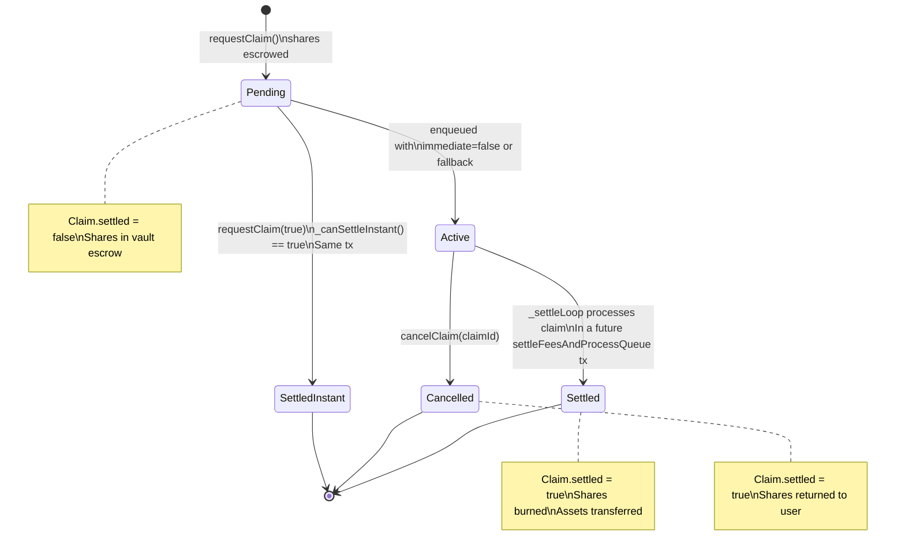
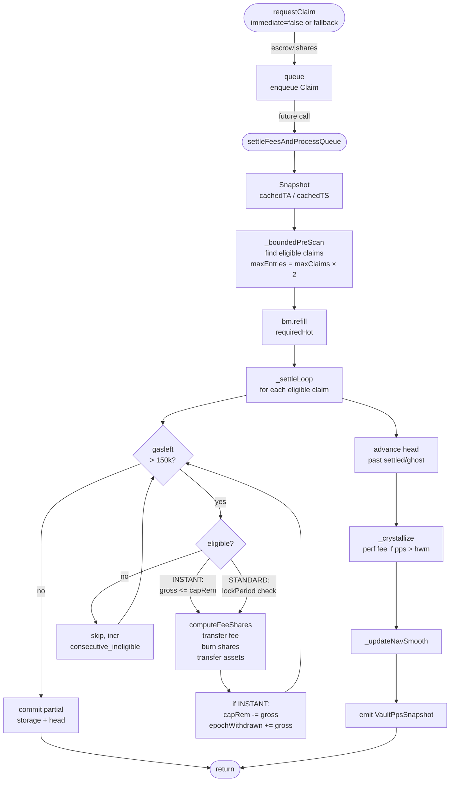

# Queue Mechanics

> **Source of truth**: `src/core/modules/QueueModule.sol:207` @ `c39f9462`
> **ADR-015 workflow applied**: full code read before drafting.

---

## 1. Overview

The queue is the primary withdrawal mechanism for all vault users. It serializes and batches claim settlement, decoupling withdrawal requests from liquidity availability. Every withdrawal — even INSTANT — passes through the same entry point (`requestClaim`) before settling.

The queue is implemented in `QueueModule` (`src/core/modules/QueueModule.sol:207`, 841L), a module that runs in delegatecall context. Storage lives in `QueueStorage.Layout` (EIP-7201 namespaced, `src/core/storage/QueueStorage.sol:24`).

Key design decisions:

| Decision | Rationale |
|----------|-----------|
| All withdrawals enter via `requestClaim` | Single entry point — uniform anti-spam, NAV freshness, epoch roll |
| Shares escrowed to vault on queue | Prevents double-spend; vault holds escrowed shares during pending period |
| Deterministic PPS per batch | `cachedTA/cachedTS` snapshot once per `settleFeesAndProcessQueue` call — all claims in same tx use identical price |
| Bounded pre-scan | `maxEntries = maxClaims × MAX_SCAN_MULTIPLIER(2)` + `MAX_CONSECUTIVE_INELIGIBLE(32)` cap — gas-bounded without O(queue) scans |
| W2: never block exits | All non-critical calls (NAV refresh, incentives notify) are try/catch |

---

## 2. Queue Storage

`QueueStorage.Layout` is stored at EIP-7201 slot `0x20afa2de85fad1e68653d750134f8c4543e7db931009cedccc72142811c77f00` (`QueueStorage.sol:L10`):

```solidity
// src/core/storage/QueueStorage.sol:24
struct Layout {
    uint256[]                     queue;       // ordered list of active claim IDs
    uint256                       head;        // index into queue[] of first unsettled entry
    uint256                       nextClaimId; // monotonic counter
    uint256                       pendingShares; // total escrowed shares across all active claims
    mapping(uint256 => Claim)     claims;      // full claim data per ID
}
```

`Claim` struct packs into two 32-byte storage slots:

```solidity
struct Claim {
    // slot 0: [address user (20B)] [uint64 ts (8B)] [bool immediate (1B)] [bool settled (1B)]
    address user;
    uint64  ts;
    bool    immediate;
    bool    settled;

    // slot 1:
    uint256 shares;     // escrowed shares (gross — before fee deduction)
}
```

### 2.1 Head pointer pattern

The `queue[]` array is append-only during normal operation — claims are never removed from the array at request time. The `head` pointer tracks the first entry that has not been settled or is not a ghost entry.

After each settle batch, `_settleLoop` advances `head` past contiguous settled or zero-shares entries:

```solidity
// src/core/modules/QueueModule.sol:506
uint256 h = q.head;
while (h < qLen) {
    QueueStorage.Claim storage hc = q.claims[q.queue[h]];
    if (!hc.settled && hc.shares > 0) break;
    unchecked { ++h; }
}
q.head = h;
```

This is O(n) in the number of settled entries at the head of the array. The separate `compactQueue()` function physically removes settled head entries to free storage, but it is never called during settlement — it is a maintenance operation callable by anyone.

### 2.2 pendingShares invariant

`pendingShares` tracks the total shares escrowed in the vault across all unsettled claims:

```
On requestClaim (queue path):  pendingShares += shares
On cancelClaim:                pendingShares -= shares
On _settleLoop per claim:      pendingShares -= c.shares
```

This value is the authoritative measure of the vault's escrow obligation. It is decremented in `_settleLoop` storage batch commit (`src/core/modules/QueueModule.sol:519`).

---

## 3. Claim Lifecycle



### 3.1 State transitions

| Transition | Function | Condition |
|-----------|---------|-----------|
| `[*] → SettledInstant` | `requestClaim(true, shares)` | `_canSettleInstant()` = true |
| `[*] → Active` | `requestClaim(false/true, shares)` | queue path (not instant or fallback) |
| `Active → Settled` | `settleFeesAndProcessQueue` | claim eligible (lock/cap) + hot available |
| `Active → Cancelled` | `cancelClaim(claimId)` | caller == claim.user |
| N/A | `compactQueue()` | maintenance only; does not change Claim state |

### 3.2 requestClaim full flow

`requestClaim(bool immediate, uint256 shares)` (`src/core/modules/QueueModule.sol:81`):

```
1. FM gate: _checkStandardExitAllowed() (if !immediate) or _checkInstantExitAllowed()
2. _enterNonReentrant() — reentrancy lock
3. _ensureFreshWarmNav() — mandatory NAV freshness (reverts if stale and refresh fails)
4. rollEpochIfNeeded(core) — advance epoch if boundary passed
5. Min claim check: shares >= minClaimShares
6. _checkQueueAntiSpam(user):
   - cooldownPerClaim: block.timestamp >= lastClaimTime + cooldown
   - maxClaimsPerUserPerEpoch: userClaimsCount[user] < max
7a. INSTANT path (immediate == true && _canSettleInstant()):
     computeFeeShares(shares, INSTANT, fee)
     _transferShares(msg.sender, feeCollector, feeShares)
     _burn(msg.sender, userShares)
     token.safeTransfer(receiver, net)
     consumeEpochCap(core, gross)
     → DONE (no queue entry)
7b. Queue path (fallback or immediate==false):
     _transferShares(msg.sender, vault, shares)   // escrow
     id = nextClaimId++
     claims[id] = Claim{user, ts, immediate=false, shares}
     queue.push(id)
     pendingShares += shares
     userLastClaimTime[user] = now
8. _exitNonReentrant()
```

Note: step 7a transfers shares from `msg.sender` — not escrowed. Step 7b escrows to `address(this)`.

### 3.3 cancelClaim

```
cancelClaim(uint256 claimId) (src/core/modules/QueueModule.sol:173)

1. Load claim: claims[claimId]
2. Check: caller == claim.user AND !claim.settled AND claim.shares > 0
3. _transferShares(vault, user, claim.shares)   // return escrowed shares
4. claim.settled = true; claim.shares = 0
5. pendingShares -= shares
6. Emit ClaimCancelled(claimId, user, shares)
```

Cancelled claims remain in `queue[]` as ghost entries (settled=true, shares=0). The head advance loop skips them.

---

## 4. Settlement Loop

`settleFeesAndProcessQueue(uint256 maxClaims)` (`src/core/modules/QueueModule.sol:207`):

### 4.1 Pre-settlement phase

```
1. FM gate: _checkSettlementAllowed()
2. rollEpochIfNeeded(core)
3. cachedTA = totalAssets()     // snapshot — immutable for entire batch
4. cachedTS = totalSupply()     // snapshot
5. capRem = calculateCapRemaining(core, q, cachedTA, vault)
6. _settleScan(maxClaims, cachedTA, cachedTS, capRem)
```

The TA/TS snapshot at step 3-4 is the core of deterministic PPS: all settlements in the same batch use the same price, regardless of intermediate burns or transfers within the loop.

### 4.2 _settleScan and bounded pre-scan

`_settleScan` orchestrates two sub-steps before the main loop:

```
_trySoftRefreshWarmNav()       // try/catch — W2 rule
_boundedPreScan(maxClaims)     // find eligible claims without settling
bm.refill(prescan.requiredHot) // warm up hot balance if BufferManager is wired
_settleLoop(eligible, ...)     // settle only the pre-scanned window
```

`_boundedPreScan(maxClaims)` (`src/core/modules/QueueModule.sol:303`):

```
maxEntries = maxClaims × MAX_SCAN_MULTIPLIER   // MAX_SCAN_MULTIPLIER = 2
consecutive_ineligible = 0

for i in [head, head + maxEntries):
    if consecutive_ineligible >= MAX_CONSECUTIVE_INELIGIBLE (32):
        hitEarlyExit = true; break
    claim = claims[queue[i]]
    if settled or shares==0: skip (ghost)
    eligible = check(claim):
        INSTANT: gross <= capRem
        STANDARD: lockPeriod==0 || now >= ts + lockPeriod
    if !eligible:
        consecutive_ineligible++
    else:
        requiredHot += gross
        eligibleCount++
        consecutive_ineligible = 0

return PrescanResult{requiredHot, eligibleCount, scanWindowEnd, hitEarlyExit}
```

The pre-scan serves two purposes:
1. Determine `requiredHot` for `bm.refill()` — avoids mid-loop refill surprises
2. Limit scan window to `scanWindowEnd` — the settle loop processes only entries in `[head, scanWindowEnd)`

### 4.3 _settleLoop

`_settleLoop(prescan, maxClaims, cachedTA, cachedTS, capRem, hot)` (`src/core/modules/QueueModule.sol:407`):

```
proc = 0
for i in [head, scanWindowEnd):
    if proc >= maxClaims: break
    if gasleft() <= 150_000: break        // gas safety exit

    claim = claims[queue[i]]
    if settled or shares==0: skip

    // Eligibility (re-check with current capRem/lockPeriod)
    if c.immediate:
        eligible = gross <= capRem
    else:
        eligible = lockPeriod==0 || now >= ts + lockPeriod
    if !eligible: continue

    // Hot liquidity check (in-memory tracker)
    if hot < gross:
        emit QueueClaimSkippedInsufficientHot(id, hot, gross)
        continue

    // Incentives sync (try/catch)
    _notifyIncentivesExit(user, gross, core)

    // Fee computation
    mode = c.immediate ? INSTANT : STANDARD
    (feeShares, userShares) = computeFeeShares(c.shares, mode, fee)

    // Fee transfer (escrow → feeCollector)
    if feeShares > 0:
        _transferShares(vault, feeCollector, feeShares)
        emit FeePaid(user, feeCollector, feeShares)

    // Asset transfer (cached PPS)
    net = (userShares × cachedTA) / cachedTS
    _burn(vault, userShares)
    pendingShares -= c.shares
    c.settled = true
    token.safeTransfer(user, net)
    hot -= net                    // in-memory hot tracker

    emit ClaimSettled(id, user, net)
    emit IERC4626.Withdraw(vault, user, user, gross, c.shares)

    // Cap update
    if c.immediate:
        capRem = capRem >= gross ? capRem - gross : 0
        epochWithdrawn += gross

    proc++

// Advance head past settled/ghost claims
// Batch commit: epochWithdrawn, pendingShares
```

### 4.4 Gas safety

The `gasleft() > 150_000` check ensures the loop exits with enough gas remaining to commit storage and emit final events. If the check triggers mid-batch, partial progress is committed — the next `settleFeesAndProcessQueue` call continues from the new `head` position.

### 4.4.1 Settlement pipeline diagram



### 4.5 Post-settlement phase

After `_settleLoop` returns:

```
_crystallize()         // performance fee if pps > hwm
_updateNavSmooth()     // EMA nav smoothing
emit VaultPpsSnapshot(pps, block.timestamp)
```

---

## 4.6 BufferManager integration

`bm.refill(requiredHot)` is called by `_settleScan` after the pre-scan, before the settle loop. The buffer manager is responsible for moving funds from deployed strategies back to the vault's idle balance ("hot"):

```
_settleScan flow:
  prescan = _boundedPreScan()         // requiredHot computed
  if address(bm) != address(0):
      bm.refill(prescan.requiredHot) // asks BM to ensure hot >= required
  _settleLoop(prescan, hot=IERC20.balanceOf(vault))
```

If `bm == address(0)` (buffer manager not wired), `_settleScan` proceeds directly to `_settleLoop` with whatever hot balance the vault currently holds.

Hot balance tracking in `_settleLoop` is **in-memory** — the loop maintains a local `hot` variable decremented on each `safeTransfer`. This avoids a `balanceOf` call per iteration (saves ~800 gas each).

`src/core/modules/QueueModule.sol:492`:
```solidity
hot -= net;   // in-memory tracker after each transfer
```

If a claim is skipped due to `hot < gross` (insufficient hot after partial refill), the claim is left in the queue for the next batch. This is the designed behavior: `bm.refill` provides best-effort liquidity; if the strategy cannot return enough, later batches will retry.

---

## 5. Anti-spam Guards

`_checkQueueAntiSpam(address user)` (`src/core/modules/QueueModule.sol:580`) enforces per-user rate limits:

| Parameter | Source | Effect |
|-----------|--------|--------|
| `cooldownPerClaim` | `QueueParams.cooldownPerClaim` | Minimum seconds between consecutive claims by same user |
| `maxClaimsPerUserPerEpoch` | `QueueParams.maxClaimsPerUserPerEpoch` | Maximum claims per user per anti-spam epoch |
| `epochDuration` | `QueueParams.epochDuration` | Duration of anti-spam epoch |

Implementation detail: the anti-spam epoch uses a separate counter (`currentEpochNumber`, `lastEpochReset` in `CoreStorage.Layout`) from the withdrawal cap epoch. They can have different durations.

When `cooldownPerClaim = 0 && maxClaimsPerUserPerEpoch = 0`, anti-spam is disabled entirely (early return in `_checkQueueAntiSpam`).

### 5.1 Anti-spam CoreStorage fields

Fields in `CoreStorage.Layout` used by `_checkQueueAntiSpam`:

| Field | Type | Description |
|-------|------|-------------|
| `currentEpochNumber` | `uint64` | Monotonic epoch counter; incremented on epoch boundary |
| `lastEpochReset` | `uint64` | Timestamp of last epoch advance |
| `userLastClaimTime` | `mapping(address → uint64)` | Last `requestClaim` timestamp per user |
| `userLastClaimEpoch` | `mapping(address → uint64)` | Epoch number of last claim per user |
| `userClaimsCount` | `mapping(address → uint64)` | Claims submitted by user in current epoch |

Epoch advance logic (`QueueLib.shouldAdvanceEpoch`):
```
if block.timestamp >= lastEpochReset + epochDuration:
    currentEpochNumber++
    lastEpochReset = uint64(block.timestamp)
    return (true, newReset)
```

When epoch advances, `userClaimsCount` is reset per-user lazily: on the user's next `requestClaim`, if `userLastClaimEpoch[user] < currentEpochNumber`, the count is zeroed before incrementing.

### 5.2 Cooldown check

```solidity
// QueueLib.isCooldownActive
function isCooldownActive(uint64 last, uint256 now, uint64 cooldown) → bool {
    return cooldown > 0 && now < uint256(last) + cooldown;
}
```

The cooldown uses `userLastClaimTime` updated at the end of each successful `requestClaim` (queue path). INSTANT settlements (no queue entry) do NOT update `userLastClaimTime`, because no queue entry is created.

### 5.3 Interaction with INSTANT path

Anti-spam checks (`_checkQueueAntiSpam`) are called in step 6 of `requestClaim`, **before** the INSTANT/queue branching at step 7. This means:
- An INSTANT settlement consumes one "claim slot" against the user's epoch quota
- The cooldown timer is updated after INSTANT settlement
- A user cannot bypass anti-spam by always requesting immediate=true

---

## 6. NAV Freshness

Two NAV freshness modes are used on the queue path:

| Mode | Used when | Reverts on stale? |
|------|-----------|------------------|
| `_ensureFreshWarmNav()` | `requestClaim` | Yes — blocks claim if NAV is stale and refresh fails |
| `_trySoftRefreshWarmNav()` | `settleFeesAndProcessQueue` | No — W2 rule, settlement proceeds with stale NAV |

`MAX_WARM_NAV_AGE = 15 minutes` (`QueueModule.sol:L20`). If `block.timestamp > warmNavTs + 15min`, the module attempts a refresh via `bm.refreshWarmNav()`.

The asymmetry is intentional: a user requesting a claim should see a fresh price, but batch settlement (often run by a keeper) must not be blocked by a transient NAV staleness.

---

## 7. compactQueue

`compactQueue()` (`src/core/modules/QueueModule.sol:562`) is a housekeeping function that physically removes settled head entries from the `queue[]` array:

```
h = q.head
if h == 0 or len == 0: return

// Shift elements left by h positions
for i in [0, len-h): queue[i] = queue[i+h]
// Pop h tail entries
for i in [0, h): queue.pop()
q.head = 0
```

Properties:
- O(n) in total queue length — expensive on large queues
- Never called in the settle path — calling it during settlement would corrupt the in-progress scan
- Idempotent: calling it on an already-compact queue is a no-op
- No economic impact: settled claims are already processed; this is pure storage cleanup
- Callable by anyone (external) — no access control; callers pay gas

---

## 7.5 Claim ordering and fairness

The queue is **FIFO with eligibility gaps**. Claims are processed in insertion order, but ineligible claims (lock not elapsed, cap insufficient) are **skipped** rather than blocking subsequent claims.

This "skip-ineligible" model has intentional implications:

1. **STANDARD before INSTANT is possible**: a STANDARD claim queued before an INSTANT claim processes first if both are eligible. If the STANDARD claim is eligible but the INSTANT claim's cap is met first, the INSTANT claim may have to wait for the next epoch.

2. **No ordering fairness for hot shortage**: if the vault has 10 USDC hot and two eligible claims for 6 USDC each, the first claim in the array is settled, the second is skipped with `QueueClaimSkippedInsufficientHot`. The second claim will be retried in the next batch when liquidity is available.

3. **Epoch cap is not first-come-first-served**: INSTANT claims are checked against `capRem` at the moment the settle loop reaches them. If earlier claims in the same batch consumed the cap, later INSTANT claims are skipped for this batch.

Mitigation: `bm.refill` is called before the settle loop to pre-load the expected hot liquidity. Claims should be skipped only if the strategy genuinely cannot provide liquidity, not due to ordering effects.

---

## 8. Incentives Integration

`_notifyIncentivesExit(user, assetsExited, core)` (`src/core/modules/QueueModule.sol:644`):

```solidity
IIncentivesEngine eng = core.incentivesEngine;
if (address(eng) == address(0)) return;
try eng.onExitLight(user, assetsExited * 1e12) {} catch {}
```

- Called once per settled claim in `_settleLoop`, before fee computation
- `assetsExited` is in USDC (6 decimals), scaled by 1e12 to 18 decimals for the incentives engine
- `try/catch` with no error handling — W2 rule; incentives failure never blocks settlement
- If `incentivesEngine == address(0)`: early return, no external call

---

## 9. Invariants

| ID | Invariant | Enforcement |
|----|-----------|-------------|
| **Q1** | Claim can only be settled once (`c.settled = true` is permanent) | `_settleLoop` skips `settled=true` entries; `cancelClaim` also sets `settled=true` |
| **Q2** | `pendingShares` = sum of all unsettled `c.shares` in active claims | Maintained by `requestClaim` (+), `cancelClaim` (-), `_settleLoop` (-) |
| **Q3** | `escrow balance(vault) >= pendingShares` at all times | Shares escrowed before enqueue; consumed on settlement or cancellation |
| **Q4** | Deterministic PPS within one batch: all claims use `cachedTA/cachedTS` snapshot | Snapshot taken once before `_settleLoop`; never updated mid-loop |
| **Q5** | Escrow underflow never causes revert | `_settleLoop` emits warning + skips (not revert) on unexpected escrow deficit |
| **Q6** | Anti-spam limits apply before escrow — spam claims are rejected before shares move | `_checkQueueAntiSpam` called in `requestClaim` before `_transferShares` |
| **Q7** | `gasleft() > 150_000` guard ensures storage commit before gas exhaustion | Inner loop condition in `_settleLoop` |

---

## 10. Events

| Event | When |
|-------|------|
| `ClaimQueued(claimId, user, shares, immediate)` | `requestClaim` → queue path |
| `ClaimSettled(claimId, user, netAssets)` | `_settleLoop` per settled claim |
| `ClaimCancelled(claimId, user, shares)` | `cancelClaim` |
| `QueueClaimSkippedInsufficientHot(id, hot, gross)` | `_settleLoop` — hot < gross |
| `FeePaid(user, feeCollector, feeShares)` | `_settleLoop` — fee transfer |
| `VaultPpsSnapshot(pps, ts)` | End of `settleFeesAndProcessQueue` |
| `Crystallized(oldHwm, newHwm, feeAssets)` | After settle batch — crystallization |
| `PerfFeeMinted(oldHwm, ppsBefore, feeShares, ppsAfter)` | Perf fee mint |
| `NavSmoothUpdated(navReal, navSmooth, ts)` | After crystallization |
| `EpochRolled(epochStart, epochDuration)` | Epoch boundary crossed |

---

## 11. Thread Safety and Reentrancy

`requestClaim` and `settleFeesAndProcessQueue` are both protected by the `FLAG_REENTRANCY_LOCKED` flag in `CoreStorage.Layout.packedFlags`:

```solidity
function _enterNonReentrant() internal {
    if (core.packedFlags & FLAG_REENTRANCY_LOCKED != 0) revert ReentrancyGuardLocked();
    core.packedFlags |= FLAG_REENTRANCY_LOCKED;
}

function _exitNonReentrant() internal {
    core.packedFlags &= ~FLAG_REENTRANCY_LOCKED;
}
```

The ERC-20 `safeTransfer` in `_settleLoop` is the primary reentrancy risk (USDC has hooks on some chains). The reentrancy guard prevents a re-entrant call to `requestClaim` from the USDC transfer callback.

---

## 12. Examples

### 12.1 Queue with three pending claims

```
State: paramMinDelay=2d, witBps=50, immediateExitPenaltyBps=100, lockPeriod=0
queue = [claimId=1, claimId=2, claimId=3], head=0

Claim1: {user=Alice, ts=Day0, immediate=false, shares=500e18}
Claim2: {user=Bob,   ts=Day1, immediate=true,  shares=200e18}
Claim3: {user=Carol, ts=Day2, immediate=false, shares=300e18}

Day 2, 14:00: settleFeesAndProcessQueue(maxClaims=10)
  cachedTA = 1_000_000 USDC, cachedTS = 1_000_000e18 → PPS = 1.0

  _boundedPreScan:
    Claim1: immediate=false, lockPeriod=0 → eligible, gross ≈ 500 USDC
    Claim2: immediate=true, capRem=10_000 → eligible, gross ≈ 200 USDC
    Claim3: immediate=false → eligible, gross ≈ 300 USDC
    requiredHot = 1000 USDC, eligible=3

  bm.refill(1000 USDC)  // warm up hot if needed

  _settleLoop:
    Claim1 (STANDARD):
      feeShares = mulBpsUp(500e18, 50) = 2.5e18 → 3e18 (ceiling)
      userShares = 497e18
      net = 497e18 × 1_000_000e6 / 1_000_000e18 = 497e6 USDC
      → transfer 497 USDC to Alice
      pendingShares -= 500e18

    Claim2 (INSTANT):
      feeShares = mulBpsUp(200e18, 150) = 3e18
      userShares = 197e18
      net = 197e6 USDC
      → transfer 197 USDC to Bob
      capRem -= 200 USDC; epochWithdrawn += 200 USDC

    Claim3 (STANDARD):
      feeShares = mulBpsUp(300e18, 50) = 2e18 (ceiling of 1.5)
      userShares = 298e18
      net = 298e6 USDC
      → transfer 298 USDC to Carol

  head advances to 3 (all settled)
  _crystallize() — PPS slightly above 1.0 due to fees? → depends on protocol state
  emit VaultPpsSnapshot
```

### 12.2 Anti-spam block

```
User: requestClaim(false, 100e18) at T=0
  → userLastClaimTime[user] = 0; cooldownPerClaim = 3600 (1 hour)
  → 0 < 3600: no cooldown yet ✓ (first claim)
  → claim stored, lastClaimTime = T

User: requestClaim(false, 100e18) at T=1800 (30 min later)
  → isCooldownActive: now(1800) < lastClaimTime(0) + cooldownPerClaim(3600) = 3600 ✓
  → revert ClaimCooldownActive()
```

---

## 12.3 compactQueue gas cost

```
Before: queue.length=200, head=150
        → 150 settled entries at head

compactQueue():
  newLen = 200 - 150 = 50
  for i in [0, 50): queue[i] = queue[i+150]   // 50 SSTORE(warm) reads + writes
  for i in [0, 150): queue.pop()               // 150 SSTORE clears (refund)
  head = 0

Approximate gas: 50 × 3000 (warm SSTORE) + 150 × ~4800 (SSTORE → zero, refund) ≈ ~870k gas
Gas refund partially offsets SSTORE clears under EIP-3529.
```

In practice, `compactQueue` is called periodically by an off-chain keeper once the head pointer is significantly behind `queue.length`. There is no incentive to compact more frequently than necessary.

### 12.4 Minimum claim size

`minClaimShares` is a governance-configurable threshold stored in `QueueParams` (read from `IParamsProvider`).

Step 5 of `requestClaim` enforces a minimum:

```solidity
// src/core/modules/QueueModule.sol:122
if (shares < core.params.getQueueParams(vault).minClaimShares)
    revert ClaimTooSmall();
```

`minClaimShares` prevents micro-claims that would fill the queue without meaningful economic activity. When `minClaimShares = 0`, no minimum is enforced.

The minimum also serves as an implicit dust-guard: shares below the minimum would produce a `net = 0` after fee deduction at 100+ bps combined exit fee, leaving the user with nothing. Rejecting them at the entry point is cleaner than settling and emitting `ClaimSettled(id, user, 0)`.

---

## 13. Edge Cases

| Case | Behavior |
|------|---------|
| Queue empty (`head >= queue.length`) | `_boundedPreScan` immediately returns; settle is no-op |
| All claims ineligible for 32 entries | `hitEarlyExit=true`; settleLoop skips eligible=0 entries; fast path |
| `hot = 0` at settle time | All claims skipped with `QueueClaimSkippedInsufficientHot`; bm.refill was called but refill may have returned 0 |
| INSTANT claim cap exhausted mid-batch | Remaining INSTANT claims skipped; STANDARD claims continue |
| Large queue with `maxClaims=1` | Only 1 claim processed per call; head advances by 1; safe on any gas limit |
| `cancelClaim` after partial settlement of queue | A settled claim cannot be cancelled (`settled=true` check); non-settled claims can still cancel |
| `compactQueue()` race with active settle | `compactQueue` is a single external call; calling it while settle is in progress (same tx) is impossible due to reentrancy guard |
| Anti-spam epoch rolls mid-session | `_checkQueueAntiSpam` advances epoch when stale; `userClaimsCount` reset to 0 |

---

## 14. Glossary

| Term | Definition |
|------|-----------|
| **queue** | `QueueStorage.Layout.queue` — append-only array of claim IDs |
| **head** | Index into `queue[]` pointing to first unsettled entry |
| **ghost entry** | A queue entry with `settled=true` or `shares=0` — created by settlement or cancellation |
| **pendingShares** | Total escrowed shares across all active (unsettled) claims |
| **bounded pre-scan** | `_boundedPreScan` — eligibility check pass before settling; bounded by `maxClaims × 2` + 32 consecutive ineligible |
| **cachedTA / cachedTS** | totalAssets / totalSupply snapshot taken once per settle batch |
| **deterministic PPS** | All claims in one `settleFeesAndProcessQueue` tx use the same price (cached snapshot) |
| **W2 rule** | Never block exits — all non-critical external calls are try/catch |
| **compactQueue** | External housekeeping function; physically removes settled head entries from `queue[]` array |
| **NAV freshness** | `warmNavTs` must be within 15 min (`MAX_WARM_NAV_AGE`) for `requestClaim`; soft refresh for settlement |
| **anti-spam epoch** | Rolling period for `maxClaimsPerUserPerEpoch` tracking (separate from withdrawal cap epoch) |
| **INSTANT in queue** | A claim stored with `c.immediate=true` that was not settled at request time; settles with INSTANT mode (cap check) in `_settleLoop` |

---

## Appendix: Code Reference Index

| Function | File | Approx line |
|----------|------|-------------|
| `QueueStorage.Layout` | `src/core/storage/QueueStorage.sol:24` | L10 |
| `Claim` struct | `src/core/storage/QueueStorage.sol:16` | L18 |
| `MAX_BATCH` constant | `src/core/modules/QueueModule.sol:57` | L18 |
| `MAX_WARM_NAV_AGE` constant | `src/core/modules/QueueModule.sol:58` | L20 |
| `MAX_SCAN_MULTIPLIER` constant | `src/core/modules/QueueModule.sol:61` | L22 |
| `MAX_CONSECUTIVE_INELIGIBLE` constant | `src/core/modules/QueueModule.sol:62` | L23 |
| `requestClaim` | `src/core/modules/QueueModule.sol:81` | L100 |
| `cancelClaim` | `src/core/modules/QueueModule.sol:173` | L180 |
| `settleFeesAndProcessQueue` | `src/core/modules/QueueModule.sol:207` | L200 |
| `_settleScan` | `src/core/modules/QueueModule.sol:358` | L310 |
| `_boundedPreScan` | `src/core/modules/QueueModule.sol:303` | L350 |
| `_settleLoop` | `src/core/modules/QueueModule.sol:407` | L430 |
| `_checkQueueAntiSpam` | `src/core/modules/QueueModule.sol:580` | L580 |
| `_trySoftRefreshWarmNav` | `src/core/modules/QueueModule.sol:628` | L626 |
| `_notifyIncentivesExit` | `src/core/modules/QueueModule.sol:644` | L643 |
| `compactQueue` | `src/core/modules/QueueModule.sol:562` | L562 |
| `_crystallize` | `src/core/modules/QueueModule.sol:763` | L763 |
| `_updateNavSmooth` | `src/core/modules/QueueModule.sol:805` | L805 |
| `_canSettleInstant` | `src/core/modules/QueueModule.sol:528` | L528 |
| `_convertToAssetsCached` | `src/core/modules/QueueModule.sol:698` | L698 |
| `rollEpochIfNeeded` | `src/core/libraries/ExitEngineLib.sol:77` | L40 |
| `calculateCapRemaining` | `src/core/libraries/ExitEngineLib.sol:106` | L60 |
| `computeFeeShares` | `src/core/libraries/ExitEngineLib.sol:151` | L155 |
| `_checkStandardExitAllowed` | `src/core/storage/FixedMaturityStorage.sol:91` | L90 |
| `_checkSettlementAllowed` | `src/core/storage/FixedMaturityStorage.sol:100` | L98 |

---

## Footer

**Source commit**: `c39f9462` (branch `reorg/runbook-docs-consolidate-01a.2`)

**Authoritative files read** (ADR-015 §2 workflow):

| File | Lines | Notes |
|------|-------|-------|
| `src/core/modules/QueueModule.sol:207` | 841 | Full read |
| `src/core/storage/QueueStorage.sol:24` | 38 | Full read |
| `src/core/storage/CoreStorage.sol:38` | partial | head, pendingShares, anti-spam fields, packedFlags |
| `src/core/libraries/ExitEngineLib.sol:77` | 279 | Full read — rollEpochIfNeeded, computeFeeShares |

**Discrepancies** (ADR-015 §5):

1. `_settleLoop` at `src/core/modules/QueueModule.sol:506` advances `head` past contiguous settled/ghost claims after each batch. The loop is O(n) in the number of contiguous settled entries at the head — it runs in the same tx as settlement. In high-volume scenarios, this advancement can itself consume significant gas. No issue found in `c39f9462`; noted for monitoring.

2. `_checkQueueAntiSpam` advances the anti-spam epoch via `QueueLib.shouldAdvanceEpoch` — a separate epoch counter from the withdrawal cap epoch (`ExitEngineLib.rollEpochIfNeeded`). The two epoch systems have independent storage fields and can have different durations. This is by design but adds complexity to parameter governance.
