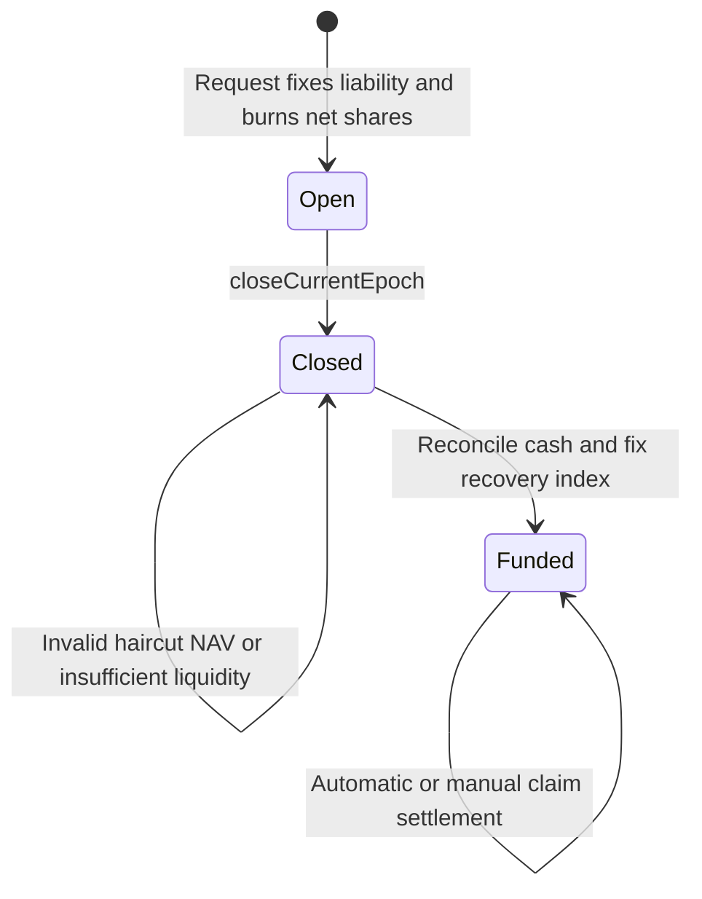

# Queue Mechanics

The queue implements economic exit at request. `EpochedQueueModule` runs through
CoreVault's delegatecall routing and stores state in `EpochQueueStorage`. The policy
is defined in [economic-exit.md](economic-exit.md); layouts are in
[storage-layout.md](storage-layout.md#5-epochqueuestoragelayout--eip-7201-multyrstorageepochqueuev1).

## 1. Overview

An accepted request refreshes and validates NAV, fixes assets owed, transfers exit fee
shares, and burns net shares. The user then owns a liability rather than participating
in shareholder returns. Requests cannot be cancelled. Epochs group liquidity preparation;
closing an epoch does not price or burn its claims.

## 2. Queue storage and accounting

`EpochClaim` records `user`, `requestedAt`, `claimed`, `assetsOwed` and `grossShares`.
`assetsOwed` is nominal and fixed at request. IDs start at one in each epoch.

`EpochData` holds timestamps, informational share totals, `totalAssetsOwed`, nominal
`claimedAssets`, `claimCount`, `reservedRemaining` and `recoveryIndex`.

| Aggregate | Meaning |
|---|---|
| `totalOwed` | Unfunded nominal liabilities plus funded remaining reserves |
| `reservedForClaims` | Cash earmarked for funded claims; already included in liabilities |
| `outstandingClaimCount` | All unsettled claims, including Open and Closed epochs |
| `fundedOutstandingClaimCount` | Unsettled claims in Funded epochs, including zero recovery |
| `fundedEpochCount` | Closed-to-Funded transitions; only increases |
| `oldestUnfundedEpochId` | Bounded-maintenance cursor for funding |

Shareholder NAV is `max(0, grossAssets - totalOwed)`. Every consumer of hot cash uses
`max(0, hot - reservedForClaims)` as spendable liquidity. Reserves are not a second NAV
subtraction. Claim counters do not affect the instant cap.

## 3. Claim lifecycle


```mermaid
stateDiagram-v2
    [*] --> Open: Request fixes liability and burns net shares
    Open --> Closed: closeCurrentEpoch
    Closed --> Closed: Invalid haircut NAV or insufficient liquidity
    Closed --> Funded: Reconcile cash and fix recovery index
    Funded --> Funded: Automatic or manual claim settlement
```

The epoch stays Funded after its final claim. Each claim has its own `claimed` flag.
A claim payout failure reverts both payment and its accounting updates.

### 3.1 Request

`requestEpochWithdrawal(shares)` enforces the queued-request breaker, fixed-maturity
state gate and deposit lock. It rolls the cap epoch before asset/supply mutations,
refreshes stale warm NAV and requires valid NAV. It rejects insolvency, zero equity,
zero shares and a rounded-zero liability. There is no `minClaimAmount` floor.

Fee shares are rounded up and transferred to the collector. Net shares are valued before
burning. Their value is added to `totalOwed` and the epoch's nominal total. Outstanding
claim count increments once. Settlement never repeats pricing, burning or the exit fee.

## 4. Epoch close and funding

### 4.1 Close

`closeCurrentEpoch()` checks the settlement gate, pause flags and minimum settlement
epoch age, marks the bucket Closed and opens the next bucket. Empty epochs may close.

### 4.2 Funding

For nominal unclaimed amount `N`, funding computes:

```text
freeAssets = max(0, grossAssets - reservedForClaims)
freeOwed   = max(0, totalOwed - reservedForClaims)
need       = N                                  if freeOwed == 0 or freeAssets >= freeOwed
             floor(N * freeAssets / freeOwed)   otherwise
neededHot  = reservedForClaims + need
```

When a haircut is indicated, funding first attempts to refresh stale warm NAV, recomputes
`need`, and validates NAV. Refresh failures are caught; invalid NAV emits
`EpochFundingNavInvalid` and leaves the epoch Closed. Liquidity reconciliation pulls warm
cash first and strategy cash second. Funding recomputes the requirement after those
operations and validates NAV again before crystallizing a haircut or rounding shortfall.

If hot cannot cover the requirement, the epoch stays Closed. In insolvency only, a
shortfall of at most one underlying base unit may be absorbed. Larger illiquid remainders
cannot lock a lower ratio. Funding reserves the actual cash, sets
`recoveryIndex = floor(reservedRemaining * 1e18 / N)` (1e18 for an empty cohort), and
writes the haircut out of `totalOwed`. It increments the funded outstanding count by the
epoch's claim count exactly once. Calling `fundEpoch` again does not reset the ratio or
count; it only maintains the funding cursor.

Two cohorts owed 50 each with gross assets 60 can each fund 30 before either claims.
Existing reserves are excluded from both sides of the second cohort's ratio.

### 4.3 Claims

`claimEpochAssets` and `batchClaimEpochAssets` require the recorded owner as caller.
`keeperSettleClaims` is permissionless and always pays recorded owners. It skips missing
or already-settled IDs; self-claim of an already-settled claim reverts.

Payout is nominal `assetsOwed * recoveryIndex / 1e18`, rounded down. Each claim releases
its cohort reserve share and decrements both outstanding counters. The final claim
releases all remaining reserve dust. A zero-recovery claim also settles and decrements
counts. Later asset recovery does not reopen a funded cohort or increase its payout.

## 5. Instant withdrawal path

`requestInstantWithdrawal` applies the same deposit lock and NAV validity requirements.
After refreshing warm NAV it checks gross share value against cap allowance and free
hot/warm liquidity. Eligibility selects the instant fee tier; failure of cap/liquidity or
an instant pause selects the standard queued tier. A deposit lock or invalid NAV reverts.
Successful instant exits pay the fixed net amount and consume that amount from the cap.
They leave no queued claim or outstanding count behind.

## 6. Two independent epoch concepts

| Epoch | State | Purpose |
|---|---|---|
| Cap epoch | `CoreStorage.epochStart`, `epochDuration`, `epochWithdrawn`, `capBaseSnapshot` | Static instant allowance |
| Settlement epoch | `EpochQueueStorage.currentEpochId` and `epochs` | Group requests for cash preparation and funding |

Cap rollover snapshots shareholder NAV before request, deposit/mint, force exit and
funding mutations. A zero cap duration skips rollover safely. The allowance uses
`capPerEpochBps`; dynamic cap configuration is ignored. Standard claims never consume it.

## 7. Automatic settlement and manual fallback

Automatic settlement is required in the deployment configuration. `ClaimSettlementUpkeep`
has its own registration and budget, separate from `VaultUpkeep`. Both `checkUpkeep` and
`performUpkeep` stop when either outstanding count is zero or claims are paused. Scanning
is bounded, skips drained epochs, and wraps to revisit epochs funded out of order.
Maintenance is allowed only while a Funded epoch has unsettled claims.

The keeper computes cursor changes itself. Batch failure triggers per-claim attempts;
failed claims receive a retry delay and healthy claims can proceed. Exclusion affects
only the keeper. Owner self-claim remains available, but it cannot bypass a token's
refusal to pay that recipient. See [settlement operations](claim-settlement-operations.md).

## 8. Operational checks

Monitor `EpochFundingNavInvalid`, `EpochFundingShortfall`, `EpochRecoveryCrystallized`,
`EpochAssetsClaimed` and `ClaimSettlementFailed`. A degraded strategy is not automatically
written off. Follow the [insolvency runbook](insolvency-runbook.md), extracting recoverable
assets before disabling any valuation source.
