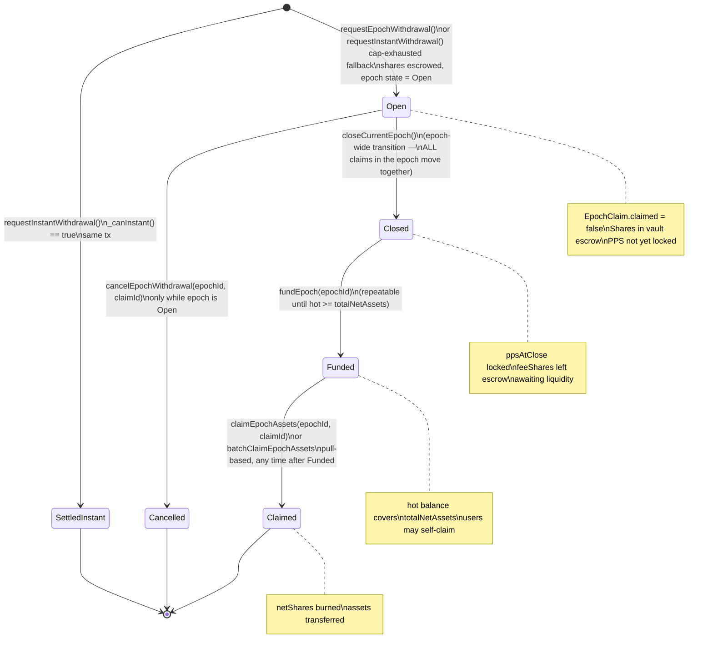
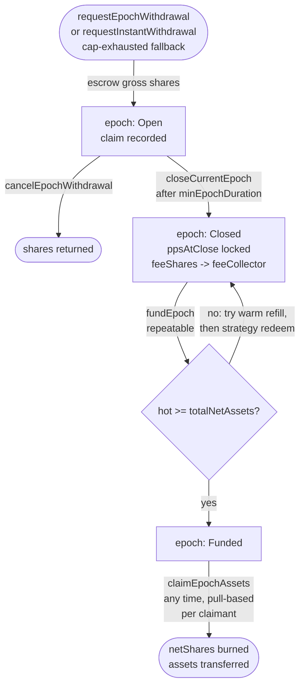

# Queue Mechanics

> **Source of truth**: `src/core/modules/EpochedQueueModule.sol` @ `f7e3544`
> **Supersedes**: v1.0 of this document, which described `QueueModule.sol` (deleted).
>   `QueueModule` was the original FIFO/keeper-scanned queue; `EpochedQueueModule` replaced
>   it as the sole production queue-settlement mechanism (Renzo ezETH-style epoch batching).

---

## 1. Overview

The queue is the async withdrawal mechanism for all vault users. Every non-instant withdrawal
— and every instant withdrawal that fails the cap check — passes through the epoch queue.
Unlike the retired `QueueModule` (a live FIFO array scanned by a keeper), the queue is now
**epoch-bucketed**: claims submitted within a time window share one epoch, one locked
price-per-share, and one liquidity pull.

The queue is implemented in `EpochedQueueModule` (`src/core/modules/EpochedQueueModule.sol`,
~990L), a module that runs in delegatecall context. Storage lives in
`EpochQueueStorage.Layout` (EIP-7201 namespaced, `EpochedQueueModule.sol:29`) — a storage
slot entirely separate from the retired `QueueStorage.Layout` (`src/core/storage/QueueStorage.sol`,
still present purely as a reserved/never-reused EIP-7201 slot; no live code writes to it).

Key design decisions:

| Decision | Rationale |
|----------|-----------|
| Claims bucket into epochs, not a flat FIFO array | O(1) liquidity pull per epoch instead of O(queue depth) keeper scan |
| PPS locked once at `closeCurrentEpoch()`, not per-claim | Eliminates live-PPS MEV window and settlement-order unfairness |
| Pull-based `claimEpochAssets()`, not keeper-push | No keeper dependency for a user to eventually receive funds; removes head-of-line blocking |
| Single liquidity pull via `fundEpoch()` per epoch | One warm-refill + strategy-redeem waterfall covers every claim in the epoch, regardless of count |
| `requestInstantWithdrawal()` preserved for cap-eligible exits | Keeps the fast path for small/early exits; falls back to the epoch queue on cap exhaustion |
| Crystallization decoupled from queue settlement | `endEpochCrystallize()`/`_crystallize()` have zero dependency on epoch/queue state — ported verbatim from `QueueModule`, callable independent of epoch lifecycle |
| W2: never block exits | Non-critical calls (NAV refresh, incentives notify, warm refill) are try/catch |

---

## 2. Queue Storage

`EpochQueueStorage.Layout` is defined at `EpochedQueueModule.sol:29-90`:

```solidity
// src/core/modules/EpochedQueueModule.sol:59
struct Layout {
    uint256 currentEpochId;
    mapping(uint256 => EpochData) epochs;                       // epochId => aggregate
    mapping(uint256 => mapping(uint256 => EpochClaim)) claims;   // epochId => claimId => claim
    mapping(uint256 => uint256) nextClaimId;                     // epochId => next claimId (starts at 1)
    uint256 escrowedShares;          // total shares in vault escrow across ALL open/closed epochs
    uint256 outstandingClaimCount;   // total unclaimed claims across ALL epochs (dynamic-cap signal)
    uint256 oldestUnfundedEpochId;   // oldest epoch CLOSED but not yet FUNDED (keeper cursor)
}
```

Per-epoch aggregate (`EpochData`, `EpochedQueueModule.sol:37-49`):

```solidity
struct EpochData {
    EpochState state;          // Open | Closed | Funded
    uint64     openedAt;
    uint64     closedAt;
    uint64     fundedAt;
    uint256    totalGrossShares;
    uint256    totalNetShares;
    uint256    totalFeeShares;
    uint256    ppsAtClose;      // WAD price-per-share locked at closeCurrentEpoch()
    uint256    totalNetAssets;  // totalNetShares * ppsAtClose / WAD, set at close
    uint256    claimedAssets;   // running total paid out via claimEpochAssets
    uint256    claimCount;      // number of claims submitted to THIS epoch
}
```

Per-claim entry (`EpochClaim`, `EpochedQueueModule.sol:52-57`):

```solidity
struct EpochClaim {
    address user;
    uint256 netShares;   // after fee deduction — what the user burns at claim time
    uint256 feeShares;   // already transferred to feeCollector at epoch close
    bool    claimed;
}
```

### 2.1 Two counters, two purposes

`EpochData.claimCount` (per-epoch, resets to 0 on `closeCurrentEpoch()`) and
`Layout.outstandingClaimCount` (global, persists across epoch boundaries) serve different
roles:

- `claimCount` — used by keepers as an anti-churn check before closing (`currentEpochClaimCount()`
  view): don't close an epoch with nothing in it.
- `outstandingClaimCount` — the dynamic-cap "queue depth" signal (`WithdrawalCapLib.calculateDynamicCapBps`).
  A dedicated fix in this module ensures this counter does **not** reset when an epoch closes —
  an earlier version used per-epoch `claimCount` for this signal, which meant dynamic-cap stress
  detection could be dodged by front-running an epoch close with a large instant withdrawal. See
  `EpochedQueueModule.t.sol:test_dynamicCap_survivesEpochClose` for the regression test.

### 2.2 escrowedShares invariant

`escrowedShares` tracks total shares escrowed in the vault across every open, closed-unfunded,
and funded-unclaimed epoch combined:

```
On requestEpochWithdrawal / requestInstantWithdrawal fallback:  escrowedShares += grossShares
On cancelEpochWithdrawal:                                        escrowedShares -= grossShares
On closeCurrentEpoch (fee shares leave escrow to feeCollector):  escrowedShares -= totalFeeShares
On claimEpochAssets / batchClaimEpochAssets:                      escrowedShares -= claim.netShares
```

`vault.balanceOf(address(vault)) == escrowedShares` holds at all times — this is the epoch-model
equivalent of the old `pendingShares` invariant, exposed via the `totalEscrowedShares()` view.

### 2.3 oldestUnfundedEpochId — the keeper cursor

The epoch-model equivalent of `QueueStorage.head`. Lets a keeper find "what needs `fundEpoch()`
next" in O(1) instead of scanning epoch IDs from 0. Advanced lazily inside `fundEpoch()`
(`EpochedQueueModule.sol:444-459`) — only past *consecutively* FUNDED epochs, and only when the
just-funded epoch **is** the current cursor position. Funding can happen out of order (a keeper
might fund epoch 5 before epoch 3 finally gets enough liquidity), so the cursor must never skip
past a still-unfunded earlier epoch.

---

## 3. Claim Lifecycle


```mermaid
stateDiagram-v2
    [*] --> SettledInstant: requestInstantWithdrawal()\n_canInstant() == true\nsame tx
    [*] --> Open: requestEpochWithdrawal()\nor requestInstantWithdrawal() cap-exhausted fallback\nshares escrowed, epoch state = Open

    Open --> Cancelled: cancelEpochWithdrawal(epochId, claimId)\nonly while epoch is Open

    Open --> Closed: closeCurrentEpoch()\n(epoch-wide transition —\nALL claims in the epoch move together)
    Closed --> Funded: fundEpoch(epochId)\n(repeatable until hot >= totalNetAssets)

    Funded --> Claimed: claimEpochAssets(epochId, claimId)\nor batchClaimEpochAssets\npull-based, any time after Funded

    SettledInstant --> [*]
    Cancelled --> [*]
    Claimed --> [*]

    note right of Open: EpochClaim.claimed = false\nShares in vault escrow\nPPS not yet locked
    note right of Closed: ppsAtClose locked\nfeeShares left escrow\nawaiting liquidity
    note right of Funded: hot balance covers\ntotalNetAssets\nusers may self-claim
    note right of Claimed: netShares burned\nassets transferred
```

### 3.1 State transitions

| Transition | Function | Condition |
|-----------|---------|-----------|
| `[*] → SettledInstant` | `requestInstantWithdrawal(shares)` | `_canInstant()` = true (cap + liquidity) |
| `[*] → Open` | `requestEpochWithdrawal(shares)` | always queues into the current open epoch |
| `[*] → Open` (fallback) | `requestInstantWithdrawal(shares)` | `_canInstant()` = false → calls `_requestEpochWithdrawal` internally |
| `Open → Cancelled` | `cancelEpochWithdrawal(epochId, claimId)` | caller == claim.user, epoch still `Open` |
| epoch `Open → Closed` | `closeCurrentEpoch()` | `block.timestamp >= epoch.openedAt + minEpochDuration`; permissionless |
| epoch `Closed → Funded` | `fundEpoch(epochId)` | hot balance ends up `>= totalNetAssets` after the liquidity waterfall; permissionless, repeatable |
| `Funded → Claimed` | `claimEpochAssets` / `batchClaimEpochAssets` | caller == claim.user, epoch is `Funded`, claim not already claimed |

Note that `closeCurrentEpoch()` and `fundEpoch()` act on the **whole epoch**, not a single
claim — this is the core structural difference from `QueueModule`'s per-claim settle loop.

### 3.2 requestEpochWithdrawal full flow

`requestEpochWithdrawal(uint256 shares)` (`EpochedQueueModule.sol:212`, delegates to
`_requestEpochWithdrawal` at `:228`):

```
1. FM gate: _checkStandardExitAllowed(fm, false)
2. shares == 0 → revert ZeroAmount()
3. Lazily initialize epoch 0 on the very first-ever submission (openedAt, state=Open, emit EpochOpened)
4. epoch.state must be Open, else revert EpochNotOpen()
5. _trySoftRefreshWarmNav() — try/catch, W2 rule
6. computeFeeShares(shares, STANDARD, fee) → (feeShares, netShares)
7. _transferShares(user, address(this), shares)   // escrow ALL gross shares
8. claimId = ++nextClaimId[epochId]
9. claims[epochId][claimId] = EpochClaim{user, netShares, feeShares, claimed=false}
10. epoch.totalGrossShares += shares; totalNetShares += netShares; totalFeeShares += feeShares; claimCount++
11. escrowedShares += shares; outstandingClaimCount += 1
12. _notifyIncentivesExit(user, grossAssets, core) — try/catch
13. emit EpochWithdrawalRequested(epochId, claimId, user, shares, netShares, feeShares)
```

Anti-spam on this path is `IParamsProvider.WithdrawalParams.minClaimAmount`, enforced in
`_requestEpochWithdrawal` and, so the outcome depends on the caller's input rather than on vault
state, also up front in `requestInstantWithdrawal`. `core.feeCollector` is exempt: it is a single
trusted address whose own bookkeeping caps its outstanding claims, and applying the floor to it
would strand fee accruals smaller than the floor with no route to distribution.

The per-user `QueueParams.maxClaimsPerUserPerEpoch` / `cooldownPerClaim` throttles are NOT enforced
by this module. `minClaimAmount` is the only per-claim gate, so the cost of driving
`outstandingClaimCount` past `DynamicCapParams.queueStressThreshold` is roughly
`threshold * minClaimAmount` in capital, refundable, plus gas. Size the threshold against the
vault's deposit cap, not against a fixed claim count.

### 3.3 cancelEpochWithdrawal

```
cancelEpochWithdrawal(uint256 epochId, uint256 claimId) (EpochedQueueModule.sol:290)

1. epoch.state must be Open (cannot cancel after close — PPS is about to lock)
2. claim.user == msg.sender, else revert NotClaimOwner()
3. claim.claimed must be false, else revert ClaimAlreadySettled()
4. Return ALL gross shares (netShares + feeShares) to the user via _transferShares
5. epoch.totalGrossShares -= gross; totalNetShares -= netShares; totalFeeShares -= feeShares; claimCount--
6. escrowedShares -= gross; outstandingClaimCount -= 1
7. Mark the claim entry cancelled (claimed=true, netShares=0) so it can never be claimed or re-cancelled
8. emit EpochWithdrawalCancelled(epochId, claimId, user, gross)
```

Cancellation is only possible while the epoch is still `Open`. Once `closeCurrentEpoch()` runs
and locks `ppsAtClose`, claims in that epoch can only be claimed (once funded) — never cancelled.

---

## 4. Epoch Close and Funding

### 4.1 closeCurrentEpoch

`closeCurrentEpoch()` (`EpochedQueueModule.sol:327`), permissionless:

```
1. FM gate: _checkSettlementAllowed(fm)
2. epoch.state must be Open, else revert EpochNotOpen()
3. block.timestamp >= epoch.openedAt + minEpochDuration, else revert EpochTooYoung()
4. _trySoftRefreshWarmNav() — try/catch
5. Snapshot PPS: ts = totalSupply(); ta = totalAssets(); pps = ts==0 ? WAD : ta*WAD/ts
6. epoch.ppsAtClose = pps; totalNetAssets = totalNetShares * pps / WAD; closedAt = now; state = Closed
7. If totalFeeShares > 0: transfer them (address(this) → feeCollector) in ONE batched transfer;
   escrowedShares -= totalFeeShares; emit FeePaid
8. emit EpochClosed(epochId, pps, totalNetShares, totalNetAssets, totalFeeShares)
9. Open the NEXT epoch immediately (currentEpochId++, new epoch openedAt=now, state=Open, emit EpochOpened)
   — new submissions are never blocked waiting for the old epoch to fund/settle
```

`minEpochDuration` (`EpochedQueueModule.sol:827`) reads `IParamsProvider.QueueParams.epochDuration`,
falling back to a 1-day default if governance hasn't configured it — this is an operational
batching cadence, not a security gate, so a nonzero default is intentional (unlike the cap-epoch
duration in `ExitEngineLib.rollEpochIfNeeded`, which has no zero fallback).

Step 6 is the single most important behavioral guarantee of this architecture: **every claim in
the epoch settles at the exact same price**, fixed once, regardless of what totalAssets/totalSupply
do afterward. There is no live-PPS MEV window during funding or claiming.

### 4.2 fundEpoch — the liquidity waterfall

`fundEpoch(uint256 epochId)` (`EpochedQueueModule.sol:390`), permissionless, repeatable:

```
1. epoch.state must be Closed (EpochNotClosed if Open, EpochAlreadyFunded if already Funded)
2. hot = asset.balanceOf(vault)
3. emit EpochFundAttempt(epochId, needed=totalNetAssets, hotBefore=hot, hotAfter=0)
4. if hot < totalNetAssets:
     deficit = totalNetAssets - hot
     Step A — warm refill (cheaper than strategy redeem):
       if BufferManager wired and warmNavState valid and warmNav > 0:
         pullWarm = min(deficit, warmNav)
         try bm.refill(pullWarm) {} catch { emit QueueWarmRefillFailed }
         hot = balanceOf(vault); deficit = max(0, totalNetAssets - hot)
     Step B — strategy redeem for remaining gap:
       if deficit > 0 and router wired:
         plan = router.planRedeem(deficit)
         if plan.length > 0: try router.executeRedeemBatch(plan) { emit RealizedForQueue } catch {}
         hot = balanceOf(vault)
5. emit EpochFundAttempt(epochId, needed=totalNetAssets, hotBefore=0, hotAfter=hot)
6. if hot >= totalNetAssets:
     state = Funded; fundedAt = now; emit EpochFunded(epochId, totalNetAssets)
     Advance oldestUnfundedEpochId past any now-consecutively-Funded epochs (§2.3)
   else:
     epoch remains Closed — retry fundEpoch() later as more liquidity becomes available
```

This single call replaces `QueueModule`'s per-batch `bm.refill(requiredHot)` inside the settle
loop — the pull happens **once per epoch**, sized to the epoch's total liability, not once per
`maxClaims` batch. `EpochAlreadyFunded()` reverts on a second call to an already-funded epoch —
callers (including test helpers) must guard against double-funding rather than relying on
idempotence.

### 4.3 claimEpochAssets — pull-based settlement

`claimEpochAssets(uint256 epochId, uint256 claimId)` (`EpochedQueueModule.sol:470`):

```
1. epoch.state must be Funded, else revert EpochNotFunded()
2. claim.user == msg.sender, else revert NotClaimOwner()
3. claim.claimed must be false, else revert ClaimAlreadySettled()
4. assets = claim.netShares * epoch.ppsAtClose / WAD     // deterministic — locked at close
5. claim.claimed = true (CEI — before external transfer); epoch.claimedAssets += assets
6. escrowedShares -= claim.netShares; outstandingClaimCount -= 1
7. _burn(address(this), claim.netShares)
8. if assets > 0: asset.safeTransfer(msg.sender, assets)
9. emit EpochAssetsClaimed(epochId, claimId, user, assets, netShares)
10. emit IERC4626.Withdraw(vault, user, user, netShares+feeShares valued at ppsAtClose, netShares+feeShares)
```

`batchClaimEpochAssets(epochId, claimIds[])` (`EpochedQueueModule.sol:515`) is a gas-efficiency
variant for one user claiming several of their own claim IDs in the same funded epoch in one
transaction — entries in the array not owned by `msg.sender` are silently skipped (no revert),
so a caller can safely pass a superset of IDs.

No keeper is required for a user to receive funds — this is the core UX improvement over
`QueueModule`, whose users depended on a keeper eventually reaching their claim in the FIFO scan.

---

## 4.4 Full flow diagram


```mermaid
flowchart TD
    REQ([requestEpochWithdrawal\nor requestInstantWithdrawal\ncap-exhausted fallback]) -->|escrow gross shares| OPEN[epoch: Open\nclaim recorded]
    OPEN -->|cancelEpochWithdrawal| CANCELLED([shares returned])

    OPEN -->|closeCurrentEpoch\nafter minEpochDuration| CLOSED[epoch: Closed\nppsAtClose locked\nfeeShares -> feeCollector]
    CLOSED -->|fundEpoch\nrepeatable| WATERFALL{hot >= totalNetAssets?}
    WATERFALL -->|no: try warm refill,\nthen strategy redeem| CLOSED
    WATERFALL -->|yes| FUNDED[epoch: Funded]

    FUNDED -->|claimEpochAssets\nany time, pull-based\nper claimant| CLAIMED([netShares burned\nassets transferred])
```

---

## 5. Instant Withdrawal Path

`requestInstantWithdrawal(uint256 shares)` (`EpochedQueueModule.sol:698`) is functionally
identical to `QueueModule.requestClaim(immediate=true, ...)`:

```
1. FM gate: _checkStandardExitAllowed(fm, true)
2. shares == 0 → revert ZeroAmount()
3. _trySoftRefreshWarmNav(); rollEpochIfNeeded(core) — the CAP epoch, not the settlement epoch (see §6)
4. gross = convertToAssets(shares)
5. if _canInstant(gross, withdrawalParams, core):
     computeFeeShares(shares, INSTANT, fee); notify incentives
     transfer feeShares to feeCollector (if any); burn netShares
     asset.safeTransfer(msg.sender, netAssets); consumeEpochCap(core, gross)
     emit InstantExit(user, shares, netAssets, feeShares)
     return (settledImmediately=true, epochId=0, claimId=0)
   else:
     (epochId, claimId) = _requestEpochWithdrawal(msg.sender, shares)   // fallback, same as §3.2
     return (settledImmediately=false, epochId, claimId)
```

Callers **must** branch on the returned `settledImmediately` flag — a cap-exhausted instant
request silently becomes a standard epoch claim rather than reverting (W2 rule: never block
exits), and the caller needs the `(epochId, claimId)` pair to later cancel or claim it.

---

## 6. Two Independent Epoch Concepts — Do Not Confuse

This module's "epoch" (settlement batching, `EpochQueueStorage.Layout.currentEpochId`,
default duration read from `IParamsProvider.QueueParams.epochDuration`) is **entirely
separate** from `ExitEngineLib`'s cap epoch (`CoreStorage.Layout.epochStart`, fixed 7-day
default set at vault deploy time, rolled by `rollEpochIfNeeded`, governs the dynamic
withdrawal cap consumed by `requestInstantWithdrawal`/`consumeEpochCap`). They:

- Have independent storage fields and independent durations (can be reconfigured independently).
- Roll on different triggers: the cap epoch rolls automatically on interaction
  (`rollEpochIfNeeded`); the settlement epoch only rolls when `closeCurrentEpoch()` is
  explicitly called (permissionless, but not automatic).
- Both happened to default to matching durations in most test fixtures (`MockParamsProvider`
  sets the settlement epoch to 7 days; `CoreVault` sets the cap epoch to 7 days at deploy) —
  this is a test-fixture coincidence, not an architectural coupling.

---

## 7. Crystallization — Decoupled From Queue Settlement

`endEpochCrystallize()` (`EpochedQueueModule.sol:566`), `_pps()` (`:571`), `_crystallize()`
(`:576`), and `_updateNavSmooth()` (`:654`) were ported **verbatim** from `QueueModule.sol`
during the cutover. A deliberate discovery made during that migration: this logic has **zero**
dependency on `EpochQueueStorage` or the epoch lifecycle — it only reads/writes
`FeeStorage.Layout` (HWM, perf rate) and `CoreStorage.Layout` (NAV smoothing state). It was only
ever colocated with the queue module because that was the only module wired to the
`endEpochCrystallize` selector at the time.

Practically: crystallization can be triggered independent of whether any epoch is open, closed,
or funded. A keeper calling `endEpochCrystallize()` has no interaction with `closeCurrentEpoch()`/
`fundEpoch()` — they are orthogonal operations that happen to share a module for selector-wiring
convenience.

---

## 8. Invariants

| ID | Invariant | Enforcement |
|----|-----------|-------------|
| **Q1** | A claim can only be settled (claimed or cancelled) once | `claimed` flag checked before both `claimEpochAssets` and `cancelEpochWithdrawal` |
| **Q2** | `escrowedShares` = sum of all unclaimed/uncancelled claims' outstanding gross-or-net shares in escrow | Maintained by request (+gross), close (-feeShares), claim (-netShares), cancel (-gross) |
| **Q3** | `vault.balanceOf(vault) == escrowedShares` at all times | Shares only move via `_transferShares`/`_burn` inside this module, always paired with an `escrowedShares` update |
| **Q4** | Deterministic PPS within one epoch: every claim uses `ppsAtClose` | Snapshot taken once in `closeCurrentEpoch()`; immutable afterward for that epoch |
| **Q5** | `outstandingClaimCount` persists across epoch boundaries (not reset by close) | Distinct from per-epoch `claimCount`; regression-tested (`EpochedQueueModule.t.sol`) after the dynamic-cap bug fix |
| **Q6** | `oldestUnfundedEpochId` never skips past a still-unfunded earlier epoch | `fundEpoch` only advances the cursor when the just-funded epoch IS the cursor position |
| **Q7** | `fundEpoch()` never marks an epoch `Funded` while `hot < totalNetAssets` | Explicit `hot >= totalNetAssets` check gates the state transition |
| **Q8** | Cancellation only possible while epoch is `Open` | `cancelEpochWithdrawal` checks `epoch.state == Open` |

---

## 9. Events

| Event | When |
|-------|------|
| `EpochOpened(epochId, openedAt)` | First-ever claim submission (epoch 0), or automatically after every `closeCurrentEpoch()` |
| `EpochWithdrawalRequested(epochId, claimId, user, grossShares, netShares, feeShares)` | `requestEpochWithdrawal` / fallback path |
| `EpochWithdrawalCancelled(epochId, claimId, user, grossShares)` | `cancelEpochWithdrawal` |
| `EpochClosed(epochId, ppsAtClose, totalNetShares, totalNetAssets, totalFeeShares)` | `closeCurrentEpoch` |
| `EpochFundAttempt(epochId, needed, hotBefore, hotAfter)` | `fundEpoch` — emitted twice (before and after the liquidity waterfall) |
| `EpochFunded(epochId, totalNetAssets)` | `fundEpoch` — only on success |
| `EpochAssetsClaimed(epochId, claimId, user, assets, netShares)` | `claimEpochAssets` / `batchClaimEpochAssets`, per claim |
| `InstantExit(user, shares, netAssets, feeShares)` | `requestInstantWithdrawal` — settled-immediately path |
| `FeePaid(from, feeCollector, feeShares)` | `closeCurrentEpoch` (batched fee transfer) |
| `QueueWarmRefillFailed(epochId, amount, reason)` | `fundEpoch` — `bm.refill` reverted |
| `RealizedForQueue(deficit, got)` | `fundEpoch` — strategy redeem executed |

---

## 10. Glossary

| Term | Definition |
|------|-----------|
| **epoch** | A time-bounded bucket of withdrawal claims, sharing one locked PPS and one liquidity pull (settlement epoch — see §6 for the distinct cap epoch) |
| **escrowedShares** | Total shares held by the vault in escrow across all epochs — the epoch-model successor to `pendingShares` |
| **outstandingClaimCount** | Total unclaimed claims across all epochs — the dynamic-cap "queue depth" signal, persists across epoch boundaries |
| **oldestUnfundedEpochId** | Keeper cursor: oldest epoch that is Closed but not yet Funded |
| **ppsAtClose** | Price-per-share locked once at `closeCurrentEpoch()`; used for every claim in that epoch, forever |
| **liquidity waterfall** | `fundEpoch()`'s two-step liquidity sourcing: warm refill first, strategy redeem second |
| **pull-based claim** | `claimEpochAssets()` — the user (or their delegate) calls in to receive funds; no keeper push required |
| **W2 rule** | Never block exits — all non-critical external calls (NAV refresh, incentives, warm refill) are try/catch |
| **cap epoch** | The separate `ExitEngineLib`/`CoreStorage.epochStart` epoch governing the dynamic instant-withdrawal cap — not the same as the settlement epoch (§6) |

---

## Appendix: Code Reference Index

| Function / Item | File | Line |
|----------|------|------|
| `EpochQueueStorage.Layout` | `src/core/modules/EpochedQueueModule.sol` | 59 |
| `EpochData` struct | `src/core/modules/EpochedQueueModule.sol` | 37 |
| `EpochClaim` struct | `src/core/modules/EpochedQueueModule.sol` | 52 |
| `requestEpochWithdrawal` | `src/core/modules/EpochedQueueModule.sol` | 212 |
| `_requestEpochWithdrawal` | `src/core/modules/EpochedQueueModule.sol` | 228 |
| `cancelEpochWithdrawal` | `src/core/modules/EpochedQueueModule.sol` | 290 |
| `closeCurrentEpoch` | `src/core/modules/EpochedQueueModule.sol` | 327 |
| `fundEpoch` | `src/core/modules/EpochedQueueModule.sol` | 390 |
| `claimEpochAssets` | `src/core/modules/EpochedQueueModule.sol` | 470 |
| `batchClaimEpochAssets` | `src/core/modules/EpochedQueueModule.sol` | 515 |
| `endEpochCrystallize` / `_crystallize` | `src/core/modules/EpochedQueueModule.sol` | 566 / 576 |
| `_updateNavSmooth` | `src/core/modules/EpochedQueueModule.sol` | 654 |
| `requestInstantWithdrawal` | `src/core/modules/EpochedQueueModule.sol` | 698 |
| `currentEpochId` / `epochData` / `epochClaim` | `src/core/modules/EpochedQueueModule.sol` | 755 / 767 / 774 |
| `totalEscrowedShares` / `outstandingClaimCount` | `src/core/modules/EpochedQueueModule.sol` | 785 / 791 |
| `oldestUnfundedEpochId` / `epochDeficit` | `src/core/modules/EpochedQueueModule.sol` | 799 / 805 |
| `canCloseCurrentEpoch` / `currentEpochClaimCount` | `src/core/modules/EpochedQueueModule.sol` | 813 / 762 |
| `_minEpochDuration` | `src/core/modules/EpochedQueueModule.sol` | 827 |
| `_canInstant` / `_epochCapRemaining` | `src/core/modules/EpochedQueueModule.sol` | 917 / 946 |
| `rollEpochIfNeeded` (cap epoch, distinct — §6) | `src/core/libraries/ExitEngineLib.sol` | ~77 |
| `computeFeeShares` | `src/core/libraries/ExitEngineLib.sol` | ~151 |
| `_checkStandardExitAllowed` / `_checkSettlementAllowed` | `src/core/storage/FixedMaturityStorage.sol` | ~91 / ~100 |
| Selector wiring (production) | `src/core/libraries/SelectorLib.sol` | `getQueueModuleSelectors()` / `getQueueModuleViewSelectors()` |
| Reserved (unused) legacy slot | `src/core/storage/QueueStorage.sol` | kept only for EIP-7201 slot-collision safety |

---

## Footer

**Source commit**: `f7e3544`

**Migration note**: `QueueModule.sol` and its FIFO/keeper-scan settlement model were fully
removed. `QueueStorage.sol` (the storage layout, not the business logic) is intentionally kept
as a permanently-reserved EIP-7201 slot — see `docs/storage-layout.md` — since repurposing a
namespaced slot that may have held live data on a prior deployment is unsafe regardless of
whether the owning contract is still deployed.
