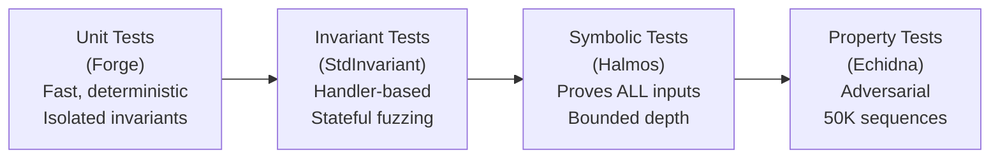

# testing.md — Multyr Core: Test Suite Architecture

**Version**: 1.0.0 | **Branch**: reorg/runbook-docs-consolidate-01a.4 | **Commit**: see footer

---

## Table of Contents

1. [Overview](#1-overview)
2. [Test Directory Structure](#2-test-directory-structure)
3. [Foundry Profiles](#3-foundry-profiles)
4. [Unit Tests](#4-unit-tests)
5. [Invariant Tests](#5-invariant-tests)
6. [Fuzz Tests](#6-fuzz-tests)
7. [Formal Verification — Halmos](#7-formal-verification--halmos)
8. [Property-Based Testing — Echidna](#8-property-based-testing--echidna)
9. [Fork Tests](#9-fork-tests)
10. [Security Tests](#10-security-tests)
11. [E2E Tests](#11-e2e-tests)
12. [How to Run — Command Cheat Sheet](#12-how-to-run--command-cheat-sheet)
13. [Coverage](#13-coverage)
14. [Glossary](#14-glossary)

---

## 1. Overview

The Multyr Core test suite uses **four verification layers**:



| Layer | Tool | Confidence | Speed | Use case |
|-------|------|-----------|-------|---------|
| Unit | Forge | Per-path | Fast | Specific behaviour + regression |
| Invariant | Forge StdInvariant | System-level | Medium | Stateful safety properties |
| Symbolic | Halmos | Exhaustive (bounded) | Slow | Arithmetic + role invariants |
| Property | Echidna | Adversarial | Slow | Solvency + accounting attacks |

**Test pass baseline** (2026-04-10 Final Shadow Readiness Report): 4888 PASS / 19 FAIL (pre-existing non-production failures). All production paths green.

---

## 2. Test Directory Structure

```
test/
├── unit/                       # Deterministic unit tests by component
│   ├── core/                   # 47 files — CoreVault + modules
│   ├── adapters/               # Strategy adapter unit tests
│   ├── capacity/               # Capacity/cap engine tests
│   ├── claims/                 # Claim processing unit tests
│   ├── config/                 # Configuration validation
│   ├── deploy/                 # Deploy script unit tests
│   ├── factory/                # Vault factory tests
│   ├── fixed-maturity/         # FixedMaturity module tests
│   ├── governance/             # Governance unit tests
│   ├── guardrails/             # BatchGuardrails unit tests
│   ├── helpers/                # Shared test helpers + mocks
│   ├── libraries/              # Library unit tests
│   ├── modules/                # Module dispatch tests
│   ├── oracle/                 # Oracle middleware tests
│   ├── periphery/              # FeeCollector, DepositRouter tests
│   ├── registry/               # SelectorRegistry tests
│   └── security/               # Unit-level security checks
├── invariants/                 # 8 StdInvariant handler-based test files
├── security/                   # 3 security-focused test files
├── e2e/                        # 15 end-to-end full-system tests
├── halmos/                     # Symbolic execution (Halmos)
├── echidna/                    # Property-based (Echidna, 5 contracts)
├── fork/                       # Arbitrum mainnet fork tests
├── fork_pre/                   # Fork pre-deployment validation
├── fork_post/                  # Fork post-deployment regression
├── fork_shared/                # Shared fork test utilities
├── fork-validation/            # Extended fork validation suite
├── integration/                # Cross-module integration tests
├── strategies/                 # USDC Lending strategy tests
├── benchmarks/                 # Gas benchmarks
└── v8/                         # Legacy v8 regression (kept for regression)
```

Key test counts per category:

| Category | Files | Description |
|----------|-------|-------------|
| `unit/core/` | 47 | CoreVault + all modules, direct unit coverage |
| `invariants/` | 8 | System, queue, governance, FM, buffer manager invariants |
| `security/` | 3 | EIP7201, share price collapse, RBAC suite |
| `e2e/` | 15 | Full flows from deposit → settle → withdraw |
| `halmos/` | 1 | Symbolic invariants I1-I3 (strategy layer) |
| `echidna/` | 5 | Property contracts (CoreVault, FeeCollector, GlobalConfig, StrategyRouter, BufferManager) |

---

## 3. Foundry Profiles

All profiles defined in `foundry.toml`. Default EVM version: `shanghai`. Fork tests use `cancun` (Arbitrum mainnet requires it).

| Profile | Command | fuzz.runs | invariant.runs | EVM | Purpose |
|---------|---------|-----------|---------------|-----|---------|
| `default` | `forge test` | 256 | 256 | shanghai | Standard CI run |
| `unit` | `FOUNDRY_PROFILE=unit forge test --match-path "test/unit/**"` | 256 | 256 | shanghai | Fast unit-only |
| `deep-security` | `forge test --profile deep-security` | 50,000 | 5,000 depth=256 | cancun | Adversarial / griefing |
| `fork_audit` | `FOUNDRY_PROFILE=fork_audit forge test --fork-url $RPC` | 5,000 | 2,000 depth=128 | cancun | Audit-grade fork |
| `fork_smoke` | `FOUNDRY_PROFILE=fork_smoke forge test --fork-url $RPC` | 256 | 100 depth=20 | cancun | Fast fork debug |
| `fork_confidence` | `FOUNDRY_PROFILE=fork_confidence forge test --fork-url $RPC` | 5,000 | 2,000 depth=128 | cancun | Pre-mainnet confidence |
| `lending_min` | `FOUNDRY_PROFILE=lending_min forge test` | 32 | — | shanghai | USDC Lending sandbox |

**Global config**:
- `optimizer = true`, `optimizer_runs = 200`, `via_ir = true`
- `gas_limit = 9999999999999` (no gas limit in tests)
- `solc_version = "0.8.28"`

**Source**: `foundry.toml`.

---

## 4. Unit Tests

### 4.1 Core Unit Tests (`test/unit/core/`)

47 files covering every major module and behaviour:

| File | What it tests |
|------|---------------|
| `CoreVault_DiamondLite_AccessControl.t.sol` | Module dispatch + role enforcement |
| `CoreVault_DiamondLite_ERC4626.t.sol` | ERC-4626 compliance (deposit/mint/withdraw/redeem) |
| `CoreVault_DiamondLite_Reentrancy.t.sol` | Reentrancy protection via FLAG_REENTRANCY_LOCKED |
| `CoreVault_DiamondLite_Routing.t.sol` | Selector → module routing correctness |
| `CoreVault_ParamTimelock.t.sol` | Submit/accept/revoke timelock cycle |
| `CoreVault_ComponentTimelock.t.sol` | FLAG_COMPONENTS_TIMELOCKED enforcement |
| `CoreVault_PauseControls.t.sol` | pause/unpause, guardian vs owner rights |
| `CoreVault_ParamFreezing.t.sol` | freezeParams + FLAG_PARAMS_FROZEN invariance |
| `CoreVault_FeeCommission.t.sol` | Fee computation + commission accounting |
| `CoreVault_HWM.t.sol` | High-watermark performance fee model |
| `ExitEngine_ForkSuite.t.sol` | Exit mode logic under fork state |
| `ExitEngine_StressTest.t.sol` | Settlement loop stress |
| `ForceWithdraw_*.t.sol` (8 files) | Force exit paths, slippage, limits, fees |
| `FuzzDeposit_FeeInvariant.t.sol` | Fuzz: deposit fee conservation |
| `FuzzWithdraw_NetExact.t.sol` | Fuzz: withdrawal net asset exactness |
| `Hardening_*.t.sol` (6 files) | Consistency, equivalence, chaos, missing coverage |
| `AuditFix_Regression.t.sol` | Regression tests for all 7 shadow-report bugs |

### 4.2 MockParamsProvider Pattern

Tests use `test/helpers/MockParamsProvider.sol` to provide controllable `IParamsProvider` implementation. This allows setting `lockPeriod`, `maxClaimsPerEpoch`, `cooldownPerClaim`, fee params in isolation without a live `GlobalConfig`.

**Source**: `src/core/modules/AdminModule.sol:73`, `src/core/modules/QueueModule.sol:207`, `src/core/storage/CoreStorage.sol:38`.

### 4.3 Key Test Patterns

**DiamondLite tests**: Tests suffixed `_DiamondLite_*.t.sol` deploy a real `CoreVault` with the actual module dispatch system (selector → module mapping). They exercise the full delegatecall path rather than unit-testing a module directly. This catches dispatch bugs (wrong role, missing selector) that pure module unit tests miss.

**ForceWithdraw cluster** (8 test files): Tests isolated concerns — allowance (`ForceWithdraw_Allowance`), lock bypass (`ForceWithdraw_BypassesLockPeriod`), fee math (`ForceWithdraw_FeeMath`), gross limits (`ForceWithdraw_LimitsGross`), owner-zero edge case (`ForceWithdraw_OwnerZero`), reentrancy guard (`ForceWithdraw_Reentrancy`), slippage (`ForceWithdraw_Slippage`). Base setup in `ForceWithdrawBase.t.sol`.

**AuditFix_Regression**: A dedicated regression file that reproduces the exact conditions of each of the 7 bugs found in the Final Shadow Readiness Report (2026-04-10). Each test is labeled with the bug number and must remain PASS at all times as a non-regression guard.

**Hardening suite** (6 files): Added post-shadow to cover paths not exercised by any other test: `Hardening_Consistency`, `Hardening_GasAndChaos`, `Hardening_MintRewardShares`, `Hardening_MissingTests`, `Hardening_RemainingItems`. These represent coverage added from the shadow report findings.

### 4.4 Fixed Maturity Unit Tests (`test/unit/fixed-maturity/`)

Dedicated test files for FixedMaturity-specific paths:
- State machine transitions (Funding → Starting → Active → Matured → Closed)
- FundingFailed path + refundClaim zero-fee behaviour
- Pre-maturity force exit penalty arithmetic (max 50% cap)
- autoCloseFunding trigger on deposit
- configureFixedMaturity boundary validation

---

## 5. Invariant Tests

### 5.1 Architecture

All invariant tests use Forge's `StdInvariant` handler pattern:

1. **Deploy** a full vault stack in `setUp()`
2. **Register** a `Handler` contract via `targetContract(address(handler))`
3. **Handler** exposes bounded mutations (deposit, claim, settle, pause, etc.)
4. **`invariant_*` functions** assert system properties after each mutation sequence

Ghost variables track state across calls (e.g., `ghost_routingWasFrozen`).

### 5.2 System Invariants (`CoreVault_System_Invariants.t.sol`)

| ID | Invariant | Description |
|----|-----------|-------------|
| SI-1 | SOLVENCY | `totalAssets >= sum of all user claims` |
| SI-2 | SHARE_ASSET_RATIO | `totalSupply * sharePrice ≈ totalAssets` |
| SI-3 | NO_INFLATION | No user can withdraw more than deposited (minus fees) |
| SI-4 | FEE_BOUNDED | Fees never exceed configured maximums |
| SI-5 | QUEUE_INTEGRITY | `queueLength() == number of pending claims` |
| SI-6 | NAV_CONSISTENCY | NAV is always consistent with underlying balances |

**Source**: `test/invariants/CoreVault_System_Invariants.t.sol`.

### 5.3 Queue Invariants (`CoreVault_ClaimsQueue_Invariants.t.sol`)

| ID | Invariant | Description |
|----|-----------|-------------|
| QI-1 | QUEUE_LENGTH | `queueLength() == number of open (unsettled, uncancelled) claims` |
| QI-2 | CLAIM_OWNERSHIP | Only claim owner can cancel their claim |
| QI-3 | MIN_CLAIM_RESPECTED | No queued claim has `grossAssets < minClaimAmount` |
| QI-4 | NO_DOUBLE_SETTLE | A claim cannot be settled twice |
| QI-5 | NO_DOUBLE_CANCEL | A claim cannot be cancelled twice |
| QI-6 | SHARES_ACCOUNTING | `totalSupply + queuedShares + cancelledShares` balance correctly |

**Source**: `test/invariants/CoreVault_ClaimsQueue_Invariants.t.sol`.

### 5.4 Governance Invariants (`Governance_Seal_Invariants.t.sol`)

| ID | Invariant | Description |
|----|-----------|-------------|
| GI-1 | SELECTOR_REGISTRY_ENFORCED | All owner selectors require ROLE_OWNER |
| GI-2 | FEECOLLECTOR_IMMUTABLE | `FeeCollector.governor` equals `rootTimelock` (immutable) |
| GI-3 | ROUTING_FROZEN_PERMANENT | Once routing frozen, cannot be unfrozen |
| GI-4 | SEALED_PERMANENT | Once sealed, system cannot be unsealed |
| GI-5 | OWNER_SELECTORS_PROTECTED | `setEcosystem` and peers always require ROLE_OWNER |
| GI-6 | GUARDIAN_CANNOT_ADMIN | Guardian address is never owner |
| GI-7 | VETOER_CANNOT_ADMIN | Vetoer address is never owner |

Handler also tracks: `ghost_failedRoleAssignments`, `ghost_blockedGuardianAdmin`, `ghost_blockedVetoerAdmin`.

**Source**: `test/invariants/Governance_Seal_Invariants.t.sol`.

### 5.5 Additional Invariant Files

| File | Focus |
|------|-------|
| `CoreVault_Adversarial_Invariants.t.sol` | Adversarial mutations: griefing, donation attacks |
| `FixedMaturity_StateView_Invariants.t.sol` | FM state machine monotone transitions |
| `RolesTimelock.invariants.t.sol` | Timelock + role interaction invariants |
| `WarmAdapter_BufferManager_Invariants.t.sol` | Buffer manager allocation invariants |
| `Invariants_Scaffold.t.sol` | Scaffold for future invariants |

---

## 6. Fuzz Tests

Fuzz tests exercise arithmetic and fee boundaries across the full USDC value range:

| File | Target | Key property |
|------|--------|-------------|
| `FuzzDeposit_FeeInvariant.t.sol` | `deposit(amount)` | Fee conservation: `gross = net + fee` exactly |
| `FuzzWithdraw_NetExact.t.sol` | `requestClaim` + settle | Net asset calculation is exact (no rounding loss) |
| `Hardening_MintFeeAlignment.t.sol` | `mint()` path | Mint fee = deposit fee at same gross amount |
| `Hardening_DepositMintEquivalence.t.sol` | Both paths | `deposit(X)` and `mint(shares(X))` give identical shares and fees |

Default fuzz runs: 256 (CI). `deep-security` profile: 50,000 runs.

---

## 7. Formal Verification — Halmos

### 7.1 Overview

`test/halmos/HalmosStrategyInvariants.t.sol` uses [Halmos](https://github.com/a16z/halmos) for symbolic execution. Halmos proves that an invariant holds for **all possible inputs** within a bounded search depth.

### 7.2 Symbolic Invariants

| ID | Test | What is proved |
|----|------|---------------|
| I1 | `check_I1_headroomNeverUnderflows` | `cap - current` never underflows; allocation capped to headroom never exceeds cap. Bounded to 1B USDC. |
| I2 | `check_I2_bpsAllocationInBounds` | `maxExposureBps <= 10000` implies allocation ≤ 100% of TVL. Avoids z3 nonlinear timeout by proving `bps <= 10000` directly without division. |
| I3 | `check_I3_reallocationConservesSum` | Any reallocation from idle to deployed preserves `deployed + idle == total`. Capital conservation proof. |

Additional symbolic tests cover RBAC role check dispatch and selector routing correctness (files in `test/halmos/` subdirectory).

### 7.3 Run Command

```bash
# Requires halmos installed
halmos --contract AllocationMathSymTest --function check_I1_headroomNeverUnderflows
halmos --contract AllocationMathSymTest --function check_I2_bpsAllocationInBounds
halmos --contract AllocationMathSymTest --function check_I3_reallocationConservesSum
```

**Source**: `test/halmos/HalmosStrategyInvariants.t.sol`.

---

## 8. Property-Based Testing — Echidna

### 8.1 Configuration (`echidna.yaml`)

```yaml
testMode:    "property"
testLimit:   50000
shrinkLimit: 5000
seqLen:      100
```

Echidna generates sequences of up to 100 calls per test, running 50,000 sequences total.

### 8.2 Property Contracts

| Contract | File | Focus |
|----------|------|-------|
| `EchidnaCoreVault` | `test/echidna/EchidnaCoreVault.sol` | Solvency, share accounting, fee bounds |
| `EchidnaFeeCollector` | `test/echidna/EchidnaFeeCollector.sol` | Fee distribution correctness |
| `EchidnaGlobalConfig` | `test/echidna/EchidnaGlobalConfig.sol` | Config boundary enforcement |
| `EchidnaStrategyRouter` | `test/echidna/EchidnaStrategyRouter.sol` | Router allocation invariants |
| `EchidnaBufferManager` | `test/echidna/EchidnaBufferManager.sol` | Buffer/reserve accounting |

**`EchidnaCoreVault` key properties**: `totalDeposited - totalWithdrawn >= vault.totalAssets()` (solvency bound), fee bps never exceed configured limits.

### 8.3 Run Command

```bash
echidna test/echidna/EchidnaCoreVault.sol --contract EchidnaCoreVault --config echidna.yaml
```

**Source**: `echidna.yaml`, `test/echidna/EchidnaCoreVault.sol`.

---

## 9. Fork Tests

### 9.1 Setup

Fork tests require an Arbitrum archive node (Chainlink heartbeat data, `transact` history):

```bash
export ARBITRUM_ARCHIVE_RPC_URL=https://arb-mainnet.g.alchemy.com/v2/YOUR_KEY
```

Pinned block: `310_000_000` (unit-level fork tests). Extended validation: block `438_222_972` (Final Shadow Readiness).

### 9.2 Fork Directory Map

| Folder | Purpose |
|--------|---------|
| `test/fork/` | Primary fork tests (strategy behaviour on live Arbitrum state) |
| `test/fork_pre/` | Pre-deployment validation (adapter health checks, oracle freshness) |
| `test/fork_post/` | Post-deployment regression (live vault state assertions) |
| `test/fork_shared/` | Shared helpers: `LendingForkBase.sol`, `addresses.json` |
| `test/fork-validation/` | Extended fork validation suite (17 domains A-O, 1950 tests) |

### 9.3 Run Commands

```bash
# Quick fork smoke
FOUNDRY_PROFILE=fork_smoke forge test --fork-url $ARBITRUM_ARCHIVE_RPC_URL -vvv

# Audit-grade (5K fuzz, 2K invariant)
FOUNDRY_PROFILE=fork_audit forge test --fork-url $ARBITRUM_ARCHIVE_RPC_URL -vv

# Rate-limited RPC
forge test --fork-url $ARBITRUM_ARCHIVE_RPC_URL --fork-retry-backoff 1000 --fork-retries 5
```

**Source**: `foundry.toml` (profiles), `test/fork_shared/`.

---

## 10. Security Tests

| File | Tests | What it verifies |
|------|-------|-----------------|
| `test/security/EIP7201Compliance.t.sol` | 5 | Storage slot values match EIP-7201 formula for all 4 namespaces + uniqueness |
| `test/security/SharePriceCollapse_Security.t.sol` | — | Share price cannot collapse via donation or inflation attack |
| `test/security/core/CoreVaultSecuritySuite.t.sol` | — | Full RBAC + reentrancy + access control suite |
| `test/security/core/LockPeriodProtection.t.sol` | — | Lock period cannot be bypassed (forceWithdraw exception verified) |

**EIP7201 namespaces tested**:
- `dsf.core.main.storage.v1` → `CoreStorage.SLOT`
- `dsf.core.fee.storage.v1` → `FeeStorage.SLOT`
- `dsf.core.queue.storage.v1` → `QueueStorage.SLOT`
- `dsf.core.fixedmaturity.storage.v1` → `FixedMaturityStorage.SLOT`

**Source**: `test/security/EIP7201Compliance.t.sol`, `src/core/storage/CoreStorage.sol:16`.

---

## 11. E2E Tests

15 files covering complete user journeys and system-level flows:

| File | Scenario |
|------|---------|
| `CoreVault_E2E.t.sol` | Deposit → queue → settle → withdraw (happy path) |
| `CoreVault_Advanced_E2E.t.sol` | Multi-user, fee crystallization, lock period |
| `Accounting_ShareAsset_E2E.t.sol` | Share/asset accounting across full cycles |
| `MoneyFlow_FullSystem_E2E.t.sol` | Full money flow: deposit → strategy → rebalance → exit |
| `Governance_ParamsToMoneyFlow_E2E.t.sol` | Governance param change → money flow impact |
| `Incentives_FullFlow_E2E.t.sol` | IncentivesEngine integration across exit flow |
| `NavDelta_Stress_ForceWithdraw_E2E.t.sol` | Force exit under NAV delta stress |
| `BufferManager_Stress_E2E.t.sol` | BufferManager under high withdrawal pressure |

E2E tests run with the `default` profile (no fork URL). They use `MockParamsProvider` and `ERC20Mock` for controlled environments.

---

## 12. How to Run — Command Cheat Sheet

| Goal | Command |
|------|---------|
| All unit tests (fast) | `FOUNDRY_PROFILE=unit forge test --match-path "test/unit/**"` |
| All tests (default) | `forge test` |
| Specific file | `forge test --match-path "test/unit/core/CoreVault_ParamTimelock.t.sol" -vvv` |
| Invariant tests | `forge test --match-path "test/invariants/**"` |
| Security tests | `forge test --match-path "test/security/**"` |
| E2E tests | `forge test --match-path "test/e2e/**"` |
| Deep-security (50K fuzz) | `forge test --profile deep-security` |
| Fork smoke | `FOUNDRY_PROFILE=fork_smoke forge test --fork-url $ARBITRUM_ARCHIVE_RPC_URL -vvv` |
| Fork audit grade | `FOUNDRY_PROFILE=fork_audit forge test --fork-url $ARBITRUM_ARCHIVE_RPC_URL -vv` |
| Echidna | `echidna test/echidna/EchidnaCoreVault.sol --contract EchidnaCoreVault --config echidna.yaml` |
| Build only | `forge build` |
| Gas report | `forge test --gas-report --match-path "test/benchmarks/**"` |

---

## 13. Coverage

Coverage is run with `forge coverage`. Key exclusions:

- Legacy files in `_legacy/` and `_archive/` (excluded from compilation)
- `test/v8/` (v8 regression, excluded from coverage)

Minimum coverage targets (not enforced in CI at this time):
- Core modules: aim for ≥ 90% line coverage
- Security paths: 100% (invariant + unit)
- Fee paths: 100% (fuzz + unit)

---

## 14. Glossary

| Term | Definition |
|------|-----------|
| **StdInvariant** | Foundry base contract for stateful invariant testing with handlers |
| **Handler** | Contract registered with `targetContract()`; exposes bounded mutations for the fuzzer |
| **Ghost variable** | Boolean/counter in a handler that tracks state across calls (e.g., `ghost_routingWasFrozen`) |
| **Halmos** | Symbolic execution tool by a16z; uses z3/bitvector solver to prove invariants exhaustively |
| **Echidna** | Adversarial property-based fuzzer; generates attack sequences to find invariant violations |
| **EIP-7201** | Namespaced storage standard: `SLOT = keccak256(abi.encode(uint256(keccak256(ns)) - 1)) & ~0xff` |
| **fork_pre** | Pre-deployment fork tests: validate adapter/oracle health before deploy |
| **fork_post** | Post-deployment fork tests: validate live vault state after deploy |
| **MockParamsProvider** | Test helper implementing `IParamsProvider` with settable params for isolation |
| **deep-security profile** | 50K fuzz + 5K invariant runs; used for audit-grade adversarial testing |

---

## Appendix: Code Reference Index

| Symbol | File | Notes |
|--------|------|-------|
| `foundry.toml` profiles | `foundry.toml:L1-L130` | All 7 profiles + fuzz config |
| `echidna.yaml` | `echidna.yaml` | testMode=property, testLimit=50000, seqLen=100 |
| `CoreVault_System_Invariants` | `test/invariants/CoreVault_System_Invariants.t.sol` | SI-1 through SI-6 |
| `CoreVault_ClaimsQueue_Invariants` | `test/invariants/CoreVault_ClaimsQueue_Invariants.t.sol` | QI-1 through QI-6 |
| `Governance_Seal_Invariants` | `test/invariants/Governance_Seal_Invariants.t.sol` | GI-1 through GI-7 + GovernanceHandler |
| `AllocationMathSymTest` | `test/halmos/HalmosStrategyInvariants.t.sol` | I1-I3 symbolic proofs |
| `EchidnaCoreVault` | `test/echidna/EchidnaCoreVault.sol` | Solvency + fee bounds |
| `EIP7201ComplianceTest` | `test/security/EIP7201Compliance.t.sol` | 5 slot compliance tests |
| `MockParamsProvider` | `test/helpers/MockParamsProvider.sol` | Controlled IParamsProvider for isolation |
| `CoreStorage.SLOT` | `src/core/storage/CoreStorage.sol:16` | `dsf.core.main.storage.v1` |
| `FeeStorage.SLOT` | `src/core/storage/FeeStorage.sol:9` | `dsf.core.fee.storage.v1` |
| `QueueStorage.SLOT` | `src/core/storage/QueueStorage.sol:9` | `dsf.core.queue.storage.v1` |
| `FixedMaturityStorage.SLOT` | `src/core/storage/FixedMaturityStorage.sol:27` | `dsf.core.fixedmaturity.storage.v1` |

---

## Footer

**Commit SHA**: `544c4b3e` (branch head at time of authoring; see git log for current SHA)

**Sources read** (ADR-015 §5):

| File | Lines | Read at |
|------|-------|---------|
| `foundry.toml` | ~130L | Full |
| `echidna.yaml` | 9L | Full |
| `test/invariants/CoreVault_System_Invariants.t.sol` | ~400L | Header + invariant functions |
| `test/invariants/CoreVault_ClaimsQueue_Invariants.t.sol` | ~400L | Header + invariant functions |
| `test/invariants/Governance_Seal_Invariants.t.sol` | 520L | Full |
| `test/halmos/HalmosStrategyInvariants.t.sol` | ~180L | Full |
| `test/security/EIP7201Compliance.t.sol` | 49L | Full |
| `test/echidna/EchidnaCoreVault.sol` | ~80L | Header |
| `docs/09-audit/FM_CORE_AUDITOR_BRIEF.md` | ~60L | Scope section |
| `docs/09-audit/FINAL-SHADOW-READINESS-REPORT.md` | ~80L | Executive summary |

**Discrepancies found** (ADR-015 §5):

1. **`test/halmos/`**: Contains additional subdirectory with symbolic tests beyond the main `HalmosStrategyInvariants.t.sol`. The halmos config files `halmos-fm-guards.json` and `halmos-selector-results.json` at repo root contain results from prior symbolic runs. These are not committed output but snapshot files.

2. **Fork test split**: 4 fork directories (`fork/`, `fork_pre/`, `fork_post/`, `fork_shared/`) remain separate. RUNBOOK-STRUCTURE-02 (pending) targets consolidation into 1 folder. Current state: fork paths work but are fragmented.

3. **`test/v8/`**: Legacy v8 regression tests included in compilation but not CI-targeted. Present to preserve historical regression baseline.

---

*Generated from code — not from existing documentation. Authoritative source: files listed above.*

<!-- testing.md — Multyr Core v1.0.0 -->
