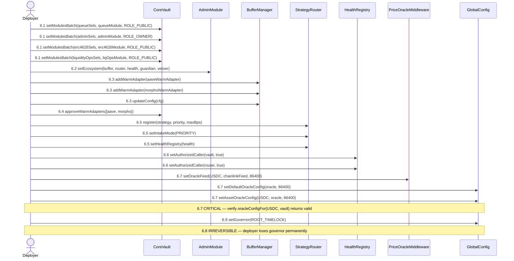
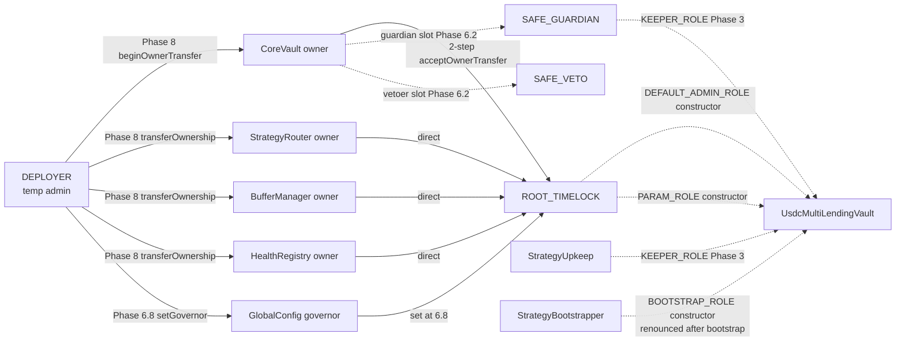

# Wiring — multyr-core

Covers the full wiring lifecycle for CoreVault and its satellite contracts: module routing, ecosystem
configuration, sealing, ownership transfer, and post-deploy verification. Companion to
`multyr-core/docs/deployment.md` (deploy phases) and `multyr-strategies/docs/wiring.md`
(strategy-side grants).

---

## 1. Selector-Role Model

CoreVault uses a custom selector-gating mechanism, **not** OZ AccessControl. Every callable
selector is registered in an internal mapping with one of four role constants
(`src/core/CoreVault.sol:71-74`):

| Constant | Value | Scope |
|---|---|---|
| `ROLE_PUBLIC` | `0` | Anyone — deposit/withdraw/queue views |
| `ROLE_OWNER` | `1` | Owner only — governance selectors |
| `ROLE_GUARDIAN` | `2` | Guardian only — pause, guardianPause |
| `ROLE_OWNER_OR_GUARDIAN` | `3` | Either — emergency-adjacent selectors |

These constants live in `src/core/CoreVault.sol:71-74` and are mirrored in
`src/core/libraries/SelectorLib.sol:17-18` and `src/core/libraries/SelectorRegistry.sol:31-34`.

The dispatch gate in `src/core/CoreVault.sol:152-163` checks `msg.sender` against
`core.owner` (for ROLE_OWNER) and `core.guardian` (for ROLE_GUARDIAN). There is **no role
grant/revoke** for these — they are address-slot checks, not OZ ACL bits.

---

## 2. Role / Access Matrix

| Role / Slot | Defined at | Initial holder | Final holder | Grant mechanism |
|---|---|---|---|---|
| `ROLE_OWNER` (owner slot) | `src/core/CoreVault.sol:72` | Deployer | ROOT_TIMELOCK | 2-step via `beginOwnerTransfer` / `acceptOwnerTransfer` (`src/core/CoreVault.sol:394-406`) |
| `ROLE_GUARDIAN` (guardian slot) | `src/core/CoreVault.sol:73` | SAFE_GUARDIAN | SAFE_GUARDIAN | `setEcosystem` call (`src/core/modules/AdminModule.sol:370`) |
| Vetoer slot | `src/core/CoreVault.sol:489` | SAFE_VETO | SAFE_VETO | `setEcosystem` optional field |
| `StrategyRouter.owner` | `src/core/modules/StrategyRouter.sol:22` | Deployer | ROOT_TIMELOCK | direct `transferOwnership` (`src/core/modules/StrategyRouter.sol:253`) |
| `BufferManager.owner` | `src/core/modules/BufferManager.sol:47` | Deployer | ROOT_TIMELOCK | direct `transferOwnership` (`src/core/modules/BufferManager.sol:123`) |
| `StrategyHealthRegistry.owner` | `src/core/modules/StrategyHealthRegistry.sol:20` | Deployer | ROOT_TIMELOCK | direct `transferOwnership` (`src/core/modules/StrategyHealthRegistry.sol:181`) |
| `FeeCollector.governor` | `src/core/modules/FeeCollector.sol:21` | Passed in constructor (immutable) | ROOT_TIMELOCK | immutable — set at deploy, no setter |
| `GlobalConfig.governor` | `src/core/config/GlobalConfig.sol:147` | Deployer | ROOT_TIMELOCK | `setGovernor` (`src/core/config/GlobalConfig.sol:338`) after oracle config |
| `ProtocolRegistry.EXECUTOR_ROLE` | `src/registry/ProtocolRegistryWithTimelock.sol:18` | multisig (SAFE) | SAFE | OZ ACL `grantRole` |
| `ProtocolRegistry.VETOER_ROLE` | `src/registry/ProtocolRegistryWithTimelock.sol:19` | admin → SAFE_VETO | SAFE_VETO | OZ ACL `grantRole` |
| `ProtocolRegistry.EMERGENCY_ROLE` | `src/registry/ProtocolRegistryWithTimelock.sol:20` | admin | admin | OZ ACL `grantRole` |

**Audit-class:**
- CRITICAL: `ROLE_OWNER`, `GlobalConfig.governor`, `FeeCollector.governor` — direct treasury and protocol param control
- HIGH: `StrategyRouter.owner`, `BufferManager.owner`, `StrategyHealthRegistry.owner` — can affect deposit routing and health checks
- MEDIUM: `ROLE_GUARDIAN` — can pause but not drain; `ROLE_VETOER` — veto window only
- LOW: `REGISTRY_ADMIN`, `EMERGENCY_ROLE` — registry metadata, not funds-path

---

## 3. Phase 6 — Wiring Sequence

All steps executed by Deployer EOA during the post-deploy configuration window, before any
ownership transfer. Script: `multyr-core/script/DeployCoreSystem.s.sol` (lines 417-512).



### Step 6.1: Module Routing

Route selectors to modules via `src/core/CoreVault.sol:272`:

```solidity
vault.setModulesBatch(queueSelectors, repeatAddress(queueModule, n), repeatRole(ROLE_PUBLIC, n));
vault.setModulesBatch(adminSelectors, repeatAddress(adminModule, n), repeatRole(ROLE_OWNER, n));
vault.setModulesBatch(erc4626Selectors, repeatAddress(erc4626Module, n), repeatRole(ROLE_PUBLIC, n));
vault.setModulesBatch(liquidityOpsSelectors, repeatAddress(liqOps, n), repeatRole(ROLE_PUBLIC, n));
```

Cannot be called after `freezeRouting()`. Verified by `src/core/libraries/SelectorLib.sol:231-316`
(role-class checks per selector category).

### Step 6.2: Ecosystem Configuration

`src/core/modules/AdminModule.sol:370`:

```solidity
IAdminModule(vault).setEcosystem(EcosystemConfig({
    bufferManager: address(bufferManager),
    strategyRouter: address(router),
    healthRegistry: address(healthRegistry),
    incentives: address(0),       // or incentivesEngine
    guardian: SAFE_GUARDIAN,
    vetoer: SAFE_VETO             // optional, address(0) skips
}));
```

### Step 6.3: BufferManager Setup

`src/core/modules/BufferManager.sol:763` (addWarmAdapter) and `:156` (updateConfig):

```solidity
bufferManager.addWarmAdapter(aaveWarmAdapter);
bufferManager.addWarmAdapter(morphoWarmAdapter);
bufferManager.updateConfig(config);  // unpause
```

### Step 6.4: CoreVault Warm Adapter Approval

`src/core/CoreVault.sol:825`:

```solidity
vault.approveWarmAdapters([aaveWarmAdapter, morphoWarmAdapter]);
```

### Step 6.5: StrategyRouter Setup

`src/core/modules/StrategyRouter.sol:196` (register), `:225` (setIntakeMode), `:158` (setHealthRegistry):

```solidity
router.register(strategy, priority, maxBps);
router.setIntakeMode(IntakeMode.PRIORITY);
router.setHealthRegistry(address(healthRegistry));
```

### Step 6.6: HealthRegistry Authorization

`src/core/modules/StrategyHealthRegistry.sol:163`:

```solidity
healthRegistry.setAuthorizedCaller(address(vault), true);
healthRegistry.setAuthorizedCaller(address(router), true);
```

### Step 6.7: Oracle Configuration (CRITICAL)

**StrategyRouter hard-fails on deposit/withdraw without oracle config.**
Oracle staleness: 86400s (Chainlink USDC/USD 24h heartbeat). Ref:
`multyr-core/script/DeployCoreSystem.s.sol:503-507`.

```solidity
priceOracle.setOracleFeed(USDC, chainlinkFeed, 86400);     // src/core/modules/PriceOracleMiddleware.sol:65
globalConfig.setDefaultOracleConfig(address(priceOracle), 86400);  // src/core/config/GlobalConfig.sol:415
globalConfig.setAssetOracleConfig(USDC, address(priceOracle), 86400);  // src/core/config/GlobalConfig.sol:428
(address o, uint256 s) = globalConfig.oracleConfigFor(USDC, address(vault));  // src/core/config/GlobalConfig.sol:815
require(o == address(priceOracle) && s == 86400, "oracle mismatch");
```

### Step 6.8: GlobalConfig Governor Transfer

`src/core/config/GlobalConfig.sol:338`. **MUST execute AFTER oracle config** — once transferred,
deployer cannot call `setDefaultOracleConfig` again.

```solidity
globalConfig.setGovernor(ROOT_TIMELOCK);
require(globalConfig.governor() == ROOT_TIMELOCK, "gov not set");
```

---

## 4. Phase 7 — Sealing

Sealing is IRREVERSIBLE. Execute only after Phase 5.7 smoke tests pass.

### Step 7.1: Freeze Routing

`src/core/CoreVault.sol:304`. **IRREVERSIBLE** — selectors cannot be re-routed after this call.

```solidity
vault.freezeRouting();
require(vault.isRoutingFrozen(), "routing not frozen");
```

### Step 7.2: Enable Components Timelock

`src/core/modules/AdminModule.sol:596`. **IRREVERSIBLE** — all `BufferManager`, `StrategyRouter`,
`HealthRegistry` changes require timelock after this call.

```solidity
IAdminModule(vault).enableComponentsTimelock();
```

### Step 7.3: Set Selector Registry

`src/core/CoreVault.sol:256`:

```solidity
vault.setSelectorRegistry(address(selectorRegistry));
```

### Step 7.4: Set Authorized Sealer

`src/core/CoreVault.sol:353`. Can be set only once (reverts if `authorizedSealer != address(0)` and
not sealed).

```solidity
vault.setAuthorizedSealer(address(systemSealer));
```

### Step 7.5: Prepare + Seal (via ROOT_TIMELOCK)

`src/core/CoreVault.sol:361` (prepareSeal) and `:371` (sealFinalState):

```solidity
systemSealer.prepareSeal(configHash);     // called by authorizedSealer
vault.sealFinalState(configHash);         // called by owner (ROOT_TIMELOCK via proposal)
require(vault.isSystemSealed(), "not sealed");
```

---

## 5. Phase 8 — Ownership Transfer

### CoreVault (2-step)

`src/core/CoreVault.sol:394` (beginOwnerTransfer) and `:400` (acceptOwnerTransfer):

```solidity
vault.beginOwnerTransfer(ROOT_TIMELOCK);
// ROOT_TIMELOCK batch proposal calls:
vault.acceptOwnerTransfer();
```

### Direct Transfers (single-step)

`src/core/modules/StrategyRouter.sol:253`, `src/core/modules/BufferManager.sol:123`,
`src/core/modules/StrategyHealthRegistry.sol:181`:

```solidity
router.transferOwnership(ROOT_TIMELOCK);
bufferManager.transferOwnership(ROOT_TIMELOCK);
healthRegistry.transferOwnership(ROOT_TIMELOCK);
// NOTE: priceOracle.transferOwnership also single-step
// NOTE: globalConfig.setGovernor(ROOT_TIMELOCK) already done at Step 6.8
```

### Periphery (Ownable2Step — 2-step)

```solidity
opsCollector.transferOwnership(ROOT_TIMELOCK);    // src/periphery/ops/OpsCollectorV2.sol (Ownable2Step)
feeDistributor.transferOwnership(ROOT_TIMELOCK);  // src/periphery/rewards/FeeDistributorV2.sol (Ownable2Step)
epochPayout.transferOwnership(ROOT_TIMELOCK);     // src/periphery/rewards/EpochPayout.sol (Ownable2Step)
partnerRegistry.transferOwnership(ROOT_TIMELOCK); // src/periphery/partner/PartnerRegistry.sol (Ownable2Step)
// ROOT_TIMELOCK batch: acceptOwnership() on each
```

---

## 6. Phase 8.5 — 30-Item Wiring Verification Checklist

All checks use `cast call` against live Arbitrum. Canonical source:
`docs/09-audit/deployment-map-appendix.md:514-540`.

### Core (10 checks)

| # | Check | Expected |
|---|---|---|
| 1 | `vault.owner()` | ROOT_TIMELOCK |
| 2 | `vault.guardian()` (`src/core/CoreVault.sol:470`) | SAFE_GUARDIAN |
| 3 | `vault.vetoer()` (`src/core/CoreVault.sol:489`) | SAFE_VETO |
| 4 | `vault.isRoutingFrozen()` (`src/core/CoreVault.sol:319`) | `true` (post-seal) |
| 5 | `vault.isSystemSealed()` (`src/core/CoreVault.sol:348`) | `true` (post-seal) |
| 6 | `router.owner()` (`src/core/modules/StrategyRouter.sol:22`) | ROOT_TIMELOCK |
| 7 | `bufferManager.owner()` (`src/core/modules/BufferManager.sol:47`) | ROOT_TIMELOCK |
| 8 | `healthRegistry.owner()` (`src/core/modules/StrategyHealthRegistry.sol:20`) | ROOT_TIMELOCK |
| 9 | `feeCollector.governor()` (`src/core/modules/FeeCollector.sol:21`) | ROOT_TIMELOCK |
| 10 | `globalConfig.governor()` (`src/core/config/GlobalConfig.sol:147`) | ROOT_TIMELOCK |

### Strategy (4 checks)

| # | Check | Expected |
|---|---|---|
| 11 | `strategy.hasRole(CORE_ROLE, vault)` (`src/strategies/usdc-lending/controller/StrategyStorageLayout.sol:98`) | `true` |
| 12 | `strategy.hasRole(CORE_ROLE, router)` (`src/strategies/usdc-lending/controller/StrategyStorageLayout.sol:98`) | `true` |
| 13 | `strategy.hasRole(DEFAULT_ADMIN_ROLE, ROOT_TIMELOCK)` | `true` |
| 14 | `router.isStrategyEnabled(strategy)` (`src/core/modules/StrategyRouter.sol:267`) | `true` |

### Periphery Ownership (4 checks)

| # | Check | Expected |
|---|---|---|
| 15 | `opsCollector.owner()` | ROOT_TIMELOCK |
| 16 | `feeDistributor.owner()` | ROOT_TIMELOCK |
| 17 | `epochPayout.owner()` | ROOT_TIMELOCK |
| 18 | `partnerRegistry.owner()` | ROOT_TIMELOCK |

### Periphery Wiring (12 checks)

| # | Check | Expected |
|---|---|---|
| 19 | `opsCollector.feeDistributor()` (`src/periphery/ops/OpsCollectorV2.sol:84`) | feeDistributor address |
| 20 | `feeDistributor.epochPayout()` (`src/periphery/rewards/FeeDistributorV2.sol:59`) | epochPayout address |
| 21 | `feeDistributor.vault()` | vault address |
| 22 | `referralBinding.authorizedRouter(depositRouter)` (`src/periphery/referral/ReferralBinding.sol:32`) | `true` |
| 23 | `depositRouter.vault()` | vault address |
| 24 | `depositRouter.ASSET()` (`src/periphery/router/DepositRouter.sol:103`) | USDC `0xaf88d065e77c8cC2239327C5EDb3A432268e5831` |
| 25 | `depositRouter.PERMIT2()` (`src/periphery/router/DepositRouter.sol:121`) | Permit2 `0x000000000022D473030F116dDEE9F6B43aC78BA3` |
| 26 | `depositRouter.REFERRAL_BINDING()` (`src/periphery/router/DepositRouter.sol:122`) | referralBinding address |
| 27 | `feeCollector.treasury()` (`src/core/modules/FeeCollector.sol:24`) | TREASURY multisig |
| 28 | `feeCollector.opsCollector()` | opsCollector address (NOT raw ops wallet) |
| 29 | `feeCollector.safetyReserveVault()` (`src/core/modules/FeeCollector.sol:26`) | SAFETY_RESERVE vault |
| 30 | `feeCollector.treasuryBps() + safetyReserveBps` ≤ 10000 (`src/core/modules/FeeCollector.sol:29-30`) | valid split |

### Cast Commands Reference (All 30 Checks)

Replace `$VAULT`, `$ROUTER`, etc. with addresses from `broadcast/core-addresses.json`.

```bash
# Core (1-10)
cast call $VAULT "owner()(address)"
cast call $VAULT "guardian()(address)"
cast call $VAULT "vetoer()(address)"
cast call $VAULT "isRoutingFrozen()(bool)"
cast call $VAULT "isSystemSealed()(bool)"
cast call $ROUTER "owner()(address)"
cast call $BUFFER "owner()(address)"
cast call $HEALTH "owner()(address)"
cast call $FEE_COLLECTOR "governor()(address)"
cast call $GLOBAL_CONFIG "governor()(address)"

# Strategy (11-14)
cast call $STRATEGY "hasRole(bytes32,address)(bool)" \
    $(cast keccak "CORE_ROLE") $VAULT
cast call $STRATEGY "hasRole(bytes32,address)(bool)" \
    $(cast keccak "CORE_ROLE") $ROUTER
cast call $STRATEGY "hasRole(bytes32,address)(bool)" \
    $(cast keccak "DEFAULT_ADMIN_ROLE") $ROOT_TIMELOCK
cast call $ROUTER "isStrategyEnabled(address)(bool)" $STRATEGY

# Periphery ownership (15-18)
cast call $OPS_COLLECTOR "owner()(address)"
cast call $FEE_DISTRIBUTOR "owner()(address)"
cast call $EPOCH_PAYOUT "owner()(address)"
cast call $PARTNER_REGISTRY "owner()(address)"

# Periphery wiring (19-30)
cast call $OPS_COLLECTOR "feeDistributor()(address)"
cast call $FEE_DISTRIBUTOR "epochPayout()(address)"
cast call $FEE_DISTRIBUTOR "vault()(address)"
cast call $REFERRAL_BINDING "authorizedRouter(address)(bool)" $DEPOSIT_ROUTER
cast call $DEPOSIT_ROUTER "vault()(address)"
cast call $DEPOSIT_ROUTER "ASSET()(address)"
cast call $DEPOSIT_ROUTER "PERMIT2()(address)"
cast call $DEPOSIT_ROUTER "REFERRAL_BINDING()(address)"
cast call $FEE_COLLECTOR "treasury()(address)"
cast call $FEE_COLLECTOR "opsCollector()(address)"
cast call $FEE_COLLECTOR "safetyReserveVault()(address)"
python3 -c "
import subprocess, json
t = int(subprocess.check_output(['cast','call','$FEE_COLLECTOR','treasuryBps()(uint16)']).strip())
s = int(subprocess.check_output(['cast','call','$FEE_COLLECTOR','safetyReserveBps()(uint16)']).strip())
assert t + s <= 10000, f'BPS overflow: {t}+{s}={t+s}'
print(f'BPS split OK: treasury={t} safety={s} sum={t+s}')
"
```

---

## 7. Idempotency Invariants

| Operation | Status | Source | Notes |
|---|---|---|---|
| `vault.setModulesBatch(...)` | ✅ Idempotent | `src/core/CoreVault.sol:272` | Re-setting same selector/module/role is a no-op; reverts if routing frozen |
| `bufferManager.addWarmAdapter(addr)` | ⚠️ Check | `src/core/modules/BufferManager.sol:763` | Should not double-register; verify no re-entry path |
| `router.register(strategy, prio, bps)` | ⚠️ Check | `src/core/modules/StrategyRouter.sol:196` | Re-registration reverts if already registered with same address |
| `healthRegistry.setAuthorizedCaller(addr, true)` | ✅ Idempotent | `src/core/modules/StrategyHealthRegistry.sol:163` | Boolean set — safe to repeat |
| `bootstrapper.bootstrap(adapters[])` | ❌ NOT idempotent | `src/strategies/usdc-lending/StrategyBootstrapper.sol:87` | Renounces BOOTSTRAP_ROLE permanently after first call; second call reverts |
| `vault.freezeRouting()` | ❌ NOT idempotent | `src/core/CoreVault.sol:304` | IRREVERSIBLE — reverts if already frozen; cannot unfreeze |
| `IAdminModule(vault).enableComponentsTimelock()` | ❌ NOT idempotent | `src/core/modules/AdminModule.sol:596` | IRREVERSIBLE — FLAG_COMPONENTS_TIMELOCKED is a one-way bit |
| `globalConfig.setGovernor(addr)` | ⚠️ Careful | `src/core/config/GlobalConfig.sol:338` | Once transferred to timelock, deployer loses the ability to call again; all subsequent calls require timelock proposal |

**Bootstrap renounce invariant** (`src/strategies/usdc-lending/StrategyBootstrapper.sol:116-117`):
after `bootstrap()` completes, `strategy.hasRole(BOOTSTRAP_ROLE, bootstrapper) == false`. No address
retains BOOTSTRAP_ROLE. Verifiable via `strategy.getRoleMemberCount(BOOTSTRAP_ROLE) == 0`.

---

## 8. Unwiring Procedure

### Pre-Seal (Full Recovery Possible)

At any point before `freezeRouting()` is called, the following recovery operations are available:

1. Re-route selectors: `vault.setModulesBatch(sels, newModule, role)` — `src/core/CoreVault.sol:272`
2. Transfer vault ownership: `vault.beginOwnerTransfer(newOwner)` → `vault.acceptOwnerTransfer()` — `src/core/CoreVault.sol:394-400`
3. Transfer router ownership: `router.transferOwnership(newOwner)` — `src/core/modules/StrategyRouter.sol:253`
4. Transfer bufferManager: `bufferManager.transferOwnership(newOwner)` — `src/core/modules/BufferManager.sol:123`
5. Transfer healthRegistry: `healthRegistry.transferOwnership(newOwner)` — `src/core/modules/StrategyHealthRegistry.sol:181`
6. Transfer globalConfig governor: `globalConfig.setGovernor(newGov)` — `src/core/config/GlobalConfig.sol:338`
7. Revoke strategy roles (pre-renounce): `strategy.revokeRole(KEEPER_ROLE, upkeep)` — `src/strategies/usdc-lending/controller/StrategyStorageLayout.sol:97`

### Post-Seal (Limited Recovery Only)

After `freezeRouting()` (`src/core/CoreVault.sol:304`) and `sealFinalState()`
(`src/core/CoreVault.sol:371`):

- **Selector re-routing: IMPOSSIBLE** — `FLAG_ROUTING_FROZEN` blocks `setModulesBatch`
- **Module changes: require timelock** — `FLAG_COMPONENTS_TIMELOCKED` requires ROOT_TIMELOCK proposal
- **Ownership transfer: still possible** via timelock proposal on `vault.beginOwnerTransfer`
- **Adapter quarantine**: `strategy.quarantineAdapter(idx)` — verify function exists in `src/strategies/usdc-lending/controller/UsdcLendingStrategy.sol`
- **Emergency exit per-adapter**: `strategy.emergencyExit(adapterIdx)` — verify in source
- **GlobalConfig governor**: can be changed via `globalConfig.setGovernor(newGov)` only if caller is current governor (timelock)

---

## 9. Multi-Sig Flow

Phase 8 ownership transfers and post-seal governance proposals require Safe batch transactions.
Reference batch file: `docs/ops/safe-batch-v7-hardening.json` (offline-signed).

Safe batch pattern for Phase 8:
```json
{
  "transactions": [
    { "to": "vault",         "data": "acceptOwnerTransfer()" },
    { "to": "router",        "data": "transferOwnership(ROOT_TIMELOCK)" },
    { "to": "bufferManager", "data": "transferOwnership(ROOT_TIMELOCK)" },
    { "to": "healthRegistry","data": "transferOwnership(ROOT_TIMELOCK)" }
  ]
}
```

ROOT_TIMELOCK minimum delay: `multyr-core/script/DeployCoreSystem.s.sol:228` (set at deploy).
Post-seal proposals via `ROOT_TIMELOCK.schedule()` + `ROOT_TIMELOCK.execute()` with 2-day delay.

---

## 10. Audit-Class Assertion Mapping

The following wiring invariants are CRITICAL for audit scope and must each have a passing
`cast call` or forge test assertion at audit delivery time.

| Invariant | Audit Class | Verification |
|---|---|---|
| `vault.owner() == ROOT_TIMELOCK` | CRITICAL | Check 1 (§6) |
| `feeCollector.governor() == ROOT_TIMELOCK` | CRITICAL | Check 9 (§6) |
| `globalConfig.governor() == ROOT_TIMELOCK` | CRITICAL | Check 10 (§6) |
| `vault.isSystemSealed() == true` | CRITICAL | Check 5 (§6) |
| `strategy.hasRole(CORE_ROLE, vault)` | HIGH | Check 11 (§6) |
| `strategy.hasRole(CORE_ROLE, router)` | HIGH | Check 12 (§6) |
| `bootstrapper` has no BOOTSTRAP_ROLE post-bootstrap | HIGH | `getRoleMemberCount(BOOTSTRAP_ROLE) == 0` |
| `healthRegistry.setAuthorizedCaller(vault, true)` | HIGH | Off-chain via `healthRegistry.isAuthorizedCaller(vault)` |
| `router.isStrategyEnabled(strategy)` | MEDIUM | Check 14 (§6) |
| `referralBinding.authorizedRouter(depositRouter)` | MEDIUM | Check 22 (§6) |
| BPS sum invariant (check 30) | MEDIUM | `treasuryBps + safetyBps ≤ 10000` |
| Deployer has no ROLE_OWNER post-Phase 8 | CRITICAL | `vault.owner() != deployer` |
| Deployer has no DEFAULT_ADMIN_ROLE on strategy post-renounce | HIGH | `strategy.hasRole(DEFAULT_ADMIN_ROLE, deployer) == false` |

---

## 11. Role Dependency Graph


