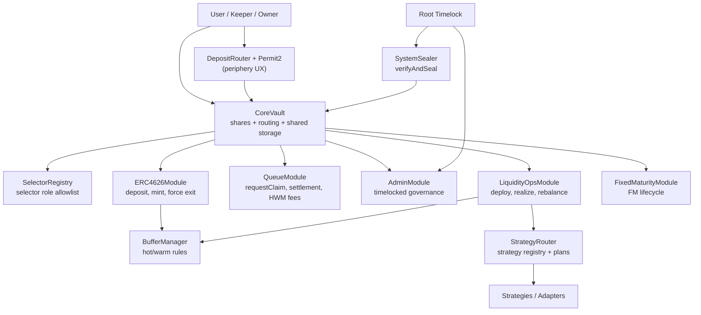
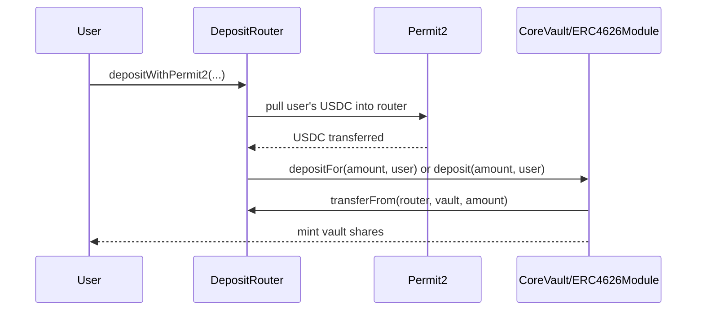
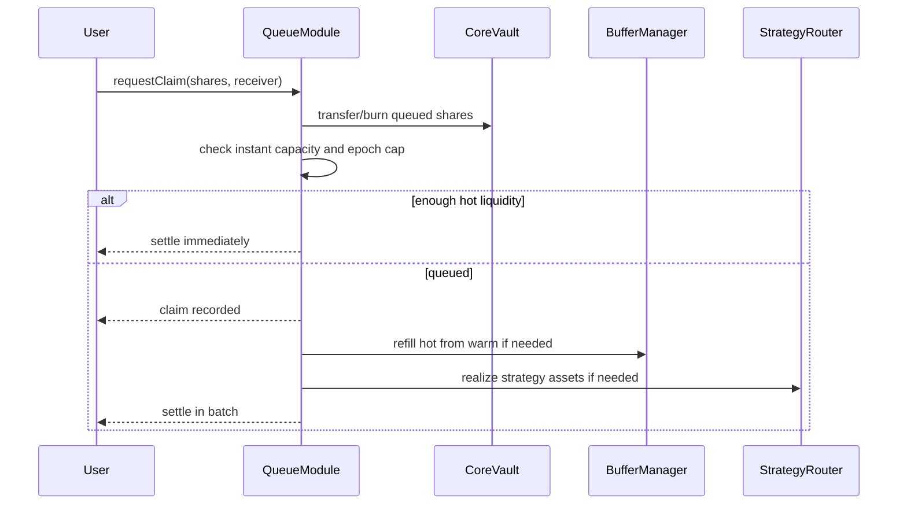
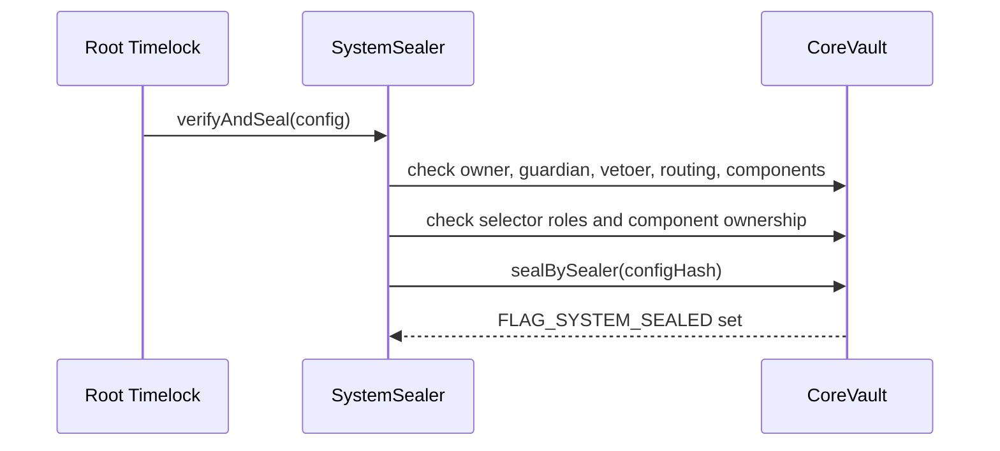

# Architecture Understanding

Final review snapshot for the Multyr Core sprint.

This document explains the system as it is intended to be walked through in the
review: vault architecture, module boundaries, important flows, security
invariants, and how the sprint fixes fit into the design.

## 1. System Summary

Multyr Core is a modular USDC vault with ERC-4626-style entry, asynchronous
standard exits, force-exit paths, hot/warm/strategy liquidity tiers, and
timelocked governance. `CoreVault` owns the share token and shared storage.
Business logic is split into modules that are called through a diamond-lite
selector router.

The system has four big ideas:

- **Diamond-lite modularity**: `CoreVault` routes selectors to modules through
  `delegatecall`, while module and selector permissions are validated by
  `SelectorRegistry`.
- **Tiered liquidity**: assets are held as hot vault USDC, warm adapter
  liquidity, and strategy allocations behind `StrategyRouter`.
- **Queued withdrawals**: normal `withdraw` and `redeem` are disabled. Users
  request claims through `QueueModule` and are settled under epoch rules.
- **Production sealing**: after deployment wiring is frozen and ownership has
  moved to the root timelock, `SystemSealer.verifyAndSeal` checks invariants and
  atomically seals the vault.

## 2. Component Map

## 3. Component Responsibilities

| Component | Responsibility |
|---|---|
| `CoreVault` | Share token, ERC-4626 surface, selector routing, ownership, pause, module authorization, seal state |
| `ERC4626Module` | Deposits, exact-share minting, force exits, deposit limits, entry-side fees |
| `QueueModule` | Asynchronous claims, queue settlement, epoch processing, performance fee crystallization |
| `AdminModule` | Governance setters, timelocked parameter changes, component timelocks, dead deposit setup |
| `LiquidityOpsModule` | Deploy hot surplus, realize strategy funds, rebalance strategy allocations |
| `FixedMaturityModule` | Fixed-maturity funding, activation, maturity, refund, and close states |
| `BufferManager` | Hot/warm target policy, warm adapter movement, refill logic |
| `StrategyRouter` | Strategy registry, enabled strategy checks, deposit/redeem plans, force redeem |
| `SelectorRegistry` | Immutable selector-to-role allowlist |
| `SystemSealer` | Final production invariant verification and atomic seal |
| `FeeCollector` | Treasury/fee recipient governance and fee accounting boundary |
| `GlobalConfig` | Global protocol limits and config values |
| `VaultFactory` | Registry/discovery of deployed vaults; active deployment is script-driven |
| `DepositRouter` | Periphery UX for Permit2 deposits and referrals |

`VaultFactory` is best understood as a registry in the current architecture.
Deployment is handled by scripts and helpers. The factory records already
deployed vaults, validates basic metadata such as asset address, and emits
events for indexing/subgraph discovery.

## 4. CoreVault Routing Model

`CoreVault` is the only share-token contract. It implements the ERC-20/ERC-4626
surface and stores canonical vault state. Most user-facing and governance
selectors are routed to modules.

There are two routing paths:

- Explicit functions on `CoreVault`, such as `deposit`, `mint`, `totalAssets`,
  ownership reads, module setup, routing freeze, and seal functions.
- Fallback-routed functions, where `CoreVault.fallback()` looks up
  `moduleOf[msg.sig]`, checks `roleOf[msg.sig]`, and delegates to the module.

Role constants:

| Role | Meaning |
|---|---|
| `ROLE_PUBLIC` | Anyone can call |
| `ROLE_OWNER` | Only vault owner/root timelock |
| `ROLE_GUARDIAN` | Only guardian |
| `ROLE_OWNER_OR_GUARDIAN` | Owner or guardian |
| `ROLE_MODULE` | Only the vault itself/module context |

`SelectorRegistry` is the immutable source of truth for allowed selectors and
their required roles. `CoreVault.setModule` and deployment scripts must match
the registry, otherwise selector wiring reverts.

Important sprint role changes:

- `depositFor` is now the two-argument selector
  `depositFor(uint256,address)`.
- `deployToStrategiesWithPlan` is no longer public. It requires
  `ROLE_OWNER_OR_GUARDIAN` because the caller supplies an allocation plan.

## 5. Storage Model

Modules use EIP-7201-style namespaced storage libraries. Because modules execute
with `delegatecall`, each module reads and writes the vault's storage, not its
own deployment storage.

| Storage Library | Main Responsibility |
|---|---|
| `CoreStorage` | owner, guardian, modules, roles, core components, flags |
| `FeeStorage` | deposit/withdraw/force fees, performance fee params, pending timelocks |
| `QueueStorage` | claims, queue pointers, epoch settlement accounting |
| `FixedMaturityStorage` | vault mode, FM state, funding/maturity settings |

`CoreStorage.packedFlags` is a `uint256` bitmap. Important flags include:

- `FLAG_PAUSED`, `FLAG_PAUSED_DEPOSITS`, `FLAG_PAUSED_WITHDRAWALS`
- `FLAG_ROUTING_FROZEN`
- `FLAG_COMPONENTS_TIMELOCKED`
- `FLAG_SYSTEM_SEALED`
- `FLAG_DEAD_DEPOSIT_DONE`
- `FLAG_FEES_INITIALIZED`
- `FLAG_PERF_INITIALIZED`
- `FLAG_REENTRANCY_LOCKED`

Using a full `uint256` bitmap is normal in Solidity: it fits one storage slot,
matches EVM word size, and leaves room for future flags.

## 6. NAV and Liquidity Tiers

The vault tracks assets through three liquidity buckets:

- **Hot**: USDC held directly by `CoreVault`.
- **Warm**: assets held in warm adapters, managed through `BufferManager`.
- **Strategy**: assets deployed to registered strategies through
  `StrategyRouter`.

`totalAssets()` is the canonical live NAV used for share conversion and fee
logic. Operational paths may also use cached warm NAV, but deposit and force-exit
math should refresh or soft-refresh warm NAV before conversions.

`totalAssetsBreakdown()` is used by liquidity operations to decide how much hot
USDC can be deployed while preserving operational reserves and warm headroom.

## 7. Deposit Entry Flow

`ERC4626Module` owns the deposit and mint accounting. The active entry points
are:

- `deposit(uint256 assets, address receiver)`
- `depositFor(uint256 assets, address receiver)`
- `mint(uint256 shares, address receiver)`
- slippage-protected `deposit` and `mint` overloads

The sprint changed `depositFor` from a three-argument payer model to a two-
argument router model. The payer is always `msg.sender`.

Security meaning:

- A victim's standing vault allowance is no longer enough for an attacker.
- Routers must pull funds to themselves first, then call the vault.
- The router may use either `depositFor(amount, user)` or `deposit(amount, user)`
  after it holds the USDC and has approved the vault.

## 8. Standard Exit Flow

Standard ERC-4626 `withdraw` and `redeem` revert with
`AsyncWithdrawalRequired`. Normal exits go through `QueueModule.requestClaim`.

Queue settlement is also where performance fees are crystallized.

## 9. Force Exit Flow

`forceWithdraw` and `forceWithdrawAll` bypass the standard queue and lock period.
They still respect pause flags and force-withdraw limits.

`forceWithdraw` is the exact-asset protected path:

- user requests exact assets
- user supplies a strategy pull plan
- `maxShares` protects share slippage
- router loss caps and plan validation apply
- the call reverts if the exact asset target cannot be met

`forceWithdrawAll` is the deterministic full-share burn path:

- burns all caller shares after force fees
- attempts hot -> warm -> strategy force liquidity
- pays `min(hot after pull, targetAssets)`
- does not currently accept `minAssetsOut`

The force-withdraw-all behavior is a known residual risk: it guarantees removal
of the share position, not full-value asset delivery if strategy liquidity is
frozen or partial.

## 10. Performance Fees and HWM

Performance fees are tracked through `FeeStorage.highWaterMark` and
`FeeStorage.lastCrystallize`. The correct invariant is that HWM is monotonically
non-decreasing.

Sprint fix:

- drawdown crystallization no longer lowers HWM
- fees cannot be charged merely on recovery from a loss
- `_crystallize()` itself enforces `minCrystallizeInterval`, so public
  `endEpochCrystallize()` cannot bypass the interval guard

## 11. Liquidity Operations and Strategy Routing

`LiquidityOpsModule` moves hot surplus into strategies and realizes funds back
from strategies.

There are two deploy paths:

- `deployToStrategies(maxAmount)`: public keeper-style path. It uses
  `StrategyRouter.planDeposit`, so the caller cannot choose destinations.
- `deployToStrategiesWithPlan(plan, maxAmount)`: owner/guardian path. The caller
  supplies an explicit plan, so it must be privileged and each strategy address
  must be validated before transfer.

Sprint fix for the external-plan path:

- selector role changed to `ROLE_OWNER_OR_GUARDIAN`
- every `plan[i].strat` is checked with `router.isStrategyEnabled`
- validation happens before `asset.safeTransfer(plan[i].strat, amount)`

This is important because the value transfer occurs in `LiquidityOpsModule`
itself, before any strategy deposit execution.

## 12. Governance and Admin

`AdminModule` manages fees, performance fee parameters, min delay, components,
guardian/vetoer, initial setup, dead deposit, and system configuration.

Governance paths are split into:

- one-shot pre-seal setup, such as `setInitialFees`,
  `setInitialPerfParams`, and `seedDeadDeposit`
- timelocked parameter updates, such as fee params, perf params, and min delay
- component timelocks, such as `submitBufferManager` and `submitRouter`

Sprint governance fixes:

- `setEcosystem` now respects `FLAG_COMPONENTS_TIMELOCKED`.
- pending submissions for perf params, min delay, buffer manager, and router now
  revert with `PendingParamsNotResolved` instead of silently overwriting a live
  pending change.

## 13. System Sealing

`SystemSealer` verifies that the final deployment is governed by the root
timelock and that production invariants are true. It is not part of normal user
operation.

Current sealing flow:

The sprint replaced the old two-call timestamp-dependent path with one atomic
timelock operation:

- `SystemSealer.verifyAndSeal(config)`
- deterministic `configHash` with no `block.timestamp`
- `CoreVault.sealBySealer(configHash)` records the hash and sets
  `FLAG_SYSTEM_SEALED` atomically

The legacy `prepareSeal` and `sealFinalState` functions still exist on
`CoreVault`, but the production review path should use `verifyAndSeal`.

## 14. Fixed Maturity Mode

`FixedMaturityModule` adds a lifecycle on top of the open-ended vault:

- OpenEnded
- Funding
- Starting
- Active
- Matured
- Closed
- FundingFailed

Deposit, force-exit, deployment, and settlement paths check fixed-maturity state
before proceeding. Open-ended strategy deployment is blocked while a vault is in
fixed-maturity states where capital should not be reallocated freely.

## 15. Key Invariants

These are the invariants I would lead with in the review:

- selector roles must match `SelectorRegistry`
- routing is frozen before system seal
- no critical component swap after component timelock without the submit/accept
  delay path
- `depositFor` payer is always `msg.sender`
- external strategy plans cannot target unregistered or disabled strategies
- HWM never decreases
- standard exits are asynchronous; direct `withdraw` and `redeem` do not settle
- `forceWithdraw` is exact/protected; `forceWithdrawAll` is best-effort and
  should be handled carefully by integrators
- root timelock owns the vault and critical components before sealing

## 16. Review Walkthrough Order

Suggested call flow:

1. Start with `CoreVault` routing and `SelectorRegistry`.
2. Explain deposit entry and the `depositFor` payer-model fix.
3. Explain queue exits versus force exits.
4. Walk through HWM fee behavior and the monotonic HWM fix.
5. Walk through liquidity deployment and the external-plan drain fix.
6. Walk through AdminModule timelock fixes.
7. End with `SystemSealer.verifyAndSeal` and final production invariants.
