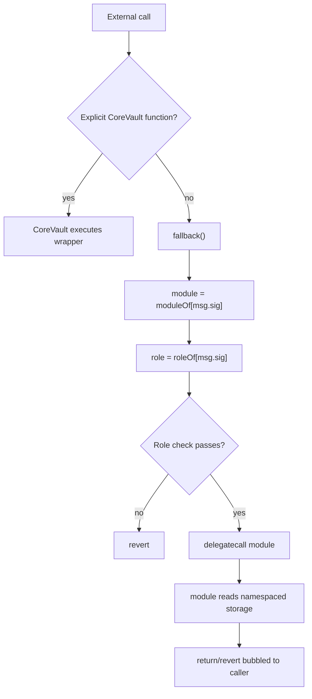
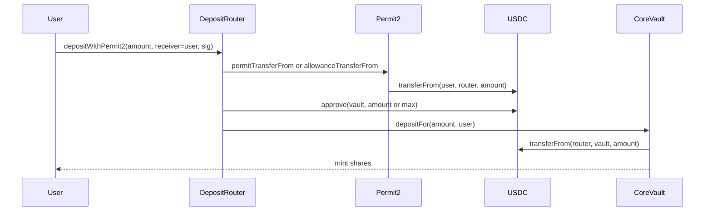
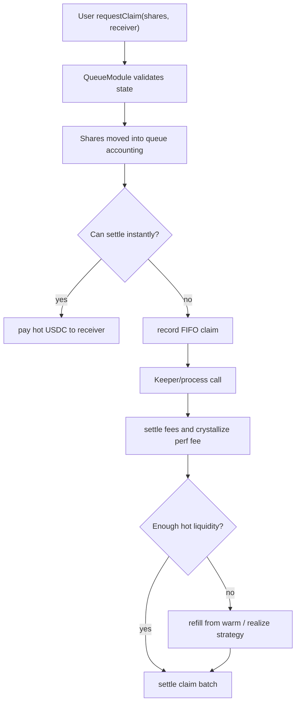
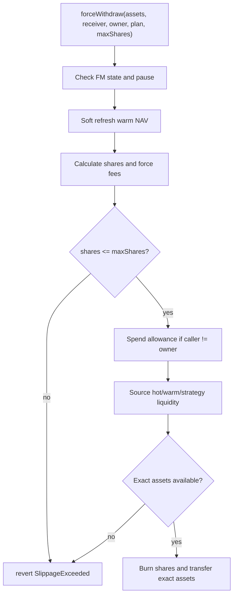
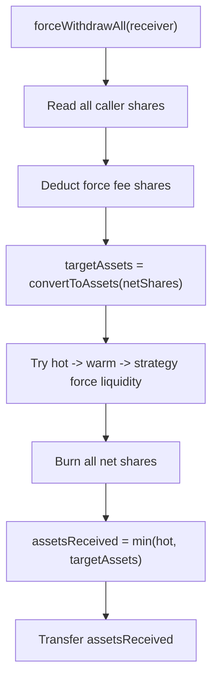
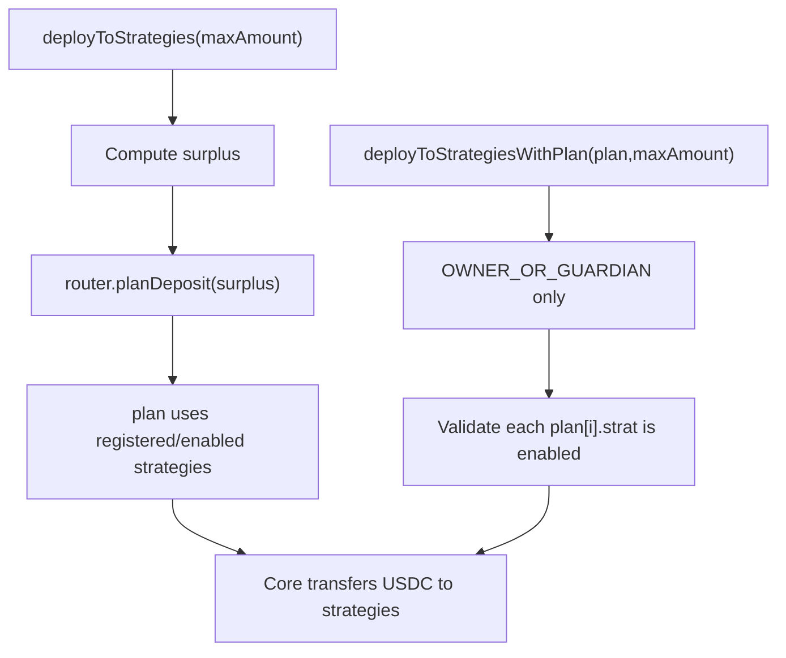
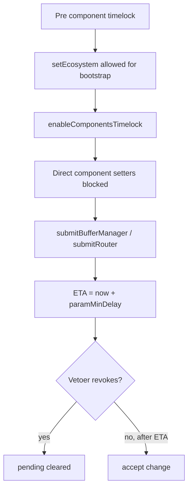
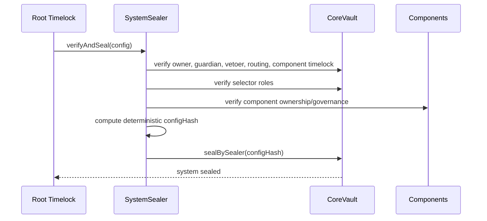

# Flow Diagrams

Mermaid diagrams for the final review.

## 1. Core Routing

## 2. DepositRouter With Permit2

Security invariant: the vault pulls from the router because `msg.sender` is the
router. The user is never passed as an arbitrary payer to the vault.

## 3. Standard Queue Exit

## 4. Force Withdraw

## 5. Force Withdraw All

Review note: this path is best-effort and lacks `minAssetsOut`; it remains the
main residual risk.

## 6. Strategy Deployment

## 7. Governance Component Change

## 8. System Seal

